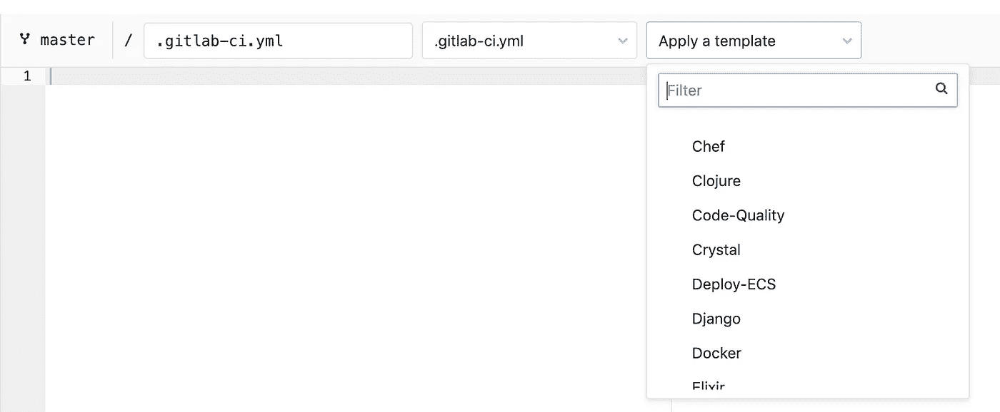
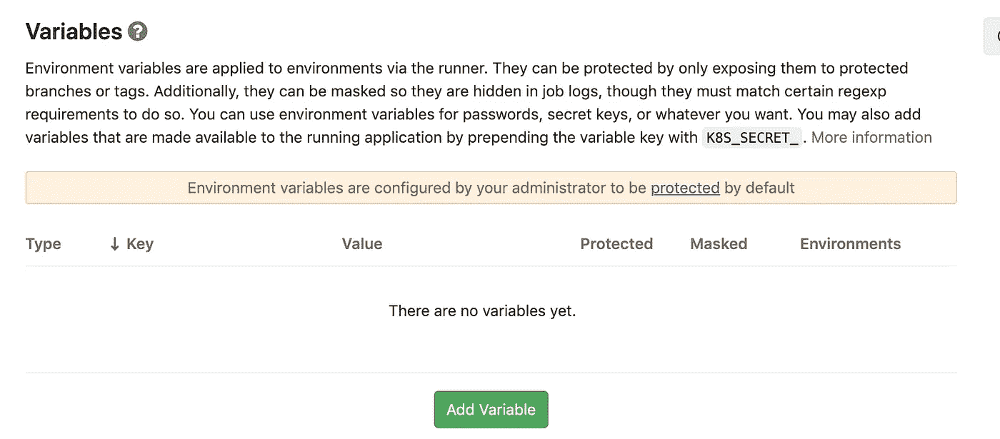
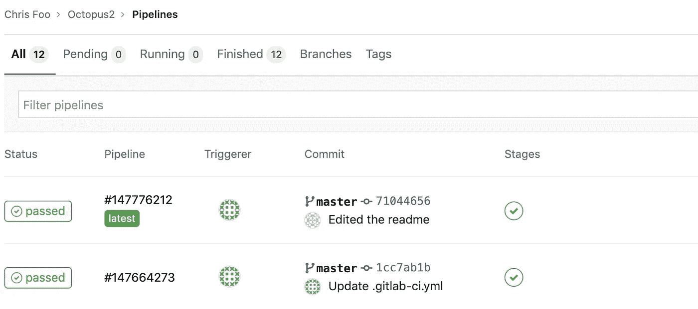
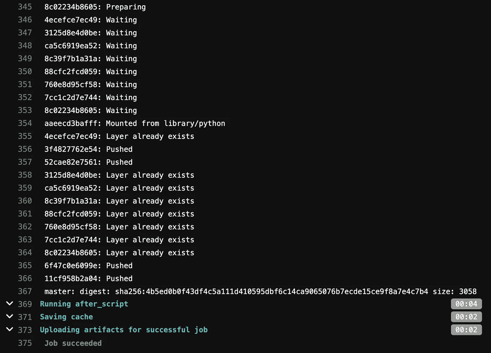
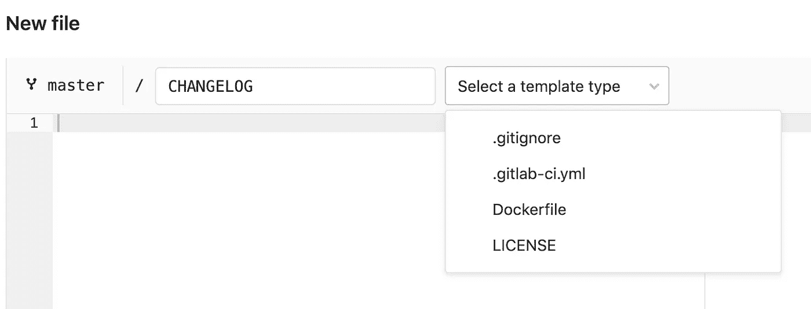

# 使用 Tensorflow 构建可部署的吉拉 Bug 分类引擎

> 原文：<https://levelup.gitconnected.com/building-a-deployable-jira-bug-classification-engine-using-tensorflow-745667c72607>


埃菲尔铁塔下的深层网络(鸣谢:作者自有)

# 介绍

我有一段时间的职业抱负之一实际上是开始写一些 ML 代码，并最终掌握 DNNs(深度神经网络)和 *Tensorflow。*我在 [Coursera](http://www.coursera.org) 和 [Udemy](http://www.udemy.com) 上上过一些课程，但是没有什么比得上在一个真实的项目中实际工作。另外，我一直在做一个名为**章鱼**的项目(肯定是我一直在吃的所有 Tako-pachi 或日本章鱼球)。Octopus 是一个使用传统 ML 将吉拉 bug 票证分类给工程团队的项目，我想看看 DNN 是否可以应用于类似的项目:根据描述为吉拉 bug 票证分配优先级。

当我报名参加 AICamp 的在线课程时，我有机会这样做。这是一个为期 4 周的强化课程，向你介绍 DNNs 的基础知识，但以一种非常实际的方式进行。作为课程的一部分，我开始着手一个顶点项目，瞧，这就是我真正钻研的机会！

只有两个问题:

1.  由于这个项目将是监督学习，我需要带标签的训练数据。我不能使用八达通数据，因为这是内部数据。此外，数据集太小(DNN 训练需要数百对数万)。
2.  AICamp 课程中的所有示例主要集中在图像分类上，例如 MNIST、CIFAR。没有关于文本分类的。

我还想获得以下方面的实践经验:

1.  使用 GPU 训练模型，感受训练中的加速效果。
2.  将模型打包成某种可部署的形式(可能使用 *pickle* )。
3.  使用 Apache Flask 将预测器打包成 HTTP POST API。
4.  创建预测器包的 Docker 映像。
5.  创建一个 CI 管道来构建包并部署到 Docker 注册中心。

这些是我能够完成的，你可以在这里找到 Jupyter 笔记本、数据、Dockerfile、Gitlab YAML:

> [https://gitlab.com/foohm71/octopus2](https://gitlab.com/foohm71/octopus2/-/tree/master)

由于我设定要完成的目标之一是使用 GPU 训练模型，因此使用 [Google Colab](http://colab.research.google.com) 很自然(Colab 是 Google 的笔记本工具，相当于 Jupyter)。此外，Google Colab 内置了 Tensorflow 2，并对 Jupyter Notebook 进行了一些漂亮的增强，使 Python 和数据科学方面的工作变得更容易。回购中的大多数笔记本都是要在 Google Colab 上运行的。

# 数据

原来有人已经从几个开源项目中开源了吉拉机票数据，并将其导入到 PostgresSQL 数据库中。你可以在这里找到:【1】。致力于提取这个数据集的团队也就此写了一篇论文[2]。

下一步是安装 PostgresSQL 并执行数据导入。

一旦完成，我想要一个适当大小的数据集，只是为了看看传统的 ML 算法将如何坚持，因为不像 Octopus，我们将把票分类到 bug 优先级，而不是团队，因为没有开源项目的团队数据。

我为此选择了动物园管理员项目的 bug 票:

```
select * from jira_issue_report 
   where status = ‘Closed’ 
      and type = ‘Bug’ 
      and project = ‘ZOOKEEPER’ 
      not (description is null or description = ‘’) 
      and priority is not null
```

您可以在名为`JIRA_OPEN_DATA_ZOOKEEPER.csv`的存储库中找到这个文件的 CSV。这大约有 400 行。

我还将所有的票提取到一个 CSV: `JIRA_OPEN_DATA_ALL.csv`。这大约有 20 万行。

然而，我很快意识到这个数据集太大了，无法在 Google Colab 上处理(这很遗憾)，所以我创建了一个大约 40k 行的子集:`JIRA_OPEN_DATA_LARGESET.csv`使用 SQL 查询:

```
select * from jira_issue_report 
  where status = ‘Closed’ 
    and type = ‘Bug’ 
    and (project = ‘FLEX’ 
    or project = ‘JBIDE’ 
    or project = ‘RF’ 
    or project = ‘SPR’ 
    or project = ‘HBASE’) 
    and not (description is null or description = ‘’) 
    and priority is not null
```

# 使用传统 ML 的文本分类

*注意:我只简要介绍这一部分，因为它不是本文的核心。关于这个主题的很好的介绍，参见[4]。*

在**exploratorydataanalysis . ipynb**中，进行了非常基本的探索性数据分析。同样，一个非常简单的*文本斑点朴素贝叶斯*分类器被用于基线分类。这是根据[3]中的例子。

需要注意一些事情:

1.  文本 blob 朴素贝叶斯分类器的准确率约为 49%
2.  分类目标很偏。我们不想平衡，而是想看看这会有多糟糕/好
3.  为了获得一个 TF-IDF 作为传统 ML 分类的特征，我进行了一些单词分析，从本质上提取出冗余数据，如 id、电子邮件、URL。还进行了单词和二元模型的标记化。

所有这些都是使用 *Numpy* 、 *Pandas* 、 *Sci-kit Learn* 和 *Matplotlib* 库完成的。

关于如何做到这一点的指南可以在[4]和[5]中找到。

接下来，我使用处理过的数据集，并在以下分类器上运行:*朴素贝叶斯、逻辑回归、SVM 和随机森林*分类器，还按照【6】的指导对随机森林分类器执行了一些*超参数调整*。

你可以在回购的 **ModelAnalysis.ipynb** 中找到所有这些。最终的准确度只有 33%。(当时我并没有尝试使用 *XGBoost* 。也许以后吧！)

# 基于 DNN 和张量流的文本分类

如果你看一下文献，将 DNNs 应用于文本分类通常分为以下几种方法:

1.  使用*循环神经网络* (RNN)，特别是 *LSTM* (长短期记忆)。
2.  使用一个*卷积神经网络* (CNN)。
3.  使用单词嵌入，如 *word2vec，GloVe。*
4.  使用预训练模型作为基础模型，冻结/解冻层，例如 *BERT。*

我决定去 CNN，因为我在参加 AICamp 课程后对它有所熟悉。用于图像分类和文本分类的标准 CNN 之间的主要区别如下:

1.  使用*嵌入层*将每个单词映射到向量空间
2.  使用 *1D 卷积层*代替 2D 卷积层

网络的其余部分是一个非常标准的 CNN 图像分类。

为了更好地理解 CNN 如何应用于文本分类，我建议要么观看 Lukas Biewald 的 YouTube 视频“使用卷积神经网络进行文本分类(2019)”——见[7]，要么参加 Udemy 上的懒惰程序员课程“Tensorflow 2.0:深度学习和人工智能”[8]。有一节是关于将 LSTM 和 CNN 应用于二进制文本分类的。

嵌入层背后的关键思想是这样的:如果我们将每个单词映射到一个 N 维向量空间，那么单词之间的“距离”(即。每个单词如何相互关联)可以通过调整每个单词在向量空间中的位置来“学习”。

至于 1D 卷积层——其想法与 2D 卷积层相同，但我们不是在`n x n`内核上操作，而是在`1 x n`内核上操作，后者是单词的数字表示。这背后的关键直觉是单词与其旁边的单词有关系(与在传统 NLP 中使用 n 元语法的想法相同)。

## 数据准备

类似于传统的 ML，我们将原始文本转换为 TF-IDF 矩阵，我们必须在这里做一些类似的事情。基本上创建一系列单词序列，并在末尾填充零。

```
# Convert sentences to sequences
MAX_VOCAB_SIZE = 20000
tokenizer = Tokenizer(num_words=MAX_VOCAB_SIZE)
tokenizer.fit_on_texts(df_train)
sequences_train = tokenizer.texts_to_sequences(df_train)
sequences_test = tokenizer.texts_to_sequences(df_test)# get word -> integer mapping
word2idx = tokenizer.word_index
V = len(word2idx)# pad sequences so that we get a N x T matrix
data_train = pad_sequences(sequences_train)# get sequence length
T = data_train.shape[1]data_test = pad_sequences(sequences_test, maxlen=T)
```

## 模型探索/调整

在**dnnmodelansalysis . ipynb**中你会发现模型探索:

1.  我从针对二元分类提出的基本 CNN 模型开始，并将其修改为处理多类别分类。
2.  逐渐添加更多的卷积和密集层，以帮助模型更好地学习。
3.  添加批量标准化和剔除以减少过度拟合。
4.  最后加上早停。

最终模型包含以下内容:

*   嵌入层
*   内核大小为 3 的 6 个 1D conv 层
*   最大池层
*   内核大小为 3 的 4 个 1D conv 层
*   最大池层
*   内核大小为 3 的 2 个 1d conv 层
*   全局最大池
*   4 个密集层，有漏失
*   批量标准化的所有图层
*   提前停止

代码:

```
D = 20early_stopper = EarlyStopping(monitor=’val_loss’, patience=5, restore_best_weights=True)model = Sequential()
model.add(Input(shape=(T,)))model.add(Embedding(V + 1, D))model.add(Conv1D(32, 3, activation=’relu’))
model.add(BatchNormalization())
model.add(Conv1D(32, 3, activation=’relu’))
model.add(BatchNormalization())
model.add(Conv1D(32, 3, activation=’relu’))
model.add(BatchNormalization())
model.add(Conv1D(32, 3, activation=’relu’))
model.add(BatchNormalization())
model.add(Conv1D(32, 3, activation=’relu’))
model.add(BatchNormalization())
model.add(Conv1D(32, 3, activation=’relu’))
model.add(BatchNormalization())
model.add(MaxPooling1D(3))model.add(Conv1D(64, 3, activation=’relu’))
model.add(BatchNormalization())
model.add(Conv1D(64, 3, activation=’relu’))
model.add(BatchNormalization())
model.add(Conv1D(64, 3, activation=’relu’))
model.add(BatchNormalization())
model.add(Conv1D(64, 3, activation=’relu’))
model.add(BatchNormalization())
model.add(MaxPooling1D(3))model.add(Conv1D(128, 3, activation=’relu’))
model.add(BatchNormalization())
model.add(Conv1D(128, 3, activation=’relu’))
model.add(BatchNormalization())
model.add(GlobalMaxPooling1D())model.add(Dense(units=800, activation=’relu’))
model.add(BatchNormalization())
model.add(Dropout(0.2))
model.add(Dense(units=400, activation=’relu’))
model.add(BatchNormalization())
model.add(Dropout(0.2))
model.add(Dense(units=200, activation=’relu’))
model.add(BatchNormalization())
model.add(Dropout(0.2))
model.add(Dense(units=100, activation=’relu’))
model.add(BatchNormalization())
model.add(Dropout(0.2))
model.add(Dense(units=num_classes, activation=’softmax’))model.compile(optimizer=’adam’, loss=’categorical_crossentropy’, metrics=[‘accuracy’])
history = model.fit(data_train1, training_labels1, epochs=40, batch_size=8, verbose=True, validation_split=.2, callbacks=[early_stopper])
plot_training_history(history, model, data_test1, test_labels1)
```

即使我们将其与传统的 ML 模型进行比较，其精度也达到了约 54%,但是大型数据集对于 ML 模型来说太大了，而 ZOOKEEPER 数据集对于 DNN 来说太小了。

# 构建可部署模型

这有 3 个组成部分:

1.  培训和保存模型
2.  构建简单的 HTTP POST API 包装器
3.  构建简单的 CI 渠道

*注意:有几种方法可以构建云部署的可部署模型:谷歌云(GCP)有几种方法可以做到这一点，这些方法都有很好的记录，亚马逊(AWS)也是如此，例如 Sagemaker 和微软 Azure。*

## 培训和保存模型

**dnnproductiontraining . ipynb**包含我用来训练模型并将模型保存到`.h5`文件中的步骤。它被设计为使用 GPU 和高 RAM 运行时在 Google Colab 上运行。在传统的 CPU 上，这将需要更长的时间来训练。

该模型与上一节中描述的最终模型相同。唯一不同的是，这次它是用整个大数据集训练的(没有训练/测试分裂)。

一旦被训练，它被保存:

```
model.save(“/content/gdrive/My Drive/Colab Notebooks/Octopus2/jira_open_data_classifier.h5”, save_format=’tf’)
```

然后我们测试这个模型，看它是否能预测。

```
test_sentance = [‘The hard coded host of the client can only let it run on the same host as the thrift server.’]test_seq = tokenizer.texts_to_sequences(test_sentance)test_padded = pad_sequences(test_seq, maxlen=T)p = model.predict_classes(test_padded)
```

## 构建简单的 HTTP POST API 包装器

这本质上是回购中的`**app.py**`。

这只是一个 Apache Flask 应用程序，它:

1.  从`jira_open_data_classifier.h5`加载模型
2.  从 JSON POST 有效负载中提取“标题”和“描述”
3.  运行预测并输出预测。这段代码类似于上一节中的测试代码。

要跑`app.py,`只需`python3 app.py`

`test.sh`包含执行 POST 的 curl 命令:

```
curl -X POST -H “Content-Type: application/json” \
  -d ‘{“title”: “TestSizeBasedThrottler fails occasionally”, “description”: “Every now and then TestSizeBasedThrottler fails reaching the test internal timeouts.I think the timeouts (200ms) are too short for the Jenkins machines.On my (reasonably fast) machine I get timeout reliably when I set the timeout to 50ms, and occasionally at 100ms.”}’ \
  [“http://localhost:5000/api_predict](http://localhost:5000/api_predict)"
```

## 构建简单的 CI 渠道

我发现 Gitlab 的一个好处是，它们为`.gitlab-ci.yml`(CI)和`Dockerfile`提供了模板。要创建 CI 管道，你只需要在主项目页面上，点击“设置 CI/CD”按钮，它将创建一个基本的空白`.gitlab-ci.yml`，将有一个下拉菜单，上面写着“应用模板”，让你从各种类型的构建管道中进行选择，如 Android、C++等。为此，我选择了“Docker ”,因为我想创建一个 Docker 容器。


“设置配置项/光盘”按钮



如何应用“Docker”模板”

*注意:如果你从未创建过 Docker 容器并在 Docker 注册表上发布过 Hello World 容器，我建议你前往*[*docker.com*](http://docker.com)*并按照快速入门教程创建一个简单的 Hello World 容器并将其发布在 Docker 注册表上。*

回到`.gitlab-ci.yml`，您会注意到以下环境变量:

*   【docker.com】—这是您用来登录注册中心的用户标识(在本例中为 T4)
*   `$CI_REGISTRY_PASSWORD` —这是您用于登录注册表的密码(在本例中为[docker.com](http://docker.com))
*   `$CI_REGISTRY` —这可以删除，因为我们使用的是默认的 Docker 注册表。这将是必要的，如果你有一个单独的 Docker 注册表，如 AWS

这些环境变量需要在“设置-> CI / CD ->变量”下进行配置。在那里，您可以将这些变量添加为键值对。



在哪里配置 CI/CD 变量

如果你已经正确地设置好了一切(事实上一旦 repo 中有一个`.gitlab-ci.yml`), git lab 将开始构建。转到“CI / CD - >管道”，您应该会看到一些运行。



CI/CD 管道视图

如果您单击管道散列，导航到正在运行的作业并单击它，您将能够看到该作业的控制台日志。



成功完成的作业的控制台日志

不幸的是，管道最有可能失败，因为 Dockerfile 文件尚未创建。为此，请转到“项目概述”并单击“新建文件”按钮(如果您没有看到“新建文件”按钮，您也可以单击“更改日志”按钮)。



如何添加 Dockerfile 文件

然后将允许您选择一个模板。我选择了 *Python* 的一个作为底子。

我创建的 Dockerfile 文件是:

```
FROM python:3.6

WORKDIR /usr/src/app

COPY requirements.txt /usr/src/app/
RUN pip install --no-cache-dir -r requirements.txt

COPY . /usr/src/app

# Inform Docker that the container is listening on the specified port at runtime.
EXPOSE 5000

# Run command
CMD ["python", "app.py"]
```

一旦就位，构建就应该成功了。docker 映像被构建并在注册表上发布。

# 参考

[1]吉拉社会知识库，马可·奥图等著[https://github.com/marcoortu/jira-social-repository](https://github.com/marcoortu/jira-social-repository)

[2]JIRA 储存库数据集，Marco Ortu 等人，2015 年 9 月[https://www . researchgate . net/publication/301370380 _ The _ JIRA _ 储存库 _ 数据集](https://www.researchgate.net/publication/301370380_The_JIRA_Repository_Dataset)

[3]教程:构建文本分类系统，Text blob【https://textblob.readthedocs.io/en/dev/classifiers.html 

[4]使用 NLTK 的初学者的文本分析，Avinash Navlani，2019 年 12 月[https://www . data camp . com/community/tutorials/Text-Analytics-初学者-nltk](https://www.datacamp.com/community/tutorials/text-analytics-beginners-nltk)

[5]理解 Python 中的随机森林分类器，Avinash Navlani，2019 年 5 月[https://www . data camp . com/community/tutorials/Random-Forests-classifier-Python](https://www.datacamp.com/community/tutorials/random-forests-classifier-python)

[6]Hyperparameter Tuning the Random Forest in Python，Will Koehrsen，2018 年 1 月[https://towardsdatascience . com/Hyperparameter-Tuning-the-Random-Forest-in-Python-using-scikit-learn-28 D2 aa 77 DD 74](https://towardsdatascience.com/hyperparameter-tuning-the-random-forest-in-python-using-scikit-learn-28d2aa77dd74)

[7]使用卷积神经网络的文本分类(2019)，卢卡斯·比沃尔德[https://youtu.be/8YsZXTpFRO0](https://youtu.be/8YsZXTpFRO0)

[8] Tensorflow 2.0:深度学习与人工智能，懒程序员[https://www.udemy.com/course/deep-learning-tensorflow-2/](https://www.udemy.com/course/deep-learning-tensorflow-2/learn/lecture/15862048?start=390#questions)

[](https://skilled.dev) [## 编写面试问题

### 一个完整的平台，在这里我会教你找到下一份工作所需的一切，以及…

技术开发](https://skilled.dev)