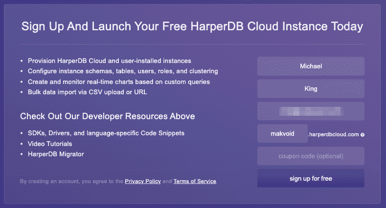

# 使用 HarperDB 构建数字标牌系统

> 原文：<https://levelup.gitconnected.com/building-a-digital-signage-system-using-harperdb-9f87ebe0849b>

卢卡·布拉沃在 [Unsplash](https://unsplash.com?utm_source=medium&utm_medium=referral) 上的照片

数字标牌已经成为日常生活中更常见的景象，我经常想:我如何才能创建自己的数字标牌系统？我还认为这是一个测试我最近发现的新产品 HarperDB 的好机会。目前，我在我的内部家庭实验室上运行我自己的容器化 web 集群，以处理我的智能家居设置，所以我想用 HarperDB 可以提供的简化设置来取代它。

# 什么是 HarperDB？

[HarperDB](https://harperdb.io/) ，简单来说，就是一个可以让你在本地、在云端、或者在边缘以一种弹性的、响应性的方式存储、查询、处理数据的产品。该数据库使用动态模式，支持 SQL 和 NoSQL 操作，并包括一个内置的 API 来轻松读取和管理您的数据。它还包括一个他们称之为自定义函数的功能，这使我们能够灵活地将自己的路线和代码添加到幕后的 [Fastify](https://www.fastify.io/) API 中。此外，HarperDB 可以为我们自己的静态 web UI 提供服务，例如，React 或 Angular 前端使用自定义函数向 HarperDB 读写数据。

# 报名参加 HarperDB

开户所需的初始注册信息

HarperDB 有一个免费层，我发现对大多数小项目来说已经足够了，可以通过访问[注册](https://studio.harperdb.io/sign-up)页面开始。设置密码后，您将被重定向到 HarperDB Studio 中的实例页面，这是 HarperDB 的管理控制台。在 HarperDB Studio 中，我们可以管理实例、管理我们的组织(用户、计费等)、查看每个实例的数据等等。

由于我们刚刚开始我们的帐户，这里没有列出任何内容，但是我们可以通过单击'**创建新的 HarperDB 云实例'**按钮来创建一个新的实例。将出现一个弹出窗口，要求您在 AWS/威瑞森波长或用户安装的实例之间进行选择。我将选择使用 AWS/威瑞森波长实例，因为这样实例将完全由 HarperDB 管理，最好的部分是:我不需要设置任何东西！

实例类型选择—在本教程中，我们将使用一个 AWS 实例。

在下一个窗口中，选择**‘Harper db Cloud on AWS’**并进入下一个窗口输入实例信息。对于实例名称，输入'**符号'**-该名称将与您的 HarperDB 用户名结合，形成您的实例的 URL，如您在文本框下方所见。对于实例凭据，此帐户用于在实例上执行管理任务，如添加新角色和自定义功能。大多数情况下，我们会在使用 HarperDB Studio 时使用这个帐户。创建实例后，我们还将设置一个没有“超级用户”权限的用户来使用设备。输入凭据后，继续下一个窗口，选择实例详细信息。

实例规格选择因为我们使用的是云实例

只要您只选择免费选项，我们就可以进入下一个窗口并确认我们的实例详细信息，否则，它将收集付款信息。点击**‘添加实例’**后，HarperDB 将自动在 HarperDB 云中为我们提供我们的实例，并通过发送电子邮件通知我们实例准备就绪。

实例详细信息的最终确认

我已经使用免费实例选项两个月了，还没有遇到任何问题，比如停机或查询失败。根据我的经验，与其他免费数据库解决方案相比，响应时间也非常可观。我还非常喜欢在本地安装的 HarperDB 实例上开发定制函数，然后立即将代码部署到云实例上，通常这需要一点脚本来处理(或者最坏的情况——手动部署),这样可以节省大量时间。

# 配置 HarperDB 云实例

一旦我们的 HarperDB 云实例启动，我们就可以设置所需的初始模式和表。首先，创建一个新模式，并将其命名为**‘signs’**。一旦我们添加了模式，HarperDB 将允许我们创建包含在模式中的表。如前所述，HarperDB 使用动态模式，因此我们将只提供表名和散列属性。哈希属性是用于唯一标识记录的列。除了散列属性字段之外，被称为**‘审计属性’**的两个属性被添加到每个表:**创建时间**和**更新时间**。这使我们可以很容易地知道记录是何时创建或修改的，而不必向我们的应用程序添加额外的逻辑。如果您感兴趣，可以在[文档](https://harperdb.io/docs/reference/dynamic-schema/)中找到关于 HarperDB 动态模式的更多信息。

添加新模式非常简单

在我们创建初始模式的下面，我们也可以在这里添加表。我们只需要这样做一次，因为将来我们可以根据需要从一个实例复制到另一个实例。

向模式中添加新表也非常简单

**‘devices’**表将保存我们的设备信息和配置，因此我们不需要调整设备本身的信息，我们将能够从管理控制台处理所有信息。**“日志”**表将保存设备遇到的任何异常以及显示设备在线的心跳。

要创建的表及其散列属性(唯一标识符)

# 创建设备角色和用户

为了让我们的设备访问自定义功能，我们将为设备设置一个额外的用户和角色，不包含读取、写入和删除权限。这是因为我们将只使用这个用户来确保我们拥有有效的凭证，就像 API 密钥一样。为此，在 HarperDB Studio 中，单击**“角色”**选项卡，并在**“标准角色”**下单击**“+”**按钮。我将把我的命名为**‘read _ only’**，但是你可以随意命名。如果我们需要为某些表添加权限，我们可以在右侧面板的 JSON 对象中添加它们，但是，对于这个用例，我们不需要添加任何权限。添加后，点击**“用户”**选项卡，填写用户名和密码，选择之前创建的角色，并将其保存在安全的地方以备后用。

# 克隆项目

创建了模式、表、角色和用户之后，我们就可以进入有趣的部分了:代码！我准备了一个仓库，里面包含了我们这个项目需要的所有代码。您可以[下载](https://github.com/makvoid/guide-harperdb-digital-signage/archive/refs/heads/master.zip)zip 文件或使用 Git 克隆它:

存储库中将有一个文件夹，用于存放本指南中使用的自定义功能包、前端、用户界面和脚本。这个项目中使用的所有代码都是 NodeJS，所以您需要在本地安装一个节点环境。我建议使用 [NVM](https://github.com/nvm-sh/nvm) (节点版本管理器)来管理您的节点安装，因为它使管理更加容易。安装 NVM 的说明可以在[文档](https://github.com/nvm-sh/nvm#install--update-script)中找到。为了管理所有项目的包，我使用了 [Yarn](https://yarnpkg.com/) ，安装说明可以在[这里](https://classic.yarnpkg.com/lang/en/docs/install/)找到。或者，您可以使用 NPM(与 Node 捆绑在一起),但是我们强烈推荐使用 Yarn，它也能保证依赖关系正常工作。

# 创建前端应用程序

为了使标志的管理变得容易，我编写了一个 Angular 应用程序，它使用之前设置的自定义函数来快速、轻松地显示和编辑设备。由于自定义函数端点受到身份验证的保护，我也向应用程序添加了登录屏幕和 [route guards](https://medium.com/@ryanchenkie_40935/angular-authentication-using-route-guards-bf7a4ca13ae3) 。

填充了样本错误警报的前端

在应用程序的仪表板上，用户会看到一些关于其设备的快速统计数据以及任何错误(如果存在的话)。点击错误将允许用户消除错误并转到感兴趣的设备。单击设备列表中的任何设备，可以更新分配给该设备的标志，或者更改有关标志的信息，如描述或名称。

## 代码解释

在项目中，代码被分成多个模块:登录、共享和设备。登录模块只包含登录表单组件，而共享模块包含标题、加载微调器和模式组件。在设备模块中，包含设备列表和设备详细信息组件。所有模块都包含一些服务来处理与 HarperDB 云实例的交互以及存储/访问应用程序的状态。

## 构建前端

在下一步构建前端之前，您需要做的第一件事是用实例的 URL 更新环境文件。这可以通过编辑`src/environments`文件夹中的文件来完成，例如:

如果您不确定实例的自定义函数 URL 是什么，当查看自定义函数选项卡时，它会显示在左下角，我们将在下一步中探讨。我们现在不需要构建前端，因为部署脚本稍后会自动构建它，所以我们可以继续进行自定义功能。

# 自定义功能

我们首先需要在实例上启用自定义函数，因为默认情况下它们是不启用的。为此，在 HarperDB Studio 中，单击顶部导航栏中的**‘函数’**选项，然后单击**‘启用自定义函数’**按钮。一旦启用，我们将能够创建一个新项目，你可以把它想象成一个[名称空间](https://en.wikipedia.org/wiki/Namespace)。它允许你分割你的代码，并帮助保持它的组织性和保持项目的相互分离。为了简单起见，我将我的项目命名为**‘API’**，但是，您可以输入您喜欢的任何项目名称。

HarperDB 允许我们向实例部署定制的功能包，我们可以利用它在一个简单的请求中加载项目所需的控制器、路由、助手和前端。通常，我们会从本地安装的实例中传输自定义函数，但是，我们将使用 HarperDB API 来使用我准备的脚本加载它，您可以在**' scripts/deploy-Custom-functions . js '**中找到该脚本。

我们需要做的第一件事是更新一些配置常量。例如，我将我的配置为:

之后，可以执行脚本来执行打包和上传:

完成这一步后，我们可以导航回 HarperDB Studio，并查看已经上传的新定制函数项目。

## 概观

项目的每个部分都有自己的路线文件，以帮助保持一切整洁和分离，因为这个项目需要一些路线。每个帮助器都被分离到它自己的文件中，所以如果你想把其中一个复制到你的项目中，在需要依赖项的情况下会容易得多。

为了保护 API 路由，我编写了一个助手( [validateBasicAuth](https://github.com/makvoid/guide-harperdb-digital-signage/blob/master/custom-functions/helpers/validateBasicAuth.js) )，它获取用户提供的授权信息，并根据底层 HarperDB 实例对其进行检查。这样，要使用任何路由，用户都必须传递一个有效的角色，并且端点不对公众开放。为了确保编辑设备时主体参数存在，我还添加了另一个助手( [checkBody](https://github.com/makvoid/guide-harperdb-digital-signage/blob/master/custom-functions/helpers/checkBody.js) )，确保所有必需的参数都在请求主体中传递。由于一些端点需要多个验证器，我还为一个请求添加了一个将验证器链接在一起的方法( [chainValidators](https://github.com/makvoid/guide-harperdb-digital-signage/blob/master/custom-functions/helpers/chainValidators.js) )，这非常有用。

# 创建设备应用程序

为了在设备的显示屏上显示一个标志，我们需要创建一个应用程序来检查更新的任务并显示 web 内容本身。我发现最简单的方法是使用带有选项的木偶师(Chromium ),使用户界面更加无缝，例如 Kiosk 模式。可以使用 Webview 代替，但是，与 Puppeteer 包含的丰富功能集相比，这是一个简单的选择，因为它将使我们的编码工作变得更加容易。

## 概观

在启动应用程序时，我们将获取最新的任务，然后设置一个计时器，从一个自定义函数中每 10 秒刷新一次该信息。为了获取设备最新分配的任务，我们可以使用带有设备唯一 ID 的**‘Get Device’**端点。DigitalSignage 类中的 loadTask 方法获取这些信息，并将其与我们的活动任务进行比较。如果检测到新任务，应用程序将清除以前的选项卡，并开始启动分配的新任务。

## 浏览器配置

为了让设备的行为更像一个标志，而不像一个浏览器，我们可以启用一些可选的 Chromium [设置](https://peter.sh/experiments/chromium-command-line-switches/)。我们还将在启动时设置一个事件监听器，这样，如果浏览器由于任何原因关闭或遇到错误，它可以根据需要重新启动。

## 标志类型

在应用程序中，如何显示标志的所有逻辑都在每个任务的类中处理。例如，要循环显示一系列网页，我们可以使用 **TaskWebSeries** 类。添加额外的符号类型或额外的功能很简单，因为每种类型都包含在它的类中。

## 基本 Web (TaskWebBasic)

基本任务是最简单的实现，因为它只显示一个 web 资源，如果需要，还可以使用可选的计时器来刷新页面。这项任务是最常见的，因为它可以服务于许多目的。

## 网络系列(TaskWebSeries)

系列任务很像基本任务，但是它可以在任意数量的页面之间自动切换。可以将每个页面配置为在屏幕上停留一段时间，或者配置为以相同的速度改变所有页面。

## YouTube 视频(TaskYouTube)

YouTube 任务可以轻松地在全屏模式下自动播放 YouTube 视频。启动时，它会确保播放器开始播放，并最大化视频。目前，它不会跳过广告，但这将是一个很好的功能，在未来添加。

## 谷歌幻灯片

此任务允许您自动显示 Google 幻灯片演示，并以预定义的速度在可用的幻灯片中循环。该任务可以配置为按顺序连续运行幻灯片，或者在完成后将演示文稿重置到开头。

## 错误处理

如果设备应用程序遇到错误，它将重试大多数操作(如果适用)。如果所有重试尝试失败，它将使用自定义功能将日志消息保存到数据库，并允许您在主页上查看。这样，您就不必设置日志收集器或手动进入设备来检查错误。

## 额外设置

我们还将安装[清理器](https://wiki.debian.org/unclutter)，它将处理隐藏鼠标。我们将利用[系统和](https://www.freedesktop.org/wiki/Software/systemd/)来管理和整理应用程序，并确保它们保持运行。由于默认情况下不加载 unclutter，我们需要在设备设置好之后通过包管理器来安装它。我们将在**‘最终设置和配置’**部分介绍相关步骤。

# 试运行和测试

现在，我们可以通过设置新设备并为其分配任务来测试用户界面。使用管理控制台，导航至**“设备”**，点击**“添加新设备”**。在这里，我们可以提供名称和描述来记住此设备，并选择我们要分配给此设备的签名任务。对于这个例子，我将使用**‘Web(Basic)’**符号类型，并给它一个 URL 来加载。

添加/编辑设备时使用的“编辑设备”屏幕

如上填写一些样本细节后，点击**‘保存设备’**。一旦您保存了您的设备，您现在将有一些额外的选项可用，如**【下载配置】**和**【删除】**。继续点击**“下载配置”**，因为我们很快就会用到它。将出现一个弹出窗口，要求您提供我们之前在**“创建设备角色和用户”**部分中设置的特定于设备的凭据。配置存储这些信息，以便设备可以根据 API 进行身份验证，以获取最新的任务，并在需要时上传任何日志。

如果您想在将用户界面部署到设备之前测试它，您首先需要将下载的配置复制到您的主目录，以便应用程序知道在哪里可以找到它(例如/home/user/。sign_config.json)。然后，导航到文章存储库中的**‘user-interface’**文件夹，并运行以下命令:

启动应用程序后，浏览器窗口应该出现在您的主显示器上，并导航到上面设置的 URL。稍后在应用程序的部署过程中，我们将向 systemd 添加服务，以根据需要处理应用程序的自动启动和重启。

Example.com 按照我们的配置装载

# 部署到树莓 Pi

要将应用程序部署到 Raspberry Pi，我们必须首先将操作系统加载到设备上。对于本指南，我将使用 DietPi，因为它是一个轻量级的基于 Debian 的操作系统，非常适合这样的任务。从[下载](https://dietpi.com/#download)页面，选择**‘Raspberry Pi’**，或您正在使用的任何主板，并为您的设备下载适当的图像。下载完成后，使用类似 [Balena Etcher](https://www.balena.io/etcher/) 的程序，用你下载的图像刷新 SD 卡，并将其插入 Pi 的 SD 卡插槽。

引导 Pi 后，操作系统会要求您登录并接受许可证。用户名的默认凭证为**‘root’**，密码为**‘dietpi’**，登录后可以更改。一旦接受，它将根据需要运行一些初始化和更新。它还会要求您启用/禁用串行控制台，如果您愿意，可以禁用它，因为本项目不需要它。完成后，您将看到 DietPi-Software 屏幕，在这里您可以轻松安装某些软件，我们将继续安装。

# 安装需求

使用箭头键，选择**‘搜索软件’**，并遵循以下步骤:

1.  键入`lxde`并按回车键。
2.  在下一个屏幕上突出显示**‘LXDE’**选项，按下**‘空格键’**按钮选择它。
3.  当**【确定】**高亮显示时，按**【Tab】**键，按**【Enter】**键。
4.  选择**‘SSH 服务器’**并使用箭头键选择**‘OpenSSH 服务器’**并接受确认。
5.  使用箭头键，选择屏幕底部的**‘安装’**，然后选择**‘确定’**。
6.  当出现网络浏览器提示时，选择**‘铬’**。
7.  当提示增加 GPU 内存时，选择**‘确定’**。
8.  一旦软件安装完毕，您回到命令行，输入命令`dietpi-config`。
9.  从列表中选择**‘自动启动选项’**，在**‘桌面’**下，选择**‘自动登录’**，然后选择用户**‘dietpi’**。
10.  按**‘Tab’**键，选择**‘Exit’**，按**‘Enter’**退出。
11.  键入`startx`并按**‘回车’**或重启设备启动桌面环境。

# 安装附加组件

要在设备上安装 Node，我建议使用 NVM。通过在命令终端中遵循这些说明，或者使用用户界面文件夹内的脚本文件夹中的“install_nvm.sh”脚本，可以很容易地将它安装在设备上:

# 额外步骤

1.  在桌面上，右击桌面上的任意位置，选择**‘桌面首选项’**。
2.  在**‘壁纸模式’**选项下，选择**‘仅填充背景色’**，点击**‘关闭’**。或者，您也可以删除所有桌面图标，并通过任务栏设置将底部任务栏设置为不使用时最小化，以获得更整洁的外观。
3.  如果你没有使用 DietPi，你也要禁用屏幕空白和任何屏保选项。
4.  如果你想使用无线还是有线:
    a .在终端中，输入命令`sudo dietpi-config`。
    b .向下导航并选择**‘网络选项:适配器’**。选择**‘车载 WiFi’**，选择**‘确定’**启用。
    c .选择**‘WiFi’**，选择**‘Ok’**启用。
    d .之后选择**‘扫描’**，选择第一个槽，选择**‘手动’**。
    e .出现提示时输入您的无线凭证，选择**【完成】**，然后选择**【应用】**，并接受确认。出现提示时，退出配置菜单并重启 Pi。

# 最终设置和配置

要将文件复制到设备上，我们首先需要在本地机器上构建用户界面，然后将编译后的代码传输到设备上。如果您不确定您的设备的 IP 地址是什么，您可以打开一个命令终端，DietPi 会在顶部显示它。

复制完所有文件后，我们现在可以在设备上做一些最后的设置了。

我们现在应该可以在设备屏幕上看到之前显示的标志设置。之后，可以修改该标志并将其调整为不同的 URL 或类型，以查看它如何处理更新。我还包含了一个示例餐厅菜单，您可以通过将 URL 设置为:`file:///opt/signs-user-interface/templates/menu_example.html`来使用它。

设备屏幕上显示的菜单示例输出

# 结论

总的来说，HarperDB 使这个项目更加精简，因为它处理多个职责，这为我们省去了很多麻烦。通过用户界面，可以进一步改进其他一些功能，如远程控制设备重启或在需要时提取系统日志。另一个值得监控的方面是设备的统计数据，比如空闲内存、CPU 温度等。

我个人期待着与 HarperDB 进行更多的互动，并构建更多的项目，因为在部署项目时会容易得多。如果您对代码或 HarperDB 有任何问题，请随时留下评论，我很乐意回答！

# 链接/资源

*   [代码库](https://github.com/makvoid/guide-harperdb-digital-signage)
*   哈珀德布