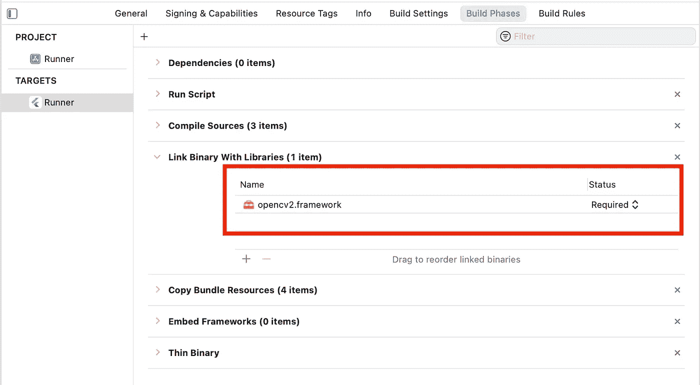
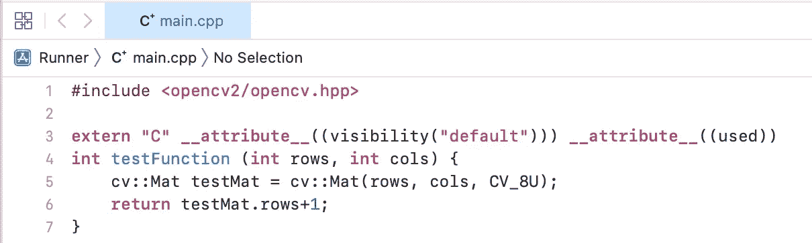
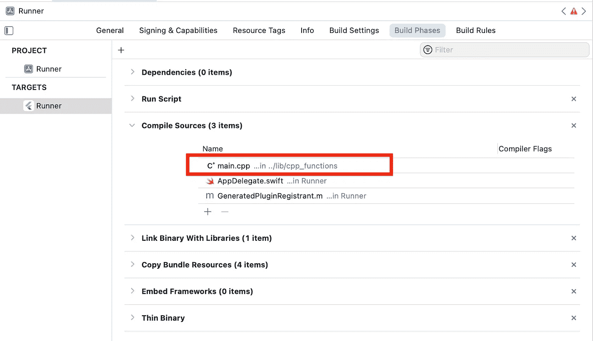
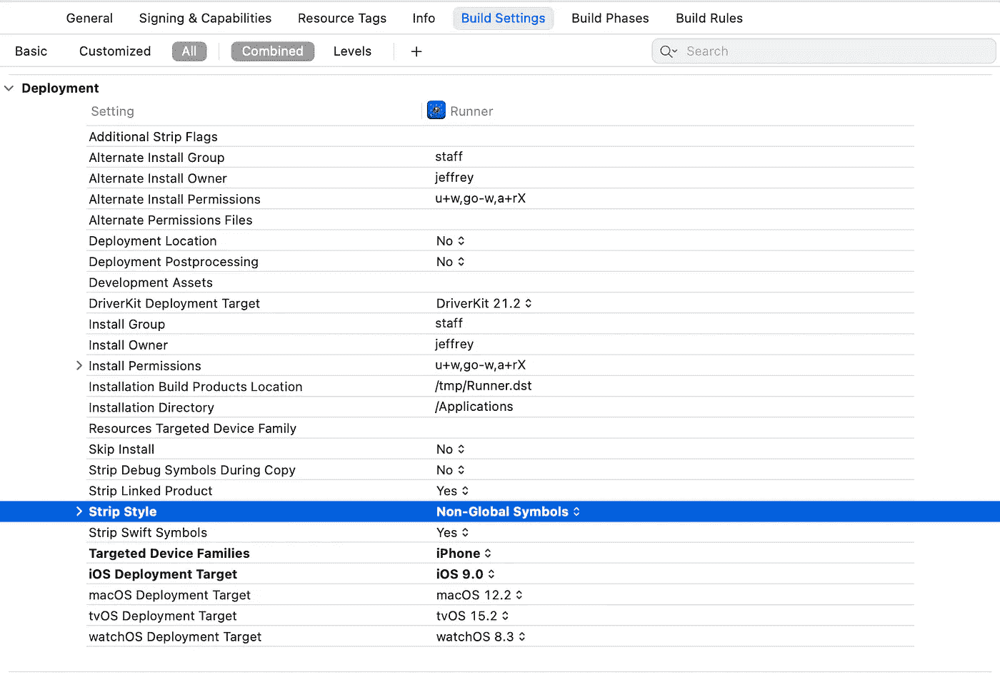

# 使用 Dart 构建颤振计算机视觉应用程序:ffi、OpenCV 和 Tensorflow(第 1 部分)

> 原文：<https://levelup.gitconnected.com/building-a-flutter-computer-vision-app-using-dart-ffi-opencv-and-tensorflow-part-1-513dac9325ab>

## 这是解释如何使用 dart:ffi、OpenCV 和 Tensorflow 在 Flutter 中编写计算机视觉应用程序的三部分系列的第一部分。

第一部分讨论了如何正确配置 OpenCV 库和我们的定制 C++文件以在 Flutter 应用程序中工作，以及如何通过 dart:ffi 从 Dart 访问这些 C++文件。

[**第二部分**](https://medium.com/@jeffrey.wolberg/building-a-flutter-computer-vision-app-using-dart-ffi-opencv-and-tensorflow-part-2-81472b4ac380) **讨论如何使用 dart:ffi 库使用指针在 Dart 和 C++之间传递数据。这对于将图像数据传输到 C++来说尤其重要，这样它就可以被 OpenCV 操作并返回到 Dart。**

[**第三部分**](https://medium.com/@jeffrey.wolberg/building-a-flutter-computer-vision-app-using-dart-ffi-opencv-and-tensorflow-part-3-8e3a1182250b) **讨论如何使用 tflite_flutter 插件在 Flutter 应用程序中使用 tensorflow。我们将通过适当的配置，常见的错误，以及如何在我们的设备上运行推理。**

注意:本教程只包括 iOS 的配置，并且已经在 M1 mac 上测试过。


Sudoku Cam，一个用 C++实现的使用 OpenCV 的计算机视觉颤振 app

## 在 Xcode 中配置 OpenCV

为了在我们的应用中使用 OpenCV，我们必须有一个 opencv **。框架'**文件，这是一个包含库的头文件以及用于静态链接的二进制文件的包。这里面有很多行话，但这只是意味着苹果需要一种方法来访问 OpenCV 资源，同时运行应用程序。

你可以在这里阅读更多关于苹果框架的内容:[https://developer . apple . com/library/archive/documentation/ma cosx/Conceptual/BP frameworks/Concepts/whatareframeworks . html](https://developer.apple.com/library/archive/documentation/MacOSX/Conceptual/BPFrameworks/Concepts/WhatAreFrameworks.html)

得到这个。“框架”文件，前往[https://opencv.org/releases/](https://opencv.org/releases/)下载 **iOS 包**。解压后，将***opencv 2 . framework***文件夹放在你的***PROJECT _ DIR/IOs***文件夹中。

要让 Xcode 链接到应用程序，请前往***PROJECT _ DIR/IOs/runner . Xcode proj***并点击**构建阶段**。然后，在 **Link Binary With Libraries** 选项卡下，添加之前添加的***opencv 2 . framework***文件夹。见下图。



# 编写和链接我们的 C++代码

让我们测试一下我们的 OpenCV 库是否可以被我们的应用程序访问。为此，我们将编写一个简单的 C++函数，该函数将在构建我们的应用程序时编译。然后，我们将使用 dart:ffi 包从我们的 flutter 应用程序访问它。

了解如何使用 dart:ffi 的最佳和最详细的来源是[官方文档](https://docs.flutter.dev/development/platform-integration/c-interop)。下面我将向您展示最重要的步骤:

让我们编写一个小的 C++函数来测试我们是否可以从我们的 Flutter 应用程序成功访问 OpenCV:



在第 3 行，你可能会问为什么这些符号是必要的。根据官方文件:

> FFI 库只能绑定 C 符号，所以在 C++中这些符号必须标记`extern C`。添加的其他属性防止链接器在链接时优化期间丢弃符号。

为了确保 XCode 在构建时编译我们的 C++函数，直接进入***PROJECT _ DIR/IOs/runner . XCode proj***并点击**构建阶段**。然后，在**编译源**选项卡下，添加。我们刚刚创建的 cpp 文件。这叫做*静态链接*。见下图。



我们必须更改 Xcode 中的另一个配置设置，以便以后能够访问我们的 C++代码。

进入***PROJECT _ DIR/IOs/runner . xcode proj***，点击**构建设置。**滚动到**部署**部分，将**条形样式**字段从“所有符号”更改为“非全局符号”。参见 GitHub 评论了解更多关于为什么这是必要的信息。



更改 Xcode 中的“条形样式”栏

# 在 Dart 中访问我们的 C++代码

现在我们将开始用 Dart 写作。

将 dart:ffi 包添加到您的 pubspec.yaml 中，方法是在您的项目文件夹中运行以下命令，或者访问[https://pub.dev/packages/ffi/install](https://pub.dev/packages/ffi/install)并找到一个定制版本放在您的 pubspec.yaml 文件中

```
flutter pub add ffi
```

太好了！在我们的 Dart 代码中，我们必须获得动态库，从中我们将访问我们的自定义 C++函数。

```
import 'dart:ffi'; // For FFI
import 'dart:io'; // For Platform.isX

final DynamicLibrary nativeAddLib = Platform.isAndroid
    ? DynamicLibrary.open('libnative_add.so')
    : DynamicLibrary.process();
```

然后，通过编写以下内容来加载该函数:

```
final int Function(int x, int y) testFunction = nativeAddLib
    .lookup<NativeFunction<Int32 Function(Int32, Int32)>>('testFunction')
    .asFunction();
```

然后，你可以调用它！

```
int output = testFunction(100, 100);
```

您应该能够在您的 Flutter 应用程序中看到输出。万岁！这意味着你可以通过 C++从你的 Flutter 应用程序中访问 OpenCV 函数的完整套件。

在下一个教程的[中，我们将学习如何使用 dart:ffi 通过指针在 C++中来回传递数据。这对于将图像数据传输到 C++来说尤其重要，这样它就可以被 OpenCV 操作并返回到 Dart。](https://medium.com/@jeffrey.wolberg/building-a-flutter-computer-vision-app-using-dart-ffi-opencv-and-tensorflow-part-2-81472b4ac380)

干杯！