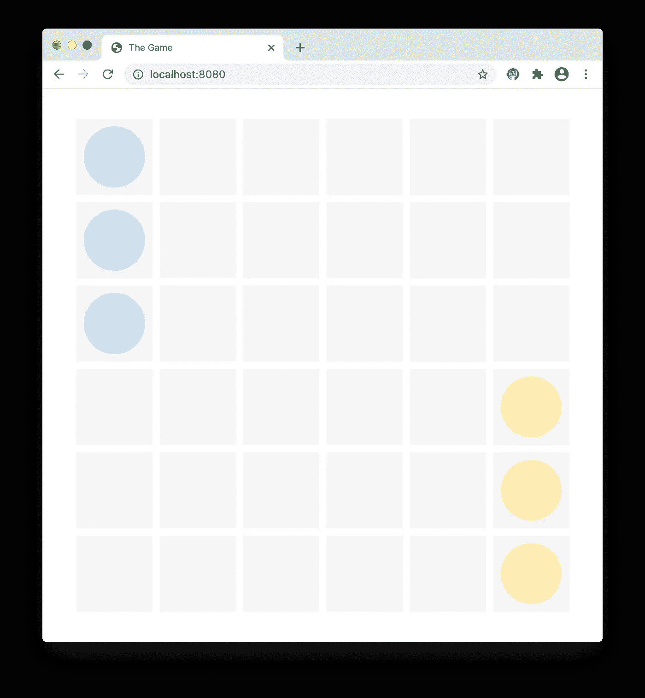
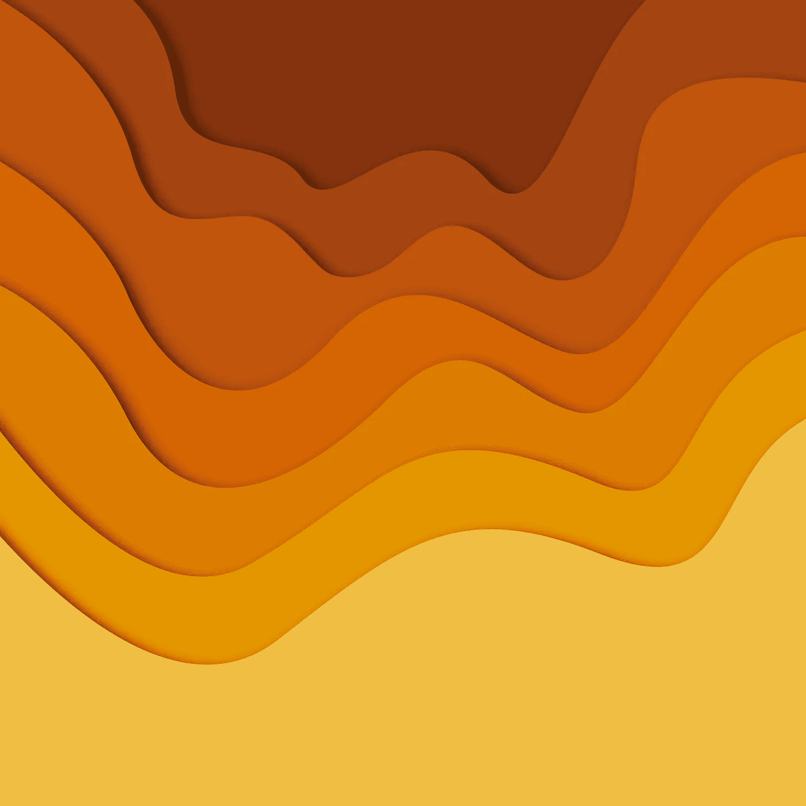

# 用 TypeScript 构建游戏。颜色和图层

> 原文：<https://levelup.gitconnected.com/building-a-game-with-typescript-colors-and-layers-337b0e4d71f>

教程[系列](https://medium.com/@gregsolo/gamedev-patterns-and-algorithms-in-action-with-typescript-d29b913858e)的第四章讲述了如何用类型脚本和本地浏览器 API 从头开始构建一个游戏

[free pik 创建的设计向量](https://www.freepik.com/free-photos-vectors/design)

很高兴看到你回来，读者！在这一系列教程中，我们学习如何使用**类型脚本**、原生**浏览器的 API**、**固体**架构、**增量**方法和**单元测试**从头构建一个简单的回合制游戏。

这是第四章的第一部分。本章将向我们介绍游戏的新元素:`Ships`。这些是玩家可以在棋盘上移动并攻击其他玩家的船只的元素。游戏的最终目标是摧毁所有的敌舰。如果您正在寻找本系列的其他章节，您可以在这里找到它们:

*   [简介](https://medium.com/@gregsolo/gamedev-patterns-and-algorithms-in-action-with-typescript-d29b913858e)
*   [第一章实体组件系统](https://medium.com/@gregsolo/entity-component-system-in-action-with-typescript-f498ca82a08e)
*   第二章。游戏循环([第一部](https://medium.com/@gregsolo/gamedev-patterns-and-algorithms-with-typescript-game-loop-part-1-2-699919bb9b71)，[第二部](https://medium.com/@gregsolo/gamedev-patterns-and-algorithms-in-action-with-typescript-game-loop-2-2-c0d57a8e5ec2))
*   第三章。绘制网格([第 1 部分](https://medium.com/@gregsolo/building-a-game-with-typescript-drawing-grid-1-5-aaf68797a0bb)、[第 2 部分](https://medium.com/javascript-in-plain-english/building-a-game-with-typescript-drawing-grid-2-5-206555719490)、[第 3 部分](https://medium.com/@gregsolo/building-a-game-with-typescript-drawing-grid-3-5-1fb94211c4aa)、[第 4 部分](https://medium.com/@gregsolo/building-a-game-with-typescript-iii-drawing-grid-4-5-398af1dd638d)、[第 5 部分](https://medium.com/@gregsolo/building-a-game-with-typescript-drawing-grid-5-5-49454917b3af))
*   第四章。舰船(第一部分，[第二部分](https://medium.com/@gregsolo/building-a-game-with-typescript-team-and-fleet-f223d39e9248)，[第三部分](https://medium.com/@gregsolo/building-a-game-with-typescript-drawing-ship-14e6c19caa38)，[第四部分](https://gregsolo.medium.com/building-a-game-with-typescript-ship-and-locomotion-4f5969675993)
*   第五章输入系统([第一部分](https://gregsolo.medium.com/building-a-game-with-typescript-input-system-1-3-46d0b3dd7662)、[第二部分](https://gregsolo.medium.com/building-a-game-with-typescript-input-system-2-3-cd419e36027c)、[第三部分](https://gregsolo.medium.com/building-a-game-with-typescript-input-system-3-3-8492552579f1))
*   第六章。寻路和移动([第一部分](https://blog.gregsolo.me/articles/building-a-game-with-typescript-pathfinding-and-movement-17-introduction)、[第二部分](https://blog.gregsolo.me/articles/building-a-game-with-typescript-pathfinding-and-movement-27-highlighting-locomotion-range)、[第三部分](https://blog.gregsolo.me/articles/building-a-game-with-typescript-pathfinding-and-movement-37-graph-and-priority-queue)、[第四部分](https://blog.gregsolo.me/articles/building-a-game-with-typescript-pathfinding-and-movement-47-pathfinder)、[第五部分](https://blog.gregsolo.me/articles/building-a-game-with-typescript-pathfinding-and-movement-57-finding-the-path)、[第六部分](https://blog.gregsolo.me/articles/building-a-game-with-typescript-pathfinding-and-movement-6-instant-locomotion)、[第七部分](https://blog.gregsolo.me/articles/pathfinding-and-movement-7-animated-locomotion))
*   第七章。玛奇纳州
*   第八章。攻击系统:生命和伤害
*   第九章。比赛的输赢
*   第十章敌人 AI

> 随意切换到[库](https://github.com/soloschenko-grigoriy/gamedev-patterns-ts)的`*drawing-grid-5*`分支。它包含了前几篇文章的工作成果，是这篇文章的一个很好的起点。

在这一点上，我们不打算使用高保真图形。我们的目标是理解原理和构建系统，而不是运送 AAA 游戏。所以，我们的*飞船*看起来会相当谦虚:

是的，这些圆圈实际上是船

但不要因此而气馁。事实上，我们用简单的形状来代表移动的元素并不意味着我们的系统功能会更弱。我们专注于游戏的编程方面，并建立了一个类似的原型。这并不意味着我们不能将高质量的图形放在我们稍后构建的代码之上。

在最后几章中，我们构建了几个实用程序来帮助我们处理游戏的许多方面:`Vector2D`、`Entities and Components`、`Lifecycle Events`。我们开始相当广泛地处理绘图和颜色，所以是时候介绍另一个实用程序:`Color`助手了。

# 目录

1.  颜色实用程序
2.  测试颜色实用程序
3.  画圆
4.  画布前景层
5.  结论

# 颜色实用程序

[宏矢量创建的背景矢量——www.freepik.com](https://www.freepik.com/vectors/background)

以前，我们用 native canvas 的方式处理颜色:作为一个字符串。但是`string`是一个相当不安全的结构，而且不太灵活。例如，看看我们如何设置`Node`颜色:

该字符串包含 4 条不同的信息:4 个颜色通道的颜色设置(红色、绿色、蓝色、Alpha)。如果我们想改变任何频道，我们必须做一些奇怪的字符串操作。更不用说，我们有零验证或类型检查，可能会意外设置某些东西`rgva(245, 245, 245, 1)`甚至`rgba(-245, 245, 2450, 10)`。总的来说，最好有一个专用的数据类型来满足我们丰富多彩的需求:

我希望你已经习惯了每次我们创建一个新东西的时候更新桶文件:

我们应该能够用显式颜色通道实例化`Color`类，存储并提供公共读取访问:

然而，我们应该首先验证参数，并且只有当它们满足我们的约束时才进行实例化。为此，在这种情况下，我们必须跳过方便的 TypeScript 快捷方式，手动设置字段:

验证本身很简单。我们应该验证每个数字都在合理的范围内(颜色通道为 0–255，alpha 通道为 0–1):

另外，颜色通道应该是一个整数:

现在我们可以在构造函数中运行验证了:

> 为什么`IsValidChannel`是静态的？因为提供的验证规则与`Color`的实例无关，也就是特定的`color`。这些规则对于整个类型是通用的。

由于 Canvas API 使用了`strings`，新的`Color`助手应该提供一种将其值转换为字符串的方法:

现在让我们更新`Settings`以包含`Color`而不是字符串:

`Canvas`现在可以用`Color`而不是弦了:

这将需要更新`canvas.spec.ts`:

不错！此时，我们的代码应该通过`npm start`成功编译，所有测试应该通过`npm t`:

我们使用方便的小转换器方法`AsString`。让我们绕个弯，添加相反的转换功能:`FromString`这个静态方法能够将 string 转换成`Color`的实例:

该方法解析提供的字符串并验证每个组件确实是一个数字，然后实例化新的`Color`。

# 测试颜色实用程序

www.freepik.com 弗里皮克创作的[图案照片](https://www.freepik.com/photos/pattern)

厉害！我们剩下的工作就是用单元测试来覆盖我们的新助手:

首先，我们可以断言`Color`可以被正确实例化:

我们只是验证新创建的`Color`的每个通道都有一个合适的值。接下来，我们应该检查验证是否正常工作:

我们向`Color`提供每个通道的无效选项，并确保每次它报告各自的错误。

太好了！我们已经介绍了构造函数，现在我们应该将注意力转移到其他方法上:

`AsString`转换器应该获取`Color`的一个实例，并返回一个格式正确的字符串:

为了验证`Color.FromString`，我们可以提供一个字符串，并检查每个通道是否有正确的值:

最后，我们可以检查不同的无效字符串，并预期会抛出错误:

此时，我们的代码应该通过`npm start`成功编译，并且所有测试应该通过`npm t`:

厉害！现在，当我们设置好`Color`助手后，我们终于可以开始绘制船只了。或者我应该说，圆圈？

# 画圆

正如我之前提到的，在我们的游戏中，船只被简单地表示为圆圈。如果你还记得我们有一个很棒的微型渲染引擎，我们在前面的章节中已经设置好了:`Canvas`。但是除了矩形之外，我们没有工具来画任何东西。是时候解决这个不便了！

[rawpixel.com 创建的背景向量](https://www.freepik.com/vectors/background)

我们需要一种能为我们画圆的新方法:

我们用天然画布`rect`画出矩形并填充。然后，我们对一个循环重复这种方法，但多亏了`arc`方法:

当然，我们应该用测试来覆盖这个新功能:

与我们测试`FillRect`的方式相同，我们将监视本机 API，并期望它在调用`canvas.FillCircle`后被执行:

不错！此时，我们的代码应该可以用`npm start`成功编译，并且所有的测试都应该通过`npm t`:

# 前景画布层

[Sketchepedia 创建的背景矢量](https://www.freepik.com/vectors/background)

形状不是唯一区别于网格的东西。它们总是被画在网格的顶部。换句话说，它们应该绘制在顶层“层”上。但是我们只有一个“背景”层:

没问题！添加新层是一项简单的任务:

该过程与我们用于`background`的过程相同:我们实例化适当大小的新`Canvas`，唤醒它，并将其链接到私有字段。你可以想象，几乎所有的代码都是重复的。让我们定义一个单独的方法来避免重复我们自己:

现在在`Background`和`Foreground`getter 中使用这个新方法:

不错！但是我们在这里有一个小问题:这两张画布是相同的。唯一的区别就是他们的名字:`background` vs `foreground`。没有什么*实际上*让`foreground`躺在上面。

事实上，每个画布都是一个 DOM 元素。为了将它们放在不同的“级别”上，我们可以使用 good 'ol CSS:具有更高`z-index`的元素更接近查看者(假设它们属于同一个父元素，这正是我们的情况)。

我们有很多方法可以实现这一点。其中之一是让`Canvas`处理样式，而`CanvasLayer`只利用特定的规则。通过这种方式，他们将维护自己的职责:`Canvas`管理画布 DOM 元素，`CanvasLayer`创建画布层。

为了实现这个行为，我们应该在`Canvas`中提供一个新的 API:

该方法采用可能的 CSS 选项，并将它们应用于 canvas 元素:

> *注意，我使用* `*Partial*` *让消费者只提供几个可能的选项。*

我们现在可以更新单元测试来验证这种行为:

并将其连接到`CanvasLayer`:

厉害！让我们通过测试新的`Foreground`层在蛋糕上加一颗樱桃:

测试`Foreground`的方法与`Background`的方法完全相同:无论我们请求这个层多少次，`Canvas`实例化应该只发生一次。

此时，我们的代码应该通过`npm start`成功编译，所有测试应该通过`npm t`:

> 你可以在[库](https://github.com/soloschenko-grigoriy/gamedev-patterns-ts)的`ships-1`分支中找到这篇文章的完整源代码。

# 结论

酷！我们做好了一切必要的准备，搭起了画船的舞台。我们创造了一个方便的工具来帮助我们处理颜色。此外，我们更新了我们的渲染引擎，以支持一个新的原始形状:圆形。当然，我们引入了一个新的画布层:`Foreground`，这是一个为我们未来的船只准备的特殊位置，以确保它们总是停留在图像的顶部。

下次我们将谈论团队和对手。我们还将为**舰队**创建一个专用实体。没错:我们将拥有自己的舰队！

我真的很想听听你的想法！如果你有任何**评论**、**建议**、**问题**，或者任何其他**反馈**，请不要犹豫，给我发私信或者在下面留下评论！如果你喜欢这篇文章，请与他人分享。它真的帮助我继续努力。感谢您的阅读，我们下次再见！

*这是系列教程* ***用 TypeScript*** *构建游戏的第四章。其他章节可点击此处:*

*   [简介](https://medium.com/@gregsolo/gamedev-patterns-and-algorithms-in-action-with-typescript-d29b913858e)
*   [第一章实体组件系统](https://medium.com/@gregsolo/entity-component-system-in-action-with-typescript-f498ca82a08e)
*   第二章。游戏循环([第一部分](https://medium.com/@gregsolo/gamedev-patterns-and-algorithms-with-typescript-game-loop-part-1-2-699919bb9b71)，[第二部分](https://medium.com/@gregsolo/gamedev-patterns-and-algorithms-in-action-with-typescript-game-loop-2-2-c0d57a8e5ec2))
*   第三章。绘制网格([第一部分](https://medium.com/@gregsolo/building-a-game-with-typescript-drawing-grid-1-5-aaf68797a0bb)、[第二部分](https://medium.com/javascript-in-plain-english/building-a-game-with-typescript-drawing-grid-2-5-206555719490)、[第三部分](https://medium.com/@gregsolo/building-a-game-with-typescript-drawing-grid-3-5-1fb94211c4aa)、[第四部分](https://medium.com/@gregsolo/building-a-game-with-typescript-iii-drawing-grid-4-5-398af1dd638d)、[第五部分](https://medium.com/@gregsolo/building-a-game-with-typescript-drawing-grid-5-5-49454917b3af))
*   第四章。船舶(第 1 部分，[第 2 部分](https://medium.com/@gregsolo/building-a-game-with-typescript-team-and-fleet-f223d39e9248)，[第 3 部分](https://medium.com/@gregsolo/building-a-game-with-typescript-drawing-ship-14e6c19caa38)，[第 4 部分](https://gregsolo.medium.com/building-a-game-with-typescript-ship-and-locomotion-4f5969675993))
*   第五章输入系统([第一部分](https://gregsolo.medium.com/building-a-game-with-typescript-input-system-1-3-46d0b3dd7662)、[第二部分](https://gregsolo.medium.com/building-a-game-with-typescript-input-system-2-3-cd419e36027c)、[第三部分](https://gregsolo.medium.com/building-a-game-with-typescript-input-system-3-3-8492552579f1))
*   第六章。寻路与移动([第一部分](https://blog.gregsolo.me/articles/building-a-game-with-typescript-pathfinding-and-movement-17-introduction)、[第二部分](https://blog.gregsolo.me/articles/building-a-game-with-typescript-pathfinding-and-movement-27-highlighting-locomotion-range)、[第三部分](https://blog.gregsolo.me/articles/building-a-game-with-typescript-pathfinding-and-movement-37-graph-and-priority-queue)、[第四部分](https://blog.gregsolo.me/articles/building-a-game-with-typescript-pathfinding-and-movement-47-pathfinder)、[第五部分](https://blog.gregsolo.me/articles/building-a-game-with-typescript-pathfinding-and-movement-57-finding-the-path)、[第六部分](https://blog.gregsolo.me/articles/building-a-game-with-typescript-pathfinding-and-movement-6-instant-locomotion)、[第七部分](https://blog.gregsolo.me/articles/pathfinding-and-movement-7-animated-locomotion))
*   第七章。玛奇纳州
*   第八章。攻击系统:生命和伤害
*   第九章。比赛的输赢
*   第十章敌人 AI