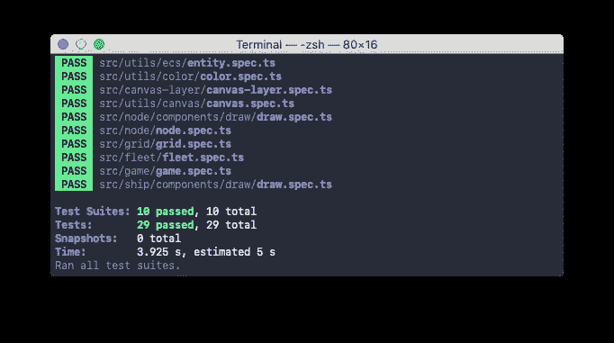
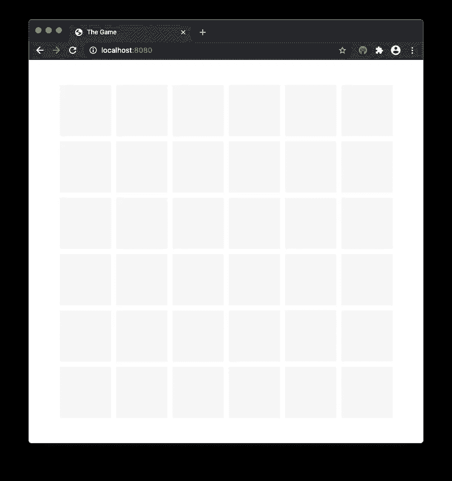
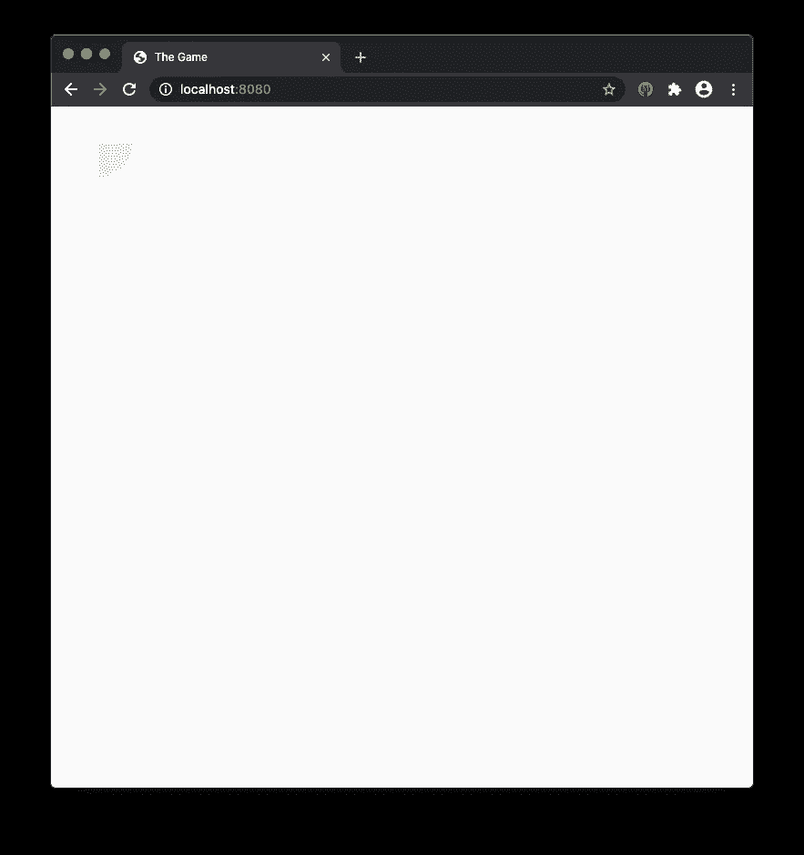
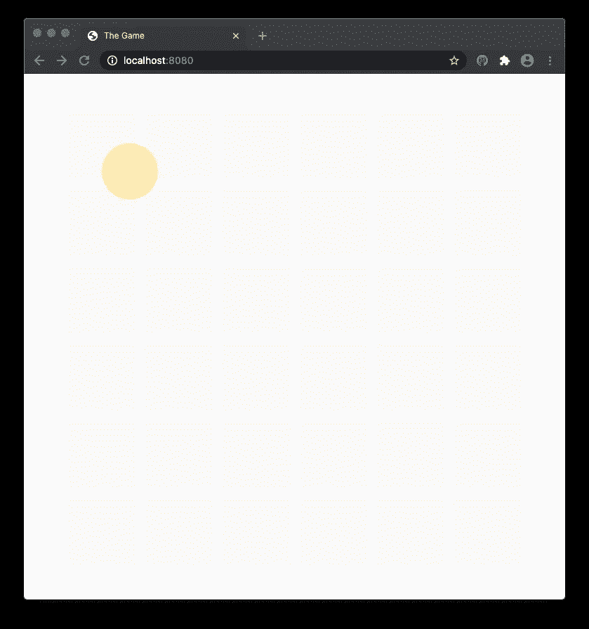
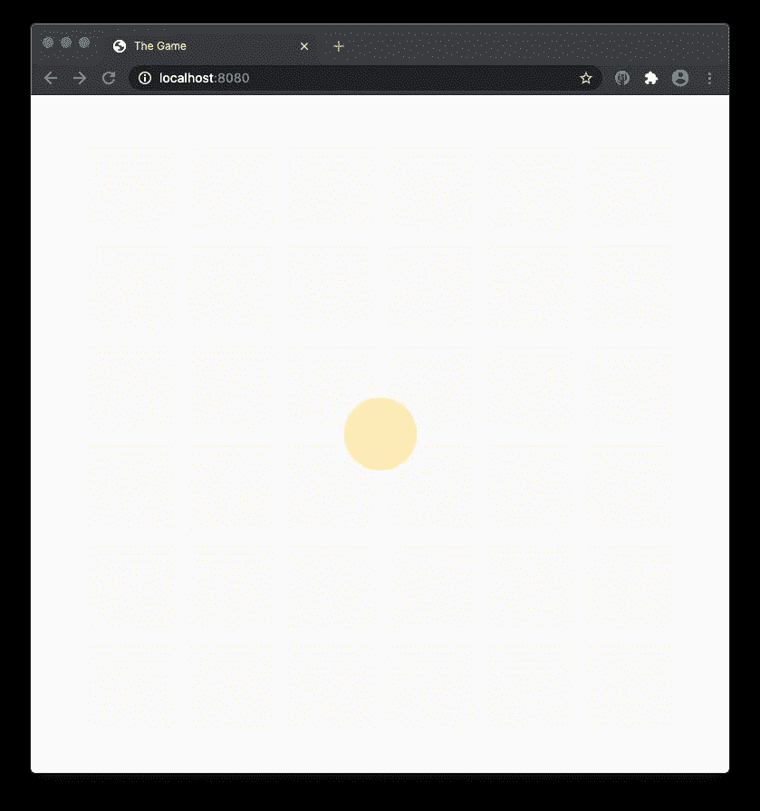
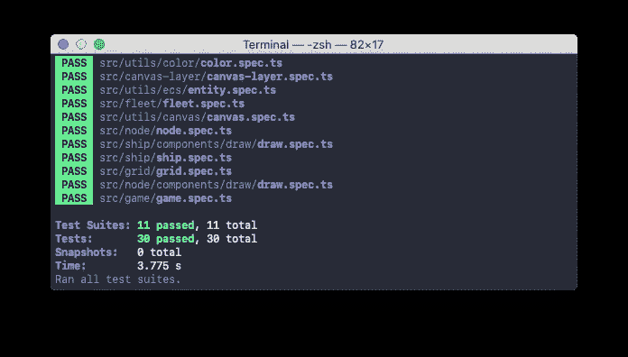

# 用 TypeScript 构建游戏。牵引船

> 原文：<https://levelup.gitconnected.com/building-a-game-with-typescript-drawing-ship-14e6c19caa38>

教程[系列](https://medium.com/@gregsolo/gamedev-patterns-and-algorithms-in-action-with-typescript-d29b913858e)的第四章讲述了如何用 TypeScript 和原生浏览器 API 从头开始构建游戏

[由 vectorpouch 创建的行程矢量](https://www.freepik.com/free-photos-vectors/travel)

你好，读者！欢迎回到本系列教程！我们正在讨论如何使用**类型脚本**、无外部库、**稳固**架构、**增量**方法和**单元测试**从头构建一个简单的回合制游戏。

在上一篇文章中，我们介绍了`Ship`:这款游戏最基本的游戏机制。我们还谈到了`Teams`和冲突，建立了`Fleet`作为舰船的集合。

今天我们要展示一些视觉效果。我们将在屏幕上渲染`Ship`,并对它的位置做一点改动。准备好了吗？

在第四章“船”中，我们实现了回合制游戏中最重要的标志:我们抽取了`Ships`。玩家会用它们来攻击其他玩家。失去所有船只意味着输掉游戏。您可以在这里找到本系列的其他章节:

*   [简介](https://medium.com/@gregsolo/gamedev-patterns-and-algorithms-in-action-with-typescript-d29b913858e)
*   [第一章实体组件系统](https://medium.com/@gregsolo/entity-component-system-in-action-with-typescript-f498ca82a08e)
*   第二章。游戏循环([第一部](https://medium.com/@gregsolo/gamedev-patterns-and-algorithms-with-typescript-game-loop-part-1-2-699919bb9b71)、[第二部](https://medium.com/@gregsolo/gamedev-patterns-and-algorithms-in-action-with-typescript-game-loop-2-2-c0d57a8e5ec2))
*   第三章。绘制网格([第 1 部分](https://medium.com/@gregsolo/building-a-game-with-typescript-drawing-grid-1-5-aaf68797a0bb)、[第 2 部分](https://medium.com/javascript-in-plain-english/building-a-game-with-typescript-drawing-grid-2-5-206555719490)、[第 3 部分](https://medium.com/@gregsolo/building-a-game-with-typescript-drawing-grid-3-5-1fb94211c4aa)、[第 4 部分](https://medium.com/@gregsolo/building-a-game-with-typescript-iii-drawing-grid-4-5-398af1dd638d)、[第 5 部分](https://medium.com/@gregsolo/building-a-game-with-typescript-drawing-grid-5-5-49454917b3af))
*   第四章。舰船([第一部分](https://medium.com/@gregsolo/building-a-game-with-typescript-colors-and-layers-337b0e4d71f)，[第二部分](https://medium.com/@gregsolo/building-a-game-with-typescript-team-and-fleet-f223d39e9248)，第三部分，[第四部分](https://gregsolo.medium.com/building-a-game-with-typescript-ship-and-locomotion-4f5969675993))
*   第五章输入系统([第一部分](https://gregsolo.medium.com/building-a-game-with-typescript-input-system-1-3-46d0b3dd7662)、[第二部分](https://gregsolo.medium.com/building-a-game-with-typescript-input-system-2-3-cd419e36027c)、[第三部分](https://gregsolo.medium.com/building-a-game-with-typescript-input-system-3-3-8492552579f1))
*   第六章。寻路和移动([第一部分](https://blog.gregsolo.me/articles/building-a-game-with-typescript-pathfinding-and-movement-17-introduction)、[第二部分](https://blog.gregsolo.me/articles/building-a-game-with-typescript-pathfinding-and-movement-27-highlighting-locomotion-range)、[第三部分](https://blog.gregsolo.me/articles/building-a-game-with-typescript-pathfinding-and-movement-37-graph-and-priority-queue)、[第四部分](https://blog.gregsolo.me/articles/building-a-game-with-typescript-pathfinding-and-movement-47-pathfinder)、[第五部分](https://blog.gregsolo.me/articles/building-a-game-with-typescript-pathfinding-and-movement-57-finding-the-path)、[第六部分](https://blog.gregsolo.me/articles/building-a-game-with-typescript-pathfinding-and-movement-6-instant-locomotion)、[第七部分](https://blog.gregsolo.me/articles/pathfinding-and-movement-7-animated-locomotion))
*   第七章。玛奇纳州
*   第八章。攻击系统:生命和伤害
*   第九章。比赛的输赢
*   第十章敌人 AI

> 随意切换到[库](https://github.com/soloschenko-grigoriy/gamedev-patterns-ts)的`ships-2`分支。它包含了前几篇文章的工作成果，是这篇文章的一个很好的起点。

# 目录

1.  ShipDrawComponent 简介
2.  TDDing ShipDrawComponent
3.  配置船的半径和颜色
4.  附加组件
5.  测试船
6.  结论

# ShipDrawComponent 简介

我们有一个简单但足够强大的渲染引擎供我们使用。我们[自己造的](https://medium.com/@gregsolo/building-a-game-with-typescript-iii-drawing-grid-4-5-398af1dd638d)！并且我们成功测试了它来绘制`Nodes`。

我们可以利用同样的方法来渲染`Ships`，引擎足够灵活来支持它。

[故事创造的人物向量——www.freepik.com](https://www.freepik.com/vectors/people)

首先，负责绘制`Ships`的行为是一个*组件*。我们可以用不同的方式渲染船只，使用各种视觉效果，即使现在它们看起来像一个简单的圆圈。在未来，我们甚至可以释放 WebGL 的全部力量来渲染美丽的程序生成的船只，谁知道呢？但是我们可以肯定的是:保持我们的架构的灵活性是很重要的。

我们的`Entity`和`Component`应该允许我们添加/删除我们认为合适的“绘图组件”。

我首先为`ShipDrawComponent`创建一个样板文件。首先，组件本身:

然后桶文件:

最后，测试规格:

第二，如果你记得的话，`NodeDrawComponent`经常重新绘制自己，以确保它可视化最近的状态。我们通过在每次更新时调用`Clear`和`Draw`来做到这一点。这对`Ships`来说甚至更重要，因为它们比`Grid`更具动态性:玩家在棋盘上移动船只，船只可以开火并受到伤害，等等。我们还应该在第一次画画之前清理画布:

不错！然而，这一次我们将尝试新的东西。让我们先编写这些测试，然后再考虑生产代码，而不是实现解决方案，然后再测试它。换句话说，是时候进行测试驱动开发了！

# TDDing ShipDrawComponent

由 www.freepik.com 星光公司创建的[商业载体](https://www.freepik.com/vectors/business)

首先，我们必须实例化组件来测试它:

但是，每个组件都需要一个`Entity`，没有它就不能存在。`Ship`对于这种情况来说是一个明显的候选者，但是我们不直接构造`Ship`，而是准备一个**模拟**。这种方法给了我们额外的灵活性，以防`Ships`决定改变它的构造函数签名。

正如我们对`Fleet`所做的一样，我们在“所有者”所在的同一个文件夹中设置了`Ship` mock:

我们可能会在系统的其他地方使用它，因此用 barrel 文件重新导出我们的 mock 是合理的:

不错！我们现在可以很容易地在`ShipDrawComponent`测试中使用这个模拟:

测试对象就位后，我们可以开始验证它。我们的第一个案例是关于`Component`醒来时清理画布。在我们的代码中“清理画布”是什么意思？我们花了一些时间将渲染引擎设置为代码和任何底层 API 之间的抽象层。因此，“清理”意味着调用特定层`Canvas`的`ClearRect`:

这里我们监视`CanvasLayer.Foreground.ClearRect`,确保它从未被执行过。正如我们所确定的，`Ship`属于`Foreground`层，与`Node`相反，它在`Background`上绘制自己。

接下来，我们简单地唤醒组件，并期待我们的小间谍被调用:

第二个案例也是如此。但是我们也应该验证是否调用了`FillCircle`，因为`Ships`在我们的游戏中是简单的圆:

厉害！当然，考试无情地落下。但是现在我们知道该怎么做了！我们准备的测试显示了我们需要写什么代码。

首先，让我们定义私有的`Draw`和`Clear`方法。他们将分别负责所有绘图和清除逻辑。此外，确保我们在需要时调用它们:

厉害！我们现在要做的是*实际上是*绘制和清理…但是怎么做呢？当然，我们需要调用`CanvasLayer.Foreground.FillCircle`，我们知道没问题！但是这个方法需要一个圆心，那是什么？

嗯，那必须是`Ship`的*位置*。棘手的是不像`Node`这个位置不是一个常数。根据游戏力学，`Ship`必须不停地四处移动服务于玩家的意志。而且，`Draw`组件对此行为没有权限。`Ship`的位置应由`Ship`本身甚至*另一个*组件控制。

我们以后再处理这个问题。现在我们可以通过硬编码位置来凑合。我们不知道它将来自哪里，如何工作，但我们肯定它不是我们`DrawComponent`的成员。考虑到这一点，我将使`position`成为私有计算属性:

有了位置，渲染就变成了调用渲染引擎 API 的小事:

等等，为什么半径是 **40** ？难道应该是`Node`的大小吗？既然只有一只`Ship`能“站”在一只`Node`上？这是事实，但是`Ships`可以小于`Node`。理想情况下，`Ship`中的`radius`应该是可配置的，并允许游戏设计师使用它并找到完美的值。`color`也是如此。而且，`color`应该是`Team`的一个功能，否则玩家很容易混淆！

# 配置船的半径和颜色

[rawpixel.com-www.freepik.com 创建的业务向量](https://www.freepik.com/vectors/business)

记住这一点，是时候更新了`Settings`:

> 我正在使用[材质颜色工具](https://material.io/resources/color/#!/?view.left=0&view.right=0)来选择颜色，但是如果你喜欢，可以随意选择其他颜色！

我们现在可以应用新设置:

这里我们根据这个`Ship`属于什么`Team`来选择圆的颜色。半径也由`Settings`决定。

清理画布落在同一个桶里:

我们清理`Ship`周围整个`Node`大小的区域。由于`ClearRect`期望区域的左上角，我们必须在这里做一些数学计算。

> “等一下！为什么我们要清理整个`Node`而不是一个圆圈？船占的空间肯定少！”很棒的问题！我们确实清理了比我们利用面积稍多的地区。但是我们知道在任何时候一个节点内只能有一艘飞船。这允许我们清理所有可能的“伪像”,这些“伪像”可能在动画过程中由丢帧引起。这不会解决所有的问题，但却是获得合适结果的廉价方式。
> 
> "好吧，但是它不也删除了`Node`吗？"不，因为我们画在完全不同的层:“前景”。网格停留在底部，“背景”层，不受我们在其他层所做的任何事情的影响。这正是我们花时间介绍分层系统的原因。

这就是了！我们的艰苦劳动结束了，现在我们可以用`npm start`成功编译，用`npm t`通过所有测试。这一次，我们通过测试驱动开发做到了这一点！做得好！

# 附加组件

然而，我们在屏幕上看不到任何新东西:

当然啦！我们*准备了*组件，但是还没有*附上*。让我们来解决这个小误会:

现在我们可以看到我们的`Ship`！

我们只看到了一部分。这是因为我们将圆心硬编码为`0,0`，即画布的左上角。这是它的边缘，除此之外的东西都被剥离了。我们可以稍微调整一下这个值:

现在我们可以看到这艘船的辉煌:

你可以随意摆弄这个位置。例如，您可以将`Ship`放在画布的正中央:

您应该会看到类似这样的内容:

> 技术上来说，我们看到一堆`Ships`。他们只是在彼此身上画画。我们在绘制`Nodes`时也遇到了同样的问题。在我们摆好位置后，我们会看到其他的船。

# 测试船

在我们结束这篇文章之前，请不要否认我在蛋糕上加了一点樱桃。我们测试了`ShipDrawComponent`，但是我们完全忘记了`Ship`！

[弗里皮克-www.freepik.com 创建的模板向量](https://www.freepik.com/vectors/template)

幸运的是，我们已经测试实体很多次了，这段代码应该很熟悉:

到目前为止，我们只监视一个组件，`ShipDrawComponent`，并确保它在实体自身唤醒和更新时唤醒和更新。`Ship`没有孩子，所以我们不讨论这个场景。

此时，我们的代码应该仍然可以通过`npm start`成功编译，并且所有的测试应该仍然可以通过`npm t`:

> 你可以在[库](https://github.com/soloschenko-grigoriy/gamedev-patterns-ts)的`ships-3`分支中找到这篇文章的完整源代码。

# 结论

这太棒了！我们引入了新的拼图块`ShipDrawComponent`，它负责利用我们简陋的渲染引擎绘制船只。我们还尝试了在本教程中从未做过的事情:我们使用测试驱动开发来烹饪这个组件。

然而，我们还没有完全完成。我们硬编码了`position`,但肯定不会让它那样。我们同意这不是我们的责任。但那是谁呢？

`Ship`的位置在很多方面取决于`Ship` *移动*的事实。移动`Ship`意味着改变它的位置。具体怎么做？好吧，我们将在本章的最后一部分讨论它，当我们介绍`Locomotion`组件的时候。

我真的很想听听你的想法！如果你有任何**的评论**、**的建议**、**的问题**，或者任何其他**的反馈**，不要犹豫给我发私信或者在下面留下评论！如果你喜欢这个系列，**请与他人分享**。这对我继续努力很有帮助。感谢您的阅读，我们下次再见！

*这是系列教程* ***用打字稿*** *构建游戏中的第四章。其他章节可点击此处:*

*   [简介](https://medium.com/@gregsolo/gamedev-patterns-and-algorithms-in-action-with-typescript-d29b913858e)
*   [第一章实体组件系统](https://medium.com/@gregsolo/entity-component-system-in-action-with-typescript-f498ca82a08e)
*   第二章。游戏循环([第一部分](https://medium.com/@gregsolo/gamedev-patterns-and-algorithms-with-typescript-game-loop-part-1-2-699919bb9b71)，[第二部分](https://medium.com/@gregsolo/gamedev-patterns-and-algorithms-in-action-with-typescript-game-loop-2-2-c0d57a8e5ec2))
*   第三章。绘制网格([第一部分](https://medium.com/@gregsolo/building-a-game-with-typescript-drawing-grid-1-5-aaf68797a0bb)、[第二部分](https://medium.com/javascript-in-plain-english/building-a-game-with-typescript-drawing-grid-2-5-206555719490)、[第三部分](https://medium.com/@gregsolo/building-a-game-with-typescript-drawing-grid-3-5-1fb94211c4aa)、[第四部分](https://medium.com/@gregsolo/building-a-game-with-typescript-iii-drawing-grid-4-5-398af1dd638d)、[第五部分](https://medium.com/@gregsolo/building-a-game-with-typescript-drawing-grid-5-5-49454917b3af))
*   第四章。船舶([第一部分](https://medium.com/@gregsolo/building-a-game-with-typescript-colors-and-layers-337b0e4d71f)、[第二部分](https://medium.com/@gregsolo/building-a-game-with-typescript-team-and-fleet-f223d39e9248)、第三部分[、第四部分](https://gregsolo.medium.com/building-a-game-with-typescript-ship-and-locomotion-4f5969675993))
*   第五章输入系统([第一部分](https://gregsolo.medium.com/building-a-game-with-typescript-input-system-1-3-46d0b3dd7662)、[第二部分](https://gregsolo.medium.com/building-a-game-with-typescript-input-system-2-3-cd419e36027c)、[第三部分](https://gregsolo.medium.com/building-a-game-with-typescript-input-system-3-3-8492552579f1)
*   第六章。寻路与移动([第一部分](https://blog.gregsolo.me/articles/building-a-game-with-typescript-pathfinding-and-movement-17-introduction)、[第二部分](https://blog.gregsolo.me/articles/building-a-game-with-typescript-pathfinding-and-movement-27-highlighting-locomotion-range)、[第三部分](https://blog.gregsolo.me/articles/building-a-game-with-typescript-pathfinding-and-movement-37-graph-and-priority-queue)、[第四部分](https://blog.gregsolo.me/articles/building-a-game-with-typescript-pathfinding-and-movement-47-pathfinder)、[第五部分](https://blog.gregsolo.me/articles/building-a-game-with-typescript-pathfinding-and-movement-57-finding-the-path)、[第六部分](https://blog.gregsolo.me/articles/building-a-game-with-typescript-pathfinding-and-movement-6-instant-locomotion)、[第七部分](https://blog.gregsolo.me/articles/pathfinding-and-movement-7-animated-locomotion))
*   第七章。玛奇纳州
*   第八章。攻击系统:生命和伤害
*   第九章。比赛的输赢
*   第十章敌人 AI