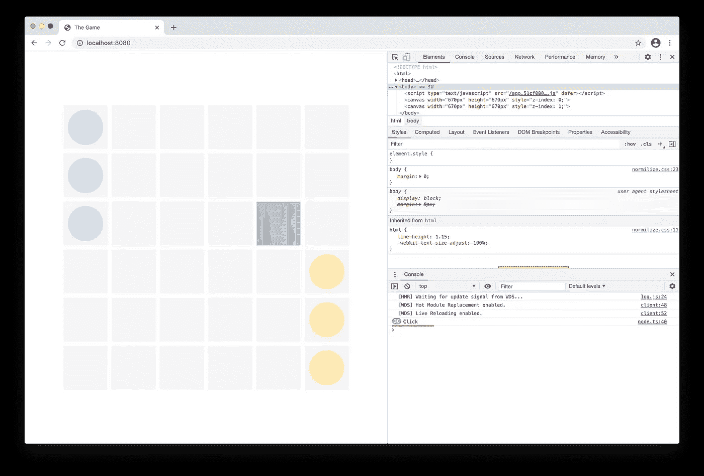
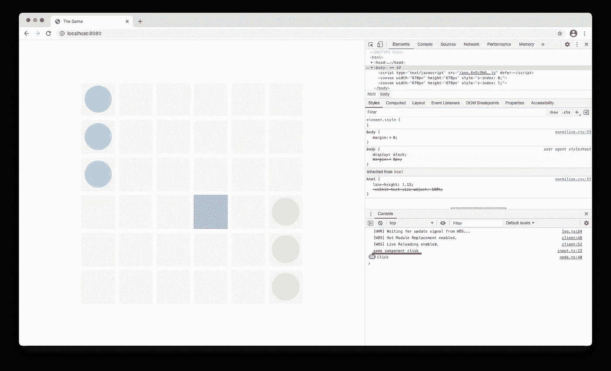
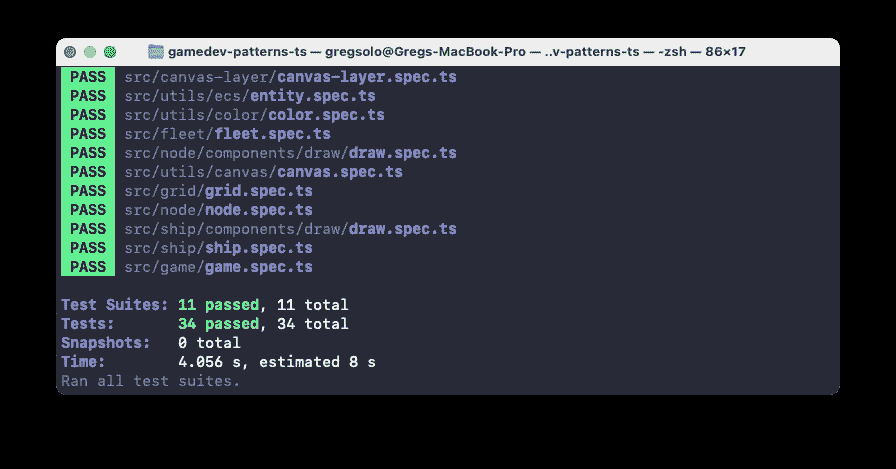

# 用 TypeScript 构建游戏。输入系统 2/3

> 原文：<https://levelup.gitconnected.com/building-a-game-with-typescript-input-system-2-3-cd419e36027c>

教程[系列](https://medium.com/@gregsolo/gamedev-patterns-and-algorithms-in-action-with-typescript-d29b913858e)中的第五章讲述了如何用 TypeScript 和本地浏览器 API 从头开始构建游戏

[由 vector juice-www.freepik.com 创建的云矢量](https://www.freepik.com/vectors/cloud)

欢迎回来，读者！[上次](https://gregsolo.medium.com/building-a-game-with-typescript-input-system-1-3-46d0b3dd7662)我们配置了`Node`实体来监听`body` DOM 元素上的 *click* 事件。虽然这给了我们想要的东西:一种在事件发生时得到通知的方式，但它远非高效。事实上，如果我们运行代码并添加`debugger`或`console.log`，我们会注意到我们对事件做出了多次反应:

我们捕捉点击 36 次(目前游戏中的`Nodes`的数量):

这并不特别可怕，因为我们仍然可以通过检查点击点是否在这个节点`Occupies`的区域内来将它缩小到特定的`Node`。但是，即使没有这种检查，36 个事件侦听器也很难成为任何现代浏览器的性能瓶颈。然而，如果游戏的其他部分也应该听卡嗒声，这个问题可能会加剧。问题并不在于性能，至少在我们拥有数千个这样的元素之前是如此(老实说，如果我们构建一个更复杂的游戏，这是相当可行的)。问题是，对于这种设计，我们必须为每个这样的元素复制来自`Awake`的代码。我们可以做得更好，在这一期中，我们将讨论如何用更好的架构来重构我们的代码。

在第五章*“输入系统”*中，我们将构建一个简单的系统，让玩家有机会与游戏交流。您可以在这里找到本系列的其他章节:

*   [简介](https://medium.com/@gregsolo/gamedev-patterns-and-algorithms-in-action-with-typescript-d29b913858e)
*   [第一章实体和组成部分](https://medium.com/@gregsolo/entity-component-system-in-action-with-typescript-f498ca82a08e)
*   第二章。游戏循环([第一部分](https://medium.com/@gregsolo/gamedev-patterns-and-algorithms-with-typescript-game-loop-part-1-2-699919bb9b71)，[第二部分](https://medium.com/@gregsolo/gamedev-patterns-and-algorithms-in-action-with-typescript-game-loop-2-2-c0d57a8e5ec2))
*   第三章。绘制网格([第一部分](https://medium.com/@gregsolo/building-a-game-with-typescript-drawing-grid-1-5-aaf68797a0bb)、[第二部分](https://medium.com/javascript-in-plain-english/building-a-game-with-typescript-drawing-grid-2-5-206555719490)、[第三部分](https://medium.com/@gregsolo/building-a-game-with-typescript-drawing-grid-3-5-1fb94211c4aa)、[第四部分](https://medium.com/@gregsolo/building-a-game-with-typescript-iii-drawing-grid-4-5-398af1dd638d)、[第五部分](https://medium.com/@gregsolo/building-a-game-with-typescript-drawing-grid-5-5-49454917b3af))
*   第四章。舰船([第一部分](https://medium.com/@gregsolo/building-a-game-with-typescript-colors-and-layers-337b0e4d71f)、[第二部分](https://medium.com/@gregsolo/building-a-game-with-typescript-team-and-fleet-f223d39e9248)、[第三部分](https://medium.com/@gregsolo/building-a-game-with-typescript-drawing-ship-14e6c19caa38)、[第四部分](https://gregsolo.medium.com/building-a-game-with-typescript-ship-and-locomotion-4f5969675993)
*   第五章输入系统([第一部分](https://gregsolo.medium.com/building-a-game-with-typescript-input-system-1-3-46d0b3dd7662)，第二部分[，第三部分](https://gregsolo.medium.com/building-a-game-with-typescript-input-system-3-3-8492552579f1))
*   第六章。寻路和移动([第一部分](https://blog.gregsolo.me/articles/building-a-game-with-typescript-pathfinding-and-movement-17-introduction)、[第二部分](https://blog.gregsolo.me/articles/building-a-game-with-typescript-pathfinding-and-movement-27-highlighting-locomotion-range)、[第三部分](https://blog.gregsolo.me/articles/building-a-game-with-typescript-pathfinding-and-movement-37-graph-and-priority-queue)、[第四部分](https://blog.gregsolo.me/articles/building-a-game-with-typescript-pathfinding-and-movement-47-pathfinder)、[第五部分](https://blog.gregsolo.me/articles/building-a-game-with-typescript-pathfinding-and-movement-57-finding-the-path)、[第六部分](https://blog.gregsolo.me/articles/building-a-game-with-typescript-pathfinding-and-movement-6-instant-locomotion)、[第七部分](https://blog.gregsolo.me/articles/pathfinding-and-movement-7-animated-locomotion))
*   第七章。玛奇纳州
*   第八章。攻击系统:生命和伤害
*   第九章。比赛的输赢
*   第十章敌人 AI

> 随意切换到[库](https://github.com/soloschenko-grigoriy/gamedev-patterns-ts)的`input-1`分支。它包含了前几篇文章的工作成果，是这篇文章的一个很好的起点。

# 目录

1.  介绍
2.  输入游戏组件
3.  快速内务处理
4.  Onclick 组件
5.  Onclick，抽象组件
6.  结论

# 输入游戏组件

我们有这么多事件处理程序的原因是我们为每个`Node`附加了它们。这就更奇怪了，因为从 DOM 的角度来看，我们实际上是在听整个`body`。

[宏向量-www.freepik.com 创建的技术向量](https://www.freepik.com/vectors/technology)

我们只有一个`body`，所以我们可以在实体的层次结构中向上移动监听器:一直到`Game`。这几乎不是`Game`本身的核心特征，而是一个我们可以打开或关闭的组件:

`IComponent`接口要求我们实现`Awake`和`Update`，并定义`Entity`。此外，我们不应该忘记桶文件:

太好了！现在，只要组件唤醒，我们就可以开始监听点击事件:

不错！因为我们只有一个`Game`实体，所以我们可以确保不添加任何多余的侦听器。

`HandleClick`有一些重要的职责。首先，它必须确保点击发生在游戏本身:

这个应该看着眼熟。我们将点击的点发送给`canvas`来分析这个点是否属于它。如果响应是否定的，我们忽略这个事件。

> 注意，我们使用了`Background`层。正如我们上次讨论的，我们检查哪一层并不重要，因为它们实际上占据了相同的区域。在更复杂的情况下，当图层位置不同和/或我们关心 Z 坐标时，检查会更复杂。幸运的是，我们总是可以在需要的时候扩展这个组件。

为了检查这是否有效，让我们在`point`检查之后添加`console.log`:

但是如果我们用`npm start`运行游戏并打开浏览器，除了来自`Node`的旧日志之外，我们将看不到其他日志:

那是因为我们忘记将新的`GameInputComponent`连接到`Game`:

现在你应该可以看到画布中每次点击的“游戏组件点击”日志消息以及“旧的”36 条消息。请注意，游戏会忽略画布边界之外的事件:

完美，正如我们所愿。对于所有的点击，我们有一个集中的监听器，过滤掉所有无用的事件。但是我们没有机制来通知实际的响应者。毕竟，`Node`怎么知道点击发生了呢？

# 快速内务处理

在我们开始解决这个问题之前，让我们先清理一下。首先，我们可以从根本上简化`game tests`。如果你还记得，前几集我们在测试`Game`实体时添加了一堆假组件。

[杰马斯托克-www.freepik.com](https://www.freepik.com/vectors/business)创建的业务向量

现在，当我们有一个真正的`Input Component`附加，我们可以摆脱假货:

我简单地删除了所有与假组件`C1`、`C2`、`C3`相关的代码，并添加了一个测试来验证`Game`是否连接了真正的`GameInputComponent`并正在运行。

同样，让我们为`Game`本身定义一个专用的模拟，我们很快就会用到它:

传统上，更新枪管:

并在测试中使用模拟:

此时，我们的代码应该可以用`npm start`成功编译，并且所有的测试都应该通过`npm t`:

最后，请允许我去掉我们上次添加的“脏”代码。不管怎样，我们已经实现了大部分:

好了，我们清理完了。那么，`Nodes`、`Ships`和其他人如何获得解雇事件的通知呢？有许多方法可以实现这一点。

我们可以用我最喜欢的模式之一:`Observer`。为了实现这个模式，我们必须存储应该在`GameInputComponent`之前通知的所有项目的列表。这是一个非常强大的方法，但是，每当我们想要新的项目开始监听事件时，我们都必须更新这个列表。或者相反，让项目停止监听。该功能可能需要这些项目了解`GameInputComponent`。

我宁愿避免这种耦合，而是建议我们再次利用我们的实体和组件。我们可以定义一个新的组件，比如说`Onclick`组件，并简单地通知所有拥有这个组件的`Game`子组件事件:

因此，`Game`的任何子节点都可以通过简单地附加`OnclickComponent`来“订阅”这些通知。当然打字稿投诉不存在的`OnclickComponent`。它完全有权这样做。我们还没有定义组件本身，但是这里有一个问题。

# Onclick 组件

以前，我们所有的组件都属于某个`Entity`。`GameInputComponent`明确属于`Game`实体。`NodeDrawComponent`没有`Node`就无法揣测它的存在。

`OnclickComponent`是异兽。它根本不关心一个特定的实体。它的唯一目的是向“连接我的实体，对点击事件感兴趣，并且必须对其做出反应”做出承诺。简单来说，它保证了 public 方法`ClickOn(point: Vector2D)`的存在。

【www.freepik.com 故事打造的营销载体

自然是一个`interface`但是比`IComponent`稍微严格一点。它需要实现`ClickOn`方法:

由于它不属于任何实体，我们可以将其放在`utils`下。让我们提醒自己关于桶文件:

但是这个接口的目的到底是什么呢？问题是，我们不知道哪些实体会利用点击功能。最重要的是，`GameInputComponent`也不知道。也不应该。

假设我们希望`Node`收到点击通知。我们可以创建**一个特定的** `NodeOnclickComponent`来实现`IOnClickComponent`接口。同样，如果我们希望`Ship`被通知，我们可以定义`ShipOnclickComponent`。但是`GameInputComponent`只会知道`IOnClickComponent`并且调用任何实现这个接口的人。这有效地将`GameInputComponent`从任何关于对事件做出反应的逻辑中分离出来。更好的是:`GameInputComponent`甚至不需要跟踪“订户”

唉，不管用。TypeScript 不断向我们抛出一个讨厌的错误:`'IOnClickComponent' only refers to a type, but is being used as a value here`。

的确，接口只是一个*类型的*，而`HasComponent`和`GetComponent`都需要一个实际的*东西*。如果你还记得，我们的实体组件系统被设置为在*运行时*工作，这给了我们在游戏*运行*时添加和删除组件的灵活性。在运行时，没有留下接口，所以我们的 ECS 实际上没有任何东西可以使用。

那么，我们如何解决这个难题呢？ECS 需要一些“真实”的东西，比如函数、类或对象。我们可以将我们的`IOnClickComponent`转换成一个类:

我们可以**删除**多余的`onclick.h`文件并更新桶:

但是你可能注意到我们必须按照`IComponent`的要求实现`Awake`和`Update`。这很烦人，更重要的是，从架构的角度来看，这是不正确的。`OnclickComponent`与`Awake`或`Update`无关。此外，正如我们之前讨论的，我们期望未来的组件(如`ShipOnclickComponent`、`NodeOnclickComponent`等)实现`IOnClickComponent`。`ClickOn`应该也会被覆盖。

如果这还不够的话，整个类`OnclickComponent`本身存在*只有*需要扩展。我们不期望有这个类的实例。幸运的是，在 OOP 世界中有一个特殊的工具来完成这项工作:*抽象*类。

# Onclick，抽象组件

[www.freepik.com 线材制作的图案照片](https://www.freepik.com/photos/pattern)

事实上，我们可以简单地将这个类和所有我们期望被覆盖的方法标记为“抽象”并将实现委托给未来的“特定”类:

太好了！现在我们可以更新`GameInputComponent`来使用这个抽象类而不是接口:

Aaaaand 它也不工作。我们消除了一个 TS 错误，却得到了另一个:`Argument of type 'typeof OnclickComponent' is not assignable to parameter of type 'constr<OnclickComponent>’`。这到底是什么意思？！

别紧张。TypeScript 只是试图通过迫使我们做出合理的、深思熟虑的选择来帮助我们。在这种情况下，它表明`OnclickComponent`很好，不是一个“通常的”类。你看，[当我们设计我们的实体组件系统](https://medium.com/@gregsolo/entity-component-system-in-action-with-typescript-f498ca82a08e)时，我们从来没有想过组件可以是一个**抽象**类。看一下这段代码:

类型`constr<T>`清楚地为组件设置了一个常规的期望(读:“可实例化的”)类。这里的关键词`new`正是这个原因。但是根据定义，类不能被实例化。

所以，我们能做的是扩展我们的选择，允许`Entity`以抽象类的形式期待一个组件:

这并不意味着我们可以将一个抽象类直接附加到`Entity`上，但是我们可以检查、查找、甚至删除一个组件，这个组件是*扩展了*某个抽象类。正是我们现在需要的！

> 这个`AbstractComponent<T>`型是怎么工作的？为了理解，我们必须回忆一下 JavaScript 中关于类的一些事情。首先，`class`本质上是围绕`constructor`函数的语法糖。当我们用`new`关键字运行一个函数时，我们是在构造一个对象的“上下文”中运行它。其次，JavaScript 使用原型继承，这本身就是一个漫长而有趣的话题。为了简单起见，我只说一个对象的特殊保留属性`prototype`保存了对父构造函数的引用。当我们说`Function & { prototype: T }`时，我们的意思是这个“东西”必须是一个函数，并且应该有一个特定的`T`类型的父构造函数。换句话说，它必须扩展那个`T`。

一旦我们更新`Entity`错误消失，我们应该能够再次编译和运行所有测试:

> 你可以在[库](https://github.com/soloschenko-grigoriy/gamedev-patterns-ts)的`input-2`分支中找到这篇文章的完整源代码。

# 结论

我们做了大量的工作，将前一期的“脏”代码转换成更健壮的系统。我们首先将`addEventListener`移到“食物链”的顶端:一直到`Game`实体，引入`GameInputComponent`。此外，我们很快更新了测试`Game`实体的方式，去掉了多余的假组件，并检查了实际运行中的组件。

然后我们花了很多时间谈论`OnclickComponent`。这个组件负责确保那些对点击事件感兴趣的人会收到他们的消息。这个讨论引导我们通过不同的方法:接口，常规类，最后是抽象类。

这一切都很棒。然而，我们仍然需要定义一个实际的组件来扩展`OnclickComponent`和**实际上**对事件做出反应。我们也忽略了`GameInputComponent`的测试。我们将在第五章的最后一部分中处理所有这些

我很想听听你的**想法**！如果你有任何**评论**、**建议**、**问题**，或者任何其他**反馈**，不要犹豫给我发私信或者在下面留言评论！如果你喜欢这个系列，**请与他人分享**。它真的帮助我继续努力。感谢您的阅读，我们下次再见！

*这是系列教程* ***用打字稿*** *构建游戏中的 N 章。其他章节可点击此处:*

*   [简介](https://medium.com/@gregsolo/gamedev-patterns-and-algorithms-in-action-with-typescript-d29b913858e)
*   [第一章实体组件系统](https://medium.com/@gregsolo/entity-component-system-in-action-with-typescript-f498ca82a08e)
*   第二章。游戏循环([第一部分](https://medium.com/@gregsolo/gamedev-patterns-and-algorithms-with-typescript-game-loop-part-1-2-699919bb9b71)，[第二部分](https://medium.com/@gregsolo/gamedev-patterns-and-algorithms-in-action-with-typescript-game-loop-2-2-c0d57a8e5ec2))
*   第三章。绘制网格([第一部分](https://medium.com/@gregsolo/building-a-game-with-typescript-drawing-grid-1-5-aaf68797a0bb)、[第二部分](https://medium.com/javascript-in-plain-english/building-a-game-with-typescript-drawing-grid-2-5-206555719490)、[第三部分](https://medium.com/@gregsolo/building-a-game-with-typescript-drawing-grid-3-5-1fb94211c4aa)、[第四部分](https://medium.com/@gregsolo/building-a-game-with-typescript-iii-drawing-grid-4-5-398af1dd638d)，第五部分)
*   第四章。舰船([第一部分](https://medium.com/@gregsolo/building-a-game-with-typescript-colors-and-layers-337b0e4d71f)、[第二部分](https://medium.com/@gregsolo/building-a-game-with-typescript-team-and-fleet-f223d39e9248)、[第三部分](https://medium.com/@gregsolo/building-a-game-with-typescript-drawing-ship-14e6c19caa38)、[第四部分](https://gregsolo.medium.com/building-a-game-with-typescript-ship-and-locomotion-4f5969675993))
*   第五章输入系统([第一部分](https://gregsolo.medium.com/building-a-game-with-typescript-input-system-1-3-46d0b3dd7662)，第二部分[，第三部分](https://gregsolo.medium.com/building-a-game-with-typescript-input-system-3-3-8492552579f1))
*   第六章。寻路和移动([第一部分](https://blog.gregsolo.me/articles/building-a-game-with-typescript-pathfinding-and-movement-17-introduction)、[第二部分](https://blog.gregsolo.me/articles/building-a-game-with-typescript-pathfinding-and-movement-27-highlighting-locomotion-range)、[第三部分](https://blog.gregsolo.me/articles/building-a-game-with-typescript-pathfinding-and-movement-37-graph-and-priority-queue)、[第四部分](https://blog.gregsolo.me/articles/building-a-game-with-typescript-pathfinding-and-movement-47-pathfinder)、[第五部分](https://blog.gregsolo.me/articles/building-a-game-with-typescript-pathfinding-and-movement-57-finding-the-path)、[第六部分](https://blog.gregsolo.me/articles/building-a-game-with-typescript-pathfinding-and-movement-6-instant-locomotion)、[第七部分](https://blog.gregsolo.me/articles/pathfinding-and-movement-7-animated-locomotion))
*   第七章。玛奇纳州
*   第八章。攻击系统:生命和伤害
*   第九章。比赛的输赢
*   第十章敌人 AI