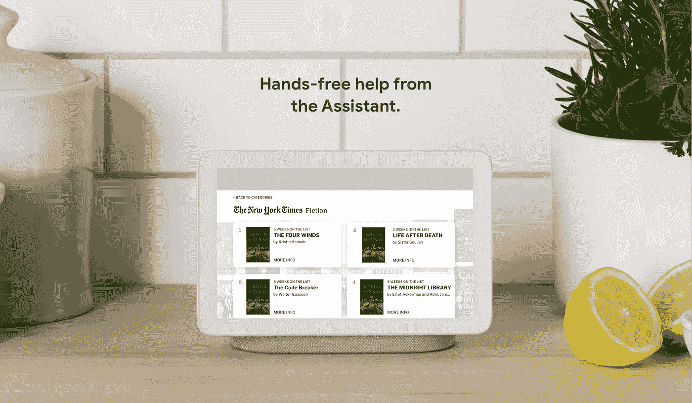
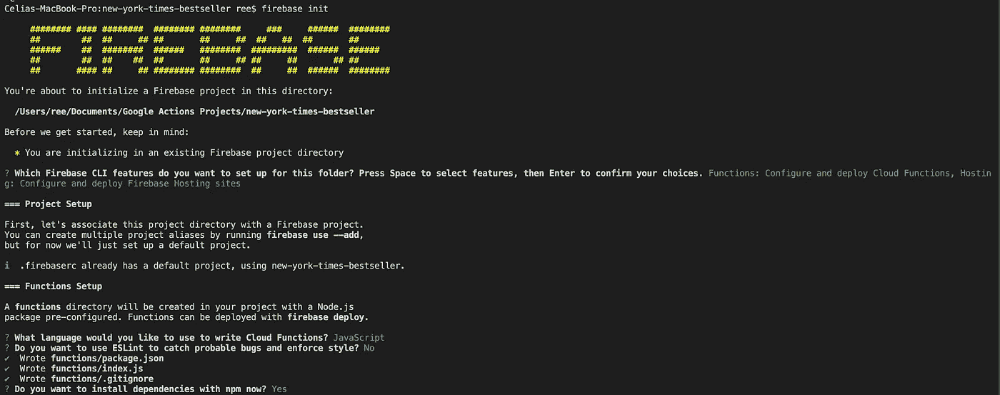
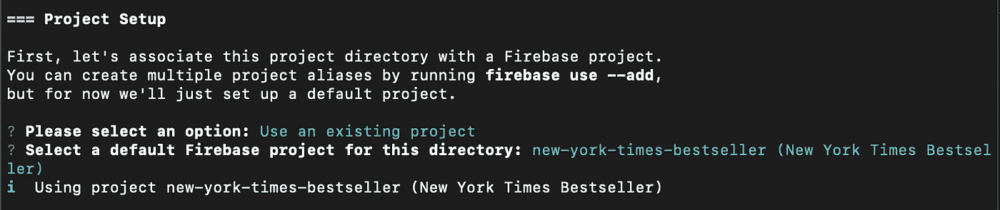
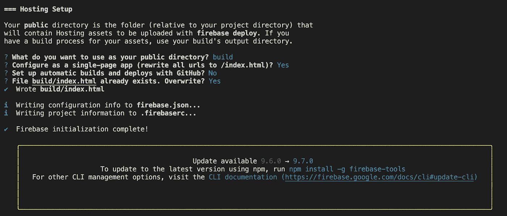
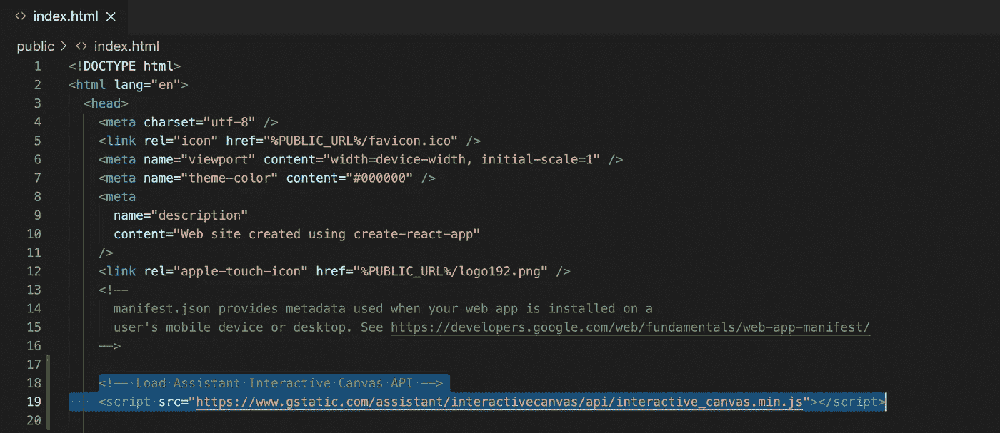
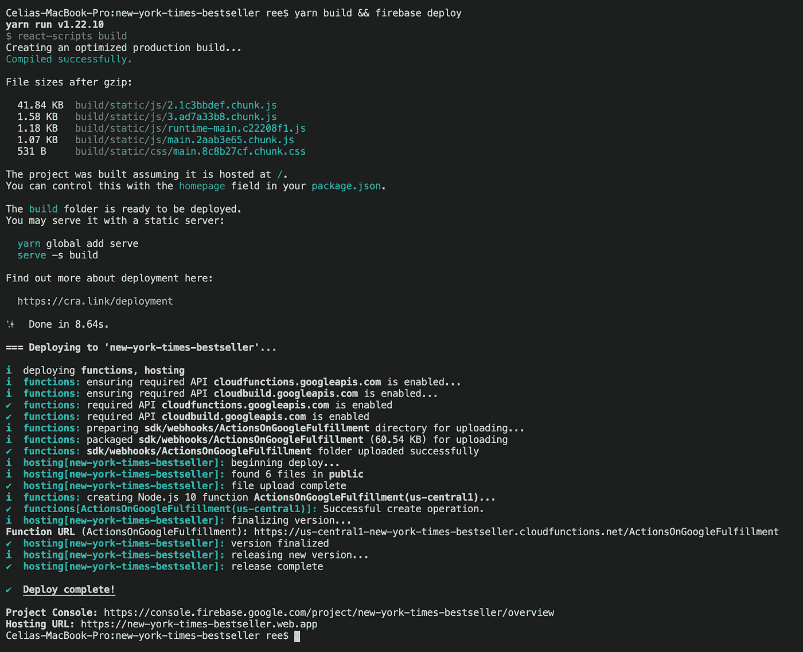
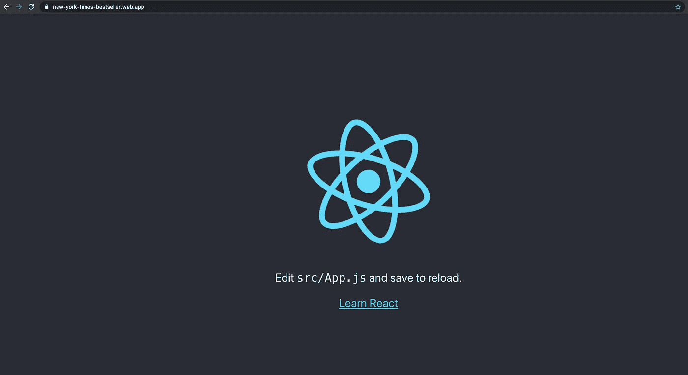
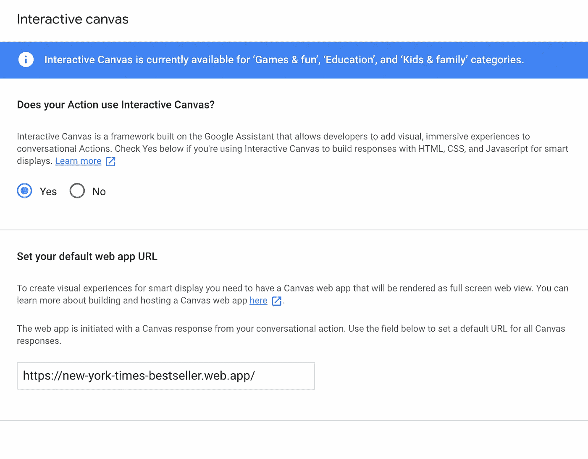
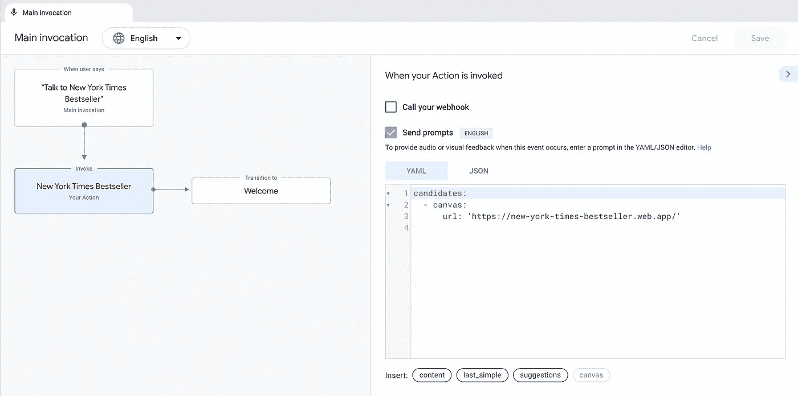
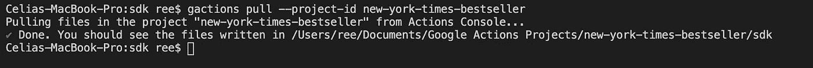

# 用交互式画布和 ReactJS 构建谷歌助手

> 原文：<https://levelup.gitconnected.com/building-a-google-assistant-with-interactive-canvas-and-reactjs-part-2-3aa88584d4cd>



在上一部分中，我介绍了一些事情，比如您需要的工具的基本设置，以及通过控制台在 Google project 上的操作。

如果你错过了，这里是:

[](https://celiaongsl.medium.com/building-a-google-assistant-with-interactive-canvas-and-reactjs-part-1-5e290eccfdbd) [## 用交互式画布和 ReactJS 构建谷歌助手——第 1 部分

### 如果你一直在探索谷歌助手及其产品，你应该见过谷歌巢枢纽，并可能阅读其…

celiaongsl.medium.com](https://celiaongsl.medium.com/building-a-google-assistant-with-interactive-canvas-and-reactjs-part-1-5e290eccfdbd) 

在这一部分中，我们将介绍如何设置我们的 ReactJS，Firebase 主机和在本地 Google 上拉动我们的操作，以便我们可以将所有这些连接在一起，并充分利用交互式画布！

# 设置您的创建-反应-应用程序和 Firebase

首先，进入您希望项目所在的文件夹。例如，我的文件夹是`Documents/Google Actions Projects`，所以我将`cd`到那个文件夹中。

当你在那个文件夹中时，像你每次做的那样创建你的 react 应用。为了让生活更容易，我将只使用`create-react-app`。

```
npx create-react-app new-york-times-bestseller
```

然后，将 cd 放入您的项目文件夹:

```
cd new-york-times-bestseller
```

初始化你的 firebase:

```
firebase init
```



为您的 Firebase 特性选择“**主机**和“**功能**”。



确保在“**为这个目录**选择一个默认的 Firebase 项目”下，您选择了您在上一部分中创建的对 Google project 的操作！



然后继续回答上面图片中的几个问题。

完成后，在任何你喜欢的 IDE 中打开你的 React 应用。

打开`public`文件夹，打开`index.html`。

将这一行添加到您的`<head>`标签中:

```
<!-- Load Interactive Canvas JavaScript -->
<script src="https://www.gstatic.com/assistant/conversational/df-asdk/interactivecanvas/api/interactive_canvas.min.js"></script>
```

这是加载交互式 Canvas JavaScript 库所必需的，它支持 web 应用程序和对话动作之间的通信。



现在，在我们接触 React 应用程序之前，让我们确保我们可以构建和部署网站！



在您的终端中，确保您位于项目文件夹的**根目录**，运行:

```
yarn build && firebase deploy
```

您需要运行`firebase deploy`来部署您的`functions`和`hosting`。

*注意:* `*yarn build*` *对你来说可能是不同的——确保你知道如何运行你的构建，如果你所做的与我的不同的话！*

如果一切顺利，你应该会在底部看到`Hosting URL`。打开它，您应该会看到类似这样的内容:



这表明你已经成功地部署了你的网站！

# 将您部署的网站连接到 Google 上的操作

现在您已经部署了网站和 AoG 设置，我们需要在您的 AoG 中打开交互式画布。



只需回到您的控制台，转到“**开发**”选项卡。打开左侧的**交互画布**。

点击“**是**”进入“**你的动作是否使用互动画布？**”

确保将您的`Hosting URL`添加到“**设置您的默认 web 应用程序 URL** ”部分。

之后，打开左侧“**调用**页签下的“**主调用**”。

确保在**发送提示**下，你有`canvas`和`url`，应该和你的`Hosting URL`匹配。



接下来，我们需要将我们的 webhooks 连接到我们的前端。

# 将 Webhooks 链接到 ReactJS 应用程序

## 将 Google Builder 上的操作与您的项目文件夹同步

还记得你在 AoG 的控制台上看到的所有 YAML 吗？是的，他们都是 YAML 的档案。

从技术上讲，你可以获得所有这些文件，查看代码，重写/添加更多逻辑，并将其推回到控制台。

要做到这一点，让我们首先同步你在你的控制台上所做的到你的本地项目文件夹。

在您的终端中，确保您位于根文件夹。

制作一个名为`sdk`的新目录。然后移入该文件夹。

```
mkdir sdk
cd sdk
```

这里，我们要将**初始化** `gactions`在文件夹的这一部分。我们通过以下方式做到这一点:

```
gactions pull --project-id ${your project id}
```

要获得您的项目 id，只需进入您的控制台，单击右上角堆叠的三个点，然后单击“**项目设置**，复制您的项目 ID。

例如，我的看起来像:



要知道你做到了，你的`sdk`文件夹里应该塞满了`actions`、`custom`、`settings`这样的文件夹，最重要的是`**webhooks**`。

我们将需要它来连接我们的交互式画布和 ReactJS 应用程序。

## 连接网钩

为了让我们的 AoG 控制台知道触发哪个场景，我们通过 webhooks 连接它。

为此，打开您的代码并打开`sdk`>`webhooks`>`ActionsOnGoogleFulfillment`>`index.js`

请随意将下面的代码复制并粘贴到您的`index.js`中。

在 index.js 中有 3 个要点需要注意:

1.  无论何时你想调用你的网页钩子，你都需要做`app.handle("${webhook name}"...`
2.  当我们使用交互式画布时，我们需要调用:

```
conv.add(    
   new Canvas({      
      data: {        
         scene: "CATEGORY_BESTSELLERS",      
      },    
   })  
);
```

3.每当我们想要将数据从我们的机器人传递到我们的前端时，我们通过`data`对象传递它。你甚至可以在`scene`旁边加上`params`以及任何你需要的东西。

一旦你设置好了你的 webhook 处理程序，请确保通过以下操作将更改推送到你的控制台:

```
cd sdk
gactions push
```

现在，让我们开始构建 ReactJS 方面的东西，因为在您的前端启动交互画布还有一个关键部分，我们仍然缺少。

# 开发 ReactJS 组件

在你的`src`文件夹中，你可以随意组织它。但是我们主要关注的是连接你的前端和你的机器人。

需要注意的关键是**你需要在前端**初始化 InteractiveCanvas。

还记得你在`public` > `index.html`里加的`<script>`吗？现在我们需要在组件中初始化它。

*(在* `*App.js*` *或* `*Canvas.js*` *中随意这样做就像我做的那样。为了简单起见我决定把它拔出来)*

为了设置和启动交互式画布，我们需要创建一个`Canvas.js`文件。这个文件实际上是将所有状态、页面和数据从您的操作链接到您的 ReactJS 页面的文件。

请随意将这段代码复制并粘贴到您的`Canvas.js`中。

这里你需要注意的 3 个关键点是:

1.  确保在代码的开头，您调用了:`this.interactiveCanvas = window.interactiveCanvas;`
2.  然后，当组件被安装时，我们做两件事:
    (1)通过从`this.interactiveCanvas.getHeaderHeightPx().then...` 获取来设置边距上限(2)调用`setCallbacks`
3.  `setCallbacks`基本上确保:
    (1)我们的场景和参数是从前面讨论的
    部分的`ActionsOnGoogleFulfillment` > `index.js`中传递的(2)我们通过做`this.interactiveCanvas.ready(callbacks);`来注册回调

基本上遵循交互画布 API [这里](https://developers.google.com/assistant/interactivecanvas/reference)。

*我们将跳过其余 ReactJS 组件和页面的构建。你可以得到我的存储库，然后自己使用。*

当您构建完剩余的组件并根据`if`语句更改页面后，请记住通过运行以下命令来部署您的构建文件:

```
yarn build && firebase deploy --only hosting
```

这就是第 2 部分！你应该能够成功地将一切联系在一起。你的机器人应该能够根据触发的 webhook 改变页面和视图。

在第三部分也是最后一部分，我们将探索应用的复杂性，例如:

1.  添加模拟数据
2.  传递参数并利用页面中的会话来跟踪用户正在做什么
3.  通过 Nest Hub 触发 onClicks

下一期**最后部分**见！

[](https://celiaongsl.medium.com/building-a-google-assistant-with-interactive-canvas-and-reactjs-part-3-5eaa14f48b6c) [## 用交互式画布和 ReactJS 构建谷歌助手——第 3 部分

### 欢迎来到本教程的最后阶段。

celiaongsl.medium.com](https://celiaongsl.medium.com/building-a-google-assistant-with-interactive-canvas-and-reactjs-part-3-5eaa14f48b6c) 

**额外备注:**

> 注意:确保在开发完 React 应用程序后，运行`yarn build && firebase deploy --only hosting`。
> 
> 如果你触摸了`sdk`文件夹中的**任何东西，你需要`cd`进入`sdk`文件夹并运行`gactions push`来保持你的 AoG 控制台根据你的本地变化进行更新。(您不需要在这里运行 yarn build 和 firebase deploy！)**

**这里是第二部分的存储库:**

[](https://github.com/celiaongsl/new-york-times-bestseller/tree/version2) [## celiaongsl/纽约时报-畅销书

### 这个项目是用 Create React App 引导的。在项目目录中，您可以运行:在…中运行应用程序

github.com](https://github.com/celiaongsl/new-york-times-bestseller/tree/version2)