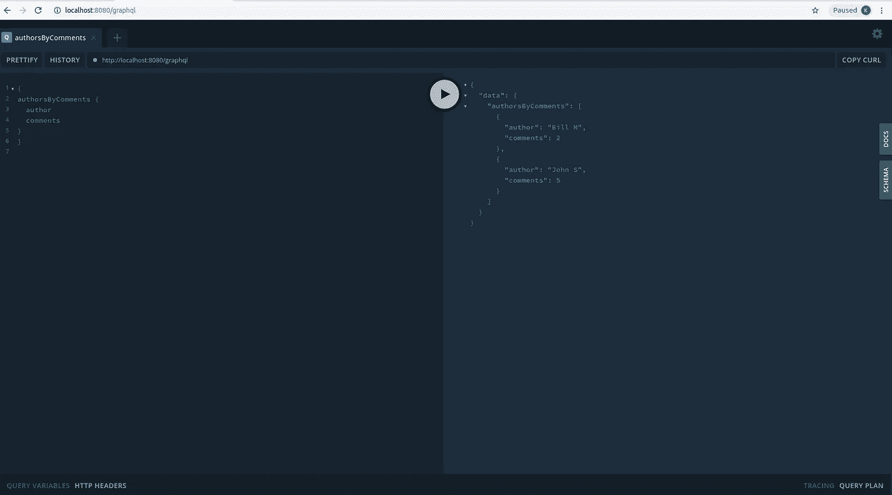

# 用 Koa 和 MongoDB 本地驱动程序构建 GraphQL API

> 原文：<https://levelup.gitconnected.com/building-a-graphql-api-with-koa-and-the-mongodb-native-driver-1a76c3930e9b>

虽然 MERN 堆栈是构建丰富、响应迅速且可扩展的 web 应用最常用的模式之一，但堆栈中组成层的灵活性和相对非个性化的特性导致了结构选择的不断变化。

本着用最佳组件选择来减少一些负担的精神，让我们看看如何构建由 Node.js 框架 Koa 和 MongoDB 本地数据库访问驱动程序支持的基于 GraphQL 的 API。不用多说，GraphQL 已经宣称自己是 API 开发的标准，因为它能够增加参数的选择性、服务器端数据转换、API 调用到单个端点的优化捆绑，以及传输的整体生产化。

Koa 是一个极简的、占用空间小的、精简的样板框架，它可能是从 Express 中派生出来的，但是通过采用基于异步/承诺的中间件链范式，它擅长于当代 Node.js API 开发。最后，Mongo 原生驱动程序是对这个开发人员方便的堆栈的一个不同寻常的偏离，它有意省略了 MongoDB 访问的任何中间层 ODM。

我们将从设置和连接 MongoDB 数据库、Koa 框架、用于 Koa 的 GraphQL Apollo 服务器和 Mongo 本地驱动程序开始。我们将在 Mongo 原生驱动程序上花费最多的时间，以涵盖由原生调用驱动的 MongoDB 的基本更新/查询操作，并了解 MongoDB 的强大功能之一，即用于高级查询的聚合管道。

所以事不宜迟，让我们开始安装组件。

## 软先决条件:

对节点和 Javascript 的基本编程概念有基本的理解(最好是 Promises、async/await)

## 软件先决条件:

*   Atom 或 VSCode(或任何替代)Javascript 编辑器。
*   Node.js 和 npm 的最新版本(以下示例已经在 node v 8.16 上测试过)

## **MongoDB**

让我们从 MongoDB 开始，它是文档数据库中最受欢迎的。

您可以选择按照平台特定说明安装 MongoDB Community edition，网址为【https://www.mongodb.com/cloud/atlas/register.】[https://docs . MongoDB . com/manual/administration/install-Community/](https://docs.mongodb.com/manual/administration/install-community/)，或者您也可以通过注册免费试用版@ [来使用 MongoDB Atlas cloud 版本](https://www.mongodb.com/cloud/atlas/register.)

另外请注意，本文中的所有软件都已经安装在 Ubuntu 16.04 (Xenial)上。

在本地安装 MongoDB 版本的情况下，一旦安装完毕，从命令行启动数据库，然后在 Unix 提示符下使用以下命令调用 mongo db shell

```
 $ sudo service mongod start 
 $ mongo 
```

在 mongo shell 中，发出以下命令

```
use blogdbdb.blogs.insertOne({ post_id: 1, post_title: “First Post”, post_text: “… Lorem ipsum..”, post_date: ISODate(‘2019–10–09’), author: “John S”, comments : [{ comment_id: 1, parent: 0, comment_text: “…First comment on Lorem ipsum..”, author:”Mark S.”}, {comment_id: 2, parent: 0, comment_text: “…Second comment on Lorem ipsum..”, author:”Jill”}, {comment_id: 3, parent: 2, comment_text: “…something to add to the comment by Jill..”,author: “Bruce P.”}, {comment_id: 4, parent: 3, comment_text: “…something to add to the comment by Bruce on the comment by Jill..”, author:”Brian”}, {comment_id: 5, parent: 1, comment_text: “…comment on first comment on Lorem Ipsum..”, author:”Ravi K”}]})
```

这

*   创建一个名为 blogdb 的数据库并切换到它
*   插入一个名为 blogs 的集合，其中包含帖子和每个帖子的评论(一个数组)。

Mongo 中的集合对应于 RDBMS 中的表，第一次使用数据库名称和集合会创建它们，如上面的语句所示。db。{收藏}。insert 使用基于 Javascript-JSON 的数据表示，而不是 SQL，与上面一样直观简单。字段名在这里是不言自明的。

让我们在这里再添加一个文档。

```
db.blogs.insertOne({ post_id: 2, post_title: “Just another Post”, post_text: “… Lorem ipsum once again..”, post_date: ISODate(‘2019–10–09’), author: “Bill M”, comments : [{ comment_id: 1, parent: 0, comment_text: “…First comment on Lorem ipsum once again..”, author:”Brian S.”}, {comment_id: 2, parent: 0, comment_text: “…Second comment on Lorem ipsum once again..”, author:”Jill”}]})```
```

## **Koa**

让我们转到 KOA——轻量级最小 node.js 框架，特别适合 API。

安装说明:这里是我们创建工作目录并放入内容的地方。还可以使用以下命令在该文件夹中创建一个 package.json 文件:

```
$ mkdir apiserver
$ cd apiserver
$ npm init -y
$ npm install koa
```

使用 VS 代码或您选择的文本编辑器创建一个 app.js 文件。

```
const Koa = require('koa');
const app = new Koa();
app.use(async ctx => {
  ctx.body = 'Just a placebo';
});
app.listen(3000, () => console.log('listening....') );
```

简单的服务器设置和一些样板文件——任何有“快速”经验的人都可以看到 4 个命令的基本效用。该框架的核心是 koa 应用程序(app ),它可以附加一堆级联中间件。

app.use (async function…)在这里仅用作占位符，以展示 koa 与 promise wrapped async functions 的中间件链接特性。

对于那些后来加入 Javascript promise(d)聚会的人来说，async 表示中间件函数异步运行，最终将返回值。

## **GraphQL**

现在让我们把 GraphQL 连接起来。

安装:因为我们将 GraphQL 用于 koa，所以我们将使用 Apollo 集成包用于 koa。

```
 $ npm install apollo-server-koa
```

随着 Apollo 的安装，我们开始定义模式，它基本上是 GraphQL 查询的一种元数据。添加一个新文件 schema.js，该文件将包含:

```
const { ApolloServer, gql } = require('apollo-server-koa');
const typeDefs = gql`
type Query  {
 posts: [ PostSummary],
 postById (id: ID!): Post,
 authorsByComments: [ AuthCommSummary ]
}type Mutation {
 addPost (postTitle: String!, postText: String!,  author: String!) :  PostSummary
}type Post {
 postTitle: String
 postText: String
 author: String
}type PostSummary {
 postTitle: String
}type AuthCommSummary {
 author: String
 comments: Int
}
`;module.exports =  typeDefs ;
```

让我们稍微检查一下-

typeDefs 列出了 GraphQL 的所有数据定义，即我们将在 API 中公开的数据类型和操作。

类型 Post、PostSummary 和 AuthCommSummary 在这里基本上是对象类型，它们的每个组成元素都是标量(基本)类型。

查询“posts”是我们将定义的第一个 API，它返回先前定义的 PostSummary 数据类型的数组。类似地，postById 接受一个非空值(由！)id 输入参数并返回 Post 数据类型。对于 authorsByComments 查询也是如此。

变异意味着在服务器上进行写操作——类似于 REST 的 PUT 或 Post 动词——我们的模式中的变异指定向数据库中插入一个新的 Post 数据类型，由构成新 POST 的参数来指示(Mongo 的字段灵活性允许我们更改或减少插入的新文档结构，因此我们在这里保留了注释数组),整个变异操作返回一个 PostSummary 数据类型作为成功的确认。

上面所有的定义都被传递到以 Apollo 'gql '函数为前缀的带标签的模板文字反斜杠(` ),该函数会将它们转换成 GraphQL 的抽象语法树进行解析。

接下来，我们定义解析器，即实际返回请求的数据或处理请求的更新的函数。我们的 resolvers.js 运行如下:

```
const { ApolloServer } = require('apollo-server-koa');
const resolvers = {
  Query: {
    posts:  getPostList,
    postById:  getPostById,
    authorsByComments:  getAuthorsbyComments,
  }, Mutation: {
    addPost: addPostDetails,
  }
}module.exports = resolvers;
```

这基本上意味着，对于查询帖子，解析器将是函数 getPostList(尚未实现)。postById、authorsByComments 和 addPost GraphQL API 端点也是如此。

值得注意的是，GraphQL 解析器可以返回 Javascript 承诺，这使得它们非常适合 facading 数据库调用，因为我们将进行的大多数 Mongo DB 调用都是回调或异步结构的，并且必须包装在隐式或显式承诺中。

现在让我们把它插入我们的 app.js，得到最终的 app.js，看起来像-

```
const Koa = require('koa');
const { ApolloServer } = require('apollo-server-koa');
const { initDB, closeDB } = require('./mongoadapter');
const typeDefs = require('./schema');
const resolvers = require('./resolvers');
const port = process.env.PORT || 8080;
const app = new Koa();
const server = new ApolloServer (
  {
    typeDefs,
    resolvers,
  });app.use(server.getMiddleware());
const koaServer = app.listen(port, () => {
  console.log(`listening....at path ${server.graphqlPath}`);
  initDB();
});process.on('SIGTERM', () => {
  closeDB();
  koaServer.close();
})
```

这将启动作为 GraphQL API 服务器的 ApolloServer，并带有模式和解析器的参数。将 ApolloServer 实例传递给 koa 应用程序，帮助后者将其作为另一个中间件。

## **最后是 MongoDB 原生驱动:**

虽然对象数据管理(ODM)存储从 RDBMS 时代就开始流行，特别是对于新开发人员来说，以避免复杂的 SQL 语义，但 Mongo 的 Javascript 内在语法使 DB bridge 的应用层更容易克服，此外，在具有本机驱动程序的 node.js 环境中使用 Mongo shell 类语法时，还能影响更快的学习曲线和更大的灵活性。因此，值得考虑通过直接使用原生 Mongo 驱动程序从 API 开发栈中分离出一个额外的处理层，尤其是在并发需求不断增长的应用程序场景中。

然而，必须指出的是，由于 Mongo 原生驱动程序不像 Mongoose 那样具有任何内置的模式验证器，因此必须使用某种级别的数据净化来缓解 NoSQL 注入漏洞，例如 mongo-sanitize 等软件包所提供的数据净化。

所以让我们通过安装将 mongo 原生驱动程序添加到我们的 package.json 中。

```
$ npm install mongodb — save
```

首先，让我们回到 resolvers.js，在 require 列表中添加下面一行。

```
const { getPostList, getPostById, addPostDetails, getAuthorsbyComments } = require(‘./mongoadapter’);
```

现在是 mongoadapter.js

```
const MongoClient = require('mongodb').MongoClient
const { UserInputError } = require('apollo-server-koa');
const url = 'mongodb://localhost:27017'
const client  = new MongoClient(url, { useNewUrlParser: true,   
     useUnifiedTopology: true  })
var db  =  null;
```

url 可能会根据您是使用 Mongo Atlas 连接还是通过网络安装 Mongo 而有所变化。让我们在服务器启动时连接到数据库。

按照 MongoDB 驱动程序文档的建议，MongoClient.connect 被调用一次，回调返回的数据库变量将被所有后续数据库操作重用。数据库初始化和关闭代码的其余部分是简单的搭建，用于连接到 Mongo，该连接将在请求间共享。

```
async function initDB() {
  if (!db)
  {
    db = await new Promise( (resolve, reject) =>
        client.connect((err) =>
        {
           if (err)
             return reject(err)
           let database = client.db('blogdb')
           resolve (database);
        })
  ).catch(e => {
        console.log('Could not get connection to MongoDB..\n' + e)
        process.exit(1)
   })
  }
}
function closeDB() {
  if (db)
    client.close()
}
```

现在我们来看看查询 getPostById 的解析器

```
async function getPostById(root, {id}, {dataSources}) {
  const blogsCollection = db.collection('blogs')
  let pid = parseInt(id);
  return blogsCollection.findOne({ post_id: pid }, { projection: {_id: 0, post_title:1, post_text:1, author: 1 }}).then( res => {
    if (!res)
      throw new UserInputError('Cound not find Post for the ID   specified.', {ID: id});
    return  { postTitle: res.post_title, postText: res.post_text,  author: res.author } ;
  })
}
```

我们使用之前初始化的“db”连接来获取对我们之前创建的 MongoDB 集合“blogs”的引用。对 db.collection 的调用返回的驱动程序集合类提供了查询和更新特定数据库集合(在本例中是博客)的方法。{MongoCollection}上的 select/WHERE 谓词。findOne 在第一个参数中指定，即{post_id: pid}，第二个参数(“列”投影，如果可以的话)指示要返回或隐藏的字段。

Mongo 集合类提供的“findOne”方法用于查询文档，顾名思义，它只需要一个结果。请注意，findOne 的返回值是一个隐含的承诺，所以我们只需要“然后”返回成功解析该承诺的响应。

(关于 async/await 和 Promises 的更详细的演练，请参考 Javascript 教程。现在，让我们试着把承诺理解为一种“未来”,它将返回预期的结果，或者作为另一个“那时”能够处理的承诺，或者作为一个直接解析的值。这非常适合 GraphQL 的情况，在这种情况下，GraphQL 服务器可以接受来自解析器的各种结果类型，尤其是异步承诺，它将等待。因此这里的语法更简洁，解析器简单地返回对驱动程序的承诺返回 API 调用。

现在是 getPostList

```
async function getPostList() {
  const blogsCollection = db.collection('blogs')
  let res = null;
  res = await new Promise( (resolve, reject) => {
    blogsCollection.find( {}, { projection: {_id:0, post_title:1    
    }}).toArray( (err, items) => { 
            if (err)
              return reject(err)
            resolve(items)
            }
          )
        }
      )
   return res.map( x =>  ( { "postTitle": x.post_title } ))
}
```

基本上类似地实现，除了我们使用“find”的一个版本，与之前遇到的 findOne 不同，它同步返回一个 MongoDB 游标，而 MongoDB 游标又有基于回调的方法(next、each、toArray 等)用于遍历结果集。因此，我们需要显式地将整个调用包装在一个承诺中(手动“承诺”它)并等待它，就像 res = await new Promise( (resolve，reject)…。

我们在这里等待异步承诺，因为我们需要在将结果值传递回 GraphQL 服务器之前对其进行处理。

请注意这里两个例子中方法的不同。

现在是突变

```
async function addPostDetails(root, {postTitle, postText,  author}) {
  let validationErrors = {}
  if ( postTitle.length >= 100 )
    validationErrors.postTitle = 'postTitle should be less than 100      characters'; if ( author.length >= 50 )
    validationErrors.author = 'author should be less than 50 characters'; if (Object.keys(validationErrors).length > 0)
    throw new UserInputError('Post update failed due to incorrect data. Please correct the below fields before proceeding.', validationErrors); const blogsCollection = db.collection('blogs')
  let res = null;
  res = await new Promise( (resolve, reject) => {
          blogsCollection.insertOne( { post_title:postTitle, 
            post_text: postText, author: author }, {},  (err,  
            result) => {
              if (err)
                return reject(err)
              resolve(result.ops[0].post_title)
            }
         )
       }
   )
   return { postTitle: res };
}
```

让我们再花一点时间来检验这一点。

Apollo Server for GraphQL 提供了一个 UserInputError 异常类，我们可以使用它来合并任何验证失败，并将其发送回客户端。

像所有的 Apollo 异常一样，它也为用户定义的错误消息附加一个扩展和用户特定的代码。在这种情况下，我们附加 validationErrors 对象。

上面的 insert 语句向成功回调(第三个参数)返回一个结果，该结果分别包含“result.ops”数组和“result.insertedCount”中新插入/更新的文档和受影响的行/文档数。我们可以利用这些来制定适当的对策。

最后，对于 Mongo 聚合，使用本地驱动程序就可以实现。

```
async function getAuthorsbyComments() {
  const blogsCollection = db.collection('blogs')
  return new Promise( (resolve, reject) => {
          blogsCollection.aggregate([ { $unwind: "$comments" }, { $group: { _id: "$author", count: {$sum : 1} } }, ], {}, (err, aggreCursor) => {
           if (err)
             return reject(err)
           aggreCursor.toArray( (errInner, results) => {
              if (errInner)
                return reject(errInner)
              documents = []
              for (i in results)
              {
                documents.push({ author: results[i]._id, comments:  results[i].count })
              }
              resolve(documents)
             })
            }
          )
        }
      )
   }
```

除了看起来相当有趣的 Collection.aggregate 函数之外，其他一切都与我们处理以前的解析器的方式一致。

这基本上是 SQL Group by 子句的 MongoDB 等价物，在这种情况下，它为我们提供了作者列表，以及他们在他们发布的所有文章中收到的所有评论的计数。

Mongo 中的聚合管道是一个操作数组(每个操作在{}之间指定，并由分隔)，它就像一个管道一样工作，将每个操作的结果传送到下一个阶段，以实现数据转换…因此要分解聚合[ { $unwind: "$comments" }，{ $group: { _id: "$author "，count: {$sum : 1} }，] -

1.聚合的第一阶段使用“展开”操作符{ $unwind: "$comments" }意味着将展开聚合操作符应用于字段注释，以将每篇文章的每个注释转置/透视到单独的行中(或者按照 Mongo 的说法是文档)。这使得通过评论进行聚集变得容易。请注意，这需要在这里完成，因为如果我们重新访问 blogs 集合定义，comments 嵌入字段当前是每个父文档中的一个数组类型。

2.第二阶段{ $group: { _id: "$author "，count: {$sum : 1} } }执行实际的分组方式，用 an _id = "$author "指定作者列(作为" Group By "列)。group 函数是包含相应作者的注释的行的计数(对每行的 1 个单元应用$sum 操作符)。

我们找到了..一个 post pivot group by 函数可以像在 Mongo shell 中一样轻松地执行，这反映了 Mongo 原生驱动程序的强大功能。

最后是 mongoadapter.js 末尾的导出函数

```
module.exports = { initDB, getPostList, getPostById, addPostDetails, getAuthorsbyComments, closeDB }
```

## **测试您的 API:**

在 Unix 命令行执行应用程序

```
$ node app.js
```

由于我们使用的是 Apollo 服务器，GraphQL Playground，当我们在浏览器中点击测试 URL 时，一个交互式的双面板浏览器内 IDE 将被激活，在我们的例子中，这个测试 URL 将是[http://localhost:8080/graph QL](http://localhost:8080/graphql)

在左侧输入 GraphQL 查询，点击中间的按钮获得结果

我们对上述模式的查询将是-

```
{ posts {
  postTitle
}}{ postById (id: 1)
{postTitle
 postText
 author}}{ authorsByComments {
 author
 comments
}}mutation {
addPost (postTitle: “Newest post”, postText: “..some text”, author:”B Rogers”)
{ postTitle
}}
```

**GraphQL 游乐场**



## **包装完毕**

仅此而已。

从这里开始，我们可以随着代码大小的增加和模块化需求来组织文件夹结构。下一个合乎逻辑的步骤是构建 React 客户端 UI，该 UI 将使用 GraphQL ApolloClient 使用 API，并显示可以由 Mongo 的复杂数据场景表示的结果。

以上所有代码都可以在 [github](https://github.com/kundanj/koa-graphql-nativemongo-api) 上找到。