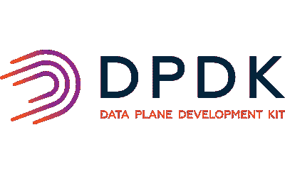
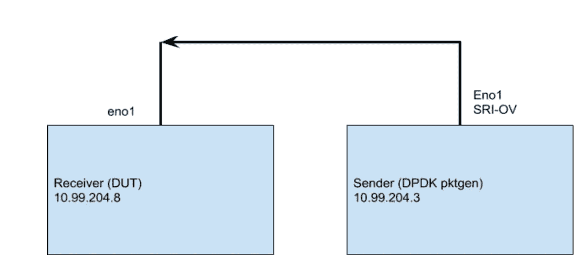
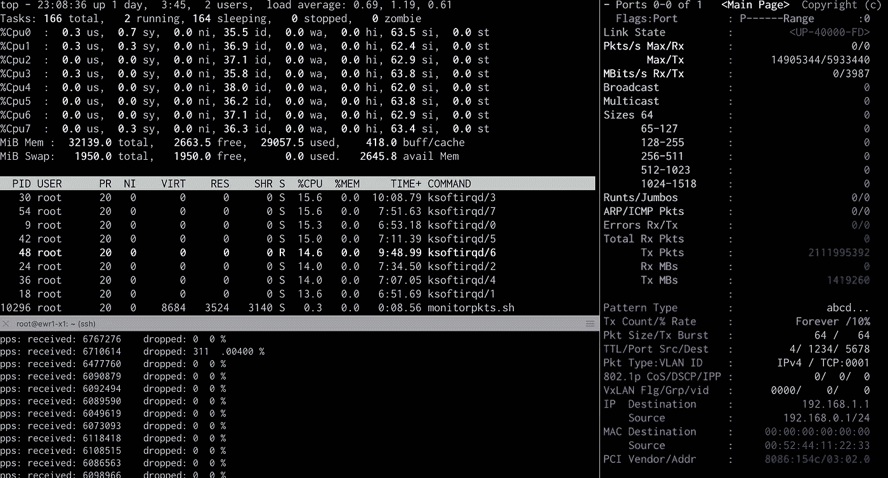
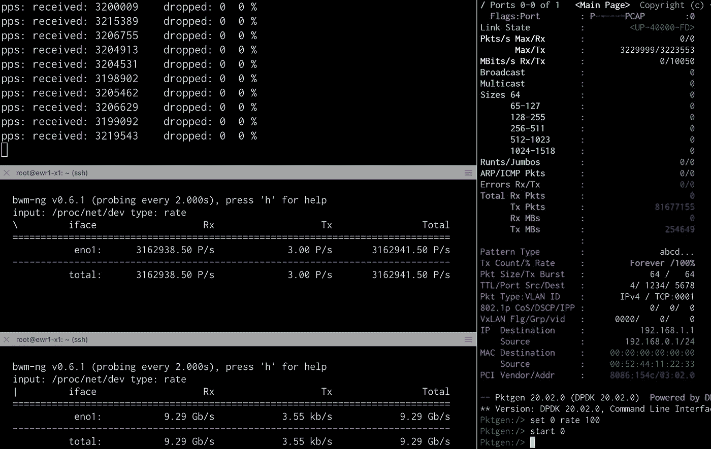

# 用 DPDK 构建高性能的基于 Linux 的流量生成器

> 原文：<https://levelup.gitconnected.com/building-a-high-performance-linux-based-traffic-generator-with-dpdk-93bb9904416c>

> ***本文原载于我的个人博客***[***toonk . io***](https://toonk.io/)


照片由 [Kolleen Gladden](https://unsplash.com/@rockthechaos?utm_source=medium&utm_medium=referral) 在 [Unsplash](https://unsplash.com?utm_source=medium&utm_medium=referral) 上拍摄

在我 20 年的网络生涯中，我经常需要做一些网络性能测试。使用案例多种多样，从排除客户问题到测试新的网络硬件，现在越来越多的虚拟网络功能和基于软件的“线路中的颠簸”。

我一直喜欢玩基于硬件的流量生成器。我第一次体验 IXIA 硬件测试可以追溯到 2003 年，在阿姆斯特丹互联网交易所，我们测试了全新的 Foundry 10G 卡。这些基于硬件的测试器非常强大，是验证新设备(如路由器线路卡、防火墙和 IPsec 设备)的绝佳工具。然而，我们并不总是能够获得这些基于硬件的流量生成器，因为它们往往非常昂贵或者只能在实验室中获得。在这篇博客中，我们将看看一个任何人都可以使用的基于软件的流量生成器——基于 DPDK。当你在读这个的时候，请记住脚本和其他信息可以在[我的 GitHub 页面上找到。](https://github.com/atoonk/dpdk_pktgen/)



DPDK，即数据平面开发工具包，是一个开源软件项目，由 Intel 发起，现在由 Linux 基金会管理。它提供了一组运行在用户空间中的数据平面库和网络接口控制器轮询模式驱动程序。好，让我们考虑一下，这是什么意思？用户空间网络是你可能越来越多地听到和读到的东西。用户空间网络(又名内核旁路)背后的主要驱动因素与 Linux 构建其网络堆栈的方式有关；它是作为通用、多用途、多用户操作系统的一部分而构建的。Linux 中的联网功能强大且功能丰富，但这只是 Linux 众多功能中的一个，所以；因此，网络堆栈需要公平竞争，并与其余的内核和用户程序共享资源。最终的结果是，通过 Linux 网络栈每秒获得几百万(1 到 3 百万)个包，差不多就是在一个标准系统上所能做到的。这不足以填满 64 字节数据包的 10G 链路，这相当于每秒 14M 数据包(pps)。这就是 Linux 中传统的中断驱动(IRQs)联网方式开始限制需求的地方，这就是 DPDK 的用武之地。对于 DPDK 和 userland 网络程序，我们从内核中取出 NIC，并将其交给 userland DPDK 程序。DPDK 驱动程序是一个轮询模式驱动程序(PMD)，这意味着通常每个网卡的一个内核总是使用 100%的 CPU，它处于一个繁忙的循环中，总是轮询数据包。这意味着您将看到该核心以 100%的速度运行，而不管该网卡上有多少数据包正在到达或发送。这显然有点浪费，但如今，随着大量内核和对高吞吐量系统的需求，这通常是一个很好的权衡，最重要的是，它允许我们在 Linux 上达到 1400 万 pps 的数字。

好吧，高性能，我们都应该转移到 DPDK，对不对？！嗯，只有一个问题……因为我们现在绕过了内核，我们无法从 Netfilter 等丰富的 Linux 特性中获益，甚至无法从 TCP/IP 栈等一些我们现在认为是基本的特性中获益。这意味着你不能仅仅用 DPDK 运行你的 Nginx、Mysql、Bind 等基于套接字的应用程序，因为所有这些都依赖于 Linux 套接字 API 和内核来工作。因此，尽管 DPDK 通过绕过内核为我们提供了很高的速度和性能，但您也损失了很多功能。

现在有相当多的基于 DKDK 的应用程序，从基于软件的路由器和交换机等网络转发器，到 F-stack 等 TCP/IP 堆栈。

在这篇博客中，我们将关注 DPDK-pktgen，一个由 DPDK 团队维护的基于 DPDK 的流量生成器。我将逐步完成安装 DPDK、设置 SR-IOV 和运行 pktgen 以下所有内容都是在 [x1.small.x86](https://www.packet.com/cloud/servers/x1-small/) 类型的[Packet.com](https://www.packet.com/)服务器上测试的，该服务器具有一个英特尔 X710 10G 网卡和一个 4 核 E3–1578 l 至强 CPU。我用的是 LTS Ubuntu 18 . 04 . 4。

# 安装 DPDK 和 Pktgen

首先，我们需要安装 DPKD 库、工具和驱动程序。安装 DPDK 和 pktgen 的方法有很多种；我选择编译源代码。有几件事你需要做；为了使它更容易，你可以下载我用来帮助你安装的[相同的 bash 脚本](https://github.com/atoonk/dpdk_pktgen/blob/master/install-dpdk-pktgen.sh)。

# 解决单网卡问题

DPDK 面临的挑战之一是它将完全控制 nic。要使用 DPDK，您需要从内核中释放 nic 并将其交给 DPDK。假设我们只有一个网卡，一旦我们把它给了 DKDK，我将失去所有的访问权限(记住，没有简单的方法继续使用 SSH，等等。因为它依赖于 Linux 内核)。通常人们通过一个管理 NIC(用于 Linux)和一个或多个用于 DPDK 的 NIC 来解决这个问题。但是我只有一个网卡，所以我们需要创新:我们将使用 SR-IOV 来实现同样的目标。SR-IOV 允许我们将一个网卡显示为多个 PCI 插槽，因此在某种程度上，我们正在虚拟化网卡。

要使用 SR-IOV，我们需要在内核中启用 iommu(在 DPDK 安装脚本中完成)。之后，我们可以像这样设置虚函数的数量(新 PCI NIC 的数量)

```
echo 1 > /sys/class/net/eno1/device/sriov_numvfs
ip link set eno1 vf 0 spoofchk off
ip link set eno1 vf 0 trust on
```

dmesg -t 将显示如下内容:

```
[Tue Mar 17 19:44:37 2020] i40e 0000:02:00.0: Allocating 1 VFs.
[Tue Mar 17 19:44:37 2020] iommu: Adding device 0000:03:02.0 to group 1
[Tue Mar 17 19:44:38 2020] iavf 0000:03:02.0: Multiqueue Enabled: Queue pair count = 4
[Tue Mar 17 19:44:38 2020] iavf 0000:03:02.0: MAC address: 1a:b5:ea:3e:28:92
[Tue Mar 17 19:44:38 2020] iavf 0000:03:02.0: GRO is enabled
[Tue Mar 17 19:44:39 2020] iavf 0000:03:02.0 em1_0: renamed from eth0
```

我们现在可以看到新的 PCI 设备和 nic 名称:

```
root@ewr1-x1:~# lshw -businfo -class network | grep 000:03:02.0
pci@0000:03:02.0 em1_0 network Illegal Vendor ID
```

接下来，我们将解除网卡与内核的绑定，并将其交给 DPDK 管理:

```
/opt/dpdk-20.02/usertools/dpdk-devbind.py -b igb_uio 0000:03:02.0
```

我们可以这样验证(注意 em2 未连接且未使用):

```
/opt/dpdk-20.02/usertools/dpdk-devbind.py -sNetwork devices using DPDK-compatible driver
============================================
0000:03:02.0 ‘Ethernet Virtual Function 700 Series 154c’ drv=igb_uio unused=iavf,vfio-pci,uio_pci_genericNetwork devices using kernel driver
===================================
0000:02:00.0 ‘Ethernet Controller X710 for 10GbE backplane 1581’ if=eno1 drv=i40e unused=igb_uio,vfio-pci,uio_pci_generic
0000:02:00.1 ‘Ethernet Controller X710 for 10GbE backplane 1581’ if=em2 drv=i40e unused=igb_uio,vfio-pci,uio_pci_generic
```

# 测试设置

既然我们已经准备好开始测试，我应该解释一下我们简单的测试设置。我使用两台 x1 小型服务器；一个是发送方(运行 dpdk-pktgen)，另一个是普通的 Ubuntu 机器。我们要测试的是接收器内核(有时称为被测设备(DUT))从网卡获取数据包的能力。仅此而已；我们没有处理任何东西，数据包被发送到的 IP 地址甚至没有在 DUT 上配置，所以内核在从网卡获取数据包后会尽快丢弃数据包。



测试设置

# 单流交通

好了，该开始测试了！让我们运行 pktgen 并生成一些包！我的第一个实验是计算在目标机器开始丢弃数据包之前，我可以在单个流中向它发送多少。

请注意，您可以在这个博客的 [GitHub repo 中找到确切的配置。文件](https://github.com/atoonk/dpdk_pktgen/) [pktgen.pkt](https://github.com/atoonk/dpdk_pktgen/blob/master/pktgen.pkt) 包含配置测试设置的命令。我配置了 mac 和 IP 地址、端口和协议以及发送速率。注意，我测试的是从 10.99.204.3 到 10.99.204.8。这些都在/31 网络上，所以我将目的 mac 地址设置为默认网关的地址。使用 [pktgen.pkt](https://github.com/atoonk/dpdk_pktgen/blob/master/pktgen.pkt) 中定义的配置，我一遍又一遍地发送相同的 64 字节数据包(5 元组，UDP 10 . 99 . 204 . 3:1234>10 . 99 . 204 . 8:81)。

我使用下面的代码来启动 pktgen。

```
/opt/pktgen-20.02.0/app/x86_64-native-linuxapp-gcc/pktgen — -T -P -m “2.[0]” -f pktgen.pkt
```

在发送器上调整发送速率属性并用 [*监控后。/monitorpkts.sh*](https://github.com/atoonk/dpdk_pktgen/blob/master/monitorpkts.sh) 在接收器上，我们发现单个流(单队列、单核)将在这个接收器机器上干净地运行，直到大约 120k pps。如果我们把发送速率提高到更高，我开始观察到接收端有数据包丢失。这比预期的要低一点，尽管它是一个流，但我可以看到服务于该队列的 CPU 有足够的空闲时间。一定还有别的事情发生…

答案与接收方网卡上的接收缓冲环有关。对于更高的数据包速率来说，它太小了。在我把它从 512 增加到 4096 之后。我现在最高能收到 1.4Mpps 才看到滴，单个流量还不错！

```
ethtool -G eno1 rx 4096
```

# 多流交通

Pktgen 还提供了对范围进行配置的能力。范围的示例包括源和目的 IP 地址以及源和目的端口。你可以在 [pktgen-range.pkt 文件](https://github.com/atoonk/dpdk_pktgen/blob/master/pktgen-range.pkt)中找到一个例子。对于大多数环境，这是一个更典型的场景，因为您的服务器可能从许多不同的 IP 地址为许多不同的流提供服务。事实上，Linux 系统依赖于许多流的存在来处理这些更大的流量。Linux 内核将这些不同的流散列并负载平衡到 nic 上可用的接收队列。然后，每个队列由一个独立的中断线程服务，允许内核并行处理工作并利用系统上的多个内核。

下面你会发现一个我用许多流运行测试时的截图。左边是接收端，右边是发送端。这里要注意的主要事情是，在接收节点上，所有可用的 CPU 都被使用，请注意 *ksoftirqd/X* 进程。由于我们使用了广泛的源端口和目的端口，我们在所有内核上实现了适当的负载平衡。有了这个，我现在可以实现 0%的数据包丢失率，最高可达 6Mpps。为了达到 14Mpps、10g 线速@ 64 字节包，我需要更多的 CPU。



# IMIX 试验

最后，我们将使用 dpdk-pktgen pcap 特性运行一个基本的 IMIX 测试。互联网混合或 IMIX 是指典型的互联网流量。当使用 IMIX 数据包测量设备性能时，性能被假定为类似于“真实世界”条件下的性能。

[imix pcap 文件](https://github.com/atoonk/dpdk_pktgen/blob/master/imix.pcap)包含 100 个数据包，其大小和比例符合 [IMIX 规范](https://en.wikipedia.org/wiki/Internet_Mix)。

```
tshark -r imix.pcap -V | grep ‘Frame Length’| sort | uniq -c|sort -n
9 Frame Length: 1514 bytes (12112 bits)
33 Frame Length: 590 bytes (4720 bits)
58 Frame Length: 60 bytes (480 bits)
```

我需要重写源和目标 IP 和 MAC 地址，以便它们与我当前的设置相匹配，可以这样做:

```
tcprewrite \
 — enet-dmac=44:ec:ce:c1:a8:20 \
 — enet-smac=00:52:44:11:22:33 \
 — pnat=16.0.0.0/8:10.10.0.0/16,48.0.0.0/8:10.99.204.8/32 \
 — infile=imix.pcap \
 — outfile=output.pcap
```

> 更多细节也可以看我这里的笔记:[https://github . com/ATO oonk/dpdk _ pktgen/blob/master/dpdkpktgen . MD](https://github.com/atoonk/dpdk_pktgen/blob/master/DPDKPktgen.md)

然后，我们启动 packetgen 应用程序，并给它 pcap

```
/opt/pktgen-20.02.0/app/x86_64-native-linuxapp-gcc/pktgen — -T -P -m “2.[0]” -s 0:output.pcap
```

我现在可以看到，我正在以 10Gbs 的速度发送和接收 320 万 pps 的数据包，远远低于我们之前看到的最大值。这意味着被测设备(DUT)能够使用 IMIX 流量模式接收 10Gbs 的数据包。



以 PCAP 为源的 IMIX 测试结果。接收者(DUT)在左边，发送者窗口在右边。

# 结论

在这篇文章中，我们介绍了如何启动和运行 DPDK，讨论了什么是 DPDK，并使用了它的 pktgen 流量生成器应用程序。使用 DPDK 时的一个典型挑战是您失去了网络接口，这意味着内核不能再使用它。在这篇博客中，我们使用 SR-IOV 解决了这个问题，它允许我们为 DPDK 创建第二个逻辑接口。使用这个接口，我能够毫无问题地生成 14Mpps。

在这个测试流量的接收端，我们有另一台 Linux 机器(没有 DPDK)，我们测试了它从 NIC 接收流量的能力(之后内核直接丢弃了它)。我们看到了每秒的数据包数是如何受到 rx 缓冲区的限制，以及 CPU 内核拾取数据包的能力(软中断)。我们看到单核能够处理大约 1.4 兆位/秒的速度。一旦我们开始利用更多的内核，通过创建更多的流，我们开始看到大约每秒 600 万的丢包。如果我们有更多的 CPU，我们可能会做得更多。

还要注意的是，在这篇博客中，我主要谈论的是每秒的包数，而不是每秒的比特数。原因是 Linux 接收器(DUT)上的每个新数据包都会产生一个中断。因此，系统可以处理的中断数量是 Linux 系统每秒可以处理多少位的最关键指标。

总而言之，pktgen 和 dpdk 需要一点工作来设置，无疑有一点学习曲线。我希望 GitHub repo 中的脚本和示例将有助于您的测试，并记住:能力越大，责任越大。

