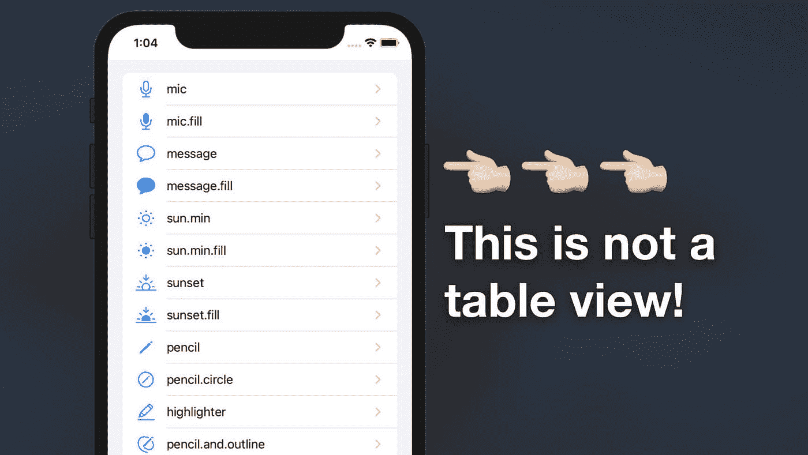
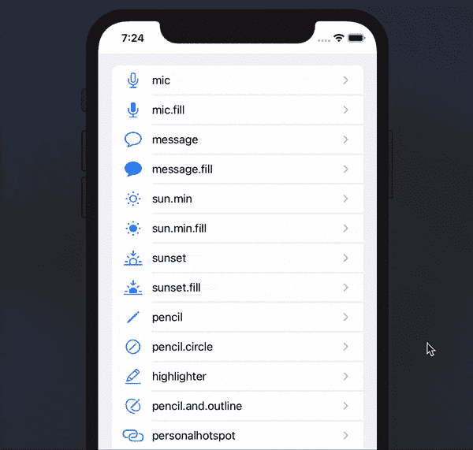
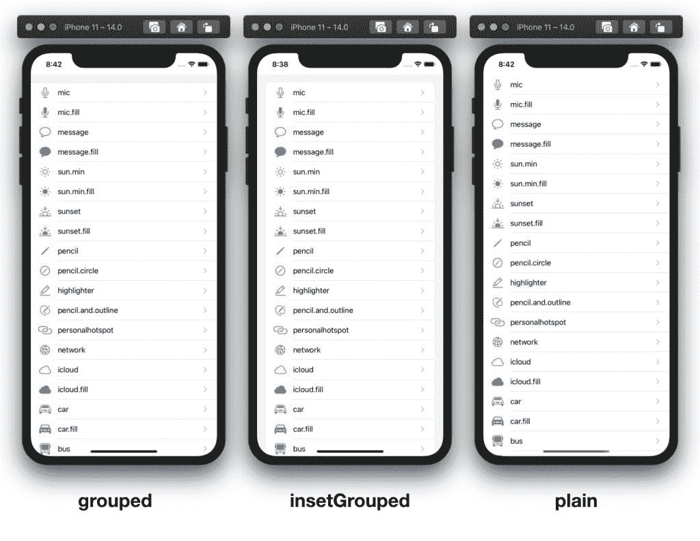
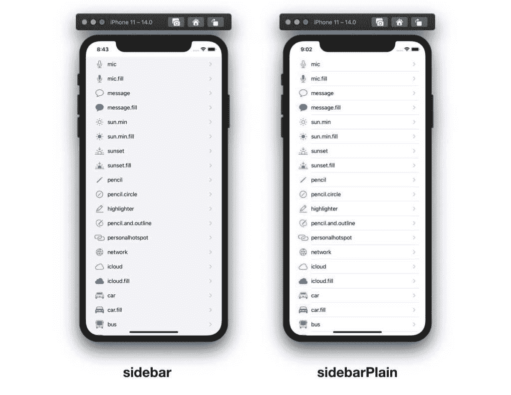
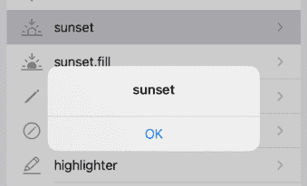
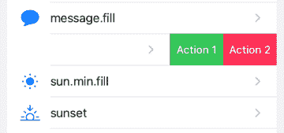

# 在 Swift 中使用 UICollectionView 构建列表

> 原文：<https://levelup.gitconnected.com/building-a-list-with-uicollectionview-in-swift-8cbed6aa6080>

## 它看起来完全像一个`UITableView`！



*本文原载于 2020 年 7 月 25 日*[*https://swiftsenpai.com*](https://swiftsenpai.com/development/uicollectionview-list-basic/)*。*

自从在 iOS6 中引入了`UICollectionView`之后，`UICollectionView`已经成为构建网格布局的默认组件。在 WWDC 2020 中，苹果通过在`UICollectionView`中引入列表布局，将`UICollectionView`的可用性推向了一个新的高度。

通过使用 iOS14 中给予`UICollectionView`的新功能和 API，现在构建一个类似`UITableView`的列表非常容易，与`UITableView`相比，这无疑是更好的选择。

在本文中，让我们看看使用 iOS 14 中的新`UICollectionView`创建一个带有可滑动单元格的列表有多简单，该单元格显示图像和文本。

# 示例应用程序

在我们开始之前，让我们快速地看一下我们在本文中试图建立什么样的列表。



我们将要构建的示例应用程序

正如你从上面的动画 gif 中看到的，我们将创建一个应用程序，当你点击它时，它会在一个`UIAlertController`中显示`SFSymbol`的名称。

此外，列表的单元格也是可滑动的，点击时会触发相应的滑动动作。

说了这么多，让我们启动 Xcode，投入其中吧！

# 创建列表

为了使用`UICollectionView`创建列表，我们需要:

1.  定义数据标识符类型
2.  定义部分标识符类型
3.  创建带有列表布局的收藏视图
4.  定义如何使用单元格注册显示数据
5.  定义集合视图的数据源
6.  创建快照并将其应用于数据源

## 1.定义项目标识符类型

在开始处理集合视图之前，我们必须首先准备好我们的数据模型。让我们继续创建一个由`name`和`image`常量组成的`SFSymbolItem`结构。

确保`SFSymbolItem`结构符合`Hashable`协议，因为我们将要使用的 diffable 数据源(在 iOS13 中引入)需要项目标识符的唯一哈希值。

之后，让我们填充一个数组`SFSymbolItem`,以便稍后我们可以使用它作为集合视图的数据模型。

## 2.定义部分标识符类型

即使在我们的示例应用程序中只有一个部分，仍然需要定义一个部分。定义节标识符的常用方法是使用枚举。

通常，节标识符只在一个特定的视图控制器中使用，因此建议在使用它的视图控制器中定义它。

## 3.创建带有列表布局的收藏视图

有了 item 和 section 标识符，我们现在就可以开始处理集合视图了。首先，让我们定义一个`UICollectionView`实例变量。

```
var collectionView: UICollectionView!
```

之后，打开视图控制器的`viewDidLoad()`，创建一个列表式布局的集合视图。

从上面的示例代码中需要注意的一点是，在创建列表配置时，您需要选择集合视图列表外观。

在 iOS 14 中，苹果推出了 5 种模仿 a `UITableView`外观的[外观](https://developer.apple.com/documentation/uikit/uicollectionlayoutlistconfiguration/appearance)。以下是我们的示例应用程序在不同外观类型下的截图。



收藏视图列表外观(分组、内分组、普通)



收藏视图列表外观(侧栏，sidebarPlain)

## 4.定义如何使用单元格注册显示数据

接下来，我们将使用 iOS 14 中引入的新的`[UICollectionView.CellRegistration](https://developer.apple.com/documentation/uikit/uicollectionview/cellregistration)` API 来创建一个单元格注册，它定义了数据应该如何在单元格中显示。

首先，我们为类型为`[UICollectionViewListCell](https://developer.apple.com/documentation/uikit/uicollectionviewlistcell)`的单元格和类型为`SFSymbolItem`的数据项创建一个单元格注册。

在单元格注册处理程序中，我们创建一个默认的单元格内容配置，并使用它来指定我们希望数据(内容)如何显示。之后，我们将为单元分配内容配置。

## 5.定义集合视图的数据源

单元格注册完成后，我们可以用它来定义集合视图的数据源。

首先，让我们定义一个`UICollectionViewDiffableDataSource`实例变量，用`Section`作为部分标识符类型，用`SFSymbolItem`作为项目标识符类型。

```
var dataSource: UICollectionViewDiffableDataSource<Section, SFSymbolItem>!
```

接下来，返回到`viewDidLoad()`，通过传入我们的集合视图并实现单元格提供者闭包来创建数据源。这样做会将数据源与我们的集合视图连接起来。

在单元提供者闭包中，我们使用之前创建的单元注册将可重用单元出队。请注意，我们不再需要使用单元重用标识符来使可重用单元出队。多酷啊。🥳

此外，单元格提供程序闭包也是配置单元格外观的好地方，例如添加单元格附件或更改单元格的色调。

## 6.创建快照并将其应用于数据源

在这最后一步，我们将通过使用 iOS 13 中引入的`[NSDiffableDataSourceSnapshot](https://developer.apple.com/documentation/uikit/nsdiffabledatasourcesnapshot)`告诉我们的视图控制器显示什么数据。

像往常一样，让我们首先创建一个`NSDiffableDataSourceSnapshot`实例变量。请确保正确设置区段标识类型和项目标识类型。

```
var snapshot: NSDiffableDataSourceSnapshot<Section, SFSymbolItem>!
```

之后，返回到`viewDidLoad()`，添加下面的代码片段。

在上面的代码中，我们首先创建一个快照实例，然后我们让快照知道它应该包含`main`部分，而`main`部分应该包含我们在步骤 1 中定义的`dataItems`。之后，将快照应用到数据源，以在集合视图上显示数据。

这就是使用集合视图创建列表的全部内容。继续运行示例代码，查看实际的列表布局。

# 处理单元格点击操作

在本节中，我们将研究如何处理单元格点击操作。概括一下，我们将在一个`UIAlertController`中显示所选`SFSymbol`的名称，如下图所示。



点击单元格后显示警告

您可能已经猜到，为了处理单元格点击动作，我们需要实现`collectionView(_:didSelectItemAt:)` delegate 方法。但是在此之前，请确保将视图控制器设置为集合视图的委托。

```
collectionView.delegate = self
```

下面是`collectionView(_:didSelectItemAt:)`委托方法的实现。

上面的代码几乎是不言自明的。但是，需要注意的一点是，我们是直接从`dataSource`而不是从`dataItems`中检索选定的数据。

这非常重要，因为`UICollectionViewDiffableDataSource`可能会执行一些后台操作，导致`dataItems`与集合视图中显示的数据不一致。

# 处理滑动动作



从右向左滑动单元格时的操作

为了在我们的列表上启用滑动操作，让我们向上滚动到`viewDidLoad()`的开头，并通过定义`trailingSwipeActionsConfigurationProvider`来修改`layoutConfig`。确保将`layoutConfig`的定义从`let`更改为`var`。

> ***亲提示:***
> 
> *执行* `*leadingSwipeActionsConfigurationProvider*` *启用左右滑动动作。*

基于苹果[文档](https://developer.apple.com/documentation/uikit/uicollectionlayoutlistconfiguration/swipeactionsconfigurationprovider?changes=latest_beta),`trailingSwipeActionsConfigurationProvider`是一个接受`IndexPath`并返回`UISwipeActionsConfiguration`的闭包。

以下示例代码演示了如何实现`trailingSwipeActionsConfigurationProvider`以获得我们的示例应用程序行为。

在`trailingSwipeActionsConfigurationProvider`闭包内，我们:

1.  从数据源中检索滑动单元格的数据项，就像我们在`collectionView(_:didSelectItemAt:)`中所做的一样。
2.  通过创建一个`UIContextualAction`的实例来定义第一个动作(动作 1)。在初始化期间，我们设置动作的样式、标题，并实现动作处理程序。
3.  在动作处理程序中，调用`handleSwipe(for:item:)`函数来显示一条警告消息。我们将很快实现这一点。
4.  调用动作处理程序的完成处理程序来表明我们已经执行了动作。
5.  配置操作视图背景颜色。
6.  定义第二个动作并实现其动作处理程序。
7.  使用我们刚刚创建的所有`UIContextualAction`创建一个滑动动作配置，并将其返回给滑动动作配置提供者。

最后，让我们实现`handleSwipe(for:item:)`函数。

至此，我们已经完成了示例应用程序实现。继续运行您的示例项目，看看一切都在运行。

我已经将完整的示例项目上传到了 [Github](https://github.com/LeeKahSeng/SwiftSenpai-UICollectionView-List) ，如果你需要任何参考，请随意下载。

# 进一步阅读

*   [UICollectionView](https://swiftsenpai.com/development/uicollectionview-list-custom-cell/)[带有自定义单元格和自定义配置的列表](https://swiftsenpai.com/development/uicollectionview-list-custom-cell/)
*   [在界面构建器中设计自定义 UICollectionViewListCell](https://swiftsenpai.com/development/custom-uicollectionviewlistcell-in-ib/)
*   [使用 UICollectionView 构建可扩展列表:第 1 部分](https://swiftsenpai.com/development/collectionview-expandable-list-part1/)
*   [使用 UICollectionView 构建可扩展列表:第 2 部分](https://swiftsenpai.com/development/collectionview-expandable-list-part2/)
*   [重新加载表格和集合视图单元格的现代方法](https://swiftsenpai.com/development/modern-ways-reload-cells/)
*   [声明式 UICollectionView 列表页眉和页脚](https://swiftsenpai.com/development/declarative-list-header-footer/)
*   [带有交互式自定义标题的 UICollectionView 列表](https://swiftsenpai.com/development/list-interactive-custom-header/)

# 包扎

本文涉及的主题仅仅触及了使用`UICollectionView`创建的列表的皮毛。还有其他更高级的主题，如多节列表、自定义单元格配置、单元格重新排序和可扩展单元格，我们尚未探索。

如果你想在我发表与这些主题相关的新文章时得到通知，请随时在[推特](https://twitter.com/Lee_Kah_Seng)上关注我。

感谢阅读。🧑🏻‍💻

# 相关 WWDC 视频

*   [UICollectionView 中的列表](https://developer.apple.com/videos/play/wwdc2020/10026/)
*   [UICollectionView 的进展](https://developer.apple.com/videos/play/wwdc2020/10097/)
*   [现代细胞配置](https://developer.apple.com/videos/play/wwdc2020/10027/)
*   [UI 数据源的进步](https://developer.apple.com/videos/play/wwdc2019/220)