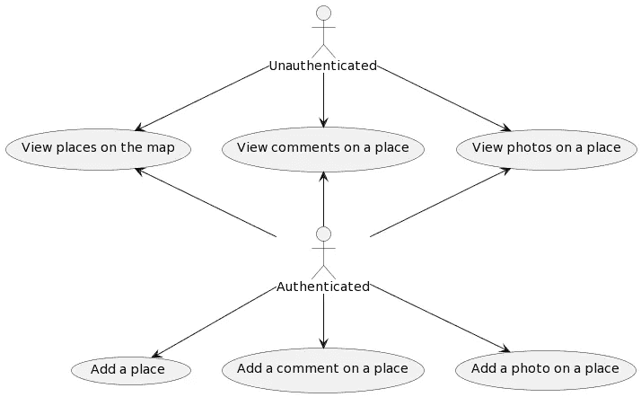
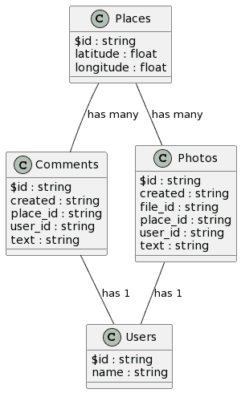
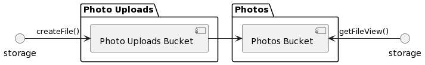

# 使用 Appwrite 构建基于位置的应用程序

> 原文：<https://levelup.gitconnected.com/building-a-location-based-app-with-appwrite-48a2e2b6d4c2>


照片由 [Z](https://unsplash.com/@dead____artist?utm_source=medium&utm_medium=referral) 在 [Unsplash](https://unsplash.com?utm_source=medium&utm_medium=referral) 上拍摄

在我使用 [Appwrite discord](https://appwrite.io/discord) 服务器期间，我看到一些人询问如何使用 Appwrite 创建一个使用 GPS 坐标的应用程序，因为 Appwrite 还没有[地理查询](https://github.com/appwrite/appwrite/issues/388)。虽然我对如何实现这一点有一些想法，但我在[app write Hackathon on Dev](https://dev.to/devteam/announcing-the-appwrite-hackathon-on-dev-1oc0)with[Places](https://dev.to/stnguyen90/places-appwrite-and-maps-14kh)期间找到了解决这个问题的机会。请继续阅读，了解 Places 是如何设计和构建的详细信息。

# 概观



用例图

Places 有两种类型的用户:

1.  未经证实的
2.  鉴定

未经身份验证的用户应该能够:

1.  查看地图上的地点
2.  查看对某个地点的评论
3.  查看某个地方的照片

经过身份验证的用户应该能够做未经身份验证的用户可以做的所有事情，以及:

1.  添加一个位置
2.  添加对某个地点的评论
3.  在一个地方添加照片

# 设计

## 收集

给定概述中定义的用例，需要以下集合:



类图

*   地点:使用纬度和经度在地图上存储地点
*   users:公开存储用户名 Users，因为 Appwrite 的用户数据是不能公开访问的
*   评论:存储一个地点的评论
    - `created` : ISO 8601 格式时间戳
    - `place_id` : `$id`地点将该评论链接到一个地点
    - `user_id` : `$id`用户将该评论链接到一个用户
    - `text`:评论文本
*   照片:从[存储 API](https://appwrite.io/docs/client/storage)
    - `place_id` : `$id`中存储一个位置的照片元数据
    - `created`:文件的 ISO 8601 格式时间戳
    - `file_id` : `$id`将该评论链接到用户的位置
    - `user_id` : `$id`将该评论链接到用户
    - `text`:照片描述

## 储存；储备



存储图

2 个桶用于实际的照片文件:

1.  照片上传:只写桶，允许用户提交照片
2.  照片:对用户公开的照片的只读存储桶

## 功能

为了确保数据的完整性，使得对于不存在的地方没有评论，并且用户不能冒充另一个用户，评论和照片集合不是公开可写的。相反， [Appwrite 函数](https://appwrite.io/docs/functions)在创建文档之前验证并自动填充属性。此外，基于事件的功能用于用户和照片。

**创建评论和创建照片**

这些函数都接受以下输入:

*   `place_id`
*   `text`

然后，他们:

1.  通过按 ID 提取位置来验证`place_id`是否存在
2.  使用当前时间戳自动填充`created`
3.  使用执行该功能的用户的用户 ID 自动填充`user_id`
4.  在相应的集合中创建文档

**创建用户**

当用户创建一个帐户时，这个函数被触发。该函数唯一做的事情是使用用户 ID 和名称创建一个用户文档。

**工艺照片**

因为存储 API 只支持除了名称之外没有任何其他元数据的文件(通过 JavaScript 是[只读](https://developer.mozilla.org/en-US/docs/Web/API/File#instance_properties))，所以一个 Photos 集合被用于元数据(将用户和地点链接到照片)。Appwrite 函数用于保持照片文档和文件同步，以及对照片执行任何处理。上传照片的流程如下:

1.  创建照片文档
2.  创建文件，提供照片文档 ID 作为自定义 ID

然后，处理照片功能触发并执行以下操作:

1.  如果存储桶不是照片上传存储桶，则退出
2.  从文件读取权限获取用户 ID
3.  验证用户 ID 与照片文档的`user_id`
    匹配——这确保上传文件的用户与创建文档的用户相同。
4.  从照片上传桶下载上传的文件
5.  调整图像大小，使照片不会过大
6.  从照片中移除位置元数据以保护用户隐私
7.  在照片存储桶中创建新文件
8.  用新创建的文件 ID 更新现有照片文档的`file_id`
9.  从照片上传存储桶中删除文件，以防止存储桶变得过大

## 前端

前端由以下库构建:

1.  [React](https://reactjs.org) 因为它是一个广受欢迎的前端库
2.  因为静态类型检查通过及早捕捉错误并提供信息丰富的代码完成大大改善了开发人员的体验
3.  MUI 因为它是一个广泛流行的用户界面库，使得构建一个好看的、响应迅速的用户界面变得简单快捷
4.  [React 传单](https://react-leaflet.js.org)因为我们使用 React，而[传单](https://leafletjs.com)是一个开源的移动友好地图库，有很多[插件](https://leafletjs.com/plugins.html)

**获取 GPS 数据**

React 传单库让处理 GPS 数据变得如此简单。当人们第一次来到 discord 服务器询问如何查询数据时，我认为有必要使用三角学来计算给定中心点和半径的北-南-东-西边界。

做数学是一种方法，但我很快发现这完全没有必要。原来 React 传单库公开了一个`map.getBounds()`函数，该函数返回一个`[LatLngBounds](https://leafletjs.com/reference.html#latlngbounds)` [对象](https://leafletjs.com/reference.html#latlngbounds)，该对象包含地图当前视图的北-南-东-西边界。

```
map.getBounds()
{
  "_southWest": {
    "lat": 51.46684144864419,
    "lng": -0.15964508056640628
  },
  "_northEast": {
    "lat": 51.5429188223739,
    "lng": -0.020256042480468753
  }
}
```

因此，剩下要做的唯一一件事就是构建一个查询来基于这些界限进行过滤:

```
const b = map.getBounds();
const documentList = await sdk.database.listDocuments<Place>(
  Collections.Places,
  [
    Query.greater(Attributes.Places.Latitude, b.getSouth()),
    Query.lesser(Attributes.Places.Latitude, b.getNorth()),
    Query.greater(Attributes.Places.Longitude, b.getWest()),
    Query.lesser(Attributes.Places.Longitude, b.getEast()),
  ]
);
```

# 逮到你了

## 向东和向西平移

因为地球是圆的，如果你向西平移，你最终会回到你开始的地方。然而，这如何在应用程序中转换为经度？原来，小叶并没有重置经度，只是继续减少或增加。例如，如果您从(40.71，-74.01)开始，向西绕地球两圈，再次到达同一位置，您将到达(40.71，-794.01)。这导致在查看地点和添加地点时出现问题。

**查看地点时平移**

查看地点时平移的问题是，如果在(40.71，-74.01)添加了一个地点，但用户平移到(40.71，-794.01)时，他们将看不到该地点。

为了解决这个问题，如果用户平移超过某个点，地图将重置以保持在某个范围内。当使用 0°和 360°作为范围时，我注意到一个问题，即地图在穿越边界时出现毛刺。这可以通过使用-180°和 180°作为边界来改善。由于这一边界在太平洋上空，没有任何陆地，所以故障不太明显，如果用户不横跨太平洋，甚至可能不会体验到。

**添加地点时平移**

添加地点时平移的问题是，如果有人平移到(40.71，-794.01)并在那里添加地点，当有人查看同一位置时，但在(40.71，-74.01)，该地点不会出现。

为了解决这个问题，我在发送给 Appwrite 之前修改了经度。当经度小于-180°时，增加 360°。当经度大于 180°时，减去 360°。

# 结论

如你所见，即使没有地理查询，使用 Appwrite 创建基于位置的应用程序也是完全可能的。地点有效地展示:

1.  如何设计相关系列
2.  如何通过 Appwrite 函数确保相关数据的完整性
3.  如何存储和获取位置数据

虽然本文中没有提到，但是 Places 也使用了:

1.  获取异步处理数据的实时 API
2.  响应式设计构建渐进式 Web 应用程序

要观看地点演示，请浏览 [https://places.pages.dev](https://places.pages.dev) 。完整的源代码，请查看 [GitHub](https://github.com/stnguyen90/places) 。