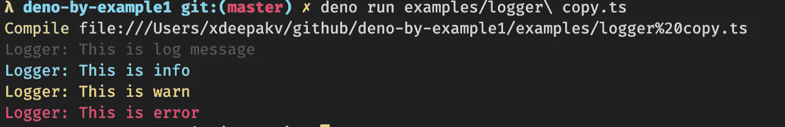
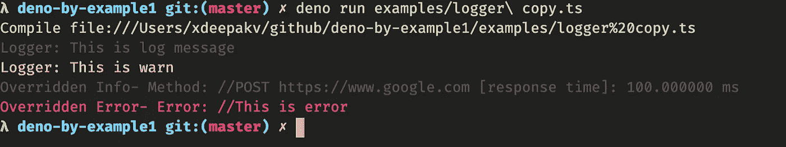
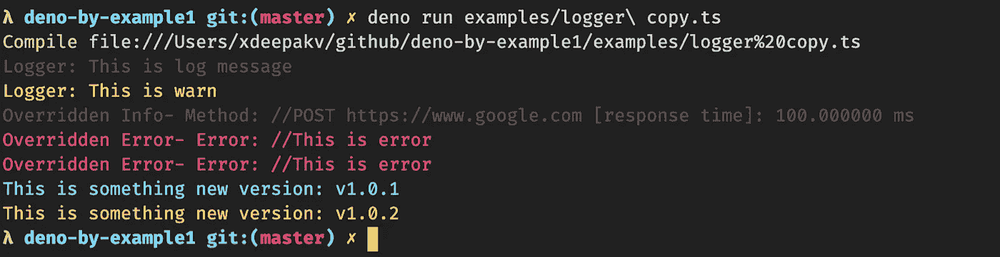

# 用 Deno 构建一个超酷的彩色记录器

> 原文：<https://levelup.gitconnected.com/building-a-logger-with-deno-3725c4390119>

L 记录痕迹是任何`programming language`人的基本需求之一。你的代码有多好并不重要，除非它不是`traceable`和`debugable`。对于调试，日志记录是最好的工具之一。接下来是`fast`和`easy`。如果你在做`local system`，这可能是你在`debugging`时最好的伙伴。


在本教程中，我将解释。如何用最少的代码(几行代码)构建一个超级酷的日志记录器。这也是没有使用任何第三方工具。

## 先决条件

1.  **Deno:** 如果没有安装 Deno[安装](https://deno.land/#installation)
2.  **基本类型脚本:** [基本类型](https://www.typescriptlang.org/docs/handbook/basic-types.html)

**探索模块:**

1.  `#fmt`
2.  `#colors`
3.  `#printf`

就像 Node.js/JavaScript,日志可以使用`console.log`来完成一样

`console.log(“Hello World”);`

不错！然而，格式化日志消息是 javascript 的一大难题。`console.log`部分实现`c++`或`java`中的`printf`等功能。但是它不支持所有的功能。

那么我们应该如何记录格式化的消息呢？

# JavaScript 格式的日志

> *使用字符串模板。*

```
const name = "Deepak";
const salary = 2000;
console.log(`My name is ${name} and my salary is ${salary}$`);// My name is Deepak and my salary is 2000$
```

酷！但是我们可以看到，对于模板中的每个参数，我们必须给你一个常量/变量。仅仅为了记录一些东西而创建变量是很困难的。

> *在* `*console.log*` *中使用变量。*

```
const name = "Deepak";
const salary = 2000;
console.log(`My name and salary is `, name, salary);// My name and salary are Deepak 2000const person = { name: "deepak", salary: 2000 };
console.log(`Info: `, person);
// Info: { name: 'deepak', salary: 2000 }
```

上面的语句在 javascript 中是有效的。我们可以传递任意数量的`vargs`到`console.log`。但是，我们不能用变量来安排消息。这对于打印任何东西非常有用，只需用逗号分隔数值即可。但是这不能用来记录有用的东西。

1.  意外实现
2.  易出错的

**我们来看一个例子:**

```
const person = { name: "deepak", salary: 2000 };
const address = { street: "221B baker street london", zip: 20000 };
console.log("Person info: " + person + " Address: " + address);
// Person info: [object Object] Address: [object Object]
```

如果您尝试用`string`附加对象，它会转换为对象的字符串`[object Object]`并被附加。

***解:***

```
const person = { name: "deepak", salary: 2000 };
const address = { street: "221B baker street london", zip: 20000 };
console.log(
  "Person info: " +
    JSON.stringify(person) +
    " Address: " +
    JSON.stringify(address)
);
// Person info: {"name":"deepak","salary":2000} Address: {"street":"221B baker street london","zip":20000}// Orconsole.log("Person info: ", person, " Address: ", address);
// Person info:  { name: 'deepak', salary: 2000 }  Address:  { street: '221B baker street london', zip: 20000 }
```

> *使用* `*console.log*` *中的局部打印功能。*

```
const person = { name: "deepak", salary: 2000 };
const address = { street: "221B baker street london", zip: 20000 };
console.log(
  "Person info: name: %s salary: %d and Address: street: %s ",
  person.name,
  person.salary,
  address.street
);
// Person info: name: deepak salary: 2000 and Address: street: 221B baker street london
```

在这里你可以看到，`console.log`确实支持`printf`喜欢的功能。不过这仅限于`%s`**串**，`%d`**号**。

注意:Mozilla 确实支持类似于`%.2f`的精确格式化。

# PrintF 简介

Deno 受`[Go](https://golang.org/)`启发很大。和 Go 一样，Deno 在标准库中也有一个`fmt`模块。该模块/包是多个类似`printf`的子模块的组合。

> ***注:*** `*fmt*` *模块仍处于* `*work-in-progress*` *状态，据 deno 开发者称。*

**导入 printf:**

```
import { printf } from "[https://deno.land/std/fmt/printf.ts](https://deno.land/std/fmt/printf.ts)";
```

**printf 的定义:**

```
export function printf(format: string, ...args: unknown[]): void {
  const s = sprintf(format, ...args);
  Deno.stdout.writeSync(new TextEncoder().encode(s));
}
```

`printf`取串`unknown`的`vars`。格式定义了字符串的格式。参数可以是任何你想要的格式。

**`**printf**`**的样品:****

```
const person = { name: "deepak", salary: 2000 };
printf(`Person Name: "%s" and Salary: %d\n`, person.name, person.salary);// Person Name: "deepak" and Salary: 2000
```

## **根据 Deno 文档，支持以下动词:**

```
| Verb  | Meaning                                                 |
| ----- | --------------------------------------------------------|
| `%`   | print a literal percent                                 |
| `t`   | evaluate arg as boolean, print `true` or `false`        |
| `b`   | eval as number, print binary                            |
| `c`   | eval as number, print character corr. to the codePoint  |
| `o`   | eval as number, print octal                             |
| `x X` | print as hex (ff FF), treat string as list of bytes     |
| `e E` | print number in scientific/exponent format 1.123123e+01 |
| `f F` | print number as float with decimal point and no exponent|
| `g G` | use %e %E or %f %F depending on size of argument        |
| `s`   | interpolate string                                      |
| `T`   | type of arg, as returned by `typeof`                    |
| `v`   | value of argument in 'default' format (see below)       |
| `j`   | argument as formatted by `JSON.stringify`               |
```

*****具有宽度和精度的动词*****

```
%9f    width 9, default precision
%.9f   default width, precision 9
%8.9f  width 8, precision 9
%8.f   width 9, precision 0
```

****宽度和精度的样品:****

```
const person = { name: "deepak", salary: 2000.2 };
printf(`Person Name: "%s" and Salary: %9.2f\n`, person.name, person.salary);// Person Name: "deepak" and Salary:   2000.20
```

**您可以编写更复杂的例子，比如填充，并将`vargs`的值传递给`printf`函数。**

****填料样品:****

```
const person = { name: "deepak", salary: 2000.2 };
// Padding Zero
printf(`Salary: %09.2f\n`, person.salary);// Salary: 002000.20
```

**`rgb`到`hex`颜色的转换就是这么简单。**

```
const r = 5,
  g = 255,
  b = 100;
printf("RGB TO HEX: #%02x%02x%02x\n", r, g, b);// RGB TO HEX: #05ff64
```

****更复杂的使用** `**vargs**` **的指标值:****

```
const person = { name: "deepak", salary: 2000.2 };printf(
  "Person has salary %d, which(%[1]d) is less than average salary %d\n",
  person.salary,
  4000
);// Person has salary 2000.2, which(2000.2) is less than average salary 4000
```

****阅读更多:**https://deno.land/std/fmt**

# **日志中的颜色**

****

**`console.log`的另一个问题是，它不支持开箱即用的颜色。我们最终在 Node.js 中添加了像 [colors](https://www.npmjs.com/package/colors) 这样的库。浏览器对`css` console.log 有一些额外的支持。但这在 Node 中不起作用。**

****阅读更多:**[https://developer.mozilla.org/en-US/docs/Web/API/console](https://developer.mozilla.org/en-US/docs/Web/API/console)**

**多亏了 Deno 的`colors`模块，我们可以轻松地丰富我们的生活。**

****从标准库导入颜色:****

```
import { red, yellow, gray, cyan } from "[https://deno.land/std/fmt/colors.ts](https://deno.land/std/fmt/colors.ts)";
```

> ***注意:颜色模块还支持* `*rgb*` *颜色***

```
import { rgb8, bgRgb8, rgb24 } from "[https://deno.land/std/fmt/colors.ts](https://deno.land/std/fmt/colors.ts)";
```

****来源于 Deno 来源:****

```
/** Set background color using paletted 8bit colors.
 * [https://en.wikipedia.org/wiki/ANSI_escape_code#8-bit](https://en.wikipedia.org/wiki/ANSI_escape_code#8-bit) */
export function bgRgb8(str: string, color: number): string {
  return run(str, code([48, 5, clampAndTruncate(color)], 49));
}
```

## *****现在，我们有了所有的基本工具。让我们完成记录器的实现。*****

****

# **创建一个基本的记录器类**

****定义接口:****

```
import { sprintf } from "[https://deno.land/std/fmt/printf.ts](https://deno.land/std/fmt/printf.ts)";
import { red, yellow, gray, cyan } from "[https://deno.land/std/fmt/colors.ts](https://deno.land/std/fmt/colors.ts)";type LogLevel = 0 | 1 | 2 | 3;
interface LoggerOptions {
  level: LogLevel;
  format?: string;
}
```

****定义日志级别和格式的默认值:****

```
const initialOptions = { level: 0, format: "%s\n" };
class Logger {
  private _level: LogLevel;
  private _format: string;
  constructor(options: LoggerOptions = initialOptions as LoggerOptions) {
    const { level, format } = { ...initialOptions, ...options };
    this._level = level;
    this._format = format;
  }
}
```

****为级别和格式定义 getter setter:****

```
const initialOptions = { level: 0, format: "%s\n" };
class Logger {
  private _level: LogLevel;
  private _format: string;
  /// rest of the code
  get level(): LogLevel {
    return this._level;
  }
  set level(_l: LogLevel) {
    this._level = _l;
  }
  get format(): string {
    return this._format;
  }
  set format(_f: string) {
    this._format = _f;
  }
}
```

> ***注意:这是为了隐藏定义。如果不希望用户修改这些值，可以删除 setter。***

****添加基本方法:****

```
const initialOptions = { level: 0, format: "%s\n" };
class Logger {
  private _level: LogLevel;
  private _format: string;
  /// rest of the code
  log(...messages: unknown[]) {
    console.log(gray(sprintf(this.format, ...messages)));
  }
  info(...messages: unknown[]) {
    console.log(cyan(sprintf(this.format, ...messages)));
  }
  warn(...messages: unknown[]) {
    console.log(yellow(sprintf(this.format, ...messages)));
  }
  error(...messages: unknown[]) {
    console.log(red(sprintf(this.format, ...messages)));
  }
}
```

****样品运行:****

```
import { Logger } from "./logger.ts";const logger = new Logger({ level: 0, format: "Logger: %s" });
logger.log("This is log message");
logger.info("This is info");
logger.warn("This is warn");
logger.error("This is error");
```

****输出:****

****

**如果你注意到，我用的是`sprintf`而不是`printf`。因为我想完全控制打印信息，如添加颜色和使用动态格式。我得用`sprintf`而不是`printf`。**

****让我们允许用户在运行时修改格式:****

```
const initialOptions = { level: 0, format: "%s\n" };
class Logger {
  private _level: LogLevel;
  private _format: string;
  /// rest of the code
  log(format: string, ...messages: unknown[]) {
    if (messages.length === 0) {
      messages = [format];
      format = this.format;
    }
    console.log(gray(sprintf(format, ...messages)));
  }
  info(format: string, ...messages: unknown[]) {
    if (messages.length === 0) {
      messages = [format];
      format = this.format;
    }
    console.log(cyan(sprintf(format, ...messages)));
  }
  warn(format: string, ...messages: unknown[]) {
    if (messages.length === 0) {
      messages = [format];
      format = this.format;
    }
    console.log(yellow(sprintf(format, ...messages)));
  }
  error(format: string, ...messages: unknown[]) {
    if (messages.length === 0) {
      messages = [format];
      format = this.format;
    }
    console.log(red(sprintf(format, ...messages)));
  }
}
```

****样品运行 2:****

```
import { Logger } from "./logger.ts";const logger = new Logger({ level: 0, format: "Logger: %s" });
logger.log("This is log message");
logger.warn("This is warn");logger.log("Overridden Info- Method: //%s %s [response time]: %05f ms" , "POST", "[https://www.google.com](https://www.google.com)", 100);
logger.error("Overridden Error- Error: //%s" , new Error("This is error").message);
```

****输出:****

****

## **最后一点:使用日志级别**

```
const initialOptions = { level: 0, format: "%s\n" };
class Logger {
  private _level: LogLevel;
  private _format: string;
  /// rest of the code
  log(format: string, ...messages: unknown[]) {
    if (this.level > 0) return;
    if (messages.length === 0) {
      messages = [format];
      format = this.format;
    }
    console.log(gray(sprintf(format, ...messages)));
  }
  /// rest of the code
}
```

****最终运行:****

```
import { Logger } from "./logger.ts";const logger = new Logger({ level: 0, format: "Logger: %s" });
logger.log("This is log message");
logger.warn("This is warn");logger.log("Overridden Info- Method: //%s %s [response time]: %05f ms" , "POST", "[https://www.google.com](https://www.google.com)", 100);
logger.error("Overridden Error- Error: //%s" , new Error("This is error").message);// Change levellogger.level = 2;// This will not print
logger.log("Overridden Info- Method: //%s %s [response time]: %05f ms" , "POST", "[https://www.google.com](https://www.google.com)", 100);// This will print
logger.error("Overridden Error- Error: //%s" , new Error("This is error").message);// Change default format
logger.level = 1;logger.format = "This is something new version: v%s";logger.info("1.0.1");
logger.info("1.0.2");
```

****输出:****

********

**`Logger class`的完整实现可以在[示例/logger.ts](https://raw.githubusercontent.com/deepakshrma/deno-by-example/master/examples/logger.ts) 中找到**

**如何使用样本可以在[examples/advance _ logger . ts](https://github.com/deepakshrma/deno-by-example/blob/master/examples/advance_logger.ts)中找到**

> ***更多类似的例子，请访问:*[*https://deepakshrma.github.io/deno-by-example/*](https://deepakshrma.github.io/deno-by-example/)**

**我希望你喜欢这个教程。请在评论中告诉我你的反馈。感谢支持(🙏🙏).**