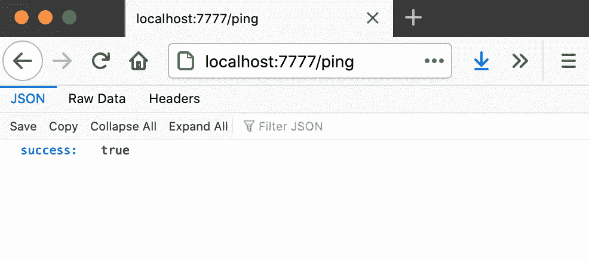

# 为图像超大规模扩展构建微服务

> 原文：<https://levelup.gitconnected.com/building-a-microservice-for-image-super-scaling-a2d9a8848c5f>


左—双三次插值，右—图像超分辨率

超大规模、神经增强、超分辨率、人工智能升级——代表同一个想法的各种术语。您可以使用人工神经网络来放大图像，而不是常规的双线性/双三次算法。但是，这并不是这篇文章真正要说的…


左—双三次插值，右—图像超分辨率

本教程旨在提供一个例子，说明如何将任何与人工智能相关的解决方案(需要您坚持使用 Python)包装在一个方便的无状态服务中，该服务可以在您的架构中的任何地方轻松部署、扩展和使用。

我们今天将构建什么:

1.  基于 Python 的微服务，带有 [Flask](https://flask.palletsprojects.com) 框架
2.  通过 ISR 包( [ISR GitHub](https://github.com/idealo/image-super-resolution) )进行图像升级的端点
3.  我们微服务的 Docker 图像
4.  Java 中的 REST API 客户端与我们的微服务进行通信

一如既往——本教程的最终代码和示例图像可以通过本文末尾的链接在我的 GitHub repo 中找到。

# 第 1 部分—基本烧瓶应用程序

让我们从制作一个简单的 Flask 应用程序开始，这是 Python 中的一个基本微服务，其中有一个`ping`端点。

首先，我们需要一个 JSON 对象`message_protocol/ping_output.py`从这个端点返回数据

```
**import** json

**class** PingOutput:
    **def** __init__(self, success: bool):
        self.success = success

    **def** toJSON(self):
        **return** json.dumps(self, default=**lambda** o: o.__dict__, sort_keys=**True**, indent=4)
```

然后，让我们让端点逻辑有自己的类，并把它放在`resource_ping.py`中，我知道，看起来有点过分，但相信我，当这些端点中有一些真正的工作负载时，这是值得的。

```
**from** message_protocol.ping_output **import** PingOutput

**class** ResourcePing:
    **def** main(self) -> PingOutput:
        **return** PingOutput(**True**)
```

通过添加一个单独的脚本`resources.py`，确保资源只被实例化一次(在应用程序启动时)

```
*# Make sure all resources are instantiated here* **from** resource_ping **import** ResourcePing
resourcePing = ResourcePing()
```

现在是主要部分——一个 Flask 应用程序，它将`/ping` URL 映射到我们的资源中。姑且称之为`flask_app.py`

```
**from** flask **import** Flask
**from** flask **import** request
**from** flask **import** Response
**from** resources **import** resourcePingapp = Flask(__name__)

@app.route(**'/ping'**, methods=[**'GET'**])
**def** ping():
    output = resourcePing.main()
    json = output.toJSON()
    **return** Response(json, mimetype=**'application/json'**)
```

有了它，你就可以通过

```
export FLASK_APP=flask_app.py
flask run --host=0.0.0.0 --port=7777
```

并通过执行`GET http://localhost:7777/ping`来测试响应



我们的 Python 微服务的主干现已完成，我们可以用类似的方式添加新资源。

# 第 2 部分—整合 ISR

随着基本 Flask 应用程序的启动和运行，我们可以添加一个端点来进行图像放大，但首先让我们通过在 Flask 应用程序之外做一个快速测试来看看[图像超分辨率](https://github.com/idealo/image-super-resolution)是如何工作的。您可以在他们的 [GitHub](https://github.com/idealo/image-super-resolution) 上找到更详细的 ISR 使用示例，我将简单介绍一下我们的案例。我们将在本教程中使用**人工取消 GANS 模型**。

```
**import** numpy **as** np
**from** PIL **import** Image
**from** ISR.models **import** RDNinputPath = **'../../sample-images/t4.jpg'** outputPath = **'../../sample-images/t4_up.jpg'** imagePil = Image.open(inputPath)
imageNumpy = np.array(imagePil)
model = RDN(weights=**'noise-cancel'**)
scaledNumpy = model.predict(imageNumpy)
scaledPil = Image.fromarray(scaledNumpy)
scaledPil.save(outputPath)
```


左—双三次插值，右—图像超分辨率


左—双三次插值，右—图像超分辨率

现在，让我们将这种扩展放到一个新的资源中。为了在 JSON 对象中传递图像，我将使用 base64 字符串图像编码，这简化了本教程，但是对于现实世界的应用程序来说，更合理的方法是只传递图像的 URL。

我们将定义输入/输出 JSON 对象(虽然它们的内容是相同的，但我将在这里使用两个不同的对象，因为在实际应用程序中，我们可能希望在其中传递额外的数据)

```
**import** json

**class** UpscaleInput:
    **def** __init__(self, imageBase64: str):
        self.imageBase64 = imageBase64

    **def** toJSON(self):
        **return** json.dumps(self, default=**lambda** o: o.__dict__, sort_keys=**False**, indent=4)

**def** parseUpscaleInput(dictionary) -> UpscaleInput:
    imageBase64 = dictionary[**'imageBase64'**]
    **return** UpscaleInput(imageBase64)**class** UpscaleOutput:
    **def** __init__(self, imageBase64: str):
        self.imageBase64 = imageBase64

    **def** toJSON(self):
        **return** json.dumps(self, default=**lambda** o: o.__dict__, sort_keys=**False**, indent=4)

**def** parseUpscaleOutput(dictionary) -> UpscaleOutput:
    imageBase64 = dictionary[**'imageBase64'**]
    **return** UpscaleOutput(imageBase64)
```

而现在资源本身，`resource_upscale.py`

```
**import** io
**import** base64
**import** numpy **as** np
**from** PIL **import** Image
**from** ISR.models **import** RDN
**from** message_protocol.upscale_input **import** UpscaleInput
**from** message_protocol.upscale_output **import** UpscaleOutput

MODEL = RDN(weights=**'noise-cancel'**)

**class** ResourceUpscale:
    **def** main(self, upscaleInput: UpscaleInput) -> UpscaleOutput:
        *# Parse base64 string into bytes array* inputImageBytesArray = base64.b64decode(upscaleInput.imageBase64)

        *# Open the image* imagePil = Image.open(io.BytesIO(inputImageBytesArray))
        imageNumpy = np.array(imagePil)

        *# Scale the image* scaledNumpy = MODEL.predict(imageNumpy)
        scaledPil = Image.fromarray(scaledNumpy)

        *# Write scaled image as bytes array* outputImageBytesArrayIO = io.BytesIO()
        scaledPil.save(outputImageBytesArrayIO, format=imagePil.format, quality=100)
        outputImageBytesArray = outputImageBytesArrayIO.getvalue()

        *# Convert back to base64 string* outputImageBase64 = base64.b64encode(outputImageBytesArray).decode(**'utf-8'**)
        **return** UpscaleOutput(outputImageBase64)
```

别忘了在`resources.py`中实例化它

```
*# Make sure all resources are instantiated here* **from** resource_ping **import** ResourcePing
**from** resource_upscale **import** ResourceUpscale
resourcePing = ResourcePing()
resourceUpscale = ResourceUpscale()
```

并将`/upscale`的网址映射到`flask_app.py`

```
**from** flask **import** Flask
**from** flask **import** request
**from** flask **import** Response
**from** resources **import** resourcePing, resourceUpscale
**from** message_protocol.upscale_input **import** parseUpscaleInput

app = Flask(__name__)

@app.route(**'/ping'**, methods=[**'GET'**])
**def** ping():
    output = resourcePing.main()
    json = output.toJSON()
    **return** Response(json, mimetype=**'application/json'**)

@app.route(**'/upscale'**, methods=[**'POST'**])
**def** upscale():
    input = parseUpscaleInput(request.json)
    output = resourceUpscale.main(input)
    json = output.toJSON()
    **return** Response(json, mimetype=**'application/json'**)
```

在这个阶段，让我们离开 Python 这一边，转而构建我们的环境和客户机，以便正确地运行这个服务并与之通信。

# 第 3 部分— Docker 图像

我们的 Docker 映像非常简单，我们将从一个基本的 Ubuntu 映像开始，安装 Python、PIP 和在容器中运行该服务所需的所有依赖项，复制源代码并在容器启动时运行该服务。所以`Dockerfile`最终看起来像这样:

```
**FROM** ubuntu:20.04

*# Initial setup & install system utils* **RUN** apt-get update **&&** apt-get upgrade **-**y
**RUN** apt-get install **-**y apt-utils software-properties-common
**RUN** apt-get install **-**y vim wget git

*# Install Python 3.8 & Pip 3* **WORKDIR /
RUN** add-apt-repository **-**y ppa:deadsnakes**/**ppa
**RUN** apt-get install **-**y python3.8
**RUN** echo **"alias python='python3.8'" >>** ~**/**.bashrc
**RUN** echo **"alias python3='python3.8'" >>** ~**/**.bashrc
**RUN** apt-get install **-**y python3-pip
**RUN** echo **"alias pip='pip3'" >>** ~**/**.bashrc

*# Install Python dependencies* **RUN** pip3 install flask
**RUN** pip3 install numpy
**RUN** pip3 install tensorflow
**RUN** pip3 install ISR **--**ignore-installed tensorflow

*# Copy source code* **RUN** mkdir **/**python-service
**COPY** . **/**python-service
**WORKDIR /**python-service
**RUN** chmod a**+**x run.sh

*# Run* **CMD './run.sh'**
```

至于`run.sh`剧本

```
**#!/bin/sh** export FLASK_APP=flask_app.py
flask run --host=0.0.0.0 --port=7777
```

现在，您可以从终端构建并运行 Docker 容器

```
docker build -t service-ai-image . && docker run --rm -ti -p 7777:7777 --name service-ai-container service-ai-image
```

并通过执行`GET [http://localhost:7777/ping](http://localhost:7777/ping)`来测试它是否在 doing

# 第 4 部分— Java 客户端

这可能是本教程中最简单的部分——我们现在需要构建一个与我们的服务通信的 REST API 客户端。我用 Java 编写这个代码，但是这一部分在你喜欢的任何其他语言中都是可行的。我将使用 [Lombok](https://projectlombok.org/setup/maven) 注释来加速并减少样板代码，使用 [Gson](https://github.com/google/gson) 来简化 JSON 映射，使用 [Apache HTTP 客户端](https://hc.apache.org/httpcomponents-client-ga/)来调用服务。然后当然是 [JUnit](https://junit.org/junit4/) 进行测试。

JSON 对象应该是这样的

```
**public interface** JsonSerializable **extends** Serializable {
    **default** String toJson() {
        **return new** GsonBuilder().create().toJson(**this**);
    }
}@Getter @AllArgsConstructor @NoArgsConstructor @ToString @EqualsAndHashCode
**public class** PingOutput **implements** JsonSerializable {
    **private boolean success**;
}@Getter @AllArgsConstructor @NoArgsConstructor @ToString @EqualsAndHashCode
**public class** UpscaleInput **implements** JsonSerializable {
    **private** String **imageBase64**;

    **public** UpscaleInput(**byte**[] imageBytesArray) {
        **this**(Base64.*getEncoder*().encodeToString(imageBytesArray));
    }

    **public** UpscaleInput(File imageFile) **throws** IOException {
        **this**(Files.*readAllBytes*(imageFile.toPath()));
    }
}@Getter @AllArgsConstructor @NoArgsConstructor @ToString @EqualsAndHashCode
**public class** UpscaleOutput **implements** JsonSerializable {
    **private** String **imageBase64**;

    **public byte**[] toBytesArray() {
        **return** Base64.*getDecoder*().decode(**imageBase64**);
    }
}
```

我们还需要一个 helper 类，它具有一些处理 HTTP 请求的逻辑(在现实世界的应用程序中，您可能希望这里有更多的 try-catch 块，一些不错的错误处理逻辑，但是这对于我们的情况来说很好)

```
**public class** ClientUtils {
    **private static** String getJsonResponse(HttpResponse httpResponse) **throws** Exception {
        **if** (httpResponse.getStatusLine().getStatusCode() == 200) {
            HttpEntity httpEntity = httpResponse.getEntity();
            **return** EntityUtils.*toString*(httpEntity);
        } **else** {
            **throw new** IllegalStateException(**"Http response status code is invalid: "** + httpResponse.getStatusLine().getStatusCode() + **", "** + EntityUtils.*toString*(httpResponse.getEntity()));
        }
    }

    **public static** <M> M parseJsonResponse(String jsonResponse, Type responseResultType) **throws** Exception {
        **return new** GsonBuilder().create().fromJson(jsonResponse, responseResultType);
    }

    **public static** String doGet(String url) **throws** Exception {
        HttpClient httpClient = HttpClientBuilder.*create*().build();
        HttpGet httpGet = **new** HttpGet(url);
        httpGet.setHeader(**"Accept"**, **"application/json"**);
        **return** *getJsonResponse*(httpClient.execute(httpGet));
    }

    **public static** String doPost(String url, String jsonPayload) **throws** Exception {
        HttpClient httpClient = HttpClientBuilder.*create*().build();
        HttpPost httpPost = **new** HttpPost(url);
        httpPost.setEntity(**new** StringEntity(jsonPayload, ContentType.***APPLICATION_JSON***));
        httpPost.setHeader(**"Accept"**, **"application/json"**);
        httpPost.setHeader(**"Content-type"**, **"application/json"**);
        **return** *getJsonResponse*(httpClient.execute(httpPost));
    }
}
```

现在，我们终于可以用两种方法来编写主客户端本身了— `ping`和`upscale`。

```
**public class** Client {
    **private static** String *BASE_URL* = **"http://localhost:7777"**;

    **public static** PingOutput ping() **throws** Exception {
        String url = *BASE_URL* + **"/ping"**;
        String response = ClientUtils.*doGet*(url);
        **return** ClientUtils.*parseJsonResponse*(response, PingOutput.**class**);
    }

    **public static** UpscaleOutput upscale(UpscaleInput input) **throws** Exception {
        String url = *BASE_URL* + **"/upscale"**;
        String response = ClientUtils.*doPost*(url, input.toJson());
        **return** ClientUtils.*parseJsonResponse*(response, UpscaleOutput.**class**);
    }
}
```

是时候一起测试整个拼图了！确保服务正在 Docker 中运行，并启动这些测试

```
@Ignore
**public class** ClientTest {
    @Test
    **public void** ping() **throws** Exception {
        PingOutput output = Client.*ping*();
        *assertNotNull*(output);
        *assertTrue*(output.isSuccess());
    }

    @Test
    **public void** upscale() **throws** Exception {
        String inputFilePath = **"../sample-images/t7.jpg"**;
        String outputFilePath = **"./sample-images/t7_up.jpg"**;
        File inputFile = **new** File(inputFilePath);
        UpscaleInput input = **new** UpscaleInput(inputFile);
        UpscaleOutput output = Client.*upscale*(input);
        *assertNotNull*(output);
        *assertFalse*(output.getImageBase64().isEmpty());
        File outputFile = **new** File(outputFilePath);
        FileUtils.*writeByteArrayToFile*(outputFile, output.toBytesArray());
    }
}
```

如果一切顺利，你应该有一个缩放图像保存在你的驱动器上


左—双三次插值，右—图像超分辨率


左—双三次插值，右—图像超分辨率

就是这样！感谢您完成本教程，并在我们继续之前快速回顾一下——我们简要检查了图像超缩放，用 Python 构建了一个 AI 微服务作为 Flask 应用程序，将其包装在 Docker 容器中，并通过 Java 中的 REST API 客户端进行了测试。我希望这篇文章是有帮助的，我设法向您展示了如何在您的项目中集成 Python AI 服务。

带有源代码的 GitHub repo:

[](https://github.com/JPLeoRX/image-super-scaling-service) [## JPLeoRX/image-超级缩放-服务

github.com](https://github.com/JPLeoRX/image-super-scaling-service) 

如果你想查看我的其他作品或联系我:

*   [个人网站](https://tekleo.net/)
*   [GitHub](https://github.com/jpleorx)
*   [PyPI](https://pypi.org/user/JPLeoRX/)
*   [DockerHub](https://hub.docker.com/u/jpleorx)
*   [博客](https://tekleo.net/blog/)
*   [LinkedIn(随意连接)](https://www.linkedin.com/in/leo-ertuna-14b539187/)