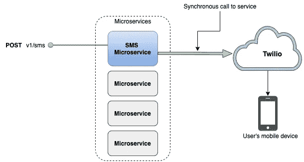
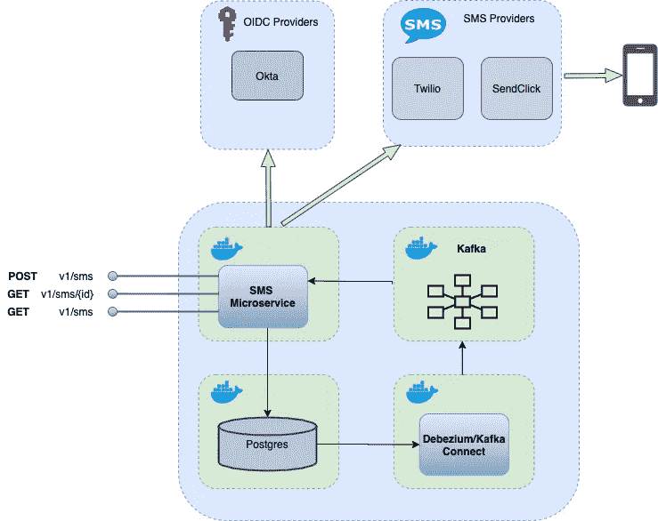
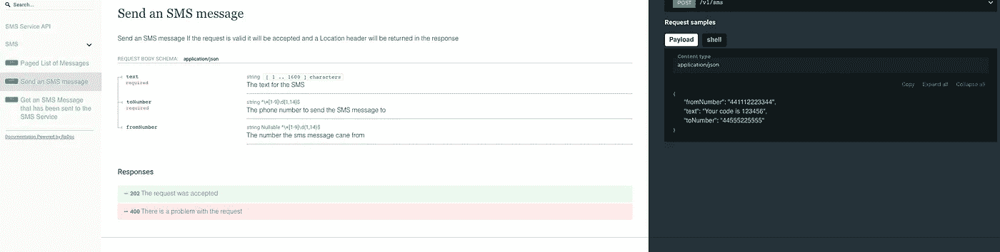
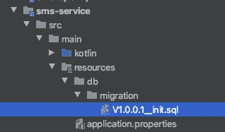

# 使用 Quarkus、Kotlin 和 Debezium 从头开始构建微服务

> 原文：<https://levelup.gitconnected.com/building-a-microservice-from-the-ground-up-with-quarkus-kotlin-and-debezium-83ae5c8a8bbc>


照片由[斯文·里德](https://unsplash.com/@starburst1977?utm_source=unsplash&utm_medium=referral&utm_content=creditCopyText)在 [Unsplash](https://unsplash.com/s/photos/network?utm_source=unsplash&utm_medium=referral&utm_content=creditCopyText)

T 这是一个关于从零开始创建微服务的多部分系列。这将是一个生产质量的应用程序，将突出以下技术的使用:

*   夸库斯
*   GraalVM
*   科特林
*   Postgres(持久性)
*   派头(JPA)
*   数据库迁移
*   卡夫卡(信息)
*   Debezium，Kafka Connect(事务发件箱模式)
*   奥克塔(OIDC)
*   开放 API
*   码头工人
*   测试容器
*   Wiremock

该应用程序将分阶段构建，每个阶段都会添加额外的功能。每个版本都是可部署的和经过全面测试的，但是服务直到最后阶段才会投入生产。

## 为什么是夸库斯？

我已经使用 spring boot 很多年了，它是一个很棒的框架。在过去的几年里，更多的框架已经开始在同一个领域竞争，比如 [Micronaut](https://micronaut.io/) 和 [Quarkus](https://quarkus.io/) 和 [Helidon](https://helidon.io/docs/latest/#/about/01_overview) 。尤其是 Quarkus，看起来非常适合微服务架构，它承诺“超音速”启动时间和“亚原子”内存使用。此外，它与 GraalVM 和 Kotlin 配合得很好。这个用例将是一个测试使用 Quarkus 构建应用程序的机会。为了有用，它需要包含 REST 服务、持久性、消息传递、安全性、配置和其他有用的通用特性。

## 为什么是科特林？

如今，成为一名通晓多种语言的程序员是明智之举，而且有越来越多优秀且成熟的 Java 替代品。其中最流行的是 Kotlin，Quarkus 为该语言提供了一流的支持。

## 为什么是 Debezium？

当数据在微服务中持久化时，该服务和其他微服务中的消费者对持久化的数据变化感兴趣。变更数据捕获(CDC)是一种监控和捕获这些变更的方法。Debezium 提供的服务可以捕获数据变化，并将它们作为事件发出。与替代轮询方法相比，CDC 避免了频繁轮询所增加的 CPU 负载，并且可以可靠地维护事件的顺序。

# 使用案例

ost 平台需要通过短信与用户交流。这可能是为了通知他们某些操作或事件，或者在用作双因素登录或升级安全的一部分时，经常发送一次性密码(OTP)。短信服务是微服务的绝佳候选，因为它只需要做一件事:发送短信。

最简单的方法是 SMS 微服务只代理选择的 SMS 提供商。该服务:

*   接收发送 SMS 消息的请求
*   将其转换为所选 SMS 提供商所需的格式
*   发送 REST 请求
*   将转换后的响应传递回调用者



图表 1。作为第三方提供商代理的 Sms 服务

这种方法没有太大的灵活性。服务的调用者必须等待来自第三方提供者的同步回复。如果存在网络故障，那么呼叫者必须再次发送消息或者继续重试。资源池耗尽导致级联故障的风险很高。最好是将调用解耦，并给服务的调用者一种检查状态的方法。

为此，我们必须将持久性引入服务和消息传递，以保证交付。我们给流程增加了一些延迟，但增加了灵活性，使系统更有用。这让我们有机会在构建服务的同时尝试一些有趣的技术。

最终的架构将如下所示:



图 2:最终架构

对于这样一个简单的服务来说，这可能看起来很重要，但它允许我们练习在微服务平台的其他部分有用的模式。

我们将分几个阶段进行构建:

*   第 1 部分编写 REST 端点并添加持久性
*   第 2 部分通过添加 Kafka 和 Debezium 实现事务发件箱模式
*   第 3 部分添加 SMS 提供者和路由逻辑
*   第 4 部分使用 OAuth 保护端点
*   第 5 部分使用 GraalVM 构建和部署本机映像

## 第一阶段。编写 REST 端点

你可以把[代码](https://github.com/iainporter/sms-service)拉出来，我来浏览一下有趣和重要的部分。

```
git clone [git@github.com](mailto:git@github.com):iainporter/sms-service.git
git checkout part_one
```

这是一个多模块 maven 项目，包含以下模块:

```
<modules>
    <module>sms-openapi</module>
    <module>sms-service</module>
    <module>component-test</module>
</modules>
```

## OpenApi

遵循 [API 优先](https://swagger.io/resources/articles/adopting-an-api-first-approach/)的方法，sms-openapi 模块定义了服务的 API。OpenAPI 允许我们描述 API 并发布它，以便其他人可以使用它。在本模块中，我们将定义微服务将发布的所有端点。

定义了三个端点:

*   **/v1/短信发布**【用于发送短信请求】
*   **/v1/sms/{messageId} GET** 【获取详细信息，包括消息的状态】
*   **/v1/sms GET** 【用于消息列表的查询和分页】

添加/v1/sms GET 可能不是完全必要的，但它给了我们尝试 Panache 分页功能的机会。

下面是/v1/sms POST 的定义

请求体被定义为

模块中有一些实用程序，用于根据规范生成 html API 文档。如果要生成文档，则必须安装节点和 NPM。执行以下操作:

```
cd sms-openapi
mvn package
npx redoc-cli bundle  ./target/classes/openapi/sms-openapi.yaml -t ./custom-template.hbs -o sms-openapi.html
```

然后，您可以查看生成的 API 文档，它看起来类似于:



图 3 OpenAPI

一旦构建了这个模块，那么生成的 POJOs 就被打包到一个 jar 中，并且可以被 sms 服务模块引用

## 资源类

需要注意的事项:

第 11–18 行创建新 SMS 消息的 POST 调用 SmsService，后者保存请求，然后添加一个位置头以允许调用者检索消息细节。注意生成的 POJO 类 SendSmsRequest 的使用。
第 22–23 行检索邮件列表最有用的查询参数是号码和状态

## SMS 服务类

持久层使用 [Panache](https://quarkus.io/guides/hibernate-orm-panache-kotlin) ，它是 Hibernate ORM 之上的一层。任何习惯使用 Spring 数据的人在习惯使用 Panache 时都不会有问题。下面是存储库类:

```
@ApplicationScoped
class MessageRepository : PanacheRepositoryBase<SmsMessage, UUID>
```

使用存储库模式时，所有预期的查找器方法都是可用的。第 45–48 行演示了分页功能。

## 候鸟迁徙所经的路径

数据库迁移由一个 [flyway](https://flywaydb.org/) 扩展处理，并遵循定义良好的命名约定



图 4 飞行路线迁移

## 组件测试

我们还没有构建足够的组件测试，但测试服务是否可以在 docker 容器中成功运行仍然是有用的，因为到目前为止它只依赖于一个真实的数据库，而不是 H2。

## 测试容器

我多么喜欢测试容器。它极大地简化了在 docker 容器中运行和测试栈的过程。目前我们只有两个容器，所以我们可以使用 docker-compose 文件来描述这些服务并启动它们

## docker-compose.yml

然后我们可以在组件测试的设置中引用这个文件

在第 5 行，我们获得了 testcontainers 公开的映射端口，并将其设置为 RestAssured 的基本 Url

下面是一个测试，证明我们可以发送消息并检索结果

## 运行服务

我们还可以使用 docker-compose 来启动我们需要的所有组件。
从父目录

```
mvn clean install
cd sms-service
docker-compose up
```

服务运行后，您可以向它发送消息

```
curl 'http://localhost:8080/v1/sms' -i -X POST  \
   -H 'Content-Type: application/json'  \
   -d '{"text":"Foo Bar!", "fromNumber": "+1234567890", "toNumber": "+1234567891"}'
```

您应该会收到带有位置的响应

```
HTTP/1.1 202 Accepted
Content-Length: 0
Location: [http://localhost:8080/v1/sms/bbb07300-4b30-45ed-97c5-a4c1b72f3fc2](http://localhost:8080/v1/sms/bbb07300-4b30-45ed-97c5-a4c1b72f3fc2)
```

您可以使用它来获取消息细节

```
curl '[http://localhost:8080/v1/sms/bbb07300-4b30-45ed-97c5-a4c1b72f3fc2](http://localhost:8080/v1/sms/bbb07300-4b30-45ed-97c5-a4c1b72f3fc2)' -i -X GET
```

期待类似以下内容的响应

```
HTTP/1.1 200 OK
Content-Length: 218
Content-Type: application/json{"createdAt":"2020-07-18T08:42:43.772795Z","fromNumber":"+1234567890","id":"bbb07300-4b30-45ed-97c5-a4c1b72f3fc2","status":"WAITING","text":"Foo Bar!","toNumber":"+1234567891","updatedAt":"2020-07-18T08:42:43.772808Z"}
```

第一部分完成了。虽然离生产就绪还有一段距离，但框架已经到位。我们现在可以在数据库中捕获消息，并对这些消息的状态给出一些反馈。作为奖励，我们可以查询邮件和页面的结果。在下一篇文章中，我们将介绍消息传递和事件处理，这样我们就可以处理被持久化的消息。

本文的代码库可以在[这里](https://github.com/iainporter/sms-service/tree/part_one)找到

该系列的其他部分包括:

*   [第二部分:使用 Kafka Connect 和 Debezium 实现 CDC](/implementing-the-transactional-outbox-pattern-with-debezium-in-quarkus-f2680306951)
*   [第三部分:连接到第三方 API 并用 Wiremock 进行测试](/building-a-resilient-microservice-with-quarkus-and-wiremock-de59b2a4fac7)
*   [第四部分:使用 OpenID Connect 保护服务](/securing-a-microservice-in-quarkus-with-openid-connect-505204d1c9a9)
*   [第五部分:使用 GraalVM 本机运行](https://medium.com/@changeant/running-a-microservice-in-quarkus-on-graalvm-52d6b42a5840)
*   [第六部分:用 Jib 封装你的微服务](https://medium.com/@changeant/containerizing-your-microservice-in-quarkus-with-jib-fae0f62bd57e)
*   [第七部分:使用 CircleCI 为微服务构建 CI 管道](/building-a-ci-pipeline-for-a-microservice-in-quarkus-with-circleci-11e9b679423f)