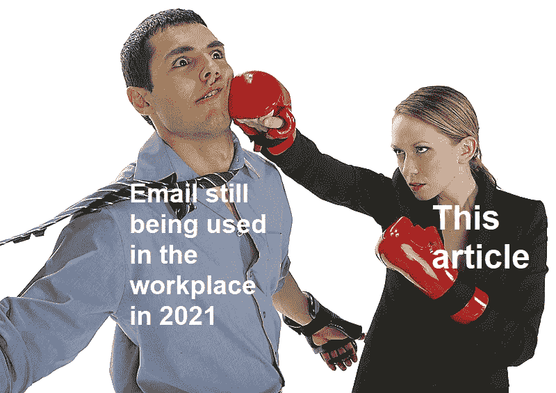
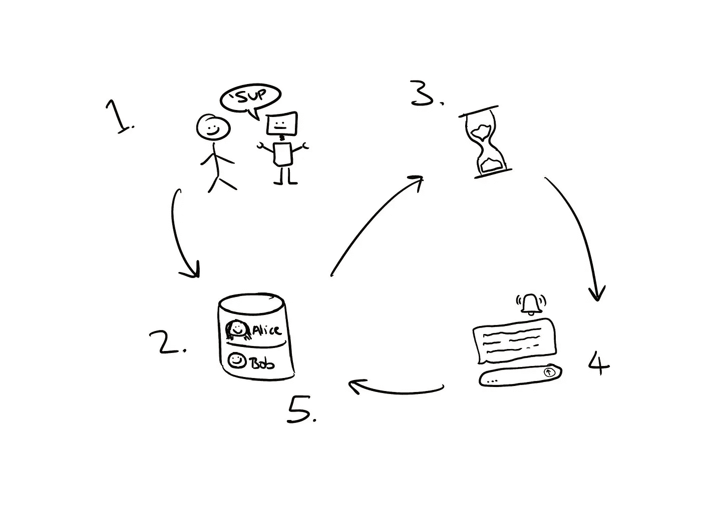
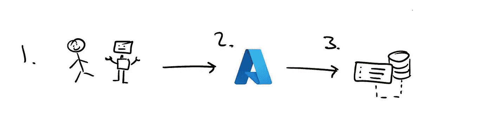
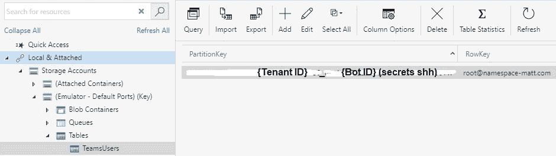
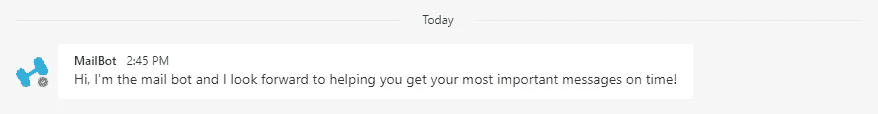
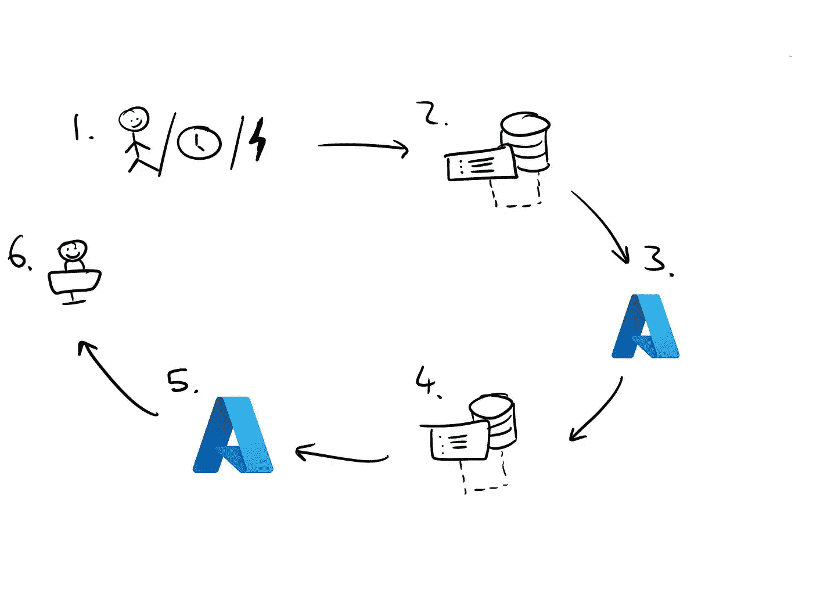
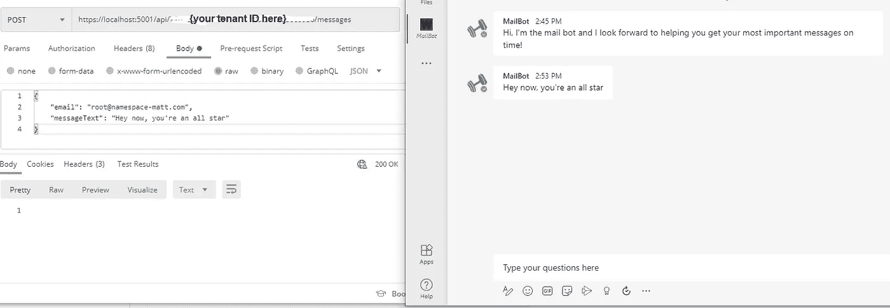

# 构建微软团队机器人很容易

> 原文：<https://levelup.gitconnected.com/building-a-microsoft-teams-bot-is-easy-8e39a344c253>

*再也看不到电子邮件*

到目前为止，我相信我们都知道电子邮件是一种糟糕的在线交流方式:信息很容易丢失，对话很难整理成线索，客户端软件很容易阻止内容/附件，破坏了你美丽信息的外观。随着最近微软团队的使用和宣布[团队将自动安装 Windows 11](https://techcrunch.com/2021/06/24/microsoft-teams-will-be-built-directly-into-windows-11/) 的所有副本，很多人希望开始以这种方式发送他们所有的消息是有道理的。你自己写的信息可以很容易地转移到团队中，但是大部分的电子邮件——自动发送的邮件呢？“但是怎么会呢？!"我听到你在问——请继续阅读，寻找答案！

# 快速事实(对于像我这样没有耐心的开发人员)

*   **我们在本文中构建的是:**一种直接向 MS Teams 用户发送消息的方式——基本上是电子邮件客户端的 Teams 版本。
*   **技术栈:** C#/.NET5(但是可以用微软的 botbuilder 库支持的任何语言来完成)& Azure TableStorage(可以随意用你喜欢的任何数据库来替换它)
*   **代码示例:** [MailBot](https://github.com/pyramid-scheme-ceo/MailBot)

# “积极主动”？

你可以为微软团队开发两种类型的机器人:“对话型”和“主动型”。它们之间没有任何正式的区别(即它们不是使用不同的工具或库构建的)，但是它们被编程为以不同的方式运行。对话机器人位于聊天的一端，并对用户的消息做出响应，而主动机器人能够在没有提示的情况下向用户发送消息。主动机器人的一个主要用例是在发送系统生成的通知时使用团队来代替电子邮件/短信。

# 它是如何工作的

对我们来说不幸的是，发送团队消息并不像“这是用户的电子邮件地址，给他们发个消息”那么简单。实际上，它遵循如下所示的有状态过程:

使用这种循环，我们能够不断地向 MS 团队中的用户发送主动消息

1.  用户和我们的机器人第一次“见面”(例如，用户安装了我们的应用程序)。
2.  我们会立即存储用户的详细信息，以便以后向他们发送信息——就像记下一个电话号码一样。
3.  我们一直等到有理由给用户发送消息…
4.  我们的机器人使用 MS Graph 创建与用户的对话并发送消息。
5.  创建对话后，我们会更新数据库中的用户信息，以便我们可以在将来的消息中重用该对话。

从这里，我们返回并永远重复步骤 3-5。简单。😁

# 公平的警告

MS Teams 离完美的产品还很远。我是从最终用户的角度来说的，更不用说从像你我这样试图为它构建应用程序的开发者的角度了。我现在已经在两家不同的公司建立了主动机器人，根据我的经验，我发现库不完整，MS Graph 权限远远不够细粒度，团队强迫你持有一些自己的数据(显然微软没有足够的自己的数据库空间？)，认证很难集成，如果你想让你的机器人上应用商店，验证是一个绝对的噩梦。

听起来很棒，对吧？我们走吧！

# 让乐趣开始:设置开发环境

我开始把这一部分写进文章里，只是意识到它应该有自己的一篇文章。所以这就是我开始做的事情——只是意识到这些说明仍然太复杂，无法在另一篇博客文章中写下来。我最终决定记录我自己一步步建立一个基本团队机器人的过程，你可以在下面看到(如果你喜欢，在视频的描述中也有一个书面的清单):

# 会见用户

回到我们最初的任务…我们发现自己处于的第一个状态是我们(作为机器人)*第一次遇见*一个用户。

简而言之，你不能向没有安装你的应用的人发送消息。这是微软非常有意的举动，以确保机器人不能轻易向他们的用户发送垃圾邮件。对我们来说，幸运的是，微软已经实现了一个相当宽松的“会见”用户的定义。我发现实践中发生这种情况的两种主要方式是用户:

*   安装你的机器人
*   被添加到安装了您的机器人的频道中(或者被安装到用户已经是其成员的频道中的机器人)

这里是主动机器人系统最重要的一点:**当我们的机器人第一次遇到用户时，我们必须捕获并存储他们的用户 ID** 。

顺便说一下，这不是普通的旧用户 ID。这个变量被简单地称为`user.id`，这个 ID 对于你的机器人和那个用户是唯一的。这样，它更像是一个机器人用户 ID，如果你想给那个特定的用户发送消息，你*需要*它。

出于某种神秘/未知的原因，微软决定他们不会把这个非常重要的 ID 存储在任何我们以后可以再次访问的地方。每次用户与你的机器人交互时，你都会收到它，但实际上这并不经常发生。人们不会在一天内多次添加或删除自己或你的机器人，如果你的机器人的主要目的是发送通知，用户也没有真正的理由发送消息。所以在大多数情况下，我们第一次见到用户时保存这个 ID 是非常重要的。这一过程如下图所示:

如何交朋友

1.  一个用户遇到了我们的机器人——也许他们被添加到一个已经安装了我们的机器人的频道中，或者他们就是安装它的人。
2.  一个事件通知被发送到 Azure，它触发一个 webhook 将事件转发到我们的 web 应用程序。
3.  我们从事件中提取 userId，并将其保存在我们自己的数据库中供以后使用。

下面的要点显示了我为完成这三个步骤而添加到我们的 bot 中的函数。你可以通读一下`TeamsInfoShim`和`TeamsUserService`的抽象，但是如果你好奇的话，你可以在完整的库[这里](https://github.com/pyramid-scheme-ceo/MailBot/blob/master/MailBot.Domain/BusinessLayer/TeamsInfoShim.cs)和[这里](https://github.com/pyramid-scheme-ceo/MailBot/blob/master/MailBot.Domain/BusinessLayer/Services/TeamsUserService.cs)找到这些类。

我们可以通过安装我们的 bot(个人安装或安装到一个渠道)来测试此功能，并确保渠道/对话的所有成员都添加到我们的数据库中。下面你可以看到我自己安装了这个机器人的结果:

1.我已经被添加为数据库中 TeamsUsers 表的用户。

2.该机器人向我发送一条消息，表明它已成功安装。

# 发送第一条消息

要发送消息，我们需要创建一个*对话*，这需要四个独立的东西(再次感谢微软让这变得简单):

1.  机器人用户标识
2.  用户的服务 URL
3.  用户所属的 Azure 租户的 ID
4.  机器人的应用程序注册 ID

幸运的是，在上一步中，我们在数据库中存储了第 1–3 项，所以只需再次获取数据以使用它。第 4 项只是我们配置文件中的`MicrosoftAppId`。

现在我们已经获得了所有需要的信息，向用户发送第一条消息的过程如下所示:

1.  我们的应用程序接收发送消息的原因，例如，用户做了某事或发生了定时事件。不管我们是如何到达这里的，这个事件都需要向我们提供两件事情:我们想要向其发送消息的用户的电子邮件地址和 Azure 租户的 ID，以便在其中发送消息。
2.  我们的应用程序通过搜索具有匹配的电子邮件地址和 Azure 租户的记录来获取所需的详细信息(bot-user-ID 和服务 URL)。
3.  然后，我们联系 MS Graph，与该用户展开对话。
4.  Graph 创建了一个与目标用户的对话，并返回一个`conversationId`,我们将它存储起来供以后的消息使用。
5.  我们将消息和对话 ID 一起发送回 Graph。
6.  我们的用户很高兴在他们的 MS 团队聊天中收到消息🎉

这个步骤的完整逻辑包含在[对话服务](https://github.com/pyramid-scheme-ceo/MailBot/blob/master/MailBot.Domain/BusinessLayer/Services/ConversationService.cs)中，但是重要的部分(创建对话)也包含在下面的要点中:

你会注意到在完整的存储库中，我添加了[一个控制器](https://github.com/pyramid-scheme-ceo/MailBot/blob/master/MailBot.API/Controllers/TenantMessagesController.cs)，它调用`ConversationService`，这就是我测试这部分流程工作的方式。在确保您的应用程序安装到与您的用户的对话中后，只需打开 [Postman](https://www.postman.com/) (或任何其他 HTTP 开发工具)，向应用程序发送 POST 请求，并观看神奇的事情发生。

请求 URL 和有效负载(左)以及以团队形式发送给我的消息(右)。

# 发送更多消息

令人惊讶的是，从这里开始，一切相对顺利。发送更多消息的过程与上面的简单相同，但是没有步骤 3 和 4:

1.  我们的应用程序收到一个发送消息的理由(同样，带有用户的电子邮件和租户 ID)。
2.  我们的应用程序获取该用户的对话 ID。
3.  我们将消息文本和对话 ID 一起发送给 Graph。
4.  用户惊讶地收到了来自我们的另一条消息！

我只是在示例存储库中使用了控制器端点，但是您能想到的任何调用`ConversationService`的方法都可以😀

# 后续步骤

恭喜你，你再也不用看电子邮件了*！从这里，您可以部署您的。NET 应用程序到你平常使用的任何地方(Azure、AWS、VM 等)。)只要你的机器人在 Azure 中的配置指向正确的 URL，一切都应该正常工作。

如果您想进入下一个级别，您可以遵循验证流程，并将您的应用程序添加到 MS Teams 应用程序商店。不幸的是，退一步说，我在这个过程中的所有经历都相当艰难，但是如果你有一个很好的理由在 app store 上获得它，希望事情会进展顺利。

祝你好运，随时留下你的任何问题/评论！😊

*没有承诺