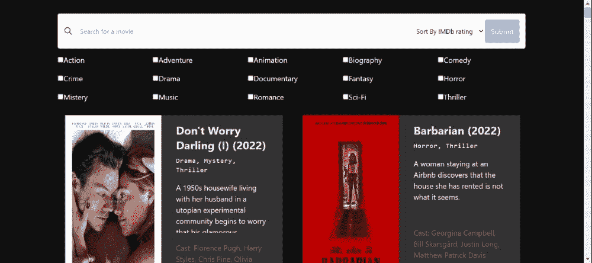
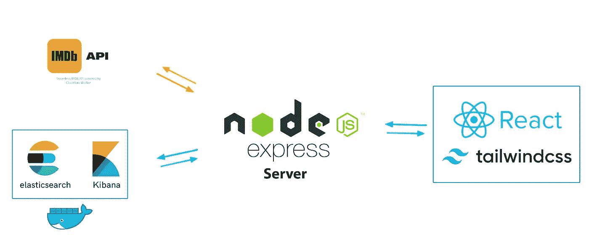

# 使用 Elasticsearch、Nodejs、Reactjs 和 IMDb API 构建电影搜索应用程序:[第 1 部分]设置环境

> 原文：<https://levelup.gitconnected.com/building-a-movies-search-app-using-elasticsearch-nodejs-reactjs-and-imdb-api-part-1-setup-the-b2536cbc3bbc>


由[劳塔罗·安德烈亚尼](https://unsplash.com/@lautaroandreani?utm_source=unsplash&utm_medium=referral&utm_content=creditCopyText)在 [Unsplash](https://unsplash.com/s/photos/full-stack?utm_source=unsplash&utm_medium=referral&utm_content=creditCopyText) 上拍摄

很高兴再次见到你，因为我们发现了弹性堆栈。今天，我们将应用我们在以前的文章中获得的知识来构建一个完整的电影搜索应用程序；电影取自 IMDb API。系好安全带，准备起飞🛫.

下面是我们想要构建的应用程序:



我们选择了以下架构:



我们将首先使用 Docker 容器对 Elasticsearch 和 Kibana 进行安全部署，由于 Elasticsearch 客户端，Docker 容器将与 Nodejs 服务器进行通信。服务器将负责从我们的 API 中检索电影，并在 Elasticsearch 上对它们进行索引。对于前端，我们有一个用 React.js 和 Tailwindcss 构建的应用程序，客户端将能够输入他的请求并查看结果。

## 设置环境

在开始开发任何东西之前，我们应该首先配置环境。为此，你需要**码头工人**。

在一个空目录中，创建一个`.env`文件和一个`docker-compose.yml`文件。这些文件将用于创建我们的容器(Elasticsearch 和 Kibana)。

在`.env`文件中，创建以下环境变量，用您的键替换 ***TYPE_HERE*** 。您可以自己选择部署端口、密码以及想要使用的堆栈版本。对于本教程，我们使用 8.4.0 版和默认端口。

```
# Version of Elastic products
STACK_VERSION=8.4.0 # Port to expose Elasticsearch HTTP API to the host
ES_PORT=9200 # Port to expose Kibana to the host
KIBANA_PORT=5601 # Password for the 'elastic' client
ELASTIC_PASSWORD=TYPE_HERE # Password for the 'kibana_system' user
KIBANA_PASSWORD=TYPE_HERE # Set the license
LICENSE=trial
```

配置完环境变量后，打开`docker-compose.yml`文件进行一些配置。我们想要一个 Elasticsearch 和 Kibana 的安全部署，所以配置如下所示。

如果你想了解更多关于这个主题的信息，我邀请你查看我写的关于这个主题的文章，或者看看官方文件。现在配置看起来不错，只需运行以下命令来创建容器:

```
docker-compose up -d
```

这可能需要一些时间，取决于您的互联网连接，因为它将从 Docker Hub 中提取 Elasticsearch 和 Kibana 图像。一旦启动了容器，您应该能够通过打开 [http://localhost:5601](http://localhost:5601) 来访问 Kibana。以 ***弹性*** 用户身份登录，填写*中的密码。env* 文件( *ELASTIC_PASSWORD* )。

既然我们的容器已经发布，我们将不得不考虑 Elasticsearch 和 Nodejs 服务器之间的安全通信。为此，我们必须复制创建容器时启动的安装服务生成的证书。

因此创建一个名为 **backend** 的文件夹，复制其路径并运行以下命令:

```
docker cp es01:/usr/share/elasticsearch/config/certs/ca/ca.crt TYPE_THE_PATH_YOU_COPIED_HERE/certs/
```

一旦执行，该命令将在我们的后端文件夹中创建一个 **certs** 文件夹，并将 **ca.crt** 文件放在那里，我们将在稍后连接 Nodejs 时使用该文件。

以上是第一部分的全部内容，我们现在可以继续为我们的应用程序编写代码了。您可以通过以下链接访问包含该应用程序的 GitHub repo:

[](https://github.com/AbdoulBaguiM/movies-search) [## GitHub-AbdoulBaguiM/movies-search:用 Reactjs、Nodejs 和…

### 这是一个电影搜索应用程序，它将 IMDB API 中的数据索引到使用…

github.com](https://github.com/AbdoulBaguiM/movies-search) 

感谢您的阅读，如果您对本文有任何问题或评论，请在下面留下您的评论。

设置后端的下一部分即将到来，敬请关注🚀。

阿卜杜尔-巴吉