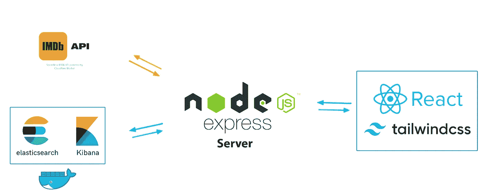

# 使用 Elasticsearch、Nodejs、Reactjs 和 IMDb API 构建电影搜索应用程序:[第 2 部分]启动节点服务器并规划数据存储

> 原文：<https://levelup.gitconnected.com/building-a-movies-search-app-using-elasticsearch-nodejs-reactjs-and-imdb-api-part-2-initiating-394796e4ecbc>


照片由[劳塔罗·安德烈亚尼](https://unsplash.com/@lautaroandreani?utm_source=unsplash&utm_medium=referral&utm_content=creditCopyText)在 [Unsplash](https://unsplash.com/s/photos/full-stack?utm_source=unsplash&utm_medium=referral&utm_content=creditCopyText) 上拍摄

欢迎回到本系列的剩余部分，使用 Nodejs 服务器、Reactjs 客户端和 Elasticsearch 从 IMDb API 制作一个完整的电影搜索应用程序。我们今天继续我们的后端配置的冒险。

在上一篇文章中，我们使用 Docker 容器设置了一个安全的 Elasticsearch 和 Kibana 部署，并将`ca.crt`文件复制到了`backend > certs`文件夹中。回想一下，我们的应用程序的架构如下:



## 设置 Node.js 服务器

在这个文件夹(后端)中打开一个终端，运行下面的命令来初始化 Nodejs 项目。填写您认为合适的字段。

```
npm init
```

接下来，运行下面的命令来安装我们需要的依赖项。

```
yarn add @elastic/elasticsearch axios cors dotenv express
```

我们还将添加 **nodemon** 作为开发依赖项:

```
yarn add nodemon -D
```

现在已经安装了依赖项，在项目的根目录(后端文件夹)创建一个`src`文件夹，并在那里创建`index.js`文件。现在编辑`package.json`中的“**main”**字段和“ **scripts** ”部分，如下所示:

```
{
...
  "main": "index.js",  
  "scripts": {    
    "start": "node src/index.js",    
    "dev": "nodemon src/index.js",
  }
...
}
```

在继续之前，现在服务器已经差不多启动了，我们应该看看我们的 API。

## 数据存储计划

点击[此链接](https://imdb-api.com/Identity/Account/Register)后创建账户。一旦您的帐户被激活，您将拥有一个 **API_KEY** 供您使用。在文档中，您可以查询不同的 URL 来检索电影、电视节目、调整图像大小……我们在这里感兴趣的是*in thiaters*URL，因为它允许我们检索一组电影，其中包含一些信息，如演员阵容、官方海报以及 IMDb 评分。文档的结构如下所示:

```
{
  "id":"tt10731256",
  "title":"Don't Worry Darling (I) (2022)",
  "fullTitle":"Don't Worry Darling (I) (2022)",
  "year":"I) (",
  "releaseState":"23 Sep 2022",
  "image":"https://m.media-amazon.com/images/M/MV5BMzFkMWUzM2ItZWFjMi00NDY0LTk2MDMtZDhkMDE2MjRlYmZlXkEyXkFqcGdeQXVyNTAzNzgwNTg@._V1_UX128_CR0,12,128,176_AL_.jpg",
  "runtimeMins":"123",
  "runtimeStr":"123 mins",
  "plot":"A 1950s housewife living with her husband in a utopian experimental community begins to worry that his glamorous company could be hiding disturbing secrets.",
  "contentRating":"R",
  "imDbRating":"6.3",
  "imDbRatingCount":"15059",
  "metacriticRating":"48",
  "genres":"Drama, Mystery, Thriller",
  "genreList":[
    {"key":"Drama","value":"Drama"},
    {"key":"Mystery","value":"Mystery"},
    {"key":"Thriller","value":"Thriller"}
  ],
  "directors":"Olivia Wilde",
  "directorList":[
    {"id":"nm1312575","name":"Olivia Wilde"}
  ],
  "stars":"Florence Pugh, Harry Styles, Chris Pine, Olivia Wilde",
  "starList":[
    {"id":"nm6073955","name":"Florence Pugh"},
    {"id":"nm4089170","name":"Harry Styles"},
    {"id":"nm1517976","name":"Chris Pine"},
    {"id":"nm1312575","name":"Olivia Wilde"}
  ]
}
```

在检索和索引数据之前，最好先了解文档的结构，以便更好地处理它们。您将会理解，对于我们的应用程序，我们不需要所有这些字段。
我们将首先定义一个接收管道，以便只保留必要的字段，并以满足我们需求的方式转换数据。

## 配置我们的摄取管道

确保 Elasticsearch 和 Kibana 正在运行，转到`DevTools > Console`部分，运行下面的命令来创建名为 **movies_pipeline** 的管道，我们将在保存数据之前应用该管道。

```
PUT _ingest/pipeline/movies_pipeline
{
  "processors": [
        {
            "remove": {
                "field": [
                    "id",
                    "title",
                    "year",
                    "releaseState",
                    "metacriticRating",
                    "genreList",
                    "directorList",
                    "starList",
                    "runtimeStr"
                ],
                "ignore_missing": true
            }
        },
        {
            "rename": {
                "field": "fullTitle",
                "target_field": "title"
            }
        },
        {
            "split": {
                "field": "genres",
                "separator": ",",
                "ignore_missing": true
            }
        }
    ]
}
```

你当然可以根据自己的需求定制这个管道。此外，您还可以通过转到页面`Stack Management > Ingest Pipeline`使用图形界面来创建管道。

## 生成索引的映射

此外，为了让 Elasticsearch 在数据搜索方面有更好的表现，明智的做法是为我们自己定义未来**电影**索引的模式。为此，仍然在控制台选项卡中，运行以下命令:

```
PUT movies
{
    "mappings": {
    "properties": {
        "contentRating": {
            "type": "text",
            "fields": {
                "keyword": {
                    "type": "keyword",
                    "ignore_above": 256
                }
            }
        },
        "directors": {
            "type": "text",
            "fields": {
                "keyword": {
                    "type": "keyword",
                    "ignore_above": 256
                }
            }
        },
        "genres": {
            "type": "keyword"
        },
        "imDbRating": {
            "type": "float"
        },
        "imDbRatingCount": {
            "type": "integer"
        },
        "image": {
            "type": "text",
            "fields": {
                "keyword": {
                    "type": "keyword"
                }
            }
        },
        "plot": {
            "type": "text"
        },
        "runtimeMins": {
            "type": "integer"
        },
        "stars": {
            "type": "text",
                "fields": {
                    "keyword": {
                        "type": "keyword"
                    }
            }
        },
        "title": {
            "type": "text",
            "fields": {
                "keyword": {
                    "type": "keyword",
                    "ignore_above": 256
                }
            }
        }
    }
}
```

您会注意到我们决定为应用程序保留的所有字段及其类型。

这部分到此为止。您可以通过以下链接访问包含该应用程序的 GitHub repo:

[](https://github.com/AbdoulBaguiM/movies-search) [## GitHub-AbdoulBaguiM/movies-search:用 Reactjs、Nodejs 和…

### 这是一个电影搜索应用程序，它将 IMDB API 中的数据索引到使用…

github.com](https://github.com/AbdoulBaguiM/movies-search) 

感谢您的阅读，如果您对本文有任何问题或评论，请在下面留下您的评论。

完成我们后端配置的下一部分即将到来，敬请关注🚀。

阿卜杜尔-巴吉