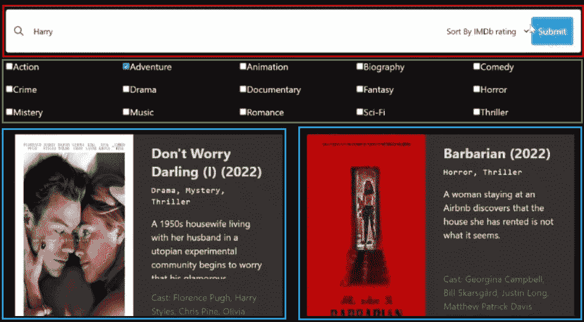

# 使用 Elasticsearch、Nodejs、Reactjs 和 IMDb API 构建电影搜索应用:[第 4 部分]使用 Reactjs 和 Tailwindcss 构建应用前端

> 原文：<https://levelup.gitconnected.com/building-a-movies-search-app-using-elasticsearch-nodejs-reactjs-and-imdb-api-part-4-building-ed9dc4b1adec>

很高兴在本系列的剩余部分再次见到您。如果您还没有阅读前面的文章，我邀请您查看它们，以了解我们的应用程序进展如何。

到目前为止，我们已经配置了我们的环境，创建了索引和管道来存储和转换我们的数据，并配置了我们的后端来从 IMDb 获取电影并将它们存储在 Elasticsearch 上。今天，我们将重点讨论应用程序前端的开发。


让我们再次回忆一下我们的应用程序的架构。


## 创建 React 应用程序并设置 Tailwindcss

前端是用 React 和 Tailwindcss 构建的。在项目的根目录中，运行以下命令来初始化 react 应用程序。

```
npx create-react-app frontend
```

然后通过运行以下命令安装依赖项:

```
npm install axios
npm install -D tailwindcss postcss autoprefixer
```

此外，为了生成`tailwind.config.js`和`postcss.config.js`，运行以下命令:

```
npx tailwindcss init -p
```

通过在顺风配置文件中添加以下部分来配置模板路径:

```
...
  content: [     
    "./src/**/*.{js,jsx,ts,tsx}",   
  ]
...
```

最后，为了完成 Tailwindcss 的配置，将这些指令添加到您的`index.css`文件中:

```
@tailwind base; 
@tailwind components; 
@tailwind utilities;
```

为了让我们的客户端应用程序与后端通信，我们将配置一个代理。在`package.json`文件中，在脚本部分之后添加这一行:

```
"proxy": "[http://localhost:3001](http://localhost:3001/)",
```

## 检索数据的电影服务

我们将首先配置我们的服务，这些服务将通过查询服务器来检索数据。因此，在`src`文件夹中，创建一个`services`文件夹，您将在其中放置以下`movies.js`文件:

```
import axios from 'axios'const getAll = () => {
  const request = axios.get('/all')
  return request.then((response) => response.data)
}const search = (title, order, genres) => {
  const params = {
    title,
    order,
    genres,
  }const request = axios.get('/api/movies', { params })
  return request.then((response) => response.data)
}export default { getAll, search }
```

这里没有什么非常复杂的，我们使用 axios 来使用我们在以前的文章中配置的 API。

## 让我们编写组件代码

我们的应用程序细分如下:



我们有三个组件。第一个是**搜索栏**，第二个叫做**复选框**是包含电影类型复选框的部分，最后一个组件是 **MovieCard** ，包含一部电影的所有信息。让我们从搜索栏开始。创建一个名为`components`的新文件夹，并将下面的`SearchBar.js`放在那里。

```
import React from 'react'const SearchBar = ({
  searchQuery,
  setSearchQuery,
  sortBy,
  setSortBy,
  handleSearch,
}) => {
  return (
    <div className="box-wrapper">
      <div className=" bg-white rounded flex items-center w-full p-3 shadow-sm border border-gray-200">
        <button className="outline-none focus:outline-none">
          <svg
            className=" w-5 text-gray-600 h-5 cursor-pointer"
            fill="none"
            strokeLinecap="round"
            strokeLinejoin="round"
            strokeWidth="2"
            stroke="currentColor"
            viewBox="0 0 24 24"
          >
            <path d="M21 21l-6-6m2-5a7 7 0 11-14 0 7 7 0 0114 0z"></path>
          </svg>
        </button>
        <input
          type="search"
          name="searchQuery"
          placeholder="Search for a movie"
          value={searchQuery}
          onChange={(e) => setSearchQuery(e.target.value)}
          className="w-full pl-4 text-sm outline-none focus:outline-none bg-transparent"
        />
        <div className="select">
          <select
            name="sortbBy"
            className="text-sm outline-none p-2 focus:outline-none bg-transparent"
            value={sortBy}
            onChange={(e) => setSortBy(e.target.value)}
          >
            <option value={''}>Sort By IMDb rating</option>
            <option value="asc">Ascendant</option>
            <option value="desc">Descendant</option>
          </select>
        </div>
        <button
          className="h-[50px] p-3 bg-blue-400 text-white rounded"
          onClick={handleSearch}
        >
          Submit
        </button>
      </div>
    </div>
  )
}export default SearchBar
```

我们在这个组件中作为道具传递要输入的值以及修改它们的函数，我们稍后将在`App.js`文件中编写这些内容。让我们进入下一个部分。

同样的步骤，在 components 文件夹中，创建一个名为`CheckBoxes.js`的文件，并将以下代码放入其中:

```
import React from 'react'
import { useState } from 'react'
import { categories } from '../utils/categories'const CheckBoxes = ({ setCheckedCategories }) => {
  const [checkedState, setCheckedState] = useState(
    new Array(categories.length).fill(false)
  )const handleOnChange = (position) => {
    const updatedCheckedState = checkedState.map((item, index) =>
      index === position ? !item : item
    )setCheckedState(updatedCheckedState)const checked = []updatedCheckedState.map((currentVal, index) => {
      if (currentVal) {
        return checked.push(categories[index])
      }
      return null
    })setCheckedCategories(checked)
  }return (
    <ul className="grid grid-cols-auto-fill gap-4 my-3 text-white">
      {categories.map((category, index) => {
        return (
          <li key={index}>
            <div className="toppings-list-item">
              <div className="left-section">
                <input
                  type="checkbox"
                  id={`custom-checkbox-${index}`}
                  name={category}
                  value={category}
                  checked={checkedState[index]}
                  onChange={() => handleOnChange(index)}
                />
                <label htmlFor={`custom-checkbox-${index}`}>{category}</label>
              </div>
            </div>
          </li>
        )
      })}
    </ul>
  )
}export default CheckBoxes
```

在这里，我们使用 props 中传递的`setCheckedCategories`函数，以便始终保持为搜索选择的类别。另外，类别是从`categories.js`文件导入的，你可以在这里找到。

对于最后一个组件，在组件文件夹中创建一个名为`MovieCard.js`的文件。看起来是这样的:

```
import React from 'react'const MovieCard = ({ movie }) => {
  movie = movie._source
  return (
    <div className="w-1/2 md:w-1/2 lg:w-[470px] max-w-4xl rounded  shadow-lg m-4 flex justify-between">
      <div className="md:flex-shrink-0">
        
      </div>
      <div className="flex flex-col flex-grow px-8 py-4 bg-color-333">
        <h3 className="font-bold text-4xl md:text-2xl lg:text-2xl text-gray-200 movie--title">
          {movie.title}
        </h3>
        <span className="movie--genres my-2 text-xl lg:text-sm lg:mb-4">
          {movie.genres.join(',')}
        </span>
        <div className="flex-grow">
          <p className="text-xl md:text-base lg:text-base text-gray-100 leading-snug truncate-overflow hover:overflow-y-scroll">
            {movie.plot}
          </p>
        </div>
        <div className="flex-grow">
          <p className="text-xl my-5 md:text-base lg:text-base text-gray-500 leading-snug">
            Cast: {movie.stars}
          </p>
        </div>
        <div className="button-container flex justify-between mb-2">
          <span className="text-lg mr-4 lg:text-sm font-bold text-orange-700">
            {movie.imDbRating}/10
          </span>
          <span className="text-lg mr-4 lg:text-sm font-bold text-green-500">
            {movie.runtimeMins} mins
          </span>
        </div>
      </div>
    </div>
  )
}export default MovieCard
```

对于在 prop 中传递的每部电影，我们的组件将负责组织其属性的显示，如标题、类型以及描述和持续时间。

## 完成应用程序

我们的三个组件已经完成，您可以转到`App.js`文件并修改代码，如下所示:

```
import React from 'react'
import { useState, useEffect } from 'react'
import CheckBoxes from './components/CheckBoxes'
import MovieCard from './components/MovieCard'
import SearchBar from './components/SearchBar'
import movieService from './services/movies'const App = () => {
  const [searchQuery, setSearchQuery] = useState('')
  const [sortBy, setSortBy] = useState()
  const [checkedCategories, setCheckedCategories] = useState([])
  const [movies, setMovies] = useState(null)useEffect(() => {
    movieService
      .getAll()
      .then((result) => setMovies(result))
      .catch((error) => console.error(error))
  }, [])const handleSearch = () => {
    if (!searchQuery) alert('Fill in the search query')
    else if (sortBy === '') setSortBy('asc')
    else if (checkedCategories.length === 0)
      alert('Select at least one category')
    else
      movieService
        .search(searchQuery, sortBy, checkedCategories)
        .then((results) => {
          setMovies(results)
        })
        .catch((error) => {
          console.error(error)
        })
  }return (
    <div className="max-w-[80%] my-0 mx-auto">
      <SearchBar
        searchQuery={searchQuery}
        sortBy={sortBy}
        setSortBy={setSortBy}
        setSearchQuery={setSearchQuery}
        handleSearch={handleSearch}
      />
      <CheckBoxes setCheckedCategories={setCheckedCategories} />
      <div className="grid grid-cols-1 lg:grid-cols-2 gap-4">
        {movies &&
          (movies.length === 0 ? (
            <span className="text-white text-2xl my-8">
              No result found, try with other parameters
            </span>
          ) : (
            movies.map((movie) => <MovieCard movie={movie} key={movie._id} />)
          ))}
      </div>
    </div>
  )
}export default App
```

我们在这里使用[**use effect**](https://reactjs.org/docs/hooks-effect.html)**钩子来检索第一页加载的所有电影，我们使用 map 循环来遍历所获得的数组，并为每个对象返回之前编写的 **MovieCard** 组件。如果我们的表格为空，则显示消息“*未找到结果，用其他参数*尝试”。**

**如果用户修改了所选择的流派、过滤选项或其中一个组件中的搜索词，则直接报告状态。一旦他点击提交按钮，就会执行`handleSearch`功能，并使用指定的参数调用`search`服务。**

**你也可以在这里找到`index.css`文件[的代码，但是你可以根据自己的需要随意设计应用程序的样式。一切就绪后，通过运行以下命令启动应用程序:](https://github.com/AbdoulBaguiM/movies-search/blob/master/frontend/src/index.css)**

```
yarn start
```

**该应用程序将可在: [http://localhost:3000](http://localhost:3000/) 获得。**

****

**好了😭。您可以通过以下链接访问包含应用程序代码的 GitHub repo:**

**[](https://github.com/AbdoulBaguiM/movies-search) [## GitHub-AbdoulBaguiM/movies-search:用 Reactjs、Nodejs 和…

### 这是一个电影搜索应用程序，它将 IMDB API 中的数据索引到使用…

github.com](https://github.com/AbdoulBaguiM/movies-search) 

感谢您的阅读，如果您对本文有任何问题或评论，请在下面留下您的评论📥。

这是一个伟大的冒险，谢谢你与我分享，我会很快看到你的其他文章，再见🚀。

阿卜杜尔-巴吉**