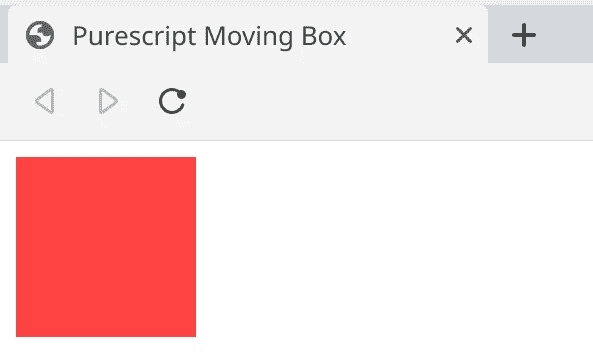

# 用 Purescript 构建一个移动的盒子——pure script 教程介绍

> 原文：<https://levelup.gitconnected.com/building-a-moving-box-with-purescript-ae1a490429ab>

## 通过使用用于 DOM 操作的普通 Purescript 技术构建一个简单的移动框，学习用于 web 开发的 Purescript 的基础知识。


# 介绍

对于那些想要深入函数式编程世界的人来说，Purescript 是一个非常有趣的选择。它让你把纯粹的功能乐趣带入网络世界，因为它可以编译成 Javascript。这很好，因为 web 编程已经为许多开发人员所熟悉，这使它成为函数式编程范例的一个很好的展示。

我开始研究 Purescript，因为我学习了一点 Haskell。我从中获得了乐趣，所以我想构建一些更实用的东西，而不是常见的书籍示例。问题是，如果我使用 Haskell，我必须学习一些 GUI 库来使项目图形化和有趣。

然后我想起了 Purescript，这种语言看起来很像 Haskell ( [not equal，虽然](https://github.com/purescript/documentation/blob/master/language/Differences-from-Haskell.md))并且允许我为我已经习惯的 web 环境构建应用程序。我决定我的玩具项目将只是一个围绕页面窗口移动的彩色盒子。

当我开始研究这门语言时，我注意到有一些著名的库可以处理 DOM。像 [Halogen](https://github.com/slamdata/purescript-halogen) 和 [purescript-react](https://github.com/purescript-contrib/purescript-react) 这样的库有望让处理 DOM 变得更简单，并提供更实用的体验。然而，我也想用这个项目来比较普通 Javascript 和普通 Purescript 的 DOM 操作，以了解“仅仅”改变语言会有什么不同。

这时我注意到没有太多的 Purescript 教程，尤其是如果你想在不使用这些库的情况下构建一些东西。如果你想通过只使用该语言的官方标准库(如 purescript-web-dom 或 purescript-web-html)来做一些事情，那么你可能只有 [Pursuit](https://pursuit.purescript.org/) 的 API 文档(这些文档并不总是真正描述性的)和 GitHub 上其他人的源代码作为参考(如果你找到的话)。这是做这个教程的主要动机。

本教程的代码基于[这个库](https://github.com/GCrispino/purescript-moving-box)。我对它做了一点修改，如果你愿意的话，我会分步骤(你可以通过它的分支)把它发布到这个[其他库](https://github.com/GCrispino/purescript-moving-box-tutorial)中。

# 开始项目

让我们开始弄脏我们的手。首先，我们将设置项目。为此，我们需要`purs`(pure script 编译器)、`pulp` (Purescript 的构建工具)和`bower`(是的，不是 npm 的包管理器)。要安装这些工具，请查看 Purescript 官方“入门”指南的[部分。](https://github.com/purescript/documentation/blob/master/guides/Getting-Started.md#installing-the-compiler)

首先，让我们创建一个目录，并使用`pulp`初始化它。我将把它命名为`box` 但是你可以随意命名:

```
$ mkdir box
$ cd box
$ pulp init
```

这将安装一些依赖项并设置`bower.json`文件。它还将通过在`src/Main.purs`上创建一个简单的 Hello World 文件和在`test/Main.purs`上创建一个测试文件来创建一个样板文件结构。我们不会在这里讨论自动化测试，所以你可以删除最后一个。

尽管这不是必需的，我们也将使用 npm 来定义一个构建脚本。所以跑吧:

```
$ npm init -y
```

然后在新创建的`package.json`文件中，创建一个`build`条目。`scripts`属性如下所示:

```
"scripts": {
  "test": "echo \"Error: no test specified\" && exit 1",
  "build": "pulp build -O --to dist/index.js"
},
```

完成这些之后，让我们安装将与 bower 一起使用的代码依赖项:

```
bower install --save purescript-web-dom purescript-web-html
```

当我们运行`pulp init`时，项目基本上只用 Purescript 的 Prelude 初始化，Prelude 是它的标准库(它定义了基本的操作符、函数和类型)。所以我们需要`purescript-web-dom`和`purescript-web-html`来处理 DOM 和操作 HTML 元素。

Purescript 编译器生成一个`.js`文件，所以在我们的例子中，我们需要一个 HTML 文件来在浏览器中加载我们的代码。在我们项目的根目录下创建一个`index.html`,内容如下:

**注意(可选):**如果您想将其转换成 Git 存储库，您可以将以下条目添加到由`pulp init`创建的`.gitignore`文件中:

```
/dist/
```

我们将使用这个文件夹来保存我们构建的文件，所以我们不希望它们被提交到存储库中。

## 构建和运行代码

要构建代码，我们只需在终端中运行我们之前定义的`build`命令:

```
$ npm run build
```

要运行它，只需在某个 web 浏览器中打开`index.html`文件，并查看它的控制台。如果一切顺利，它应该显示`Hello sailor!`

# 代码

## 创建盒子

现在我们已经设置好了一切，我们可以开始创建盒子了！让我们从创建一个静止的盒子开始(*耶*):

我们也将使用 Purescript 完成所有的样式，这样我们就不必处理 CSS 文件之类的东西了。

我们需要在`Main.purs`文件的顶部导入一些我们需要的依赖项:

然后，我们将定义`createBoxElement`，一个创建代表盒子的 HTML 元素的函数。它使用一个`String`作为元素的 id，一个`DOM.Document`作为文档对象，并返回一个`Effect DOM.Element.Element`，即新创建的 HTML 对象:

创建元素，然后定义它的 id 和类名。最后设置它的初始 CSS 属性，最后返回(`pure`把`boxEl`里面的纯值包装成一个`Effect`)。

但是等等——我们新函数上面的这个`foreign`语句是什么？这是 Purescript 的**外来函数接口** (FFI)的一个例子。这是一个在 Javascript 文件中定义的函数，我们只需要告诉 Purescript 编译器我们正在导入它，我们还需要给它一个类型签名，这样它就可以正确地进行类型检查。

这是该功能实现的代码，写在`Main.js`文件中:

除了 [currying](https://stackoverflow.com/questions/36314/what-is-currying) (这是 Purescript 中外函数的规则)，它没有做任何异常的事情。

我创建它不是为了学习/展示 FFI 是如何工作的。我这么做是因为我找不到一个本地函数来修改元素的样式属性(如果你知道的话，我很乐意添加)。

看一下`main`功能:

这个函数是我们应用程序的入口点。每个 Purescript 程序都需要它。为此，我们使用前面定义的`createBoxElement`函数来创建我们的 box 元素，并将其附加到文档的主体。我们通过`HTML.window`和`HTML.Window.document`函数访问窗口和文档对象。然后我们必须得到物体。函数`HTML.body`给了我们一个`Effect (Maybe HTMLElement)`，所以我们必须对它进行模式匹配，以确定它是属于类型`Nothing`还是类型`Just a`。这就是创建默认 span element 对象的原因，因为它用于第一种情况。获取 body 对象的结果被放入变量`b`。

最后，我们创建盒子，并在最后两行将其附加到主体。

运行`npm run build`，您应该会得到类似这样的结果:



一个很棒的盒子

酷！我们刚刚造好了我们的盒子！但是还没动…

## 移动箱子

现在我们有了箱子，我们应该开始考虑如何让它移动。为了让盒子反复移动，我们必须有某种循环。为此，我们将使用`requestAnimationFrame`,这是一个在浏览器进行下一次重画之前安排一个动作(由回调表示)发生的函数(更多信息，请查看 [this](https://developer.mozilla.org/en-US/docs/Web/API/window/requestAnimationFrame) )。在 Purescript 中，该函数具有以下签名:

```
requestAnimationFrame :: Effect Unit -> Window -> Effect RequestAnimationFrameId
```

换句话说，它接受一个`Effect Unit`(回调)——换句话说，这是一个副作用，它返回一个`Unit`(在本例中是我们的回调)，一个`Window`对象，并返回一个`Effect RequestAnimationFrameId`，一个包含我们刚刚调度回调的帧的 id 的效果。

首先，让我们创建一个虚拟动作，将一些内容打印到屏幕上:

然后，在主函数的最后，让我们用`requestAnimationFrame`来调度它:

完成这些更改并编译和运行代码后，您应该会在浏览器控制台中看到一个`"Request animation frame!!"`。

这个效果只执行一次。我们以后需要的是不停执行的东西，所以我们必须稍微改变一下`execFrame`:

现在，在我们将字符串打印到控制台后，我们将通过调度另一个`requestAnimationFrame`调用来递归调用同一个函数。现在，您的代码应该无限地打印同一个字符串。

这并不令人兴奋，对吗？但我们会马上搬箱子。

## 搬箱子(真的，我保证)

随着我们的应用程序变得有点复杂，我们将定义一个`State`类型来保持我们的状态数据在单个对象中定义良好。这在我们的小应用程序中并不真正必要，但在较大的程序中这是一个很好的实践:

现在，我们将只保留将在像素中使用的`position`来跟踪盒子在`Number`变量中的位置，只是为了展示如何保留这段数据。

让我们对`main`函数做一些修改:

注意，通过调用`new`函数并传递一个默认记录，创建了一个`Ref State`对象，现在它被传递给了`execFrame`函数，现在使用`requestAnimationFrame`调用该函数。使用`Ref`(在`Effect.Ref`模块中可用)类型是在 Purescript 中操作可变数据的一种方式。它保存了对某种数据的引用，就像我们在 Javascript 中做的那样。然而，我们必须使用一个接口来实现:要创建一个新的`Ref`对象，您必须调用`new`函数；为了读取和写入内容，我们使用了(不足为奇的)函数`read`和`write`。所有这些函数都返回一个带有最新数据的对象，所以尽管它是可变的，但它仍然是纯的(可能会令人困惑，请原谅我)。

这个完全相同的函数发生了一点变化，让我们来看看:

现在，它基本上只是调用新的`moveBox`函数，并向它传递 box 元素和新的 ref。以下是`moveBox`功能:

它首先读取当前状态，并基于它向右导出新的盒子位置。然后，它通过使用`requestAnimationFrame`调度它在下一帧执行来递归调用相同的函数。最后，它将新的距离写入状态参考。

如果您构建并运行它，您应该会看到盒子向右移动:


厉害！

## 把盒子放在窗户里

盒子会移动，但是当它到达屏幕的右端时就会消失。我们想让它保持在屏幕范围内。

让我们首先创建一个名为`Direction`的新类型，它将指示盒子的移动。下面的代码将保存在`src/Direction.purs`文件中:

`Direction`模块和类型本身被定义。正如我们所看到的，这是一个简单的类型，可以是以下 4 种类型中的任何一种:`LeftDir`、`RightDir`、`UpDir`和`DownDir`。

`moveBox`函数现在将接收当前方向，它还必须确定移动盒子后的新方向:

请注意，它调用了一个名为`getNewDirectionAndDist`的新函数来确定新的方向和距盒子原点的距离。查看下面的代码:

目前，我们只是担心水平方向(稍后我们将扩展到垂直方向)。上面的代码匹配方向，并检查到根的距离是否超过了窗口的宽度(或原点，如果它已经返回)。如果是的话，现在方向变了。此外，根据方向增加或减少距离。

`execFrame`函数的签名需要稍微修改一下。它现在将水平方向作为其第一个参数`hDir`:

现在只需在对`main`内部`requestAnimationFrame`的调用中更改以下代码:

现在，在构建并运行它之后，您应该会看到类似这样的内容:


## 垂直移动盒子

我们的下一步也是最后一步是让盒子水平和垂直移动。在我们完成了上一节的内容之后，这应该不会太难。我们只需要在代码中添加一些语句。

因为我们跟踪当前盒子的位置，而且盒子也会垂直移动，所以我们必须保持它在两个轴上的位置。状态应该是这样的知道吗:

我们将把它编码成两个`Number`变量的`Tuple`，而不是只有一个`Number`。然后，必须对以下功能进行更改:

`getNewDirectionAndDist`:

`moveBox`:

`execFrame`和`main`功能:

基本上，我们所做的是改变应用程序状态的读写，并在垂直方向(而不仅仅是水平方向)添加移动逻辑，主要是在`getNewDirectionAndDist`和`moveBox`功能上。

现在，你的盒子应该水平和垂直移动:


# 结论

我们只用 Purescript 就构建了一个**超赞的**移动盒子！我可以说，与用普通 Javascript 编写这样的应用程序相比，不使用库来编写这样的应用程序有一些优势:使用函数类型(`Maybe`、`Effect`等)、纯度和类型安全的能力就是很好的例子。当然这并不意味着这样更好，但是有一个替代方案是很好的。

正如我所说的，我刚刚开始学习更多关于纯函数式语言的知识，但是到目前为止还是很有趣的，如果这对你有所帮助，我已经很高兴了。请随意留下你的想法。再见！