# 使用 Streamlit 构建多页面应用程序，并使用 AWS Cognito 限制用户对页面的访问

> 原文：<https://levelup.gitconnected.com/building-a-multi-page-app-with-streamlit-and-restricting-user-access-to-pages-using-aws-cognito-89a1fb5364a3>

## 本文展示了如何使用 Streamlit 为您的数据科学项目创建多页面应用程序，同时允许登录功能并使用 AWS Cognito 限制用户对单个页面的访问。


在 [Unsplash](https://unsplash.com?utm_source=medium&utm_medium=referral) 上由[Towfiqu barb huya](https://unsplash.com/@towfiqu999999?utm_source=medium&utm_medium=referral)拍摄的照片

# 关于细流

Streamlit 在 Python 社区中越来越受欢迎，作为一个框架，它可以快速启动各种数据科学项目的前端。开发人员早先面临的挑战之一是在 Streamlit 中创建一个多页面前端。Streamlit 现在允许创建多页应用程序。虽然在本文中，我期望对 Streamlit 有所了解，但是如果你还没有使用过它，你可以在这里了解更多关于 Streamlit [的信息。这很容易学。](https://streamlit.io/)

# 关于 AWS Cognito

AWS Cognito 是一个简单的“平台即服务”(PaaS)工具。该工具允许用户轻松地插入他们的应用程序、功能，如注册、登录和访问控制。你可以在这里了解更多关于 Cognito [的信息。要在本文中使用 AWS Cognito，您需要有一个 AWS 帐户。出于本文的目的，我注册了 AWS 的免费层，它也提供 AWS Cognito 作为服务之一。目前，免费层版本每月仅允许 50，000 名活跃用户。](https://aws.amazon.com/cognito/)

**本文组织如下:**

1.  先决条件
2.  我们将要构建的演示
3.  使用 Streamlit 创建基本的多页面应用程序
4.  配置 AWS 认知
5.  原则 AWS Cognito 如何与 Streamlit 配合工作
6.  将 AWS Cognito 集成到我们的 Streamlit 应用程序中

# 先决条件

您需要熟悉 Python，创建 Python 环境，并用 Python 安装软件包。熟悉 Streamlit、CSS 样式和 HTML 也是有用的。与 Streamlit 和 AWS Cognito 的早期经验将是有用的工具。

出于本文的目的，我已经创建了一个 [GitHub 存储库](https://github.com/MausamGaurav/Streamlit_Multipage_AWSCognito_User_Authentication_Authorization)，其中包含了本文中讨论的所有代码。

创建一个虚拟 Python 环境，并使用这个 [requirements.txt](https://github.com/MausamGaurav/Streamlit_Multipage_AWSCognito_User_Authentication_Authorization) 文件安装所需的包。

```
pip install requirements.txt
```

# 我们将要构建的演示

## 带有登录和页面访问的多页应用程序演示

多页应用程序的演示如下所示。


作者图片

该应用程序包括一个主页，这是我们应用程序的主要登录页面，以及其他三个演示页面——绘图演示、制图演示和数据帧演示。

前两页——绘图演示和绘图演示只能由注册用户使用。第三页—任何人都可以访问 DataFrame 演示。

当用户未经身份验证首次登录应用程序时，用户无法访问前两个页面(绘图演示、绘图演示)，因为只有经过身份验证的用户才能访问这些页面。当用户点击“登录”按钮时，会打开 AWS Cognito 域上的登录页面。在这个登录页面上，当注册用户使用“mausam.gaurav@gmail.com”电子邮件登录时，他们会被重定向到主页。重定向的 URL(请在浏览器中查看 URL)包含一个授权代码作为查询参数。登录后，该用户可以访问第二页，但不能访问第一页。(*这是因为，正如后面将要显示的，这个注册用户被添加到 AWS Cognito 上一个名为“CreditAnalysts”的组中，只有“CreditAnalyts”组的成员才能访问第二页*)。第一页只能由“承销商”组的用户访问，由于当前用户属于“信用分析”组，而不是“承销商”组，因此当前用户不能访问第一页。接下来的演示显示，用户可以通过单击“注销”按钮注销。

当不同的用户“mausamgaurav@ymail.com”登录到应用程序时，他可以访问第一页。这是因为用户“mausamgaurav@ymail.com”属于“保险商”组，该组的用户可以访问第一页。承保人无法访问第二页，因此该用户无法访问第二页。(*注意，应用程序中的第三个页面 DataFrame Demo 对任何人开放，不需要认证。我们已经跳过了展示下面演示动画的第三页*

## 签约雇用

新用户可以使用 AWS Cognito 托管登录页面上的注册功能注册该应用程序。演示的动画如下所示:

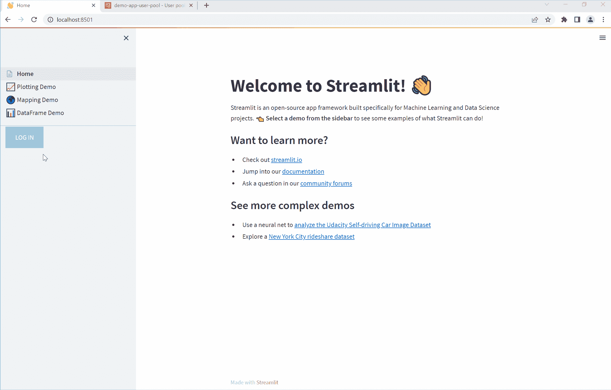

作者图片

这是一个可选功能。单击注册链接会打开一个表单，用户可以使用他们的电子邮件进行注册。最初注册时，用户会收到一个验证码。

演示动画还显示，一旦用户通过了代码验证，管理员就会将用户添加到 AWS Cognito 上的用户组中。在我们的演示示例中，用户使用“mausamgaurav@ymail.com”注册，该用户随后被管理员添加到“保险商”组。

# 使用 Streamlit 创建基本的多页面应用程序

这一节的内容基本上是对 Streamlit 网站上展示的[教程](https://docs.streamlit.io/library/get-started/multipage-apps)的重做，以创建一个多页的 app。我之所以再次提到这一点，是因为 Streamlit 在不断发展，将来他们可能会删除这一页。在撰写本文时，使用的 Streamlit 版本是 1.12.2。

> 请注意，在这一部分，您不需要关注页面的内容。**这是因为我们的目标是显示用户对单个页面的访问。**在本节中，我们只关注创建多页面应用程序。页面的内容可以是你想要的任何东西。

要使用此版本的 Streamlit 创建多页面应用程序，我们需要创建一个入口点文件。基本上，这是从 Streamlit 命令运行的主文件，用于启动前端。命令在下面。

```
streamlit run [entrypoint file]
```

所有单独的页面都需要添加到页面目录中。因此，多页应用程序的结构如下所示:

```
Home.py # This is the file you run with "streamlit run"
└─── pages/
  └─── 1_📈_Plotting_Demo.py # This is a page
  └─── 2_🌍_Mapping_Demo.py # This is another page
  └─── 3_📊_DataFrame_Demo.py # So is this
```

如果应用程序源代码的结构如上，Streamlit 会自动按数字顺序选取页面，并在侧边栏中创建页面的相应链接。这些链接的各个页面的名称是使用页面的文件名自动创建的。

## 创建入口点文件

**Home.py** 文件如下所示:

```
import streamlit as stst.set_page_config(
    page_title="Home",
    page_icon="👋",
)st.write("# Welcome to Streamlit! 👋")st.markdown(
    """
    Streamlit is an open-source app framework built specifically for
    Machine Learning and Data Science projects.
    **👈 Select a demo from the sidebar** to see some examples
    of what Streamlit can do!
    ### Want to learn more?
    - Check out [streamlit.io](https://streamlit.io)
    - Jump into our [documentation](https://docs.streamlit.io)
    - Ask a question in our [community
        forums](https://discuss.streamlit.io)
    ### See more complex demos
    - Use a neural net to [analyze the Udacity Self-driving Car Image
        Dataset](https://github.com/streamlit/demo-self-driving)
    - Explore a [New York City rideshare dataset](https://github.com/streamlit/demo-uber-nyc-pickups)
"""
)
```

在上面我们已经定制了页面标题和页面图标。如果我们现在运行应用程序，而不添加其余页面，应用程序将如下所示:

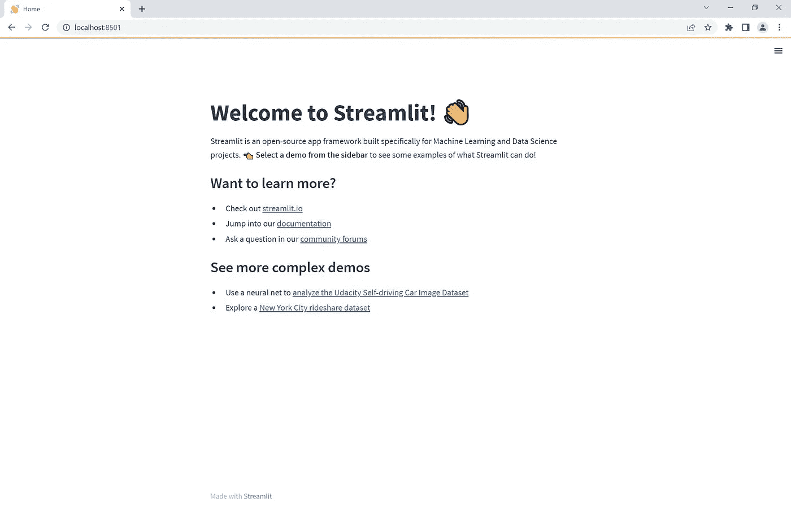

作者图片

## 创建多个页面

现在我们创建如下页面:

**第/1 页 _📈_Plotting_Demo.py**

```
import streamlit as st
import time
import numpy as npst.set_page_config(page_title="Plotting Demo", page_icon="📈")st.markdown("# Plotting Demo")
st.sidebar.header("Plotting Demo")
st.write(
    """This demo illustrates a combination of plotting and animation with
Streamlit. We're generating a bunch of random numbers in a loop for around
5 seconds. Enjoy!"""
)progress_bar = st.sidebar.progress(0)
status_text = st.sidebar.empty()
last_rows = np.random.randn(1, 1)
chart = st.line_chart(last_rows)for i in range(1, 101):
    new_rows = last_rows[-1, :] + np.random.randn(5, 1).cumsum(axis=0)
    status_text.text("%i%% Complete" % i)
    chart.add_rows(new_rows)
    progress_bar.progress(i)
    last_rows = new_rows
    time.sleep(0.05)progress_bar.empty()# Streamlit widgets automatically run the script from top to bottom. Since
# this button is not connected to any other logic, it just causes a plain
# rerun.
st.button("Re-run")
```

添加第一页后，应用程序将如下所示:

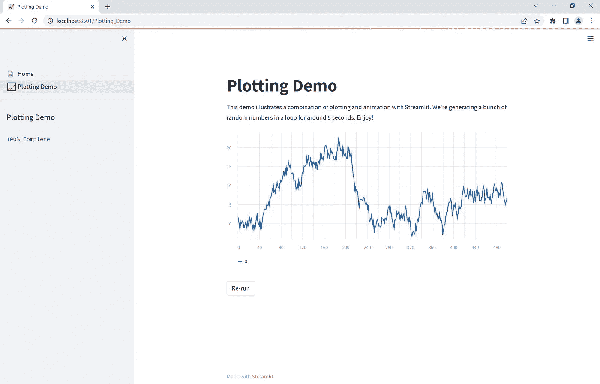

作者图片

**页数/2_🌍_Mapping_Demo.py**

```
import streamlit as st
import pandas as pd
import pydeck as pdk
from urllib.error import URLErrorst.set_page_config(page_title="Mapping Demo", page_icon="🌍")st.markdown("# Mapping Demo")
st.sidebar.header("Mapping Demo")
st.write(
    """This demo shows how to use
[`st.pydeck_chart`](https://docs.streamlit.io/library/api-reference/charts/st.pydeck_chart)
to display geospatial data."""
) @st.experimental_memo
def from_data_file(filename):
    url = (
        "http://raw.githubusercontent.com/streamlit/"
        "example-data/master/hello/v1/%s" % filename
    )
    return pd.read_json(url) try:
    ALL_LAYERS = {
        "Bike Rentals": pdk.Layer(
            "HexagonLayer",
            data=from_data_file("bike_rental_stats.json"),
            get_position=["lon", "lat"],
            radius=200,
            elevation_scale=4,
            elevation_range=[0, 1000],
            extruded=True,
        ),
        "Bart Stop Exits": pdk.Layer(
            "ScatterplotLayer",
            data=from_data_file("bart_stop_stats.json"),
            get_position=["lon", "lat"],
            get_color=[200, 30, 0, 160],
            get_radius="[exits]",
            radius_scale=0.05,
        ),
        "Bart Stop Names": pdk.Layer(
            "TextLayer",
            data=from_data_file("bart_stop_stats.json"),
            get_position=["lon", "lat"],
            get_text="name",
            get_color=[0, 0, 0, 200],
            get_size=15,
            get_alignment_baseline="'bottom'",
        ),
        "Outbound Flow": pdk.Layer(
            "ArcLayer",
            data=from_data_file("bart_path_stats.json"),
            get_source_position=["lon", "lat"],
            get_target_position=["lon2", "lat2"],
            get_source_color=[200, 30, 0, 160],
            get_target_color=[200, 30, 0, 160],
            auto_highlight=True,
            width_scale=0.0001,
            get_width="outbound",
            width_min_pixels=3,
            width_max_pixels=30,
        ),
    }
    st.sidebar.markdown("### Map Layers")
    selected_layers = [
        layer
        for layer_name, layer in ALL_LAYERS.items()
        if st.sidebar.checkbox(layer_name, True)
    ]
    if selected_layers:
        st.pydeck_chart(
            pdk.Deck(
                map_style="mapbox://styles/mapbox/light-v9",
                initial_view_state={
                    "latitude": 37.76,
                    "longitude": -122.4,
                    "zoom": 11,
                    "pitch": 50,
                },
                layers=selected_layers,
            )
        )
    else:
        st.error("Please choose at least one layer above.")
except URLError as e:
    st.error(
        """
        **This demo requires internet access.**
        Connection error: %s
    """
        % e.reason
    )
```

添加了第二个页面后，该应用程序将如下所示:


作者图片

**第/3 页 _📊_DataFrame_Demo.py**

```
import streamlit as st
import pandas as pd
import altair as alt
from urllib.error import URLErrorst.set_page_config(page_title="DataFrame Demo", page_icon="📊")st.markdown("# DataFrame Demo")
st.sidebar.header("DataFrame Demo")
st.write(
    """This demo shows how to use `st.write` to visualize Pandas DataFrames.
(Data courtesy of the [UN Data Explorer](http://data.un.org/Explorer.aspx).)"""
) @st.cache
def get_UN_data():
    AWS_BUCKET_URL = "http://streamlit-demo-data.s3-us-west-2.amazonaws.com"
    df = pd.read_csv(AWS_BUCKET_URL + "/agri.csv.gz")
    return df.set_index("Region") try:
    df = get_UN_data()
    countries = st.multiselect(
        "Choose countries", list(df.index), ["China", "United States of America"]
    )
    if not countries:
        st.error("Please select at least one country.")
    else:
        data = df.loc[countries]
        data /= 1000000.0
        st.write("### Gross Agricultural Production ($B)", data.sort_index()) data = data.T.reset_index()
        data = pd.melt(data, id_vars=["index"]).rename(
            columns={"index": "year", "value": "Gross Agricultural Product ($B)"}
        )
        chart = (
            alt.Chart(data)
            .mark_area(opacity=0.3)
            .encode(
                x="year:T",
                y=alt.Y("Gross Agricultural Product ($B):Q", stack=None),
                color="Region:N",
            )
        )
        st.altair_chart(chart, use_container_width=True)
except URLError as e:
    st.error(
        """
        **This demo requires internet access.**
        Connection error: %s
    """
        % e.reason
    )
```

添加了第三个页面后，该应用程序将如下所示:

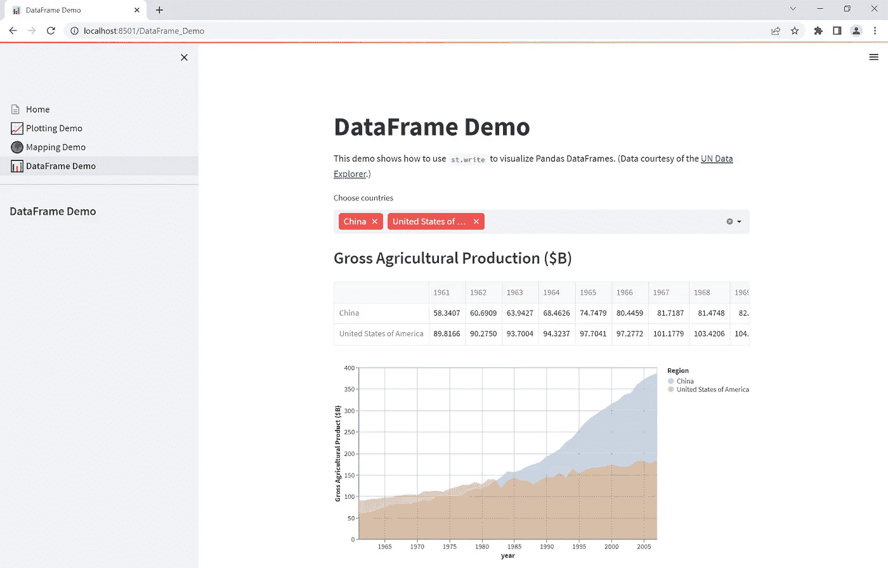

作者图片

在这一部分的最后，我们已经创建了一个带有登陆“主页”和其他三个页面的应用程序。我们还没有用户认证设置。让我们在下一节看看。

# 配置 AWS 认知

登录 AWS 控制台，在顶部的搜索按钮搜索 Cognito。进入 Cognito 部分后，您将看到一个用户池界面。

单击“创建用户池”按钮。


作者图片

然后，在下一个选项(步骤 1)中，选择“电子邮件”作为“Cognito 用户池登录选项”的选项。


作者图片

然后在步骤 2 中，选择默认密码选项和无多因素身份验证。

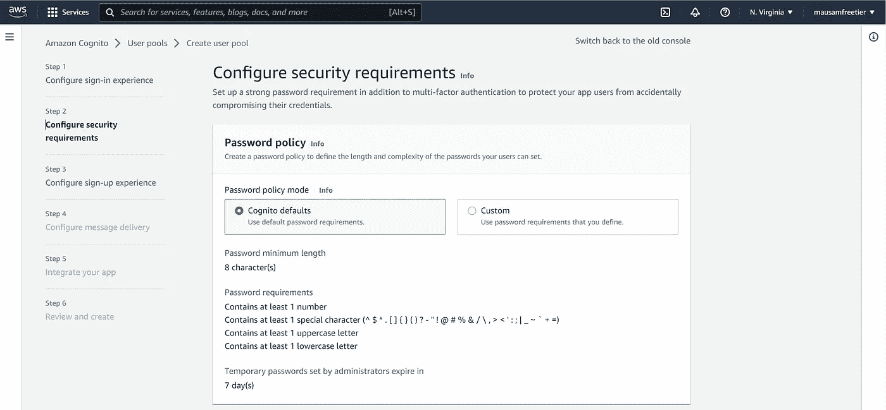

作者图片

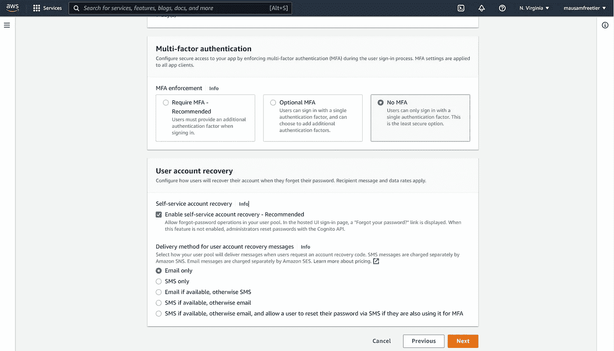

作者图片

在第 3 步中，我们允许用户自助注册，其余选项选择默认值。

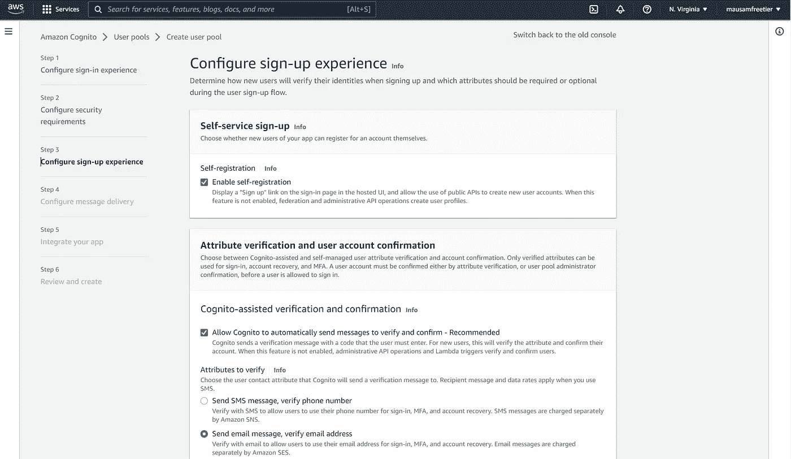

作者图片

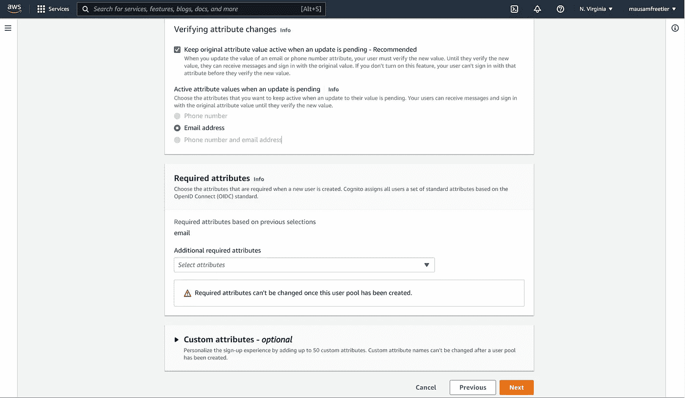

作者图片

在第 4 步中，我们希望用 Cognito 服务发送电子邮件，因此我们选择了该选项。

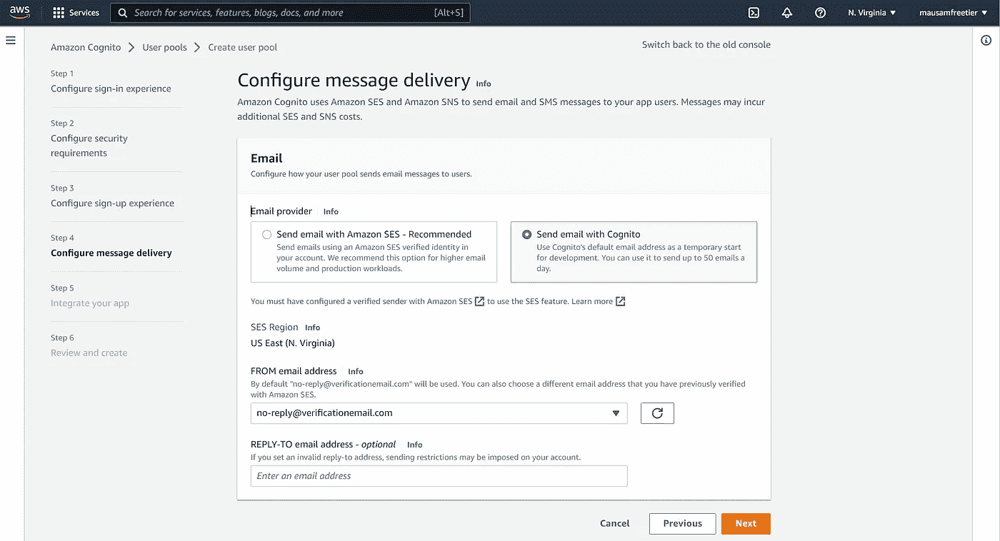

作者图片

第 5 步是最重要的一步，在这一步中，我们定义了我们的应用程序客户端及其设置。

首先选择一个用户池名称。我们使用“演示应用用户池”作为名称。我们还允许托管认证页面。这是为了让我们使用默认的登录/注册等。AWS Cognito 中提供的页面。

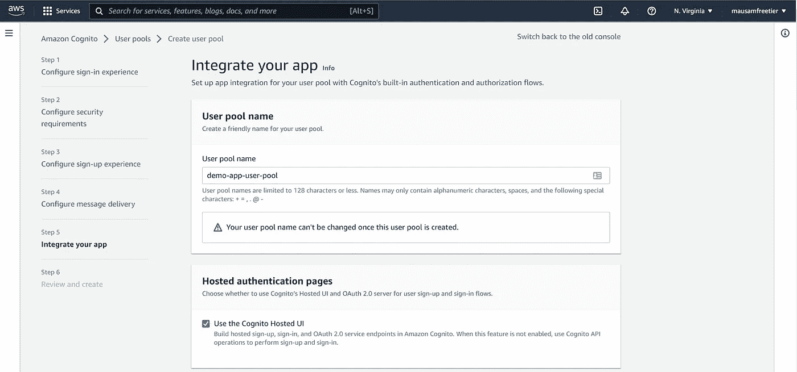

作者图片

在 Cognito 域中，我们提供了一个自定义域。这是上面的 Cognito hosted UI 页面所在的域。

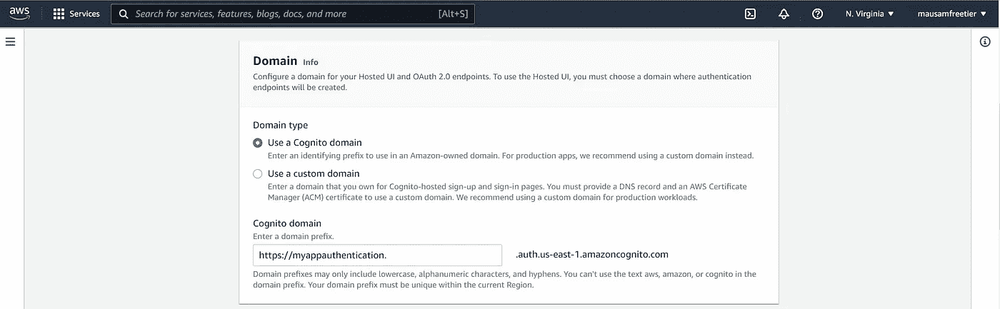

作者图片

在“初始应用客户端”中，我们选择“公共客户端”。我们提供一个应用程序客户端名称，如“演示应用程序客户端名称”,并生成一个客户端密码。对于允许的回叫 URL，我们提供了 Streamlit 应用程序主页的 URL，即“http://localhost:8501/”。回调 URL 的作用是在成功认证(登录)后，用户被路由回该 URL。因为我们已经提供了应用程序主页的 URL，所以在成功认证之后，用户被重定向到主页。请注意，在生产中，我们需要提供应用程序所在的域，例如[https://mystreamlitapp.com/.](https://mystreamlitapp.com/.)

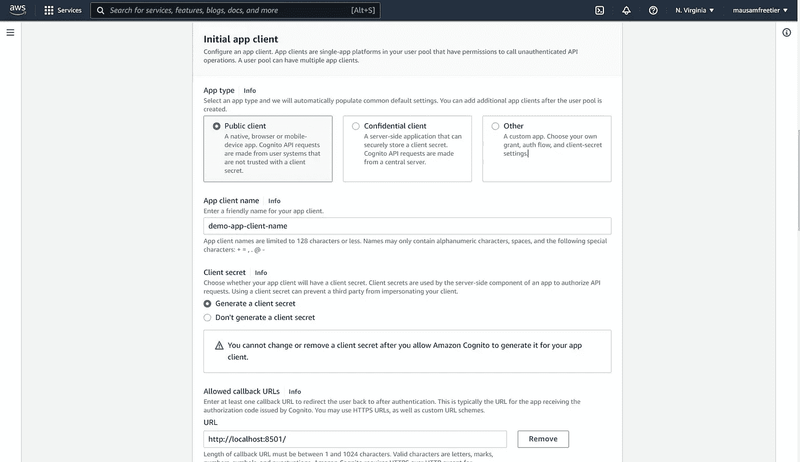

作者图片

在高级应用程序客户端设置中，在身份验证流程中，我们使用“ALLOW_USER_PASSWORD_AUTH”选项。我们将其余选项保留为默认值。

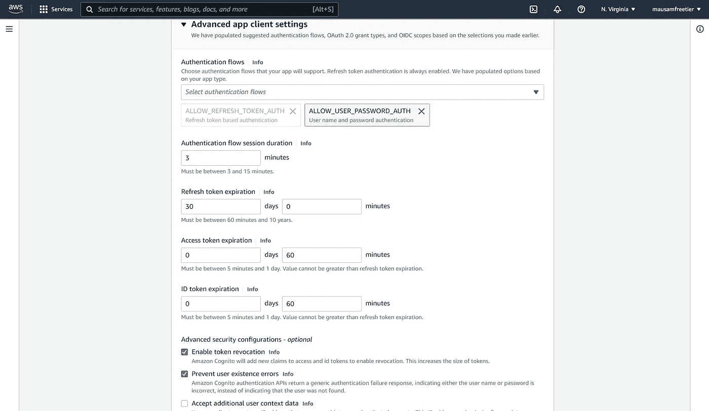

作者图片

在允许注销的 URL 中，我们再次提供了应用程序的主页，即“http://localhost:8501/”。这意味着注销后，用户将被重定向回我们的应用程序的主页。

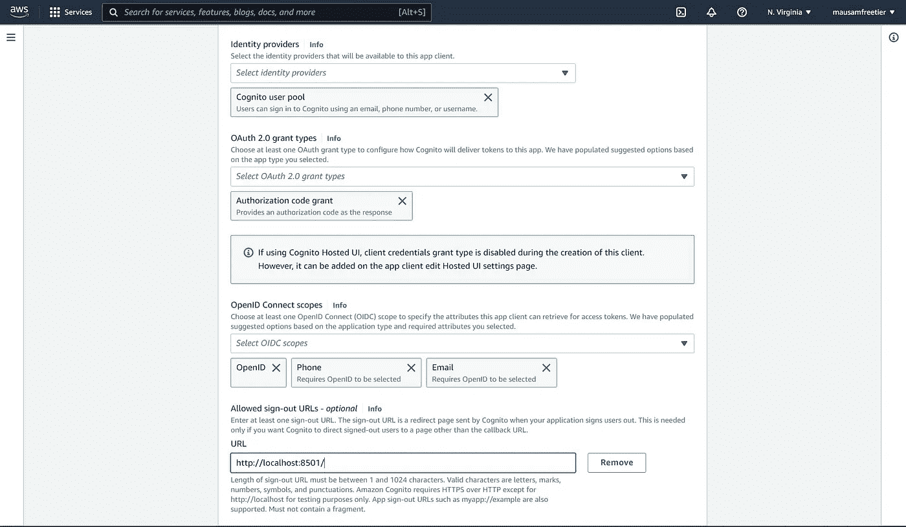

作者图片

最后，在步骤 6 中，我们确认并创建用户池。

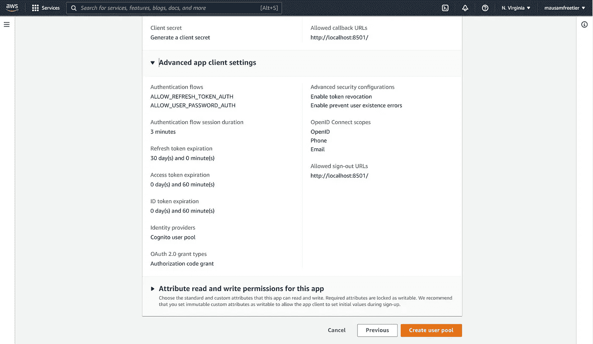

作者图片

## 将用户添加到 AWS Cognito 用户池

创建用户池后，用户可以手动添加到池中，也可以自行注册。

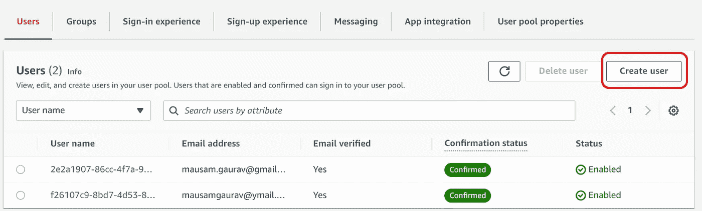

作者图片

可以使用“创建组”选项从“组”菜单创建新组。出于演示的目的，我们需要创建两个组“信用分析师”和“承销商”,并向其中添加相应的用户。

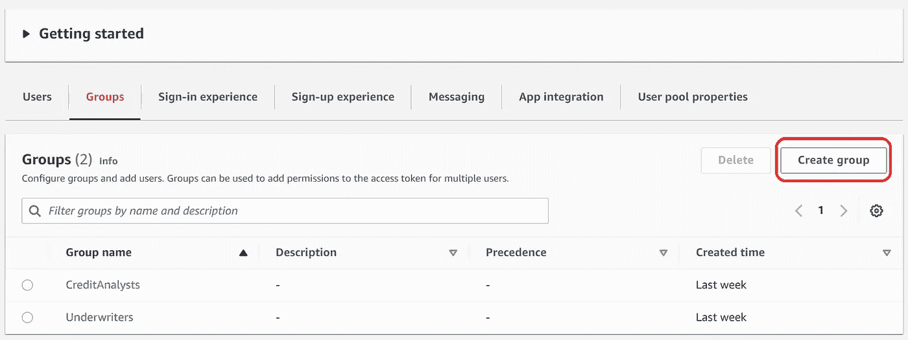

作者图片

可以将单个用户添加到组中，方法是首先在“用户”菜单中单击可点击的用户名，然后单击“将用户添加到组”按钮。例如，在本演示中，我们将用户“mausam.gaurav@gmail”添加到“CreditAnalysts”组中。

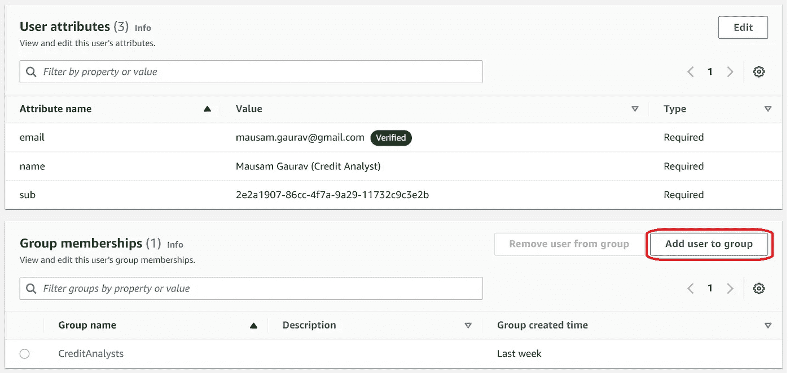

作者图片

# 原则 AWS Cognito 如何与 Streamlit 配合工作

如果我们看一下多页应用程序的“**演示和页面访问**”部分中显示的演示动画，我们会看到，一旦用户单击“登录”按钮，用户就会被带到 AWS Cognito 托管的登录页面。成功登录后，用户被重定向回主页。在用户被重定向到主页后，重定向的主页 URL 还包含一个查询参数。因此重定向的 URL 可能看起来像这样， [http://localhost:8501/？code = 3 F3 de 7 a 2-76 C2-476 a-8032-950 c 79 a 519 e 8](http://localhost:8501/?code=3f3de7a2-76c2-476a-8032-950c79a519e8)。这里的查询参数是“code ”,它的值是等号后面的值，在成功认证后从 AWS Cognito 返回。可以使用下面的函数在 Streamlit 中捕获该值(*注意，本节中讨论的所有函数都来自我们前面提到的 GitHub 存储库中的一个名为'*[*authenticate . py*](https://github.com/MausamGaurav/Streamlit_Multipage_AWSCognito_User_Authentication_Authorization/blob/master/components/authenticate.py)*'的模块*):

```
import streamlit as st# ----------------------------------
# Get authorization code after login
# ----------------------------------
def get_auth_code():
    """
    Gets auth_code state variable.

    Returns:
        Nothing.
    """
    auth_query_params = st.experimental_get_query_params()
    try:
        auth_code = dict(auth_query_params)["code"][0]
    except (KeyError, TypeError):
        auth_code = ""

    return auth_code
```

一旦我们有了这个身份验证代码，我们就可以向 oauth 2.0 令牌端点发出 post 请求，如 AWS API 文档[中所述，在这里](https://docs.aws.amazon.com/cognito/latest/developerguide/token-endpoint.html)检索 access_token、id_token 和 refresh_token。在下面显示的函数中，我们只检索访问和 id 令牌。

```
import os
import streamlit as st
from dotenv import load_dotenv
import requests
import base64# ------------------------------------
# Read constants from environment file
# ------------------------------------
load_dotenv()
COGNITO_DOMAIN = os.environ.get("COGNITO_DOMAIN")
CLIENT_ID = os.environ.get("CLIENT_ID")
CLIENT_SECRET = os.environ.get("CLIENT_SECRET")
APP_URI = os.environ.get("APP_URI")# -------------------------------------------------------
# Use authorization code to get user access and id tokens
# -------------------------------------------------------
def get_user_tokens(auth_code):
    """
    Gets user tokens by making a post request call.

    Args:
        auth_code: Authorization code from cognito server.

    Returns:
        {
        'access_token': access token from cognito server if user is successfully authenticated.
        'id_token': access token from cognito server if user is successfully authenticated.
        }

    """

    # Variables to make a post request
    token_url = f"{COGNITO_DOMAIN}/oauth2/token"
    client_secret_string = f"{CLIENT_ID}:{CLIENT_SECRET}"
    client_secret_encoded = str(
        base64.b64encode(client_secret_string.encode("utf-8")), "utf-8"
    )
    headers = {
        "Content-Type": "application/x-www-form-urlencoded",
        "Authorization": f"Basic {client_secret_encoded}",
    }
    body = {
        "grant_type": "authorization_code",
        "client_id": CLIENT_ID,
        "code": auth_code,
        "redirect_uri": APP_URI,
    }

    token_response = requests.post(token_url, headers=headers, data=body)
    try:
        access_token = token_response.json()["access_token"]
        id_token = token_response.json()["id_token"]
    except (KeyError, TypeError):
        access_token = ""
        id_token = ""

    return access_token, id_token
```

access_token 可用于发出其他 AWS 认知 API 用户请求。例如，使用 access_token，可以使用 [UserInfo API 端点](https://docs.aws.amazon.com/cognito/latest/developerguide/userinfo-endpoint.html)检索用户信息。

```
import os
import streamlit as st
from dotenv import load_dotenv
import requests
import base64# ------------------------------------
# Read constants from environment file
# ------------------------------------
load_dotenv()
COGNITO_DOMAIN = os.environ.get("COGNITO_DOMAIN")
CLIENT_ID = os.environ.get("CLIENT_ID")
CLIENT_SECRET = os.environ.get("CLIENT_SECRET")
APP_URI = os.environ.get("APP_URI")# ---------------------------------------------
# Use access token to retrieve user information
# ---------------------------------------------
def get_user_info(access_token):
    """
    Gets user info from aws cognito server.

    Args:
        access_token: string access token from the aws cognito user pool
        retrieved using the access code.

    Returns:
        userinfo_response: json object.
    """
    userinfo_url = f"{COGNITO_DOMAIN}/oauth2/userInfo"
    headers = {
        "Content-Type": "application/json;charset=UTF-8",
        "Authorization": f"Bearer {access_token}",
    }

    userinfo_response = requests.get(userinfo_url, headers=headers)

    return userinfo_response.json()
```

然后，可以对 access_token 或 id_token 进行 base64 解码，以获得 user_cognito_groups 信息。比如成功登录后，收到的授权码是‘3 F3 de 7 a 2–76 C2–476 a-8032–950 c 79 a 519 e 8’。使用此授权代码，我们向令牌 API 端点发出 POST 请求，收到的“授权令牌”如下:

```
eyJraWQiOiJidWJcL2hHa3N6eXozWmJsMlZMcWdlTTRkN0VYNWtyM2JVelJxSFNNMkVBRT0iLCJhbGciOiJSUzI1NiJ9.eyJzdWIiOiIyZTJhMTkwNy04NmNjLTRmN2EtOWEyOS0xMTczMmM5YzNlMmIiLCJjb2duaXRvOmdyb3VwcyI6WyJDcmVkaXRBbmFseXN0cyJdLCJpc3MiOiJodHRwczpcL1wvY29nbml0by1pZHAudXMtZWFzdC0xLmFtYXpvbmF3cy5jb21cL3VzLWVhc3QtMV9ldUxSaWZNQm4iLCJ2ZXJzaW9uIjoyLCJjbGllbnRfaWQiOiI2M2EzY3IzOGk1aW9mbm10dTh0MGRoOWJoNCIsIm9yaWdpbl9qdGkiOiJkMzZmMjhkOS1hNGIyLTQzMDItYjlmYS1hODA4MWNiZGYxNmEiLCJ0b2tlbl91c2UiOiJhY2Nlc3MiLCJzY29wZSI6Im9wZW5pZCBlbWFpbCIsImF1dGhfdGltZSI6MTY2NDEyNTk5OSwiZXhwIjoxNjY0MTI5NTk5LCJpYXQiOjE2NjQxMjU5OTksImp0aSI6IjU4ZjkwN2Y0LWJkOWMtNGJhMC04NjkxLWUzNzZjNDQ4NTdjMCIsInVzZXJuYW1lIjoiMmUyYTE5MDctODZjYy00ZjdhLTlhMjktMTE3MzJjOWMzZTJiIn0.R2i_YGCTX6cSZRyc19pTslPsEYRoDDGZygTjbIKDuVkqDuW1h9dyiOfS8e1LyzEDcSXGXTIcqMAhCJWIPUwdpzAutpWQdFkvUVd1DnY0Wuga5XiVM5Hc7o0_9JTY8qaO7Oo1T9tRPiNpS90q6HncqGzClHObxYF1E5q9duxpFqSllvxg5DNf7Q5kAMDYzf-b-zYHKkzxw1GXAnFyAI8rT_PZlsm4UolXeSQtR42JtFnrfk3EM5HWH10ro5QKRUqOY1NxN7SH_PGWU3_gEznF53kdwrxK7nUEXstZQau_Va0KUoXrIqzLb3cZkliWE-af3RDYro8ggMmQZbGD2m-hhg
```

如果我们用 https://jwt.io/[之类的 JWT 解码器对上述令牌进行 base64 解码，我们会看到解码后的有效载荷将包含如下所示的组信息。](https://jwt.io/)

```
{
  "sub": "2e2a1907-86cc-4f7a-9a29-11732c9c3e2b",
  "cognito:groups": [
    "CreditAnalysts"
  ],
  "iss": "https://cognito-idp.us-east-1.amazonaws.com/us-east-1_euLRifMBn",
  "version": 2,
  "client_id": "63a3cr38i5iofnmtu8t0dh9bh4",
  "origin_jti": "d36f28d9-a4b2-4302-b9fa-a8081cbdf16a",
  "token_use": "access",
  "scope": "openid email",
  "auth_time": 1664125999,
  "exp": 1664129599,
  "iat": 1664125999,
  "jti": "58f907f4-bd9c-4ba0-8691-e376c44857c0",
  "username": "2e2a1907-86cc-4f7a-9a29-11732c9c3e2b"
}
```

解码 access_token/id_token 可以在 Python 中完成，如下所示。

```
import base64
import json# -------------------------------------------------------
# Decode access token to JWT to get user's cognito groups
# -------------------------------------------------------
# Ref - https://gist.github.com/GuillaumeDerval/b300af6d4f906f38a051351afab3b95c
def pad_base64(data):
    """
    Makes sure base64 data is padded.

    Args:
        data: base64 token string.

    Returns:
        data: padded token string.
    """
    missing_padding = len(data) % 4
    if missing_padding != 0:
        data += "=" * (4 - missing_padding)
    return data

def get_user_cognito_groups(id_token):
    """
    Decode id token to get user cognito groups.

    Args:
        id_token: id token of a successfully authenticated user.

    Returns:
        user_cognito_groups: a list of all the cognito groups the user belongs to.
    """
    if id_token != "":
        header, payload, signature = id_token.split(".")
        printable_payload = base64.urlsafe_b64decode(pad_base64(payload))
        payload_dict = json.loads(printable_payload)
        user_cognito_groups = list(dict(payload_dict)["cognito:groups"])
    else:
        user_cognito_groups = []
    return user_cognito_groups
```

下一步是将身份验证信息存储到 Streamlit 会话变量中，以便跨页面共享这些变量。如果我们成功地从令牌端点接收到非空字符串的访问令牌，我们就知道用户成功地通过了身份验证。认证状态和用户认知组信息可以保存到会话变量中，如下所示。

```
st.session_state["authenticated"] = True
st.session_state["user_cognito_groups"] = user_cognito_groups
```

本节中的所有上述步骤都可以使用如下所示的主功能来实现:

```
import streamlit as st# -----------------------------
# Set Streamlit state variables
# -----------------------------
def set_st_state_vars():
    """
    Sets the streamlit state variables after user authentication.
    Returns:
        Nothing.
    """
    initialise_st_state_vars()
    auth_code = get_auth_code()
    access_token, id_token = get_user_tokens(auth_code)
    user_cognito_groups = get_user_cognito_groups(id_token)

    if access_token != "":
        st.session_state["auth_code"] = auth_code
        st.session_state["authenticated"] = True
        st.session_state["user_cognito_groups"] = user_cognito_groups
```

注意，在上面的函数中，如果状态变量不存在，我们使用了一个“初始化 _st_state_vars()”函数来初始化状态变量。该函数如下所示:

```
# ------------------------------------
# Initialise Streamlit state variables
# ------------------------------------
def initialise_st_state_vars():
    """
    Initialise Streamlit state variables.

    Returns:
        Nothing.
    """
    if "auth_code" not in st.session_state:
        st.session_state["auth_code"] = ""
    if "authenticated" not in st.session_state:
        st.session_state["authenticated"] = False
    if "user_cognito_groups" not in st.session_state:
        st.session_state["user_cognito_groups"] = []
```

可以在特定页面上使用会话变量来了解用户是否经过身份验证以及用户属于哪个组。如果用户组信息与页面上访问该页面所需的信息相匹配，那么该特定用户就可以访问该页面。

在每个页面上，我们首先导入身份验证模块。“set_st_state_variables()”函数用于在每个页面上验证用户，并显示登录和注销按钮(这些是在 Streamlit 中创建的自定义 Streamlit 按钮，并在 authenticate 模块中定义)。

```
import components.authenticate as authenticate# Check authentication when user lands on the page.
authenticate.set_st_state_vars()# Add login/logout buttons
if st.session_state["authenticated"]:
    authenticate.button_logout()
else:
    authenticate.button_login()
```

我们可以使用状态变量隐藏/显示页面内容。下面是我们如何确保只有经过身份验证和/或属于特定 AWS Cognito 组的用户才能访问页面上的内容。我们使用一个简单的 if 语句检查会话状态变量“authenticated”和“user_cognito_groups ”,当满足条件时，运行页面的代码。例如:

```
if st.session_state["authenticated"] and "Underwriters" in st.session_state["user_cognito_groups"]:
    # Show the page content
    # Contents of page 1
    st.write(
        """This demo illustrates a combination of plotting!..."""
    )# ...
else:
    if st.session_state["authenticated"]:
        st.write("You do not have access. Please contact the administrator.")
    else:
        st.write("Please login!")
```

在上面的示例中，只有当用户成功通过身份验证并且从服务器接收到的用户组信息是“保险商”时，页面的内容才会被执行并显示给最终用户。

# 将 AWS Cognito 集成到我们的 Streamlit 应用程序中

为了将我们的 AWS Cognito 用户池集成到我们的应用程序中，我们创建了一个如上所述的单独的“authenticate.py”模块来封装我们的功能。我们将这个“authenticate.py”文件保存在名为“components”的目录中，与“pages”目录并排。在“components”目录中，我们还创建了一个. env 文件，该文件将保存我们的一些 AWS Cognito 客户端设置。注意，我们还添加了一个 __init__。py 文件，以便组件目录可以作为模块导入。

```
Home.py
└─── components/
  └─── __init__.py
  └─── .env
  └─── authenticate.py 
└─── pages/
  └─── 1_📈_Plotting_Demo.py
  └─── 2_🌍_Mapping_Demo.py
  └─── 3_📊_DataFrame_Demo.py
```

的内容。env 文件如下所示。请注意，我们没有推送实际的。env 文件添加到 GitHub 存储库。实际上，出于安全考虑，您也不应该将您的 AWS 凭证推送到您的存储库中。

```
COGNITO_DOMAIN = "https://myappauthentication.auth.us-east-1.amazoncognito.com"
CLIENT_ID = "xyz"
CLIENT_SECRET = "secret-secret"
APP_URI = "http://localhost:8501/"
```

这些环境变量的实际值应该是 AWS Cognito 用户池中的值。例如,“CLIENT_ID”和“CLIENT_SECRET”值将来自受管 AWS Cognito 控制台的下方区域。

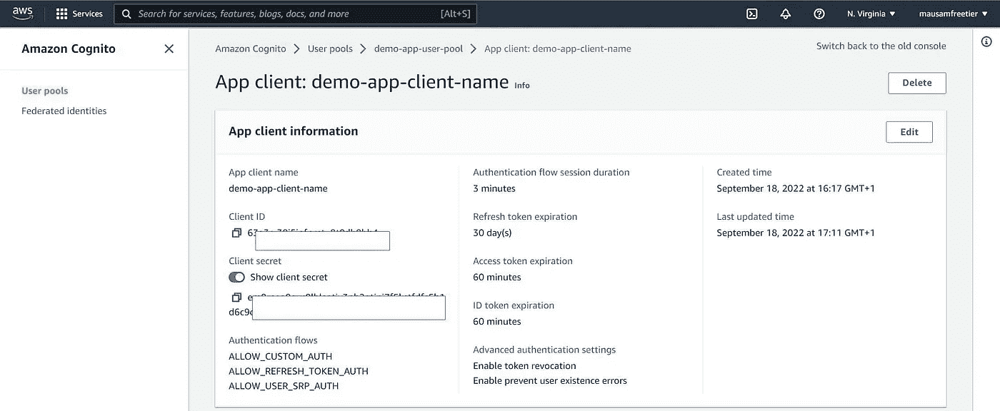

作者图片

完整的' **authenticate.py** '模块如下所示。

```
import os
import streamlit as st
from dotenv import load_dotenv
import requests
import base64
import json# ------------------------------------
# Read constants from environment file
# ------------------------------------
load_dotenv()
COGNITO_DOMAIN = os.environ.get("COGNITO_DOMAIN")
CLIENT_ID = os.environ.get("CLIENT_ID")
CLIENT_SECRET = os.environ.get("CLIENT_SECRET")
APP_URI = os.environ.get("APP_URI") # ------------------------------------
# Initialise Streamlit state variables
# ------------------------------------
def initialise_st_state_vars():
    """
    Initialise Streamlit state variables. Returns:
        Nothing.
    """
    if "auth_code" not in st.session_state:
        st.session_state["auth_code"] = ""
    if "authenticated" not in st.session_state:
        st.session_state["authenticated"] = False
    if "user_cognito_groups" not in st.session_state:
        st.session_state["user_cognito_groups"] = [] # ----------------------------------
# Get authorization code after login
# ----------------------------------
def get_auth_code():
    """
    Gets auth_code state variable. Returns:
        Nothing.
    """
    auth_query_params = st.experimental_get_query_params()
    try:
        auth_code = dict(auth_query_params)["code"][0]
    except (KeyError, TypeError):
        auth_code = "" return auth_code # ----------------------------------
# Set authorization code after login
# ----------------------------------
def set_auth_code():
    """
    Sets auth_code state variable. Returns:
        Nothing.
    """
    initialise_st_state_vars()
    auth_code = get_auth_code()
    st.session_state["auth_code"] = auth_code # -------------------------------------------------------
# Use authorization code to get user access and id tokens
# -------------------------------------------------------
def get_user_tokens(auth_code):
    """
    Gets user tokens by making a post request call. Args:
        auth_code: Authorization code from cognito server. Returns:
        {
        'access_token': access token from cognito server if user is successfully authenticated.
        'id_token': access token from cognito server if user is successfully authenticated.
        } """ # Variables to make a post request
    token_url = f"{COGNITO_DOMAIN}/oauth2/token"
    client_secret_string = f"{CLIENT_ID}:{CLIENT_SECRET}"
    client_secret_encoded = str(
        base64.b64encode(client_secret_string.encode("utf-8")), "utf-8"
    )
    headers = {
        "Content-Type": "application/x-www-form-urlencoded",
        "Authorization": f"Basic {client_secret_encoded}",
    }
    body = {
        "grant_type": "authorization_code",
        "client_id": CLIENT_ID,
        "code": auth_code,
        "redirect_uri": APP_URI,
    } token_response = requests.post(token_url, headers=headers, data=body)
    try:
        access_token = token_response.json()["access_token"]
        id_token = token_response.json()["id_token"]
    except (KeyError, TypeError):
        access_token = ""
        id_token = "" return access_token, id_token # ---------------------------------------------
# Use access token to retrieve user information
# ---------------------------------------------
def get_user_info(access_token):
    """
    Gets user info from aws cognito server. Args:
        access_token: string access token from the aws cognito user pool
        retrieved using the access code. Returns:
        userinfo_response: json object.
    """
    userinfo_url = f"{COGNITO_DOMAIN}/oauth2/userInfo"
    headers = {
        "Content-Type": "application/json;charset=UTF-8",
        "Authorization": f"Bearer {access_token}",
    } userinfo_response = requests.get(userinfo_url, headers=headers) return userinfo_response.json() # -------------------------------------------------------
# Decode access token to JWT to get user's cognito groups
# -------------------------------------------------------
# Ref - https://gist.github.com/GuillaumeDerval/b300af6d4f906f38a051351afab3b95c
def pad_base64(data):
    """
    Makes sure base64 data is padded. Args:
        data: base64 token string. Returns:
        data: padded token string.
    """
    missing_padding = len(data) % 4
    if missing_padding != 0:
        data += "=" * (4 - missing_padding)
    return data def get_user_cognito_groups(id_token):
    """
    Decode id token to get user cognito groups. Args:
        id_token: id token of a successfully authenticated user. Returns:
        user_cognito_groups: a list of all the cognito groups the user belongs to.
    """
    if id_token != "":
        header, payload, signature = id_token.split(".")
        printable_payload = base64.urlsafe_b64decode(pad_base64(payload))
        payload_dict = json.loads(printable_payload)
        user_cognito_groups = list(dict(payload_dict)["cognito:groups"])
    else:
        user_cognito_groups = []
    return user_cognito_groups # -----------------------------
# Set Streamlit state variables
# -----------------------------
def set_st_state_vars():
    """
    Sets the streamlit state variables after user authentication.
    Returns:
        Nothing.
    """
    initialise_st_state_vars()
    auth_code = get_auth_code()
    access_token, id_token = get_user_tokens(auth_code)
    user_cognito_groups = get_user_cognito_groups(id_token) if access_token != "":
        st.session_state["auth_code"] = auth_code
        st.session_state["authenticated"] = True
        st.session_state["user_cognito_groups"] = user_cognito_groups # -----------------------------
# Login/ Logout HTML components
# -----------------------------
login_link = f"{COGNITO_DOMAIN}/login?client_id={CLIENT_ID}&response_type=code&scope=email+openid&redirect_uri={APP_URI}"
logout_link = f"{COGNITO_DOMAIN}/logout?client_id={CLIENT_ID}&logout_uri={APP_URI}"html_css_login = """
<style>
.button-login {
  background-color: skyblue;
  color: white !important;
  padding: 1em 1.5em;
  text-decoration: none;
  text-transform: uppercase;
}.button-login:hover {
  background-color: #555;
  text-decoration: none;
}.button-login:active {
  background-color: black;
}</style>
"""html_button_login = (
    html_css_login
    + f"<a href='{login_link}' class='button-login' target='_self'>Log In</a>"
)
html_button_logout = (
    html_css_login
    + f"<a href='{logout_link}' class='button-login' target='_self'>Log Out</a>"
) def button_login():
    """ Returns:
        Html of the login button.
    """
    return st.sidebar.markdown(f"{html_button_login}", unsafe_allow_html=True) def button_logout():
    """ Returns:
        Html of the logout button.
    """
    return st.sidebar.markdown(f"{html_button_logout}", unsafe_allow_html=True)
```

如果我们阅读“authenticate.py”模块，这些函数是不言自明的。这些函数在页面上的执行顺序在名为“set_st_state_variables()”的主函数中。正如已经讨论过的，这个函数的作用是，每当用户登陆一个页面时，如果会话状态变量不存在，它首先尝试创建它们，然后赋予默认值。然后，它使用 get_auth_code()函数获取授权码。使用“get_user_tokens(auth_code)”函数，检索访问和 id 令牌。然后使用“get _ user_cognito_groups(id _ token)”函数，接收 user _ cogn ITO _ groups 信息。这些然后被存储在 Streamlit 会话变量中。

authenticate 模块还有两个定制的 html 链接按钮，名为 button_login()和 button_logout()，用于在每个页面上显示登录和注销按钮。这些按钮的代码非常简单——我们只是使用 URL 链接的自定义 HTML markdown 创建了一个 Streamlit 元素，这些链接使用 CSS 进行了样式化，看起来像按钮。使用 Streamlit ' ST . sidebar . markdown '，我们确保按钮出现在侧边栏上。

现在，我们只需像前面讨论的那样修改每个 Streamlit 页面，以导入 authenticate 模块并相应地修改页面代码，从而根据用户是否经过身份验证以及他们是否属于特定组来允许用户访问页面内容。

各个页面的代码如下所示。

**Home.py**

```
import streamlit as st
import components.authenticate as authenticatest.set_page_config(
    page_title="Home",
    page_icon="👋",
)st.write("# Welcome to Streamlit! 👋")st.markdown(
    """
    Streamlit is an open-source app framework built specifically for
    Machine Learning and Data Science projects.
    **👈 Select a demo from the sidebar** to see some examples
    of what Streamlit can do!
    ### Want to learn more?
    - Check out [streamlit.io](https://streamlit.io)
    - Jump into our [documentation](https://docs.streamlit.io)
    - Ask a question in our [community
        forums](https://discuss.streamlit.io)
    ### See more complex demos
    - Use a neural net to [analyze the Udacity Self-driving Car Image
        Dataset](https://github.com/streamlit/demo-self-driving)
    - Explore a [New York City rideshare dataset](https://github.com/streamlit/demo-uber-nyc-pickups)
"""
)# Check authentication when user lands on the home page.
authenticate.set_st_state_vars()# Add login/logout buttons
if st.session_state["authenticated"]:
    authenticate.button_logout()
else:
    authenticate.button_login()
```

如前所述，如果看看底部的代码，我们首先使用“authenticate.set_st_state_vars()”函数在用户登录页面时检查身份验证。然后，在这个页面上，我们只需检查用户是否通过了身份验证，如果用户没有通过身份验证，则显示登录按钮，如果用户通过了身份验证，则显示注销按钮。

**第/1 页 _📈_Plotting_Demo.py**

```
import streamlit as st
import time
import numpy as np
import components.authenticate as authenticate# Page configuration
st.set_page_config(page_title="Plotting Demo", page_icon="📈")# Check authentication
authenticate.set_st_state_vars()# Add login/logout buttons
if st.session_state["authenticated"]:
    authenticate.button_logout()
else:
    authenticate.button_login()# Rest of the page
st.markdown("# Plotting Demo")
st.sidebar.header("Plotting Demo")if (
    st.session_state["authenticated"]
    and "Underwriters" in st.session_state["user_cognito_groups"]
):
    st.write(
        """This demo illustrates a combination of plotting and animation with
    Streamlit. We're generating a bunch of random numbers in a loop for around
    5 seconds. Enjoy!"""
    )progress_bar = st.sidebar.progress(0)
    status_text = st.sidebar.empty()
    last_rows = np.random.randn(1, 1)
    chart = st.line_chart(last_rows)for i in range(1, 101):
        new_rows = last_rows[-1, :] + np.random.randn(5, 1).cumsum(axis=0)
        status_text.text("%i%% Complete" % i)
        chart.add_rows(new_rows)
        progress_bar.progress(i)
        last_rows = new_rows
        time.sleep(0.05)progress_bar.empty()# Streamlit widgets automatically run the script from top to bottom. Since
    # this button is not connected to any other logic, it just causes a plain
    # rerun.
    st.button("Re-run")
else:
    if st.session_state["authenticated"]:
        st.write("You do not have access. Please contact the administrator.")
    else:
        st.write("Please login!")
```

在此页面上，我们首先检查身份验证状态。接下来，我们根据身份验证状态显示登录/注销按钮。此外，我们检查用户是否经过身份验证，以及用户是否属于“保险商”组。如果满足这些条件，则执行该页面的代码并显示给用户。如果不满足这些条件，将向用户显示一条消息“请登录！”或者“您没有访问权限”。请联系管理员。这取决于会话状态变量的值。

页数/2_🌍_Mapping_Demo.py

```
import streamlit as st
import pandas as pd
import pydeck as pdk
from urllib.error import URLError
import components.authenticate as authenticate# Page configuration
st.set_page_config(page_title="Mapping Demo", page_icon="🌍")# Check authentication
authenticate.set_st_state_vars()# Add login/logout buttons
if st.session_state["authenticated"]:
    authenticate.button_logout()
else:
    authenticate.button_login()# Rest of the page
st.markdown("# Mapping Demo")
st.sidebar.header("Mapping Demo")if (
    st.session_state["authenticated"]
    and "CreditAnalysts" in st.session_state["user_cognito_groups"]
):
    st.write(
        """This demo shows how to use
    [`st.pydeck_chart`]([https://docs.streamlit.io/library/api-reference/charts/st.pydeck_chart](https://docs.streamlit.io/library/api-reference/charts/st.pydeck_chart))
    to display geospatial data."""
    )[@st](http://twitter.com/st).experimental_memo
    def from_data_file(filename):
        url = (
            "[http://raw.githubusercontent.com/streamlit/](http://raw.githubusercontent.com/streamlit/)"
            "example-data/master/hello/v1/%s" % filename
        )
        return pd.read_json(url)try:
        ALL_LAYERS = {
            "Bike Rentals": pdk.Layer(
                "HexagonLayer",
                data=from_data_file("bike_rental_stats.json"),
                get_position=["lon", "lat"],
                radius=200,
                elevation_scale=4,
                elevation_range=[0, 1000],
                extruded=True,
            ),
            "Bart Stop Exits": pdk.Layer(
                "ScatterplotLayer",
                data=from_data_file("bart_stop_stats.json"),
                get_position=["lon", "lat"],
                get_color=[200, 30, 0, 160],
                get_radius="[exits]",
                radius_scale=0.05,
            ),
            "Bart Stop Names": pdk.Layer(
                "TextLayer",
                data=from_data_file("bart_stop_stats.json"),
                get_position=["lon", "lat"],
                get_text="name",
                get_color=[0, 0, 0, 200],
                get_size=15,
                get_alignment_baseline="'bottom'",
            ),
            "Outbound Flow": pdk.Layer(
                "ArcLayer",
                data=from_data_file("bart_path_stats.json"),
                get_source_position=["lon", "lat"],
                get_target_position=["lon2", "lat2"],
                get_source_color=[200, 30, 0, 160],
                get_target_color=[200, 30, 0, 160],
                auto_highlight=True,
                width_scale=0.0001,
                get_width="outbound",
                width_min_pixels=3,
                width_max_pixels=30,
            ),
        }
        st.sidebar.markdown("### Map Layers")
        selected_layers = [
            layer
            for layer_name, layer in ALL_LAYERS.items()
            if st.sidebar.checkbox(layer_name, True)
        ]
        if selected_layers:
            st.pydeck_chart(
                pdk.Deck(
                    map_style="mapbox://styles/mapbox/light-v9",
                    initial_view_state={
                        "latitude": 37.76,
                        "longitude": -122.4,
                        "zoom": 11,
                        "pitch": 50,
                    },
                    layers=selected_layers,
                )
            )
        else:
            st.error("Please choose at least one layer above.")
    except URLError as e:
        st.error(
            """
            **This demo requires internet access.**
            Connection error: %s
        """
            % e.reason
        )
else:
    if st.session_state["authenticated"]:
        st.write("You do not have access. Please contact the administrator.")
    else:
        st.write("Please login!")
```

在这个页面上，我们检查与第一个页面相同的内容，并相应地执行该页面。唯一的区别是，我们检查用户是否属于“信用分析师”组。

*请注意，我们已经跳过了第三页的身份验证和用户访问，因此没有任何更改。*

通过 pages 设置，如果您再次启动 Streamlit 应用程序，我们现在应该可以在我们的应用程序中看到用户身份验证和部分访问，如本文开头的演示所示。

文章的 GitHub 页面是[这里是](https://github.com/MausamGaurav/Streamlit_Multipage_AWSCognito_User_Authentication_Authorization.git)。

希望你喜欢这篇文章。快乐流线型🚣！！