# 为 iOS 构建原生编辑器

> 原文：<https://levelup.gitconnected.com/building-a-native-editor-for-ios-968ff9bc6e0c>

# 序言

我一直着迷于我们所有软件开发人员都喜欢的伟大的开源社区。已经有一些伟大的框架产生于人们对解决问题或使伟大的事情变得更好的热情。在我作为软件开发人员的职业生涯中，我已经使用了如此多的开源框架，并且一直希望有所回报。然而，直到现在，我也没能想出一个好的问题来解决。从标题中你已经知道了——这是一个完全成熟的完全原生的 iOS 编辑器框架。

我们几乎一直在使用富文本编辑器，甚至没有意识到——就像我正在使用一个媒体编辑器来写这个故事。我正在使用添加标题，链接，图像等功能。但我考虑的是内容，而不是如何添加所有这些格式。在我作为开发者的经历中，我发现了许多基于网络的富文本编辑器，然而在 iOS 上功能丰富的并不多。所以这就是为什么，我想建一个。

# 介绍

在 iOS 上开发一个功能强大且可扩展的编辑器似乎一直是一个非常有趣的技术挑战。虽然有可能在 iOS 上运行一个基于 web 的编辑器，并且它确实可以工作，但是在非本地技术中，有些事情并不容易处理。我倾向于原生编辑器是因为有很多原生特性，比如动态字体大小和主题化，它们在原生环境中相对容易实现，但是当使用基于 web 的技术作为原生解决方案(混合)时却非常具有挑战性。

# 要求

我不想创建一个只能作为拖放组件的富文本编辑器，而是想提供一个框架，可以帮助任何人创建富文本编辑器。这样做的主要原因是我希望人们能够添加他们需要的任何功能，而不是被现成的东西所驱使或限制。

概括地说，我想要满足的需求是:

*   成为一个独立的组件——在最简单的形式下，它应该是对`UITextView`的直接替代，在最复杂的形式下，它应该能够处理任何可以从一个强大的富文本编辑器中得到的功能。
*   应该是可扩展的，以支持在编辑器中添加任何视图作为内容，以便它与文本一起流动。
*   调整内容视图的大小应该自动调整包含编辑器的大小，并支持第 n 级嵌套。
*   应该支持在键入内容时扩展文本的外观—例如，使用标记语法在键入时更改文本，或者在输入提前键入字符时突出显示—但是，不要直接意识到这些要求中的任何一个。
*   应该允许通过同一个工具栏基于焦点在多个编辑器上工作。
*   尊重容器的边界，即当设备方向改变时调整大小。
*   支持默认字体和样式，如对齐和头部缩进。
*   当然，在 macOS Catalyst 上支持所有这些几乎不需要额外的努力。

# 一个框架诞生了

带着所有这些需求，我开始着手一个框架，大约 3 个月后，我有了一个满足几乎所有初始需求的工作版本。我称之为[质子](https://github.com/rajdeep/proton/)——为使用它的开发者和使用这些开发者的优秀应用的最终用户带来积极性！


[质子](https://github.com/rajdeep/proton/)由以下关键部件组成:

## 编者ˌ编辑

考虑到上面列出的所有要点，Editor 引入了一些关键概念。这些概念允许在不同层次上扩展编辑器——甚至以我没有明确设计编辑器框架的方式，我们将在后面看到。

******* *以下所有截图均来自 iOS 模拟器。*

## 附件

编辑器最基本的概念之一是附件。附件允许编辑者在编辑文本中查看任何视图。在附件的支持下，编辑器可以包含一个表情符号、一个面板甚至一个表格，只要它可以表示为一个`UIView`。一个`Editor`也可以包含另一个`Editor`。

开箱即用的附件有五种类型:

*   **匹配内容:**根据内容大小自动调整大小的附件，即当内容改变时，附件的大小也随之改变。

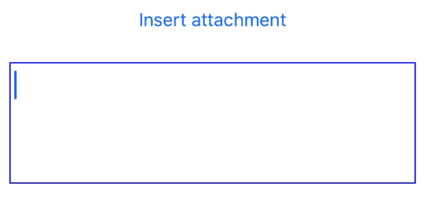

匹配内容大小的附件

*   **全宽:**附件始终采用其容器中可用的全宽。如果集装箱的宽度发生变化，附件的宽度也会随之变化。

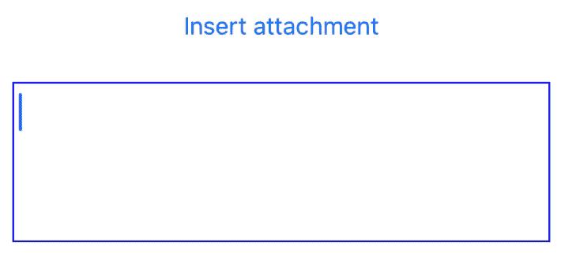

附件宽度与容器宽度匹配

*   **固定宽度:**始终遵循可配置固定宽度的附件。

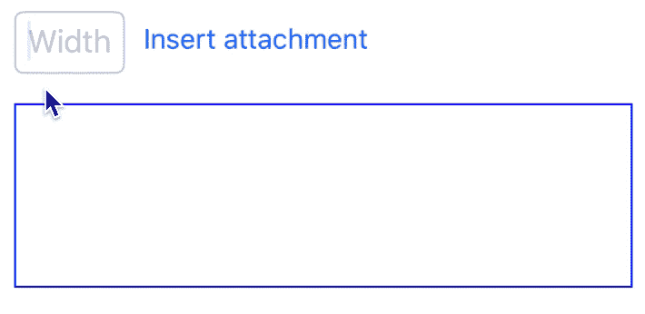

固定宽度附件

*   **宽度范围:**即使是空的也总是保持最小宽度的附件，但只会增长到给定的最大宽度。

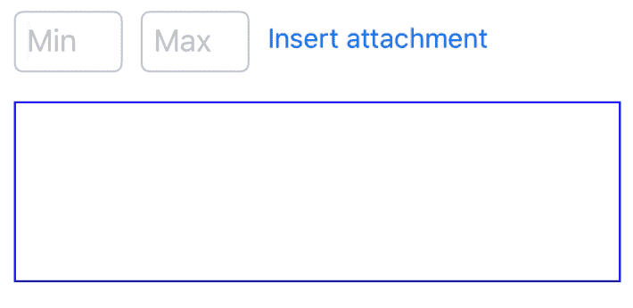

具有最小和最大宽度的附件

*   **百分比宽度:**附件总是占据集装箱宽度的一定百分比。随着容器大小的改变，附件的大小也应该改变，以适应创建附件所用的百分比。

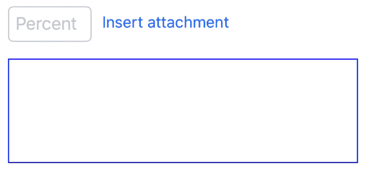

所有这些例子都使用一个文本视图，它作为附件添加到主编辑器中。您可以在附件中添加任何视图，并应用最适合您的场景的大小调整规则。

创建这些附件只需要几行代码:

## 命令

除了添加不同种类的视图作为内容，编辑器还应该允许根据用户交互改变内容属性和内容。例如，用户可能希望选择一些文本使其加粗，或者选择一些文本并将其放在面板中。基于用户交互来改变编辑器中文本或编辑器中内容的外观属性的所有这种交互都可以通过命令来实现。

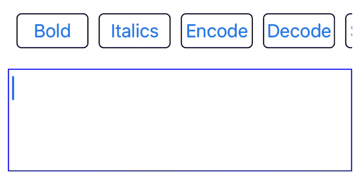

单击按钮时使文本加粗

命令可以直接在给定的编辑器上执行，也可以传递给命令执行器，以便在拥有焦点的编辑器上自动运行。

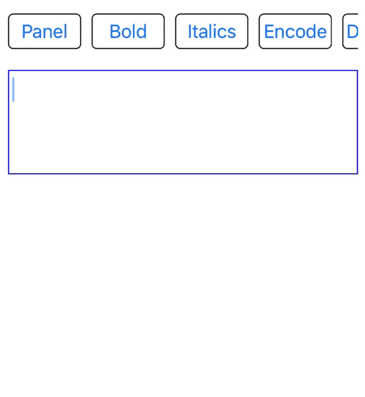

在焦点编辑器上执行命令

质子允许你添加你自己的命令，你可以添加逻辑，来执行如上所示的任务。对于文本格式，[质子](https://github.com/rajdeep/proton/)已经提供了一个基类，可以扩展以添加 iOS 支持的任何[字体特征](https://developer.apple.com/documentation/uikit/uifontdescriptor/symbolictraits)。

创建使文本加粗的命令非常简单:

执行命令只是单击按钮即可调用的另一行代码:

```
BoldCommand().execute(on: editor)
```

根据您的逻辑，命令可以作用于选定的文本或整个编辑器。

## 命令执行程序

命令执行器允许您在任何具有焦点的编辑器上执行给定的命令。如果您有一个包含编辑器的附件，并且该命令既可以在包含附件的主编辑器上执行，也可以在附件内部的编辑器上执行，这就很方便了。它抽象出了知道用户试图在哪个编辑器上运行命令的复杂性。这是通过另一个叫做`Context`的概念实现的，它将编辑器绑定到命令执行器。与命令执行程序共享相同上下文的所有编辑器将自动与命令执行程序链接。

## 语境

上下文就像是连接命令执行器和编辑器的钥匙。上下文允许您用同一个命令执行器链接多个编辑器。这在有多个工具栏作用于一个或多个编辑器(即包含在附件中的编辑器，然后添加到另一个编辑器)的情况下很有用。

## 文本处理器

编辑器不仅需要对显式用户交互进行更改，还需要在用户更改文本时进行更改。一个这样的例子是预输入，其中当输入触发字符时，文本以蓝色突出显示。另一个例子是，当用户键入开始和结束标记时，试图使用标记语法来格式化文本。

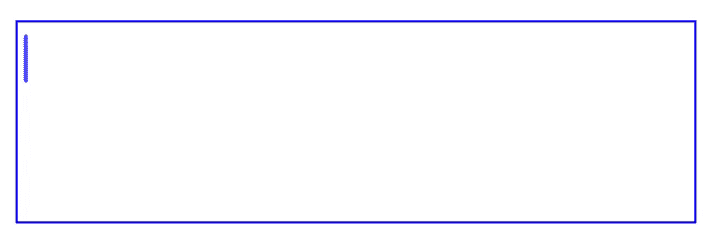

Markdown 文本处理器示例

文本处理器也允许设置优先级。一个编辑器可以注册多个文本处理器。每当编辑器中的文本发生变化时，所有注册的文本处理器都有机会根据需要更改文本或添加属性。

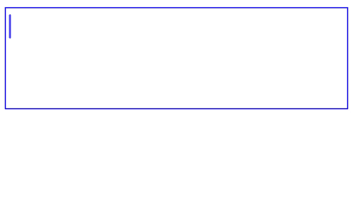

提到 TextProcessor 中继键入的文本

文本处理者有机会根据各自的优先级更改文本/属性。优先级从高到低，所有随后的处理器获得由在它之前运行的处理器改变的文本，即处理器将总是获得更新的文本。如果需要，这也允许组合来自多个文本处理器的效果。除了`high`、`medium`和`low`，文本处理器还有一个优先级叫做`exclusive`。如果一个独占文本处理器正在运行，它会阻止所有其他处理器执行。相反，它通知另一个处理器它们的处理已经被中断，以便处理器可以运行任何清理代码，如果需要的话。

就像命令一样，您可以添加自己的文本处理器来执行如上所示的功能。

## 渲染器

渲染器总是与编辑器密切相关。渲染器和编辑器之间的关系就像 UILabel 和 UITextView 之间的关系一样——只是功能更强大。最简单的形式，渲染器只不过是一个只读编辑器。然而，为了提供一个易于使用且看起来自然的 API，Renderer 封装了编辑器并公开了它自己的一组更适合 Renderer 的特性。例如，拥有文本处理器在呈现器中没有意义，因为用户不能真正在呈现器中键入内容。但是，可能需要命令来提供像在渲染器中高亮显示文本这样的功能。

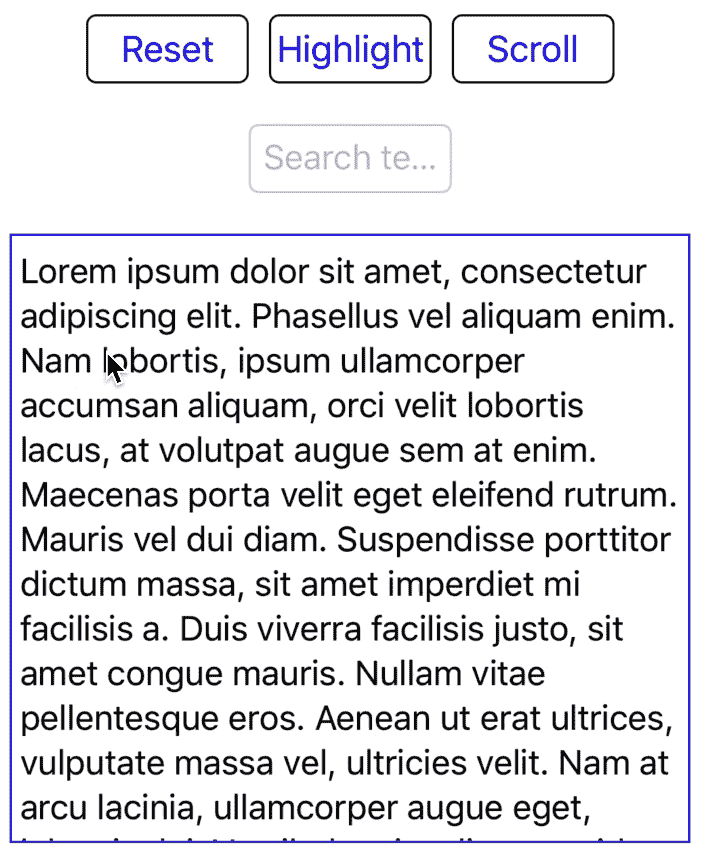

基于选择突出显示文本

借助编辑器，渲染器获得了检查内容和滚动到给定范围等特性。这两种功能都可以用来创建像查找文本这样的功能。

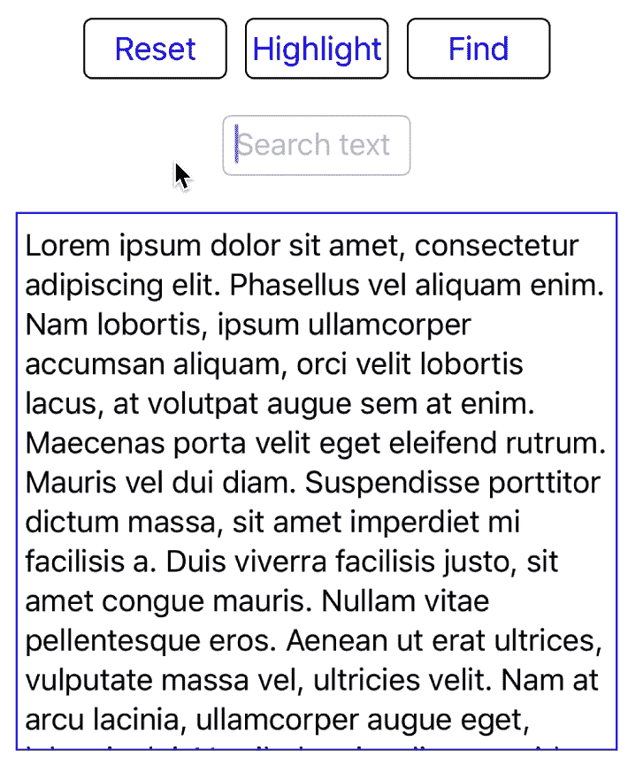

查找文本并滚动到内容

创建这个命令只是另外几行——这要感谢 [Proton](https://github.com/rajdeep/proton/) 提供的帮助函数:

最近添加到 [Proton](https://github.com/rajdeep/proton/) 中的是`ListCommand`和`ListTextProcessor`，它们可以处理你在“`UITextView`中创建列表时可能需要的所有格式。要阅读更多关于列表的内容，请前往 UITextView 中的[列表。](https://medium.com/dev-genius/lists-in-uitextview-756fe2b1407a)

# 故事还在继续…

我计划继续改进 Proton，增加更多我已经想到的功能。我希望你喜欢阅读它，并准备带着[质子](https://github.com/rajdeep/proton/)出去兜风。

我很想收到你的来信。请随时在评论区分享您的评论/想法和任何功能要求。