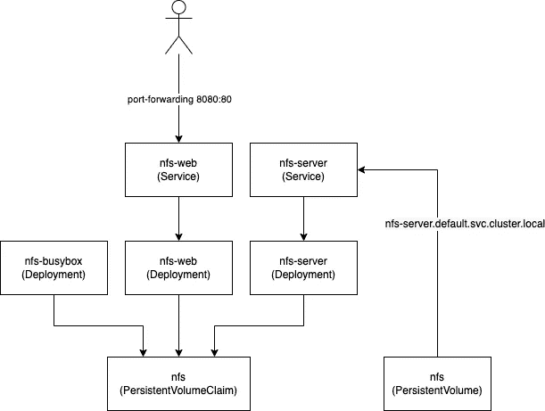
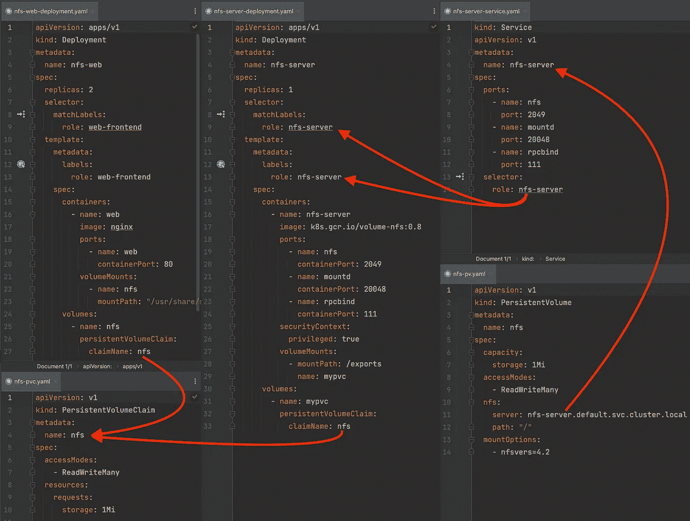
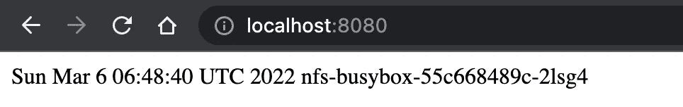

# 在 Kubernetes 中设置网络文件存储(NFS)

> 原文：<https://levelup.gitconnected.com/building-a-network-file-storage-nfs-inside-kubernetes-72955f97fe95>

一个在 Kubernetes 集群中设置网络文件存储(NFS)并从应用程序中访问它的简短示例。


## 要求

*   准备使用 Kubernetes 设置(例如一个[本地设置](/local-kubernetes-development-using-vagrant-and-k3s-547bd5687a7f))
*   [kubectl](https://kubernetes.io/docs/tasks/tools/) 已安装

与我通常的教程不同，我不会在单独的资源文件中进行详细说明，尽管我会简短地解释每个资源的用途，但会为您提供一种简单的方法来复制和粘贴工作设置，以便您可以自己进一步研究它。

## 您将在示例中看到的内容

在本例中，我将为您提供一个库伯内特 NFS 的外观示例。在这个例子中，我们将让不同的 Pod 都向同一个`index.html`写入，然后由另一个 Pod (NGINX)向“web”提供服务。当然不是到公共网站，而是在您的本地机器上，您可以通过端口转发来验证。

所提供的示例开箱即用，可以在本地使用。

像往常一样，我准备了一个 [GitHub 库](https://github.com/Abszissex/medium-k8s-nfs)供您查看完成的代码库，并遵循本文中描述的步骤。

[](https://github.com/Abszissex/medium-k8s-nfs) [## abszisex/medium-k8s-NFS

### 此时您不能执行该操作。您已使用另一个标签页或窗口登录。您已在另一个选项卡中注销，或者…

github.com](https://github.com/Abszissex/medium-k8s-nfs) 

## 一般设置

本教程的设置由七个资源文件组成:

```
/
|- nfs-busybox-deployment.yaml
|- nfs-pv.yaml
|- nfs-pvc.yaml
|- nfs-server-deployment.yaml
|- nfs-server-service.yaml
|- nfs-web-deployment.yaml
|- nfs-web-service.yaml
```

*   `nfs-busybox-deployment.yaml` —此部署修改了`index.html`，我们希望稍后以随机间隔提供服务，方法是将当前日期和 Pod 的主机名写入其中。主机名非常重要，因此我们稍后可以看到不同的 pod 写入了同一个文件。
*   `nfs-pv.yaml` —连接到 NFS 服务器的持久卷。
*   `nfs-pvc.yaml` —所有部署将用于读写共享数据的 PersistentVolumeClaim。
*   `nfs-server-deployment.yaml` —实际的 NFS 服务器部署。
*   `nfs-server-service.yaml` —连接 NFS 部署和持久卷的服务。
*   `nfs-web-deployment.yaml` —一个简单的 NGINX 部署，服务于 busybox 部署修改的来自 NFS 的`index.html`。
*   `nfs-web-service.yaml` —一个简单的服务，公开 NGINX 部署的端口 80，以便以后可以通过浏览器轻松访问该部署。

在最终状态，根据 YAML 配置，资源连接如下所示:



此外，如果您想了解该图的“主要”组件是如何连接的，请查看上面提到的 [GitHub 库](https://github.com/Abszissex/medium-k8s-nfs)，并比较下图中的 YAML 配置:



## YAML 资源公司

我们不会在本文中处理每个单独的资源，因为我不想用 GitHub 库的复制和粘贴来烦你。但是您可以随意在本地集群上应用资源，并检查各个部分之间的交互。

提供的 YAML 文件是开箱即用的，没有任何外部依赖性。如果您只是想开始，可以签出存储库并运行`kubectl apply -f .`将所有 YAML 配置应用到您的集群。根据您的集群性能，所有 pod 应该在 30 秒内可用。

当您的 pod 可用时，您可以使用端口转发来验证它是否按预期工作。

```
# Connect your local port 8080 to the port 80 of the NGINX service
kubectl port-forward svc/nfs-web 8080:80
```

如果您在运行`port-forward`命令时没有得到任何错误，您应该能够在您的浏览器中访问`localhost:8080`,并看到 busybox 副本之一已经写入服务的`index.html`,显示当前时间和 pod 的主机名。

在您的设置中，主机名当然会略有不同。



每秒钟刷新页面，直到看到不同的主机名，验证底层 HTML 文件是否在 busybox Pods 和 NGINX 部署之间共享。

在提供的例子中，在 busybox 部署中定义了两个副本。定义的副本越多，显示的文本变化就越频繁。但是您至少需要两个副本才能看到主机名的不同，这表明 NFS 工作正常。

# 摘要

我希望您可以使用这个非常简短的例子来进一步开发运行在 Kubernetes 集群上的应用程序环境。

## 你想联系吗？

如果你想联系我，请在 LinkedIn 上打电话给我。

另外，请随意查看我的书籍推荐📚。

[](https://mr-pascal.medium.com/my-book-recommendations-4b9f73bf961b) [## 我的书籍推荐

### 在接下来的章节中，你可以找到我对所有日常生活话题的书籍推荐，它们对我帮助很大。

mr-pascal.medium.com](https://mr-pascal.medium.com/my-book-recommendations-4b9f73bf961b) [](https://mr-pascal.medium.com/membership) [## 通过我的推荐链接加入 Medium—Pascal Zwikirsch

### 作为一个媒体会员，你的会员费的一部分会给你阅读的作家，你可以完全接触到每一个故事…

mr-pascal.medium.com](https://mr-pascal.medium.com/membership)