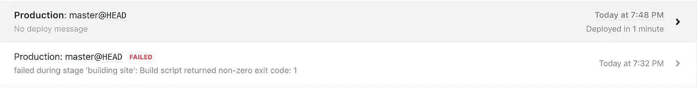
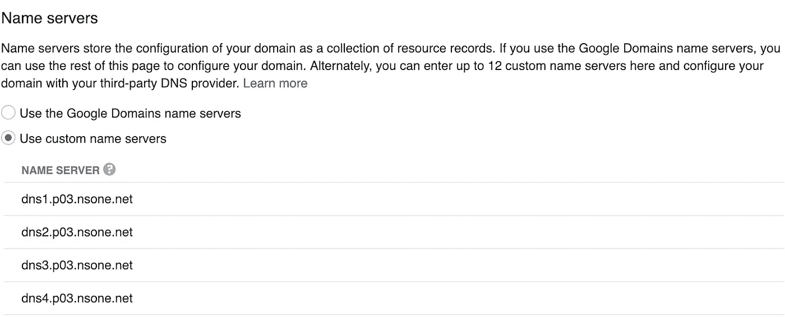
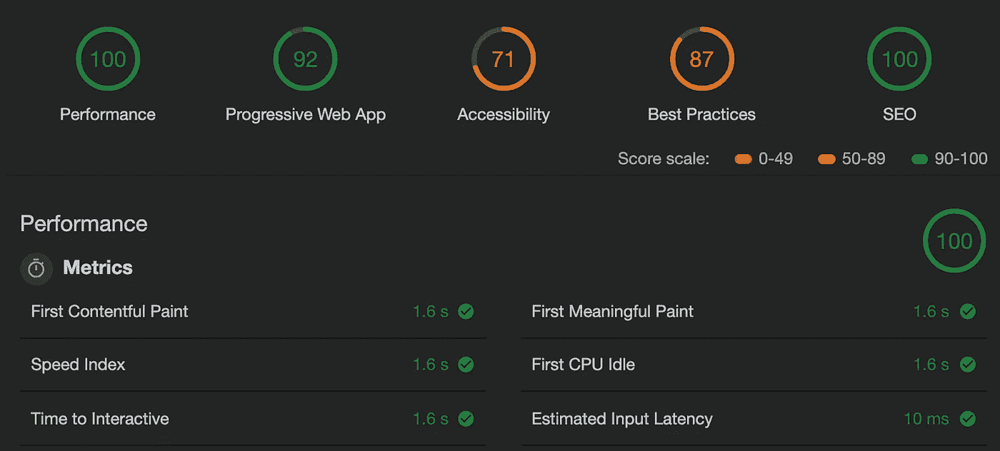

# 用 Gatsby.js 建立一个个人网站

> 原文：<https://levelup.gitconnected.com/building-a-personal-site-with-gatsby-js-contentful-and-netlify-d9e614ed9a77>

我用 [JAMstack](https://jamstack.org/) 中的最新工具建立[个人网站](https://timrbula.me)的过程。

情况就是这样

# 结构

在过去几年的工作中，我一直使用 [Gatsby.js](https://www.gatsbyjs.org/) 。凭借其出色的性能、大量的插件和完整的文档(众多特性中的一个),对我来说，这是一个建立个人网站的简单起点。我选择了 Starter[Gatsby Starter:Mate](https://github.com/EmaSuriano/gatsby-starter-mate)来快速启动项目。一个简单的`npx gatsby new personal-site [https://github.com/EmaSuriano](https://github.com/EmaSuriano)/gastsby-starter-mate`就创建了一个新项目，我开始运行了。

# 羧甲基淀粉钠

盖茨比首发:Mate 已经与 [Contentful](http://www.contentful.com) 融合。我没有使用该产品的经验，但是在通读了文档并浏览了演示站点和仪表板之后，这似乎是一种将站点内容与代码分开的强大方法。对于一个简单的个人网站来说，这可能有点过分了，但是我还是想探索一下这个产品。内容模型和灵活的 API 套件非常吸引人，并使通过 GraphQL 与 Gatsby.js 的集成变得容易。我使用 Mate starter 的内容模型&内容作为起点，并从那里开始添加我自己的内容。

# 主办；主持

Gatsby 有几个托管服务的文档，我认为包括:

*   现在
*   Github 页面
*   网络生活

经过一番研究，我选择了 [Netlify](https://www.netlify.com/) ，因为它专注且简单。这不是一个完全明智的决定，但它对我的目的来说迄今为止效果很好。持续集成和自动 HTTPS 像宣传的那样工作，有点自动。作为一名开发者，我理解你不喜欢一切都被抽象化的观点，但不可否认的是，把一个网站放到网上是多么容易。

## 解决纷争

为项目连接 [GitHub repo](https://github.com/timrbula/personal-site) 的过程非常简单，几分钟后我就尝试了网站的第一次构建。它失败了😞。在深入研究了日志和代码之后，我发现为了连接到 Contentful，需要将一个`space_id`和一个`api_key` 作为环境变量注入。通过*设置- >构建&部署*，在 Netlify 仪表板中添加环境变量很容易。在我添加了它们之后，我尝试了另一个版本，并且成功了！💚

失败和成功😋

# 领域

大约一年前，我通过谷歌域名购买了一个域名。我从来没有用它来建立一个网站，但体验相对简单，价格也足够实惠。我想要那个域名和一个新的域名重定向到我的个人网站，所以我决定再次使用谷歌域名购买新的域名。我必须在 Netlify 中设置以下内容，以便在两个域上都可以访问我的站点:

*   自定义主域
*   域别名

## 自定义主域

设置我的自定义主域是通过以下步骤完成的:

1.  将新购买的域作为自定义域添加到 Netlify 仪表板中。
2.  使用 Netlify 中的四个 DNS 服务器值更新 Google Domains 中的*配置 DNS - >* *名称服务器*设置。

DNS 更改在五分钟内传播，我的站点在我的自定义域中可用。

谷歌域名中的自定义域名服务器

## 域别名

如上所述，我注册了另一个域名，我想重定向到该网站。这是通过以下方式完成的:

1.  将以前购买的域作为*域别名*添加到 Netlify 仪表板*中。*
2.  使用 Netlify 提供的信息向 Google Domains 中的*配置 DNS - >自定义资源记录*设置添加一条记录。

## 安全性

在 DNS 更改被传播和确认后，Netlify 通过“让我们加密”自动设置 HTTPS (SSL/TLS)。精彩的😀。

# 结论

该网站可在 [timrbula.me](https://timrbula.me/) 找到。这是一个非常简单的网站，不会偏离起点太远。对于一个小的 Gatsby 应用程序来说，性能如预期的那样好。

谷歌灯塔评分显示一个伟大的性能得分。归功于盖茨比

构建和部署过程也非常简单。任何对`master`分支的推送或者 Contentful 上内容的更新(通过一个 webhook)都会触发一个新版本通过 Netlify 部署出去。

总的来说，我对创建和托管一个有吸引力的、高性能的静态站点的工具印象深刻。我没有涵盖这个过程中的所有内容，尤其是我在 starter 中所做的 React 更改，因为我认为它对于任何有前端经验的人来说都是非常简单的，并不是特别有趣。我还为这个网站做了更多的工作，比如交叉发布中型文章，设置 CI 测试，修复可访问性问题，以及对我正在使用的工具提供的所有功能进行更多的研究。尽管如此，这是一个很好的开始，我期待着继续使用这些工具。

 [## 学习 React -最佳 React 教程(2018) | gitconnected

### 前 45 名 React 教程。课程由开发人员提交并投票，使您能够找到最好的 React 课程…

gitconnected.com](https://gitconnected.com/learn/react)