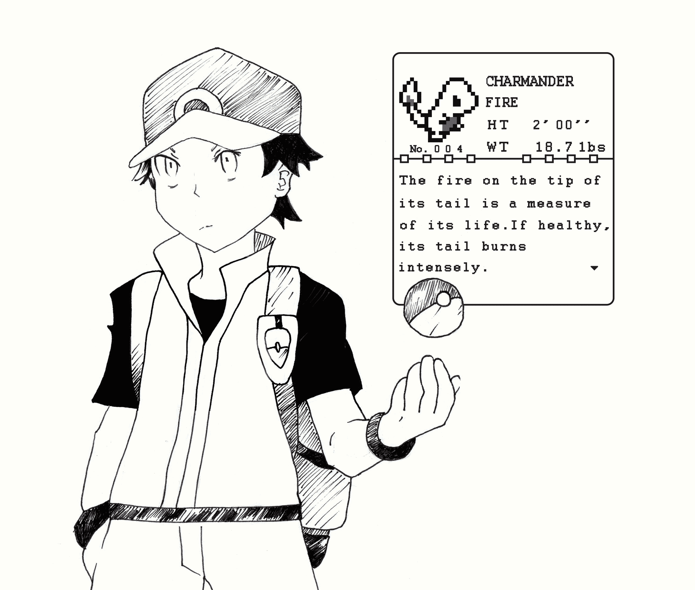

# 用 React 钩子和上下文 API 构建口袋妖怪 web 应用程序

> 原文：<https://levelup.gitconnected.com/building-a-pokemon-web-app-with-react-hooks-and-the-context-api-8f9cc044ffc7>

由 [kazuh.yasiro](https://www.instagram.com/kazuh.illust) 创作的灰烬艺术

本帖首发于 [***TK 的博客***](https://leandrotk.github.io/tk/2020/04/react-hooks-context-api-and-pokemons/index.html) 。

经过 7 年使用 Ruby、Python 和 vanilla JavaScript 的全栈开发，我现在主要使用 JavaScript、Typescript、React 和 Redux。JavaScript 社区非常棒..而且非常快。很多东西都是“一夜之间”创造出来的，只是象征性的，但有时也是真实的。而且真的很难跟上。

> *心理提示:我总觉得我在 JavaScript 聚会上迟到了。我想去那里。尽管我不太喜欢派对。*

使用 React 和 Redux 年，我觉得我需要学习新的东西，比如钩子和上下文 API 来管理状态。在阅读了一些关于它的文章后，我想尝试这些概念，所以我创建了一个简单的项目作为实验室来试验那些东西。

我从小就对口袋妖怪充满热情。玩 Game Boy，征服所有联赛，这是一段有趣的时光。现在，作为一名开发者，我想玩玩[口袋妖怪 API](https://pokeapi.co/) 。

所以基本上我想建立一个简单的网页，我可以在这个页面的各个部分之间共享数据。我想:如果我建立一个包含三个框的页面会怎么样:

*   一个盒子，里面有所有现存口袋妖怪的清单
*   一个盒子，里面有所有捕获的口袋妖怪的清单
*   一个可以向列表中添加新口袋妖怪的输入框

我可以为每个盒子构建行为或动作:

*   对于第一个盒子里的每个口袋妖怪，我可以捕捉它们并发送到第二个盒子
*   对于第二个盒子里的每个口袋妖怪，我可以释放它们并发送到第一个盒子
*   作为一个游戏神，我能够通过填充输入来创建口袋妖怪，并将它们发送到第一个盒子

好了，我很清楚我们需要在这里实现的所有特性。列表和动作。我们开始吧！

# 列出口袋妖怪

我想首先建立的基本功能是列出口袋妖怪。所以对于一个对象数组，我想列出并显示每个对象的`name`属性。就这样。

我将从第一个盒子开始:现存的口袋妖怪。起初，我想，我不需要口袋妖怪 API，我们只是模拟一下列表，看看它是否有效。使用`useState`，我可以声明我的组件状态并使用它。

我们用模拟口袋妖怪的默认值来定义它，只是为了测试它。

这里我们有三个口袋妖怪对象的列表。`useState`钩子提供了两个项目:当前状态和一个让您更新这个已创建状态的函数。

现在有了口袋妖怪的状态，我们可以对它进行映射，并呈现每个口袋妖怪的名称。

它只是一个在段落标签中返回每个口袋妖怪名字的地图。

这是实现的整个组件:

这里有一点小小的改动:

*   在口袋妖怪的`id`和`name`的组合中增加了`key`
*   并为`id`属性渲染一段(我只是测试一下。但我们稍后会删除它)

太好了！现在我们有了第一份名单。

我想做同样的实现，但现在是为了捕捉口袋妖怪。但是对于捕捉到的口袋妖怪，我想做成空单。因为“游戏”开始的时候，我其实并没有什么被捕获的口袋妖怪，对吧？对！

就是这样，真的很简单！

整个组件看起来与另一个组件相似:

这里我们映射，但是因为数组是空的，所以它不呈现任何东西。

现在我有了两个主要组件，我可以将它们放在`App`组件中:

# 捕获和释放

这是我们应用程序的第二部分。我们将捕捉和释放口袋妖怪。所以让我们想想预期的行为。

对于可用口袋妖怪列表中的每个口袋妖怪，我想启用一个动作来捕捉它们。捕捉动作会将它们从列表中删除，并将其添加到已捕捉的口袋妖怪列表中。

释放动作将具有类似的行为。但是不是从可用列表移动到捕获列表，而是相反。我们会将它们从捕获列表移动到可用列表。

因此，两个盒子需要共享数据，以便能够将口袋妖怪添加到另一个列表中。我们如何做到这一点，因为它们是应用程序中的不同组件？我们来谈谈 React 上下文 API。

上下文 API 被设计为为一个已定义的 React 组件树创建全局数据。由于数据是全局的，我们可以在这个定义的树中的组件之间共享它。所以让我们用它在两个盒子之间分享我们简单的口袋妖怪数据。

> *心理提示:“上下文主要用于不同嵌套层次的许多组件需要访问某些数据的时候。”—反应文件*

使用 API，我们简单地创建一个新的上下文:

现在，有了`PokemonContext`，我们可以使用它的提供者。它将作为组件树的组件包装器。它向这些组件提供全局数据，并使它们能够订阅与该上下文相关的任何更改。看起来是这样的:

`value`属性只是上下文提供给包装组件的一个值。我们应该向可用列表和捕获列表提供什么？

*   `pokemons`:在可用列表中列出
*   `capturedPokemons`:在捕获列表中列出
*   `setPokemons`:能够更新可用列表
*   `setCapturedPokemons`:能够更新捕获列表

正如我在前面的`useState`部分提到的，这个钩子总是提供一对:状态和更新这个状态的函数。这个函数将处理和更新上下文状态。换言之，他们是`setPokemons`和`setCapturedPokemons`。怎么会？

现在我们有了`setPokemons`。

而现在我们也有了`setCapturedPokemons`。

有了所有这些值，我们现在可以将它们传递给提供者的`value` prop。

我创建了一个`PokemonProvider`来包装所有这些数据和 API，以创建上下文并返回带有定义值的上下文提供者。

但是我们如何向组件提供这些数据和 API 呢？我们需要做两件主要的事情:

*   将组件包装到这个上下文提供者中
*   在每个组件中使用上下文

让我们先把它们包起来:

我们通过使用`useContext`并传递创建的`PokemonContext`来使用上下文。像这样:

对于可用的口袋妖怪，我们想要捕获它们，所以有`setCapturedPokemons`函数 API 来更新捕获的口袋妖怪会很有用。当口袋妖怪被捕获时，我们需要将它从可用列表中删除。`setPokemons`这里也需要。为了更新每个列表，我们需要最新的数据。所以基本上我们需要来自上下文提供者的一切。

我们需要构建一个带有捕捉口袋妖怪动作的按钮:

*   `<button>`标签带`onClick`调用`capture`函数并传递口袋妖怪

*   `capture`功能将更新`pokemons`和`capturedPokemons`列表

要更新`capturedPokemons`，我们可以用当前的`capturedPokemons`和要捕捉的口袋妖怪调用`setCapturedPokemons`函数。

而要更新`pokemons`列表，只需过滤将要捕捉的口袋妖怪即可。

`removePokemonFromList`只是一个简单的功能，通过删除捕获的口袋妖怪来过滤口袋妖怪。

组件现在看起来怎么样？

它将看起来非常类似于捕捉口袋妖怪组件。代替`capture`，它将是一个`release`功能:

# 降低复杂性

现在我们使用`useState`、上下文 API、上下文提供者和`useContext`。更重要的是，我们可以在口袋妖怪盒子之间共享数据。

另一种管理状态的方法是使用`useReducer`作为`useState`的替代。

减速器的生命周期是这样工作的:`useReducer`提供了一个`dispatch`功能。通过这个函数，我们可以在组件内部分派一个`action`。`reducer`接收动作和状态。它理解动作的类型，处理数据，并返回新的状态。现在，新状态可以在组件中使用了。

作为一个练习，为了更好地理解这个钩子，我试着用它来代替`useState`。

`useState`在`PokemonProvider`里面。我们可以在这个数据结构中重新定义可用的和捕获的口袋妖怪的初始状态:

并将该值传递给`useReducer`:

`useReducer`接收两个参数:减速器和初始状态。让我们现在建造`pokemonReducer`。

缩减器接收当前状态和被调度的动作。

这里我们得到动作类型并返回一个新的状态。动作是一个对象。看起来是这样的:

但也可能更大:

是这样的，我们传递一个口袋妖怪给动作对象。让我们暂停一分钟，想一想我们想在减速器内部做什么。

在这里，我们通常更新数据和处理动作。动作被分派。所以行动就是行为。我们的应用程序的行为是:捕获和释放！这些是我们在这里需要处理的行动。

这是我们的减速器的样子:

如果我们的动作有一个类型`CAPTURE`，我们用一种方式处理它。如果我们的动作类型是`RELEASE`，我们用另一种方式处理它。如果动作类型与这些类型都不匹配，就返回当前状态。

当我们捕获口袋妖怪时，我们需要更新两个列表:从可用列表中删除口袋妖怪，并将其添加到捕获列表中。这个状态就是我们需要从 reducer 返回的。

`capturePokemon`函数只返回更新后的列表。`getPokemonsList`从可用列表中删除捕获的口袋妖怪。

我们在减速器中使用了这个新功能:

现在的`release`功能！

`getCapturedPokemons`从捕获列表中移除释放的口袋妖怪。`releasePokemon`函数返回更新后的列表。

我们的减速器现在看起来像这样:

只有一个小的重构:动作类型！这些是字符串，我们可以将它们提取到一个常量中，并提供给调度程序。

减速器:

整个 reducer 文件如下所示:

由于缩减器现在已经实现，我们可以将它导入到我们的提供者中，并在`useReducer`钩子上使用它。

当我们在`PokemonProvider`中时，我们希望为消费组件提供一些值:捕获和释放动作。

这些函数只需要调度正确的动作类型，把口袋妖怪传给减速器就可以了。

*   `capture`函数:它接收 pokemon 并返回一个新函数，该函数调度类型为`CAPTURE`的动作和被捕获的 pokemon。

*   `release`函数:它接收 pokemon 并返回一个新函数，该函数调度一个类型为`RELEASE`的动作并释放 pokemon。

现在，有了实现的状态和动作，我们可以向消费组件提供这些值。只需更新提供商价值主张。

太好了！现在回到组件。让我们用这些新动作。所有的捕获和释放逻辑都封装在我们的 provider 和 reducer 中。我们的组件现在很干净了。`useContext`将看起来像这样:

整个组件:

对于捕获的口袋妖怪组件，它看起来会非常相似。`useContext`:

整个组件:

没有逻辑。只是 UI。非常干净。

# 口袋妖怪之神:创造者

现在我们有了两个列表之间的通信，我想建立第三个盒子。这将是我们如何创造新的口袋妖怪。但它只是一个简单的输入和提交按钮。当我们在输入中添加一个口袋妖怪名称并按下按钮时，它会调度一个动作将这个口袋妖怪添加到可用列表中。

因为我们需要访问可用列表来更新它，所以我们需要共享状态。所以我们的组件将被我们的`PokemonProvider`和其他组件包装在一起。

现在让我们构建`PokemonForm`组件。表单非常简单:

我们有一个表单、一个输入和一个按钮。总的来说，我们还有一个函数来处理表单提交，另一个函数来处理关于更改的输入。

每当用户输入或删除一个字符时，就会调用`handleNameOnChange`。我想建立一个地方州，一个口袋妖怪名字的代表。有了这个状态，我们可以在提交表单时使用它来调度。

因为我们想尝试钩子，所以我们将使用`useState`来处理这个本地状态。

每次用户与输入交互时，我们使用`setPokemonName`来更新`pokemonName`。

并且`handleFormSubmit`是调度新口袋妖怪以将其添加到可用列表的功能。

`addPokemon`是我们稍后将构建的 API。它接收口袋妖怪:一个 id 和名字。名字就是我们定义的本地状态:`pokemonName`。

`generateID`只是我构建的一个简单函数，用来生成一个随机数。看起来是这样的:

`addPokemon`将由我们构建的上下文 api 提供。这样，这个功能可以接收新的口袋妖怪，并添加到可用列表中。看起来是这样的:

它会调度这个动作类型`ADD_POKEMON`，还会传口袋妖怪。

在我们的 reducer 中，我们为`ADD_POKEMON`添加了案例，并处理状态以将新的 pokemon 添加到状态中。

并且`addPokemon`功能将是:

另一种方法是破坏状态，只改变 pokemons 属性。像这样:

回到我们的组件，我们只需要让`useContext`提供基于`PokemonContext`的`addPokemon`调度 API:

整个组件看起来像这样:

现在我们有了可用的口袋妖怪列表，捕获的口袋妖怪列表，以及创建新口袋妖怪的第三个盒子。

# 口袋妖怪效果

现在我们的应用程序几乎完成了，我们可以用 PokeAPI 中的口袋妖怪列表来替换被嘲笑的口袋妖怪。

因此，在函数组件内部，我们不能真正地产生像登录或订阅这样的副作用。这就是`useEffect`挂钩存在的原因。有了这个钩子，我们可以获取口袋妖怪(一个副作用)，并添加到列表中。

获取 PokeAPI 将如下所示:

`results`属性是获取的口袋妖怪列表。有了这些数据，我们将能够添加到口袋妖怪列表。

让我们获取`useEffect`中的请求代码:

为了能够调用`async-await`，我们需要创建一个函数并在以后调用它。空数组是一个参数，使`useEffect`知道它将查找以重新运行的依赖关系。

默认行为是运行每个已完成渲染的效果。如果我们在这个列表中添加一个依赖项，那么`useEffect`只会在依赖项改变时重新运行，而不是在所有完成的渲染中运行。

现在，我们获取了口袋妖怪，我们需要更新列表。这是一种行动，一种新的行为。我们需要再次使用 dispatch，在 reducer 中实现一个新的类型，并在上下文提供者中更新状态。

在`PokemonContext`中，我们创建了`addPokemons`函数，为使用它的消费组件提供一个 API。

它接收口袋妖怪，并派遣一个新的行动:`ADD_POKEMONS`。

在 reducer 中，我们添加这个新类型，expect pokemons，并调用一个函数将 pokemons 添加到可用列表状态。

`addPokemons`功能只是将口袋妖怪添加到列表中:

我们可以通过进行状态析构和对象属性值简写来对此进行重构:

因为我们现在向消费组件提供了这个函数 API，所以我们可以使用`useContext`来获取它。

整个组件看起来像这样:

# 包扎

这是我尝试分享我的学习和经验，同时尝试在一个迷你副业挂钩。我们学习了如何用`useState`处理局部状态，用`Context API`构建全局状态，如何用`useReducer`重写和替换`useState`，以及在`useEffect`中产生副作用。

> *免责声明:这只是一个实验项目。只是为了学习。我没有关于 Hooks 良好实践的答案，也不知道如何让它在大项目中可扩展。*

我希望这是一本好书！继续学习，继续编码！

# 资源

*   [反应文档:上下文](https://reactjs.org/docs/context.html)
*   [反应文件:挂钩](https://reactjs.org/docs/hooks-reference.html)
*   [口袋妖怪挂钩 side-project:源代码](https://github.com/leandrotk/pokehooks-labs)
*   [初级 JavaScript 课程](https://BeginnerJavaScript.com/friend/LEANDRO)
*   [针对初学者的反应课程](https://ReactForBeginners.com/friend/LEANDRO)
*   [高级反应过程](https://AdvancedReact.com/friend/LEANDRO)
*   [ES6 课程](https://ES6.io/friend/LEANDRO)
*   [为期一个月的 JavaScript 课程](https://mbsy.co/lFtbC)
*   [学习之路有什么反应](https://www.educative.io/courses/the-road-to-learn-react?aff=x8bV)
*   [学习 React 前的 JavaScript 基础知识](https://www.educative.io/courses/javascript-fundamentals-before-learning-react?aff=x8bV)
*   [重新推出 React: V16 及更高版本](https://www.educative.io/courses/reintroducing-react-v16-beyond?aff=x8bV)
*   [带挂钩的高级反应模式](https://www.educative.io/courses/advanced-react-patterns-with-hooks?aff=x8bV)
*   [实用 Redux](https://www.educative.io/courses/practical-redux)