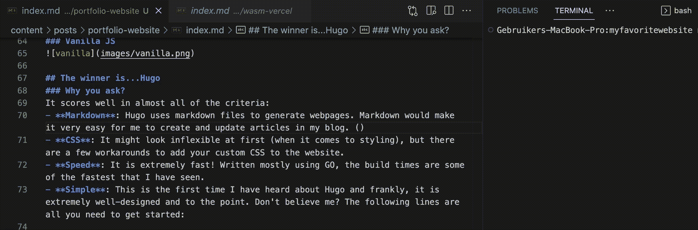

# 作为开发人员构建作品集网站

> 原文：<https://levelup.gitconnected.com/building-a-portfolio-website-as-a-developer-8066df449e15>

关于选择正确工具的(大部分)非技术性讨论。


快速声明:这不是一个逐步建立网站的指南。这是一个关于开发人员可用的不同选项的非技术性讨论。然而，我确实略微提到了我选择用来建立我的作品集网站的框架。

# **选择麻痹**

几年来，Web 开发一直处在一个奇怪的十字路口。从技术角度来看，似乎地平线上有层出不穷的框架。这可能意味着好的和坏的。积极的一面是选择的力量——选择可用的最佳技术来创建我们的 web 应用程序的能力。

另一方面，开发人员可用的选项数量往往会导致选择瘫痪。学习资源的平均质量变得越来越不可靠和不可见，导致独立开发人员的代码质量更低。

例如，当学习 NodeJS 时，我很惊讶为什么没有一种简单的方式来发出 [GET/PUT 请求](https://stackoverflow.com/questions/9577611/http-get-request-in-node-js-express)。这让我又在谷歌上搜索了几轮，最终我没有使用 NodeJS [文档](https://nodejs.org/api/http.html)中推荐的产品。

# **手头的问题**

我想创建一个作品集网站来展示我的项目和发表我的文章。坦率地说，在过去，我陷入了围绕选择的框架来塑造问题陈述的陷阱。然而，我们都同意应该反过来。对于我的项目，要求如下:

*   容易发表文章。
*   易于维护。
*   可以轻松托管—最好是免费的🤓
*   时间投入不宜超过 2 周。
*   必须可定制—使用`CSS`或`SCSS`

# **检查你的优先级**

有了现在设定的需求，我现在可以选择最适合它们的框架了，对吗？不完全是，首先我需要思考理想的“框架”应该提供什么。根据需要，按照重要性降低的顺序，根据以下参数来判断框架的质量:

## **1。可维护性**

*   代码库需要易于维护。我计划定期发表文章，并把我的网站作为我的博客的切入点。
*   能够轻松更新，然后编辑我的网站的内容是必须具备的。

## **2。灵活性**

*   作为一名开发人员，我应该能够在我的网站上添加我的风格。没有通过几天的文件阅读我的网站风格将不胜感激。
*   这是包括 WordPress 在内的许多无代码/低代码替代品无法充分提供的。

## **3。体验**

*   在我看来，一个框架的学习曲线可以决定它的吸引力。
*   快速启动并运行开发服务器将极大地有助于减少项目投入的时间。

## **4。便携性**

*   在 Heroku 和 Vercel 上部署过之后，全面管理的 CI/CD 管道让您高枕无忧。
*   理想情况下，网站的部署应该是免费的，并通过 PaaS 提供服务。

# **狩猎为栈**

我们现在有了要求和判断标准。利用这两者，我找到了一些潜在的候选人:

## [**按下**](http://wordpress.com/)


## [**反应过来**](https://reactjs.org)


## [**雨果**](https://gohugo.io)


## **香草 JS**


# 获胜者是……雨果

## 你为什么这么问？

它在几乎所有的标准上都得分很高:

*   **Markdown** : Hugo 使用 Markdown 文件生成网页。Markdown 会让我在博客中创建和更新文章变得非常容易。(就像我现在正在做的一样)



*   CSS:当涉及到样式的时候，一开始可能看起来不灵活，但是有一些变通方法可以把你的定制 CSS 添加到网站上。
*   **速度**:极快！主要使用 GO 编写，构建时间是我见过的最快的。
*   **简单**:这是我第一次听说 Hugo，设计得极其精良，切中要害。不相信我？下面几行是您开始工作所需的全部内容:

```
# Install Hugobrew install hugo# Create a websitehugo new site BrandNewSite# Add contenthugo new posts/my-first-post.md# Run the development serverhugo server -D# Build for productionhugo -D
```

## **部署**

我只是使用了一个预先配置的 GitHub 动作，将其部署在 GitHub 页面上。这个解决方案提供了我所希望的一切。

✅完全控制了

每次我推送至 master 时，✅都会构建静态文件

✅完全自由了

# **结论**

重申一下，写这篇文章不是为了推广我在网上遇到的一个新框架。但是写这篇文章是为了强调在选择一种华而不实的新技术来解决问题之前先看看问题陈述的重要性。最后，华而不实的新技术可能不能很好地满足需求，你可能最终生产出一个不合格的产品。

这个项目提醒我要成为语言/框架/技术不可知论者。所以跟我一起说:

> 需求塑造了技术，而不是相反。

# **想要连接？**

感谢您阅读我的文章。你也可以在 [LinkedIn](https://www.linkedin.com/in/mukkundsunjii/) 上找到我，在 [GitHub](https://github.com/mukkund1996/mukkund1996.github.io) 上找到我的工作。