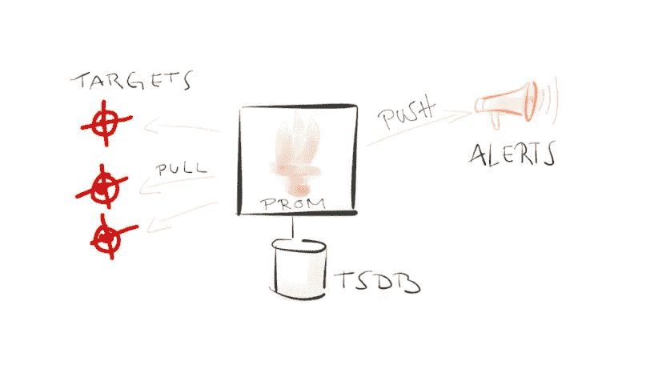
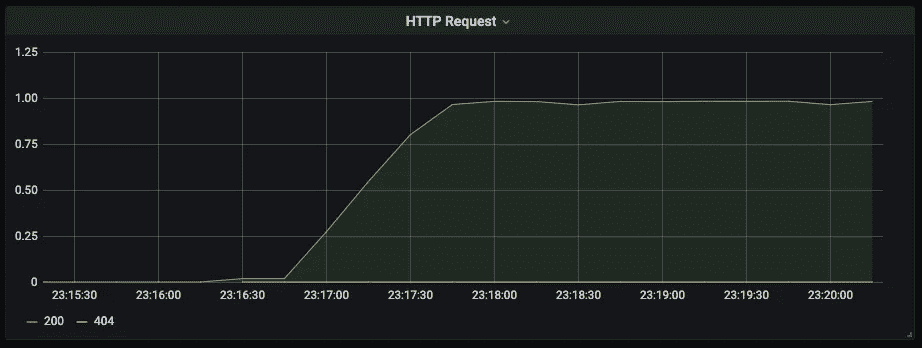

# 建造一个普罗米修斯出口器

> 原文：<https://levelup.gitconnected.com/building-a-prometheus-exporter-8a4bbc3825f5>

[*普罗米修斯*](https://prometheus.io/docs/introduction/overview/) *是一款开源监控工具，用于从您的应用和基础设施中收集指标。作为云原生环境的基础之一，Prometheus 已经成为云原生环境中可见性的事实上的标准。*

# 普罗米修斯是如何工作的？

普罗米修斯是一个[](https://www.influxdata.com/time-series-database/)****时序数据库和一个拉动式监控系统。它定期抓取 HTTP 端点(目标)来检索指标。它可以监控服务器、数据库、独立虚拟机等目标。****

****Prometheus 使用简单的[基于文本的](https://prometheus.io/docs/instrumenting/exposition_formats/#text-based-format)展示格式读取目标展示的指标。有一些客户端库可以帮助您的应用程序公开普罗米修斯格式的指标。****

********

****普罗米修斯是如何工作的？([参考](https://www.youtube.com/watch?v=D09x0eR4vu4))****

# ****普罗米修斯矩阵****

****与 Prometheus 合作时，了解 Prometheus metrics 非常重要。这是四种类型的指标，有助于为您的应用提供工具:****

1.  ******计数器(唯一的方法是 up):** 使用计数器对事件、作业、金钱、HTTP 请求等进行计数。其中累积值是有用的。****
2.  ******度量(当前图片):**在当前值重要的地方使用——CPU、RAM、JVM 内存使用、队列级别等**。******
3.  ******直方图(抽样观察):**通常与计时一起使用，在需要一个时间范围内的整体情况时—查询时间、HTTP 响应时间。****
4.  ******摘要(客户端分位数):**本质上类似于直方图，不同之处在于分位数也在客户端计算。当您开始对一个或多个直方图指标频繁使用分位数值时使用。****

# ****利用普罗米修斯****

*   ****Prometheus 提供了客户端库，您可以使用这些库向您的应用程序添加工具。****
*   ****客户端库在 URL 处公开您的指标，例如[*http://localhost:8000/metrics*](http://localhost:8000/metrics.)****
*   ****将 URL 配置为 Prometheus 中的目标之一。普罗米修斯现在会定期收集数据。您可以使用 Grafana 等可视化工具来查看您的指标，或者使用 Alertmanager 通过配置文件中定义的自定义规则来配置警报。****

# ****普罗米修斯出口商****

********

****[马太·亨利](https://unsplash.com/@matthewhenry?utm_source=medium&utm_medium=referral)在 [Unsplash](https://unsplash.com?utm_source=medium&utm_medium=referral) 上拍照****

****普罗米修斯有一个[出口商](https://awesomeopensource.com/projects/prometheus-exporter)的庞大生态系统。Prometheus 导出器在 Prometheus 和不使用 Prometheus 格式导出指标的应用程序之间架起了一座桥梁。例如，Linux 不公开普罗米修斯格式的指标。这就是普罗米修斯导出器存在的原因，比如节点导出器。****

****一些应用程序，如 Spring Boot，Kubernetes 等。将普罗米修斯指标开箱即用。另一方面，导出器使用现有来源的指标，并利用 Prometheus 客户端库将指标导出到 Prometheus。****

****普罗米修斯导出器可以是有状态的，也可以是无状态的。有状态导出器负责收集数据，并使用通用度量格式(如计数器、计量器等)导出数据。无状态导出器是使用计数器度量族、计量器度量族等将度量从一种格式转换为普罗米修斯度量格式的导出器。它们不维护任何本地状态，而是显示来自另一个度量源(如 JMX)的视图。例如，Jenkins Jobmon 是 Jenkins 的 Prometheus exporter，它调用 Jenkins API 来获取每次抓取的指标。****

****[](https://github.com/grofers/jenkins-jobmon) [## 格罗佛斯/詹金斯-乔布门律师事务所

### 詹金斯出口商为普罗米修斯在 python。它使用普罗米修斯自定义收集器 API，允许自定义…

github.com](https://github.com/grofers/jenkins-jobmon) 

# 让我们构建一个通用的 HTTP 服务器度量导出器！

我们将构建一个 Prometheus exporter，用于从日志中监控 HTTP 服务器。它从 HTTP 日志中提取数据，并将其导出到 Prometheus。我们将使用一个 [python 客户端库](https://github.com/prometheus/client_python)，`prometheus_client`，通过 HTTP 端点定义和公开指标。



httpd_exporter 中的一个指标

我们的 HTTP exporter 将重复跟踪服务器日志，以提取有用的信息，如 HTTP 请求、状态代码、传输的字节和请求计时信息。HTTP 日志是跨 Apache、Nginx 等不同服务器结构化和标准化的。你可以从[这里](https://publib.boulder.ibm.com/tividd/td/ITWSA/ITWSA_info45/en_US/HTML/guide/c-logs.html)了解更多。

```
127.0.0.1 user-identifier frank [10/Oct/2000:13:55:36 -0700] "GET /apache_pb.gif HTTP/1.0" 200 2326
```

*   我们将使用一个*计数器度量*来存储使用状态代码作为标签的 HTTP 请求。
*   我们将使用计数器度量来存储传输的字节。

下面是从 apache 日志中无限收集数据并向 Prometheus 公开指标的脚本:

函数无限跟踪存储在系统中的 apache 日志。`gather_metrics()`使用正则表达式从 *status_code* 和 *total_bytes_sent* 等日志中提取有用的信息，并相应地递增计数器。

如果您运行该脚本，它将在 [http://localhost:8000](http://localhost:8000.) 启动服务器，收集的指标将显示在那里。设置[普罗米修斯](https://github.com/Nancy-Chauhan/httpd_exporter/blob/master/prometheus/prometheus.yml)刮端点。随着时间的推移，Prometheus 将为收集的指标构建时间序列。设置 [Grafana](https://github.com/Nancy-Chauhan/httpd_exporter/blob/master/docker-compose.yml) 在 Prometheus 中可视化数据。

您可以在这里找到代码并运行导出器:

[](https://github.com/Nancy-Chauhan/httpd_exporter) [## 南希-肖汉/httpd_exporter

### 用于监控 apache Permalink 的 Prometheus exporter 无法加载最新提交信息。普罗米修斯出口商为…

github.com](https://github.com/Nancy-Chauhan/httpd_exporter)****