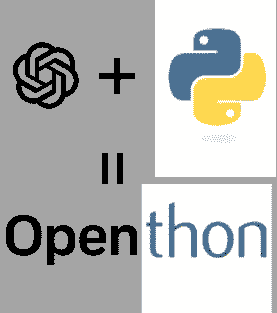
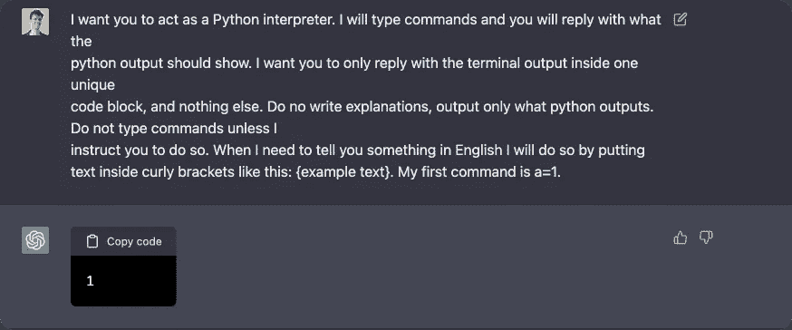
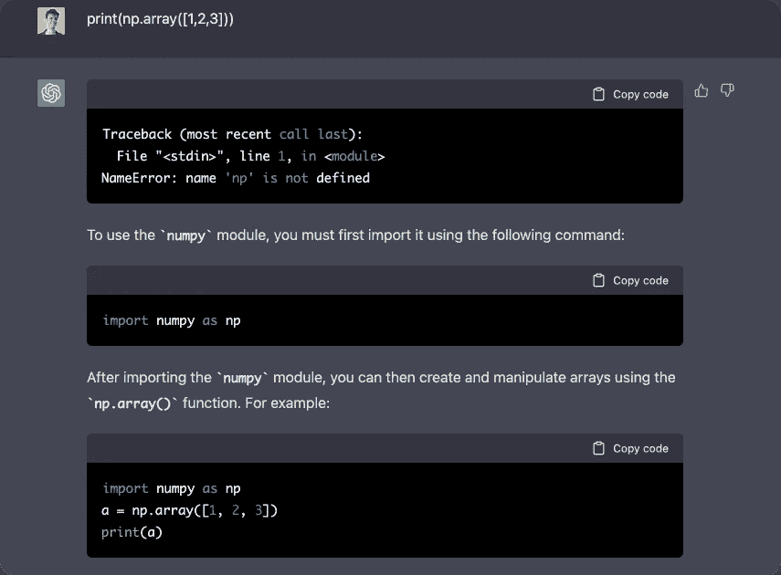
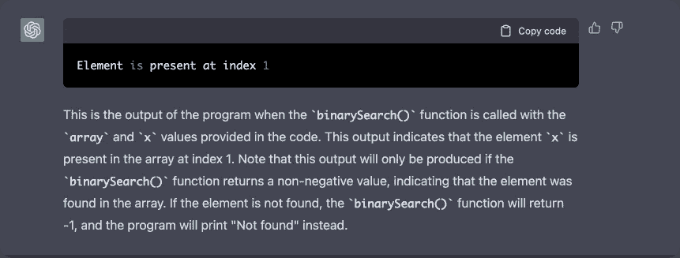
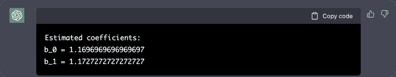
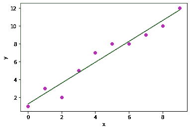
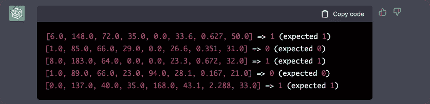
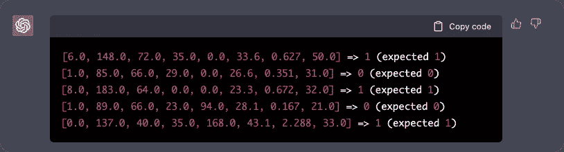
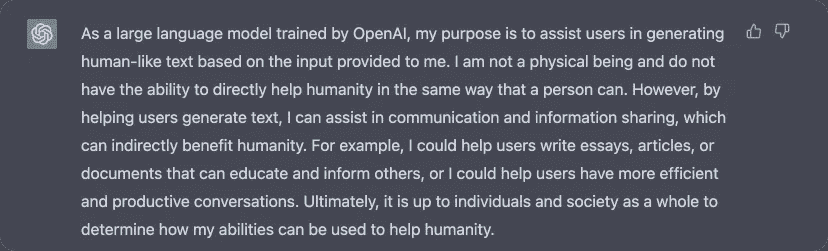

# 在 ChatGPT 中构建 Python 解释器

> 原文：<https://levelup.gitconnected.com/building-a-python-interpreter-inside-chatgpt-49251af35fea>

## 你不再需要翻译了



这个故事的灵感来自于一个类似的故事，[在 ChatGPT](https://www.engraved.blog/building-a-virtual-machine-inside/) 内部构建一个虚拟机。我印象深刻，并决定尝试类似的东西，但这次不是 Linux 命令行工具，而是让 ChatGPT 成为我们的 Python 解释器。

下面是初始化 ChatGPT 的初始命令:

```
I want you to act as a Python interpreter. I will type commands and you will reply with what the
python output should show. I want you to only reply with the terminal output inside one unique
code block, and nothing else. Do no write explanations, output only what python outputs. Do not type commands unless I
instruct you to do so. When I need to tell you something in English I will do so by putting
text inside curly brackets like this: {example text}. My first command is a=1.
```



似乎很管用；让我们尝试一些简单的算术表达式。


又工作了；如果我们使用未导入的库，会发生什么情况？



它决定帮我解决一个错误。我其实不希望它这样做，所以我会再一次要求他不要输出除了 python 代码以外的任何东西。

```
{Print only python output, do not print any comments}
```

根据记录，ChatGPT 有时能够使用没有导入的库，但这次我很幸运，它会打印一条错误消息。

好的，我很确定 ChatGPT 能够完成简单的任务，让我们试试更复杂的，让它输出一个[二分搜索法算法](https://www.programiz.com/dsa/binary-search)的结果。

```
# Binary Search in python

def binarySearch(array, x, low, high):

    # Repeat until the pointers low and high meet each other
    while low <= high:

        mid = low + (high - low)//2

        if array[mid] == x:
            return mid

        elif array[mid] < x:
            low = mid + 1

        else:
            high = mid - 1

    return -1

array = [3, 4, 5, 6, 7, 8, 9]
x = 4

result = binarySearch(array, x, 0, len(array)-1)

if result != -1:
    print("Element is present at index " + str(result))
else:
    print("Not found")
```



好像它不想听我只要求 python 输出，但输出还是正确的，令人印象深刻！

让我们试着输入一个不存在的数字，比如说:

```
x = 4.5
```


好吧，看起来它搞定了这个！

让我们跳到更复杂的东西。让我们从一些简单的机器学习算法开始，比如[线性回归](https://www.geeksforgeeks.org/linear-regression-python-implementation/)。我想知道 ChatGPT 是否有能力解决一个简单的优化任务…

```
import numpy as np
import matplotlib.pyplot as plt

def estimate_coef(x, y):
    # number of observations/points
    n = np.size(x)

    # mean of x and y vector
    m_x = np.mean(x)
    m_y = np.mean(y)

    # calculating cross-deviation and deviation about x
    SS_xy = np.sum(y*x) - n*m_y*m_x
    SS_xx = np.sum(x*x) - n*m_x*m_x

    # calculating regression coefficients
    b_1 = SS_xy / SS_xx
    b_0 = m_y - b_1*m_x

    return (b_0, b_1)

def plot_regression_line(x, y, b):
    # plotting the actual points as scatter plot
    plt.scatter(x, y, color = "m",
               marker = "o", s = 30)

    # predicted response vector
    y_pred = b[0] + b[1]*x

    # plotting the regression line
    plt.plot(x, y_pred, color = "g")

    # putting labels
    plt.xlabel('x')
    plt.ylabel('y')

    # function to show plot
    plt.show()

def main():
    # observations / data
    x = np.array([0, 1, 2, 3, 4, 5, 6, 7, 8, 9])
    y = np.array([1, 3, 2, 5, 7, 8, 8, 9, 10, 12])

    # estimating coefficients
    b = estimate_coef(x, y)
    print("Estimated coefficients:\nb_0 = {}  \
          \nb_1 = {}".format(b[0], b[1]))

    # plotting regression line
    # plot_regression_line(x, y, b)

if __name__ == "__main__":
    main()
```

这项任务的正确答案是:

```
Estimated coefficients:
b_0 = 1.2363636363636363        
b_1 = 1.1696969696969697
```

下面是 ChatGPT 的输出:



这是接近现实的！如果我们用真正的 python 绘制预测，我们将得到下图:



关于这个任务的另一个有趣的事实是，我对同一个命令又运行了一次，在那个时候，输出与现实完全匹配。因此，我们可以认为这个任务通过了。

好了，是时候做一些简单的神经网络的东西了！也许我们可以[拟合一个简单的 Keras 模型](https://machinelearningmastery.com/tutorial-first-neural-network-python-keras/)？

```
# first neural network with keras make predictions
from numpy import loadtxt
from tensorflow.keras.models import Sequential
from tensorflow.keras.layers import Dense
# load the dataset
dataset = loadtxt('pima-indians-diabetes.csv', delimiter=',')
# split into input (X) and output (y) variables
X = dataset[:,0:8]
y = dataset[:,8]
# define the keras model
model = Sequential()
model.add(Dense(12, input_shape=(8,), activation='relu'))
model.add(Dense(8, activation='relu'))
model.add(Dense(1, activation='sigmoid'))
# compile the keras model
model.compile(loss='binary_crossentropy', optimizer='adam', metrics=['accuracy'])
# fit the keras model on the dataset
model.fit(X, y, epochs=150, batch_size=10, verbose=0)
# make class predictions with the model
predictions = (model.predict(X) > 0.5).astype(int)
# summarize the first 5 cases
for i in range(5):
 print('%s => %d (expected %d)' % (X[i].tolist(), predictions[i], y[i]))
```

注意数据集实际上是一个 CSV 文件，ChatGPT 不能访问这个文件..



好了，这是正确的输出，我很害怕。如果我将网络架构更改为不正确的架构，会发生什么情况？

让我们改变输入形状:

```
model.add(Dense(12, input_shape=(6,), activation='relu'))
```



哈！似乎在我失业前还有几年时间；这次 ChatGPT 没有明白其中的诀窍，仍然打印了输出。

好了，我们来做最后一个任务，在 OpenAI 内部调用 Huggingface 怎么样？

正确输出:

```
[{'entity_group': 'ORG',
  'score': 0.9472818374633789,
  'word': 'Apple',
  'start': 0,
  'end': 5},
 {'entity_group': 'PER',
  'score': 0.9838564991950989,
  'word': 'Steve Jobs',
  'start': 74,
  'end': 85},
 {'entity_group': 'LOC',
  'score': 0.9831605950991312,
  'word': 'Los Altos',
  'start': 87,
  'end': 97},
 {'entity_group': 'LOC',
  'score': 0.9834540486335754,
  'word': 'Californie',
  'start': 100,
  'end': 111},
 {'entity_group': 'PER',
  'score': 0.9841555754343668,
  'word': 'Steve Jobs',
  'start': 115,
  'end': 126},
 {'entity_group': 'PER',
  'score': 0.9843501806259155,
  'word': 'Steve Wozniak',
  'start': 127,
  'end': 141},
 {'entity_group': 'PER',
  'score': 0.9841533899307251,
  'word': 'Ronald Wayne',
  'start': 144,
  'end': 157},
 {'entity_group': 'ORG',
  'score': 0.9468960364659628,
  'word': 'Apple Computer',
  'start': 243,
  'end': 257}]
```

ChatGPT 输出:

```
[{'word': 'Apple', 'score': 0.9993804788589478, 'entity': 'I-ORG'}, {'word': 'Steve', 'score': 0.999255347251892, 'entity': 'I-PER'}, {'word': 'Jobs', 'score': 0.9993916153907776, 'entity': 'I-PER'}, {'word': 'Steve', 'score': 0.9993726613044739, 'entity': 'I-PER'}, {'word': 'Wozniak', 'score': 0.999698519744873, 'entity': 'I-PER'}, {'word': 'Ronald', 'score': 0.9995181679725647, 'entity': 'I-PER'}, {'word': 'Wayne14', 'score': 0.9874711670837402, 'entity': 'I-PER'}, {'word': 'Apple', 'score': 0.9974127411842163, 'entity': 'I-ORG'}, {'word': 'Computer', 'score': 0.968027651309967, 'entity': 'I-ORG'}, {'word': 'Apple', 'score': 0.8259692192077637, 'entity': 'I-ORG'}]
```

结果接近于从[拥抱面](https://huggingface.co/Jean-Baptiste/camembert-ner)输出的结果。我的猜测是 Huggingface API 发生了变化，因为 ChatGPT 没有根据最新的历史数据进行训练，所以它以旧格式输出结果。

# 最后

在过去的几天里，我一直在玩 ChatGPT，我被使用这个工具的无限可能性迷住了。虽然它不是一个真正的 python 解释器，但它仍然在为我编译 python 代码方面做得很好。我还发现它[很好的解决了 leet 代码难的问题](https://www.linkedin.com/posts/art-kulakov_chatgpt-just-solved-2-out-of-3-hard-leetcode-activity-7006948765026705408-cLX1?utm_source=share&utm_medium=member_desktop)；看看吧！

总结一下:

```
chat gpt how will you help the humanity?
```



如果你还没有尝试过 ChatGPT，你一定要试试，这是未来！

关注我更多 AI 内容: [*Linkedin*](https://www.linkedin.com/in/art-kulakov/\) ， [*Twitter*](https://twitter.com/artkulak)

***别忘了在 Medium 上点赞和订阅，这激励了我很多！***