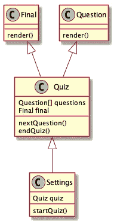
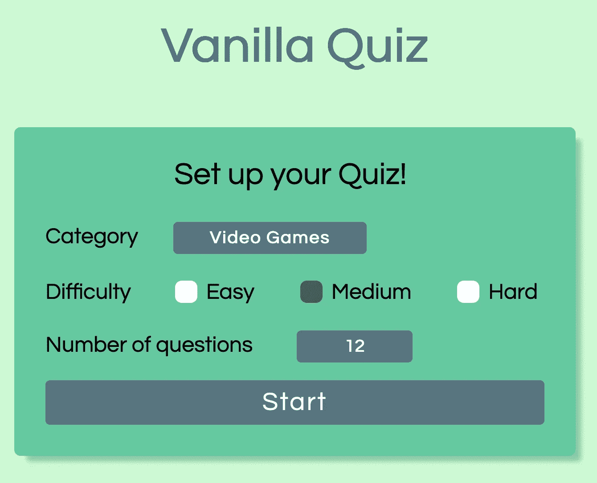
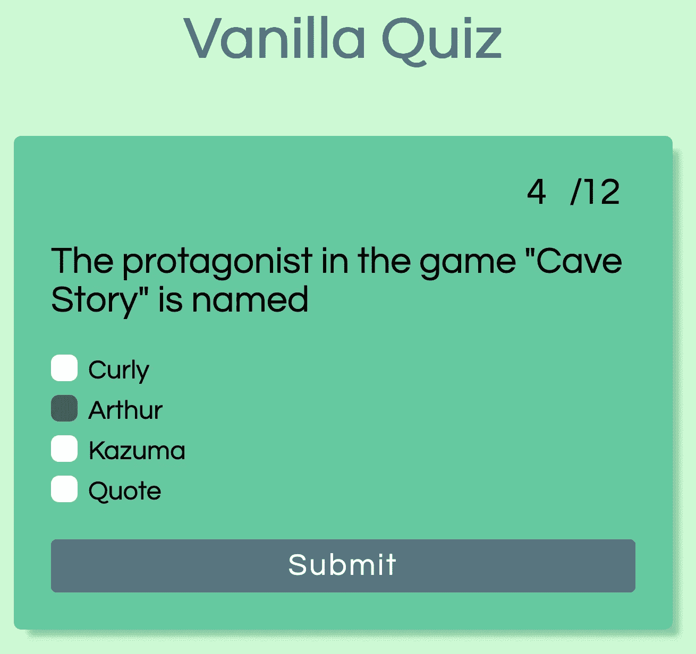
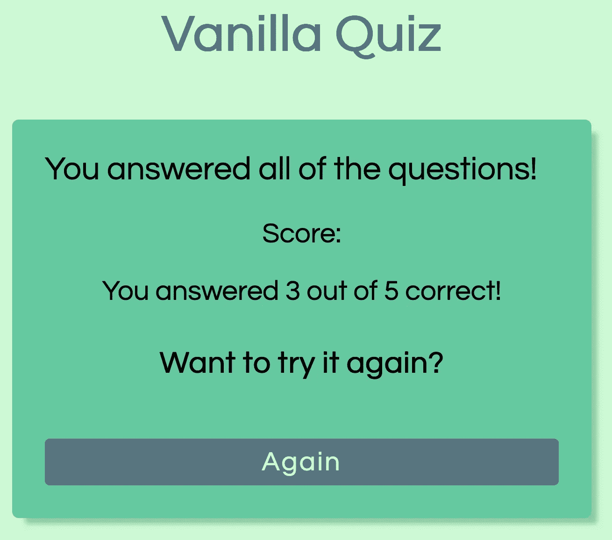

# 用 JavaScript 构建测验应用程序

> 原文：<https://levelup.gitconnected.com/building-a-quiz-app-in-javascript-b3f7d596855b>

## 从想法到完成的应用


艾米丽·莫特在 [Unsplash](https://unsplash.com/s/photos/question-mark?utm_source=unsplash&utm_medium=referral&utm_content=creditCopyText) 上的照片

我的目标是带您踏上从规划到构建测验应用程序的旅程。为此，我们将使用普通的 JavaScript、CSS 和 HTML。没有额外的库或包。让我们从定义我们的测验应用程序能做什么开始。

## 定义规格

测验将分为两大类。第一个将是一个设置区域，玩家可以在其中选择难度，类别和他想回答的问题数量。为此，我们将创建一个*设置类*来跟踪所有这些信息。完成后，他可以开始测验。

第二个领域是测验。*测验类*跟踪玩家的进度，并决定是否显示最终屏幕的下一个问题。



我们的阶级概念

此外,*测验类*还有另外两个组件，首先是一组*问题类*,它们保存问题的数据，显示它，并检查答案是否正确。另一个是显示玩家分数的最后一页的*最终类*。

我们将使用 [Open Trivia DB API](https://opentdb.com/api_config.php) 来回答问题，这样我们就不必提出我们的问题。

你可能已经猜到了，因为我说了很多关于类的东西，我们将使用[面向对象编程](https://en.wikipedia.org/wiki/Object-oriented_programming)来实现这个测验应用，而不是[函数式编程](https://en.wikipedia.org/wiki/Functional_programming)。如果你对这两种范式的区别感兴趣，可以去看看我的文章[“JavaScript 中的函数式编程与面向对象编程”](/functional-programming-vs-oop-in-javascript-539202768406)。

## 先决条件

在开始实施测验之前，我们需要创建文件夹结构以及 HTML 和 CSS。在本文中，我们将重点关注应用程序的 JavaScript 部分。因此，我将在这一部分提供必要的 HTML 和 CSS。让我们从创建这样的文件夹结构开始:

```
$ mkdir vanilla-quiz
$ cd ./vanilla-quiz
$ mkdir quiz
$ touch index.html index.js styles.css
```

继续从这些资源中复制并粘贴*index.html*和 *styles.css* :

index.html

样式. css

现在我们已经准备好开始开发我们的应用程序了。我们将要学习的第一个课程是**设置。**

## 怎么出题？

*设置类*的目标是玩家可以选择他们的类别、难度和他们想要回答的问题数量。我们需要从这三个参数中创建一个对 Open Trivia DB API 的请求，以获取玩家游戏的问题。

在开始创建我们的类之前，我们需要在 *index.js* 中创建它的一个实例，如下所示:

```
import Settings from ‘./quiz/settings.js’;new Settings();
```

这将给出一个错误，因为文件 *settings.js* 还不存在，所以让我们继续创建它。

```
$ touch ./quiz/settings.js
```

接下来，我们为我们的*设置类*创建骨架。为此，我们需要一个带有构造函数和 *startQuiz-method* 以及 *export-statement* 的类。没有 *export-statement* ，我们无法导入 *index.js* 中的类。它应该是这样的:

```
class Settings {
  constructor() {
  }

  startQuiz() {
  }
}export default Settings;
```

在构造函数中，我们希望获得开始测验所需的所有 DOM 元素。为此，我们需要获取两个 div、*测验*和*设置*，以便在玩家想要开始测验时切换它们的可见性。接下来，我们需要所有的参数，这样我们就可以创建获取问题的请求。最后但同样重要的是，我们需要得到按钮来将 *startQuiz-method* 添加到 *click-event* 中。

```
constructor() {
  this.quizElement = document.querySelector('.quiz');
  this.settingsElement = document.querySelector('.settings');
  this.category = document.querySelector('#category');
  this.numberOfQuestions = document.querySelector('#questions');
  this.difficulty = [
    document.querySelector('#easy'),
    document.querySelector('#medium'),
    document.querySelector('#hard'),
  ];
  this.startButton = document.querySelector('#start');

  this.quiz = { }; this.startButton.addEventListener('click', this.startQuiz.bind(this));
}
```

在第一部分中，我们得到了所有的 DOM 元素，注意，我们将难度元素存储在一个数组中，以便稍后过滤它们。之后，我们初始化*测验属性*并将*开始测验方法*添加到*开始按钮*中。确保将**这个**绑定到*start quick-method*。如果你不这样做，你就不能在方法中使用这个。

为了开始测验，我们需要收集所有参数并动态创建请求。因为我们正在处理一个 API 调用，所以我决定使用 *async/await* 来处理异步调用。为了确保没有错误丢失，我们将把整个调用包装在一个 *try-catch-block* 中。所以 *startQuiz-method* 应该是这样的:

```
async startQuiz() {
  try {
    const amount = this.getAmount();
    const categoryId = this.category.value;
    const difficulty = this.getCurrentDifficulty();

    const url = `https://opentdb.com/api.php?amount=${amount}&category=${categoryId}&difficulty=${difficulty}&type=multiple`; let data = await this.fetchData(url);
    this.toggleVisibility();
    this.quiz = new Quiz(this.quizElement, amount, data.results);
  } catch (error) {
    alert(error);
  }
}
```

我们在这里做什么？

首先，我们得到所有三个值，对于*数量*和*难度*我们使用尚未实现的方法。在这些方法中，我们将处理错误，例如不选择任何难度或为问题数量输入负数。

之后，我们用刚刚得到的参数创建 URL。这个 URL 在 *fetchData-method* 中传递，它将发送请求并返回数据。之后，我们调用 *toggleVisibility* ，并通过传入*结果*、*金额*和 *quizElement* 来初始化一个新的*测验对象*。

如果在任何时候出现错误，我们将通过使用*报警方法*捕捉并显示它。

最终的设置类应该如下所示:

设置. js

如果玩家没有选择任何内容或者选择的值超出范围(对于问题的数量)，那么方法 *getAmount* 和 *getCurrentDifficulty* 都将返回一个错误。我们还在这个文件的顶部为*测验类*添加了*导入声明*。另外两个方法( *fetchData* 和 *toggleVisibility* )正如它们的名字所暗示的那样。现在我们可以把注意力集中在接下来的测验课上。

## 测验时间到了！

在我们开始考虑测验类之前，我们需要创建一个包含它的文件。

```
$ touch ./quiz/quiz.js
```

我们像处理 *settings.js* 一样，先创建一个框架。

```
class Quiz {
  constructor(quizElement, amount, questions) {
    this.quizElement = quizElement; this.totalAmount = amount;
    this.questions = this.setQuestions(questions);
  } setQuestions(questions) {
    return questions.map(question => new Question(question));
  } nextQuestion() {
  } endQuiz() {
  }
}export default Settings;
```

这一次，我们需要处理一些由*设置对象*传入的参数。对于*问题*，我们为*设置对象*传入的每个问题创建一个单独的*问题对象*。*构造器*需要更多的设置，所以我们将添加更多的 DOM 元素和一个*事件监听器*到 *nextButton* 中。所以让我们开始吧！

```
constructor(quizElement, amount, questions) {
  this.quizElement = quizElement;
  this.currentElement = document.querySelector('.current');
  this.totalElement = document.querySelector('.total');
  this.nextButton = document.querySelector('#next');
  this.finalElement = document.querySelector('.final') this.totalAmount = amount;
  this.answeredAmount = 0;
  this.questions = this.setQuestions(questions); this.nextButton.addEventListener('click',
  this.nextQuestion.bind(this));
  this.renderQuestion();
}
```

正如你所看到的，它看起来很像 *settings.js* 中的构造函数。一个主要的区别是最后对 *renderQuestion* 的调用。这个调用的目的是我们想要立即呈现第一个问题。

在 *setQuestions* 和 *nextQuestion* 之间，我们创建了方法 *renderQuestion* 并实现如下:

```
renderQuestion() {
  this.questions[this.answeredAmount].render();
  this.currentElement.innerHTML = this.answeredAmount;
  this.totalElement.innerHTML = this.totalAmount;
}
```

在测验开始时， *answeredAmount* 为 0，因此我们对*问题数组*中的第一个问题调用 *render-method* 。之后，我们设置播放器的当前进度。因为我们没有实现*问题类*，但是这段代码抛出了一个错误，但是我们会很快修复它。

让我们实现 *nextQuestion-method* 。对于这一点，如果玩家检查了一个答案，如果是的话，检查了哪个答案。接下来，我们需要向玩家显示结果，并将 *answeredAmount* 加 1。最后，我们必须检查是否还有其他问题，如果有，就显示出来。如果这是最后一个，我们需要进入结果屏幕。

```
nextQuestion() {
  const checkedElement = this.questions[this.answeredAmount].answerElements.filter(el => el.firstChild.checked); if (checkedElement.length === 0) {
    alert(‘You need to select an answer’);
  } else {
    this.questions[this.answeredAmount].answer(checkedElement)
    this.showResult();
    this.answeredAmount++;
    (this.answeredAmount < this.totalAmount) ? this.renderQuestion() : this.endQuiz();
  }
}
```

这个类中唯一缺少的方法是 *showResult* 、*end quick*，以及一个为结果屏幕总结所有正确答案的方法。最终的 *quiz.js* 应该是这样的:

quick . js

我们在顶部为 *question.js* 和 *final.js* 添加了两个导入。此外，我们实现了 *showResult* ，通过使用[三元操作符](https://developer.mozilla.org/en-US/docs/Web/JavaScript/Reference/Operators/Conditional_Operator)检查问题是否被正确回答。

*endQuiz-method* 看起来有点像我们的 *settings.js* 中的*toggle visibility-method*，除了它通过调用*calculateCorrectAnswers*来总结所有的正确答案，然后将其传递给 *final-class* 的一个新实例(我们仍然需要实现那个类)。

## 显示问题和结果

我们的*测验类*目前不工作，因为两个依赖项还不存在。让我们通过添加如下两个文件来改变这一点:

```
$ touch ./quiz/question.js ./quiz/final.js
```

我们首先实现*问题类*。首先，我们像这样给文件添加一个框架:

```
class Question {
  constructor(question) {
    this.correctAnswer = question.correct_answer;
    this.question = question.question; this.answers = this.shuffleAnswers([
      question.correct_answer,
      ...question.incorrect_answers
    ]);
  } shuffleAnswers(answers) {
  }

  answer(checkedElement) {
  } render() {
  }
}export default Question;
```

我们在这里做了什么？

我们保存问题、正确答案和一组答案，在存储之前我们会对这些答案进行洗牌。

下一步是实现 *shuffleAnswers* 、*answers*和 *render* 方法。对于数组的洗牌，我们将使用[Fisher-Yates-Shuffle-Algorithm](https://www.geeksforgeeks.org/shuffle-a-given-array-using-fisher-yates-shuffle-algorithm/)。

*answer-method* 只会将玩家的选择与 *correctAnswer* 属性进行比较，而 *render* 方法会显示问题和所有可能的答案。为此，我们需要获得各自的 DOM 元素，并以这个*问题结束:*

question.js

现在唯一缺少的是最后一级*。这个类非常简单，我们只需要获取 DOM 元素来显示最终结果给玩家。为了增加一些便利，我们可以再添加一个*按钮*，重新加载页面，这样玩家可以重新开始。它应该是这样的:*

*final.js*

## *结论*

*测验应用程序现已完成。我们只用普通的旧 JavaScript 实现了这一点，并使用了面向对象编程的概念。我希望你喜欢这个，一如既往，你可以在我的 GitHub 上找到代码。*

*玩家可以选择他们想要回答的问题的类别、难度和数量，然后开始测验。*

**

*选择您的测验方式*

*开始的时候选择题是这样显示的。*

**

*已经回答了 12 个问题中的 4 个*

*在所有问题的最后，你会看到最后一页。*

**

*5 个问题中有 3 个回答正确*

*我希望你跟得开心。如果你想的话，试着改进这个版本。*