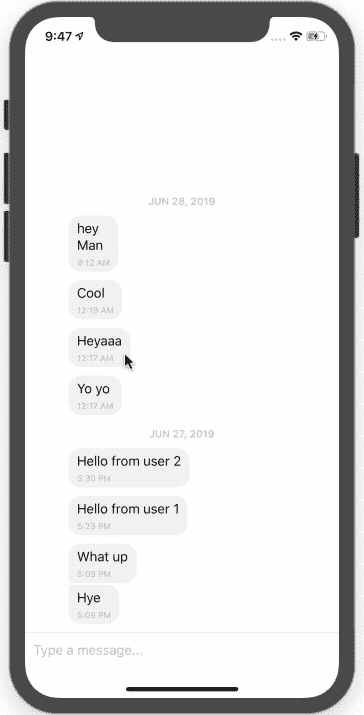
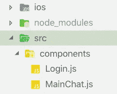
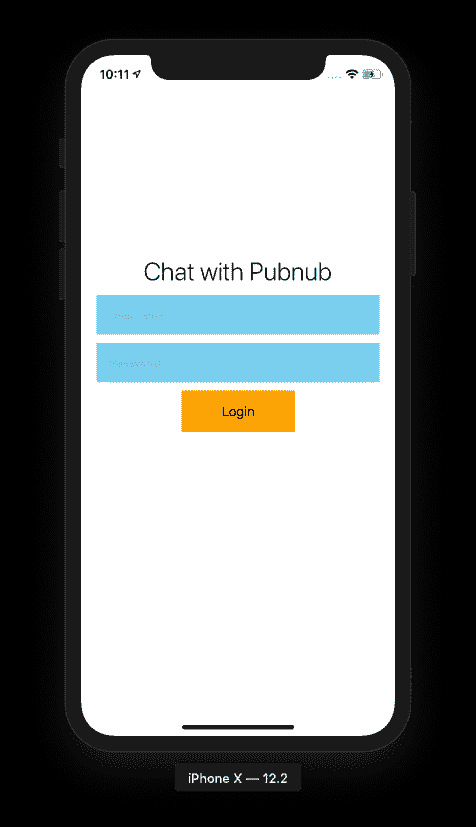
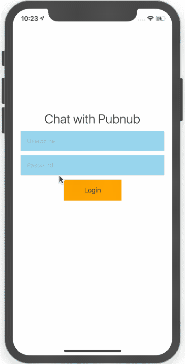
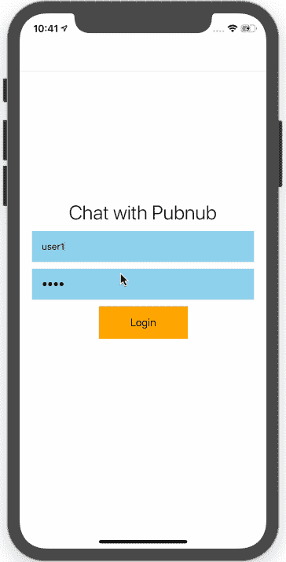

# 构建 React 本地聊天应用程序—第二部分:消息历史| PubNub

> 原文：<https://levelup.gitconnected.com/building-a-react-native-chat-app-part-two-message-history-pubnub-8466de114146>

在我们正在进行的关于构建 React 原生聊天应用的系列教程的前一部分中，我们设置了基本的消息和聊天 UI。在这一部分，我们将添加消息历史，这将允许您存储和获取历史消息。当用户重新启动他们的聊天应用程序时，他们将能够看到以前发送的消息。


*注意，你需要完成* [*第一部分*](https://dev.to/kris/building-a-react-native-chat-app-part-one-basic-messaging-5di3-temp-slug-8381702) *后才能开始学习本教程，因为我们也在那部分介绍了设置。*

在这一部分中，我们将讨论消息历史的两个主要方面:

*   获取消息历史记录
*   可视地显示哪个用户发送了消息

# 获取消息历史记录

目前，我们的聊天应用程序有一个全球聊天界面。当有人发送消息时，聊天消息会出现在所有连接用户的全局日志中。但是当我们关闭应用程序时，所有的消息都消失了。当我们重新打开应用程序时，消息日志是空的。这是因为消息历史记录没有存储在设备上。

这就是我们在这一部分要解决的问题——存储和获取消息历史。我们将使用 PubNub Storage & Playback(有时称为*历史*或*历史 API* )来完成这项工作。

导航到您的 [PubNub 管理仪表板](https://dashboard.pubnub.com/)，并激活该功能。

一旦存储和回放被激活，我们需要在应用程序刷新或恢复时获取存储的消息。为此，我们需要返回到 **App.js** 文件，然后在应用程序启动时使用**componentDidmount()**React 回调函数获取存储的消息。

以下代码片段从 PubNub 通道获取消息历史记录:

```
this.pubnub.history(
  { channel: "MainChat", reverse: true, count: 15 },
  (status, res) => {
    console.log(newmessage);
  }
);
```

这个函数的工作原理是从一个名为 MainChat 的通道获取 15 条消息。可以在 JavaScript 开发人员控制台中看到获取的消息。

你可以看到它像一个魔咒一样工作。但是当我们观察默认的天赋聊天消息结构时，它与我们的设计不符。因此，在将新消息附加到 React 状态之前，我们需要重建消息。您可以使用下面代码片段中的代码来构建一个新的消息数组，该数组将与天才聊天的消息结构相匹配:

```
componentDidMount() {
  this.pubnub.history(
    { channel: "MainChat", reverse: true, count: 15 },
    (status, res) => {
      let newmessage = [];
      res.messages.forEach(function(element, index) {
        newmessage[index] = element.entry[0];
      });
      console.log(newmessage);
    }
  );
}
```

您可以在下面的屏幕截图中看到消息结构是对齐的。

现在，我们需要将新的消息数组添加到天赋聊天中。为此，您可以使用以下代码片段:

```
componentDidMount() {
  this.pubnub.history(
    { channel: "MainChat", reverse: true, count: 15 },
    (status, res) => {
      let newmessage = [];
      res.messages.forEach(function(element, index) {
        newmessage[index] = element.entry[0];
      });
      console.log(newmessage);
      this.setState(previousState => ({
        messages: GiftedChat.append(
          previousState.messages,
          newmessage
        )
      }));
    }
  );
}
```

现在，即使在应用程序刷新时，消息历史记录也会加载。

但是，消息的排序方向相反。因此，在将数组添加到天赋聊天之前，我们需要反转数组。您可以通过使用以下代码片段来实现这一点:

```
componentDidMount() {
  this.pubnub.history(
    { channel: "MainChat", reverse: true, count: 15 },
    (status, res) => {
      let newmessage = [];
      res.messages.forEach(function(element, index) {
        newmessage[index] = element.entry[0];
      });
      console.log(newmessage);
      this.setState(previousState => ({
        messages: GiftedChat.append(
          previousState.messages,
          newmessage.reverse()
        )
      }));
    }
  );
}
```

这样，聊天信息现在可以被检索出来，并按照发送的正确时间顺序显示出来。



# 将用户与聊天 UI 中的消息相关联

你可以观察到，当你发送一条消息，刷新 app 时，消息全部显示在接收方。为什么会这样？我们在加载应用程序时随机创建了一个用户 id，以模拟多个用户。

我们需要添加一点用户认证，这样我们就可以在聊天中识别用户。这将使我们能够在聊天界面的正确一侧显示消息。然后，用户将能够在视觉上区分他们的聊天消息和他们朋友的聊天消息。

首先，我们需要在我们的应用程序目录中创建几个文件。



我们需要将代码从 App.js 文件移动到 MainChat.js，并将类名从 App 更改为 MainChat，如下面的代码片段所示:

```
import React, { Component } from "react";
import {
  View,
  Text,
  StyleSheet,
  TextInput,
  TouchableOpacity,
  Image
} from "react-native";
export default class App extends Component {
  render() {
    return (
      <View style={styles.container}>
        <View style={styles.logo}>
          <Image
            source={require("../img/react.jpg")}
            style={{ width: 66, height: 58 }}
          />
          <Image
            source={require("../img/pubnublogo.png")}
            style={{ width: 60, height: 60 }}
          />
        </View>
        <Text style={styles.welcome}>Chat with Pubnub</Text>
        <TextInput
          style={styles.input}
          placeholder="Username"
          autoCapitalize="none"
          autoCorrect={false}
          onChangeText={username => this.setState({ username })}
        />
        <TextInput
          style={styles.input}
          secureTextEntry={true}
          placeholder="Password"
          onChangeText={password => this.setState({ password })}
        />
        <View style={styles.btnContiner}>
          <TouchableOpacity style={styles.btn} onPress={() => this.login()}>
            <Text style={styles.btntext}>Login</Text>
          </TouchableOpacity>
        </View>
      </View>
    );
  }
}
const styles = StyleSheet.create({
  container: {
    flex: 1,
    justifyContent: "center",
    alignItems: "center",
    bottom: 66
  },
  welcome: {
    fontSize: 30,
    textAlign: "center",
    margin: 10,
    fontWeight: "300"
  },
  input: {
    width: "90%",
    backgroundColor: "skyblue",
    padding: 15,
    marginBottom: 10
  },
  btnContiner: {
    flexDirection: "row",
    justifyContent: "center",
    width: "80%"
  },
  btn: {
    backgroundColor: "orange",
    padding: 15,
    width: "45%"
  },
  btntext: { fontSize: 16, textAlign: "center" },
  logo: {
    flexDirection: "row"
  }
});
```

现在您可以看到我们的登录表单样式的结果。



接下来，我们将添加用户身份验证功能。为此，首先，我们用两个变量**用户名**和**密码**创建一个状态对象，如下面的代码片段所示:

```
state = { username: "", password: "" };
```

当用户在文本输入字段中键入内容时，我们将文本数据添加到状态变量中，如下面的代码片段所示:

```
<View style={styles.container}>
  <Text style={styles.welcome}>Chat with Pubnub</Text>
  <TextInput
    style={styles.input}
    placeholder="Username"
    autoCapitalize="none"
    autoCorrect={false}
    onChangeText={username => this.setState({ username })}
    />
  <TextInput
    style={styles.input}
    secureTextEntry={true}
    placeholder="Password"
    onChangeText={password => this.setState({ password })}
    />
  <View style={styles.btnContiner}>
    <TouchableOpacity style={styles.btn} >
      <Text style={styles.btntext}>Login</Text>
    </TouchableOpacity>
  </View>
</View>
```

当用户点击登录按钮时，会触发登录功能。

为了进行简单快速的配置，我们创建了一个名为 **user** 的 **const** 变量，其中包含**用户名**和**密码**，如下面的代码示例所示。

这纯粹是为了演示的目的。*不要在您的生产应用程序中这样做！构建一个安全的服务器编组身份验证系统。*

```
const user = {
  0: { username: "user1", password: 1111 },
  1: { username: "user2", password: 1111 }
};
```

现在，我们使用这个变量来表示一个数据库，并创建一个登录函数，如下面的代码片段所示。

```
login() {
  if (
    (user[0].username == this.state.username &&
      user[0].password == this.state.password) ||
    (user[1].username == this.state.username &&
      user[1].password == this.state.password)
  ) {
    this.props.navigation.navigate("MainChat", {
      username: this.state.username
    });
  } else {
    console.log(this.state);
    alert("username or password is incorrect");
  }
}
```

一旦完成，你就会得到类似这样的东西。



我们可以看到我们的登录认证是成功的。现在，我们需要在成功登录后将用户重定向到聊天室。

# 登录成功后重定向

接下来，我们需要使用 **react-navigation** 包来处理路由和重定向，比如网页。首先，您需要遵循此处的 [React 导航安装说明](https://reactnavigation.org/docs/en/getting-started.html#installation)。然后我们需要把 App.js 的所有代码移到 Login.js，并更改类名。然后我们需要让 App.js 与 react-navigation 的路线管理兼容。

```
import { createStackNavigator, createAppContainer } from "react-navigation";
import Login from "./src/components/Login";
import MainChat from "./src/components/MainChat";
const AppNavigator = createStackNavigator(
  {
    Login: {
      screen: Login
    },
    MainChat: {
      screen: MainChat
    }
  },
  {
    initialRouteName: "Login"
  }
);
export default createAppContainer(AppNavigator);
```

现在，我们可以在登录后将用户重定向到主聊天屏幕。添加导航功能后，该功能将会正常工作。

```
login() {
  if (
    (user[0].username == this.state.username &&
      user[0].password == this.state.password) ||
    (user[1].username == this.state.username &&
      user[1].password == this.state.password)
  ) {
    this.props.navigation.navigate("MainChat", {
      username: this.state.username
    });
  } else {
    console.log(this.state);
    alert("username or password is incorrect");
  }
}
```

这里我们需要指定您想在下一页使用的屏幕名称(即 MainChat)和参数(即用户名)。

我们通过用一个参数值替换 random ID 来配置 MainChat.js，如下面的代码片段所示:

```
render() {
  return (
    <GiftedChat
      messages={this.state.messages}
      onSend={messages => this.onSend(messages)}
      user={{
        _id: this.props.navigation.getParam("username")
      }}
    />
  );
}
```

让我们什么都试试吧！



您可以看到 user1 登录，然后发送了一条新消息。用户 1 将在 UI 的适当一侧看到来自用户 2 的消息。

# 包扎

在本教程中，我们学习了如何存储和获取历史聊天消息，并按照接收的顺序显示它们。

你的聊天应用功能越来越多，但我们还可以做更多。密切关注后续关于打字指标、未读消息计数、用户状态等的帖子。

*原载于 2019 年 7 月 2 日*[*【https://www.pubnub.com】*](https://www.pubnub.com/blog/building-a-chat-app-with-react-native-and-pubnub-part-two-message-history/)*。*