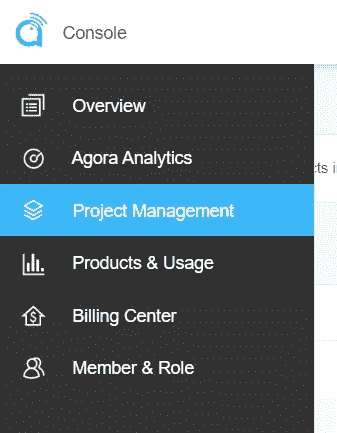

# 使用 Agora 构建 React 本地视频直播应用程序

> 原文：<https://levelup.gitconnected.com/building-a-react-native-live-video-broadcasting-app-using-agora-6ae5643ae202>


视频直播已经有了广泛的用途，从现场购物到现场音乐会。构建一个可扩展的、高质量的直播视频流应用程序有很多方面。例如，在维护跨平台兼容性的同时，维护低延迟、负载平衡和管理成千上万的用户可能会很有压力。

使用 Agora React Native SDK 有一种非常简单的方法来实现这一点。在本文中，我们将通过使用 Agora Video SDK 的魔力来构建一个直播应用程序，该应用程序可以拥有多个广播公司并托管数千个用户。在深入了解应用程序的工作原理之前，我们将检查它的结构、设置和执行。你可以通过几个简单的步骤在几分钟内进行现场直播。

在下面的例子中，我们将使用[Agora RTC SDK for React Native](https://www.npmjs.com/package/react-native-agora/)。我在写的时候用的是 v3.4.6。

# 创建 Agora 帐户

[注册](https://sso.agora.io/en/signup?utm_source=medium&utm_medium=blog&utm_campaign=building-a-react-native-live-video-broadcasting-app-using-agora)并登录仪表板。



导航到“项目管理”选项卡下的“项目列表”选项卡，并通过单击蓝色的“创建”按钮创建一个新项目。

创建一个新项目并检索应用程序 ID。如果您选择带有令牌的应用程序 ID，请为您的项目获取一个临时令牌。您可以在编辑页面上找到生成临时令牌的链接。在开发应用程序时，临时令牌将用于授权您的请求。

> ***注意:*** 建议对生产环境中运行的所有 RTE 应用进行令牌认证。有关 Agora 平台中基于令牌的认证的更多信息，请参见本指南:[https://docs.agora.io/en/Video/token?平台=所有% 20 个平台](https://docs.agora.io/en/Video/token?platform=All%20Platforms)

# 我们示例的结构

这是我们应用程序的结构:

```
**.**
├── android
├── components
│ └── **Permission.ts** │ └── **Style.ts** ├── ios├── **App.tsx**
├── index.js **.**
```

# 让我们运行应用程序

你需要安装 LTS 版本的 Node.js 和 NPM。

*   确保您已经注册了 Agora 帐户，设置了项目，并生成了应用 ID(和临时令牌)。
*   从[主分支](https://github.com/EkaanshArora/Agora-RN-Broadcast-Quickstart)下载并解压 ZIP 文件。
*   运行`npm install`在解压后的目录中安装应用依赖项。
*   导航到`./App.tsx`并输入我们从 Agora 控制台(`appId: ‘<YourAppIDHere>’`)获得的应用 ID。如果您使用令牌，请输入您的令牌和频道名称。
*   如果你是为 iOS 开发的，打开一个终端，执行`cd ios && pod install`。然后，您可以打开`ios/<projectName>.xcworkspace`文件，在 XCode 中打开您的项目并构建应用程序。(iOS 模拟器不支持摄像头。请改用物理设备。)
*   如果你正在为 Android 开发，连接你的设备并执行`npm run android`来启动应用程序。等待几分钟，让应用程序构建完成。
*   在手机或模拟器上看到主屏幕后，单击设备上的开始通话按钮。

就是这样。您应该可以在两台设备之间进行视频通话。app 使用`test`作为频道名称。

# 了解它的工作原理

## Permission.ts

我们正在导出一个从 Android 操作系统请求摄像头和麦克风权限的函数。

## App.tsx

`App.tsx`文件包含了我们视频通话的核心逻辑。

我们从编写导入语句开始。接下来，我们有一些应用 ID、令牌和频道名称的常量。

我们为应用程序状态定义了一个包含`isHost`(一个布尔值，用于在观众和广播公司之间切换；主机可以发送和接收流，而观众只能接收流)，`joinSucceed`(一个布尔值，用于存储我们是否成功连接)，以及`peerIds`(一个数组，用于存储通道中其他用户的 uid)。

我们定义了一个基于类的组件，`_engine` 变量，它将存储`RtcEngine`类的实例，该类提供了一些方法，应用程序可以调用这些方法来管理实时流。

在构造函数中，我们设置状态变量，并请求 Android 上的摄像头和麦克风的权限。当组件被挂载时，我们调用`init`函数，该函数使用 App ID 初始化 RTC 引擎。它还通过在我们的引擎实例上调用`enableVideo`方法来启用视频。

我们根据我们的`isHost`状态变量值将`channelProfile`设置为直播，将`clientRole`设置为直播。

`init`函数还为直播中的各种事件添加事件监听器。例如，当用户加入频道时，`UserJoined`事件给我们一个用户的 UID。我们将这个 UID 存储在我们的州中。

(如果在我们加入之前有用户连接到频道，那么在他们成功加入频道后，将为每个用户触发一个`UserJoined`事件。)

接下来，我们有功能`toggleRole`，它在观众和广播员之间转换角色。我们有`startCall`和`endCall`来开始和结束通话。`toggleRole`函数更新状态，并根据状态调用带有角色参数的`setClientRole`函数。`joinChannel`方法接受一个令牌、通道名、可选信息和可选 UID。(如果将 UID 设置为 0，SDK 会自动分配一个 UID。)

我们定义了 render 函数，用于显示开始和结束呼叫的按钮，以及显示本地视频源和远程用户的视频源。我们定义了`_renderVideos`函数，它呈现我们的视频提要。

为了显示本地用户的视频提要，我们使用了`<RtcLocalView.SurfaceView>`组件，该组件接受`channelId` 和`renderMode` (可用于将视频放入视图或缩放以填充视图)作为道具。为了显示远程用户的视频提要，我们使用 SDK 中的`<RtcLocalView.SurfaceView>`组件，它接收远程用户的 UID 以及`channelId` 和`renderMode`。我们映射远程用户的 uid，使用`peerIDs`数组显示每个用户的视频。

## Style.ts

`Style.ts`文件包含组件的样式。

# 结论

构建一个视频直播 app 就是这么简单。您可以参考 [Agora React Native API 参考](https://docs.agora.io/en/Video/API%20Reference/react_native/index.html)来查看可以帮助您快速添加功能的方法，如静音摄像头和麦克风、设置视频配置文件、音频混合等等。

如果你正在将你的应用程序部署到产品中，你可以在[博客](https://www.agora.io/en/blog/connecting-to-agora-with-tokens-react-native/)中阅读更多关于如何使用令牌的内容。

我邀请你加入 [Agora 开发者松弛社区](https://www.agora.io/en/join-slack/)。欢迎在`#react-native-help-me`频道提出任何 React Native 问题。