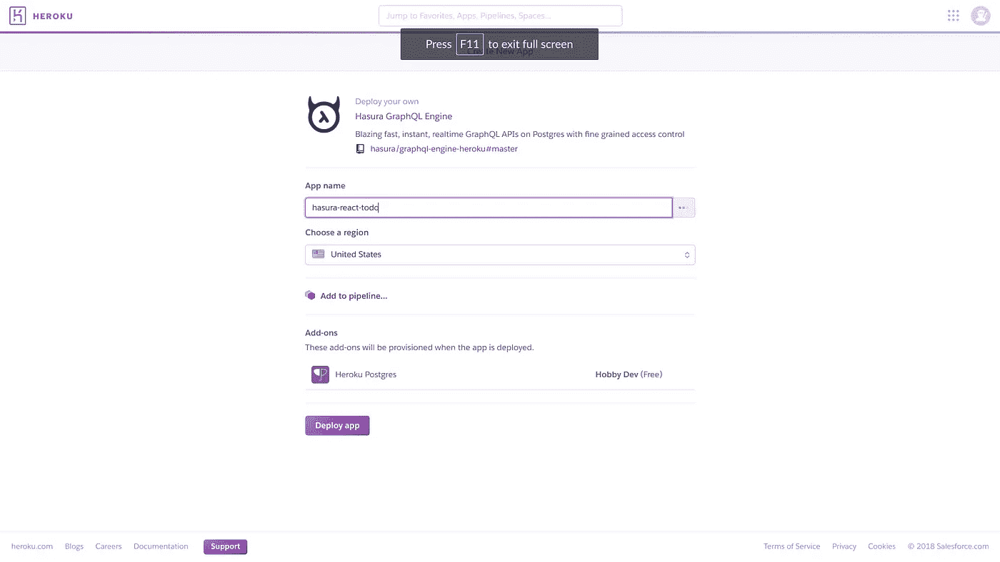
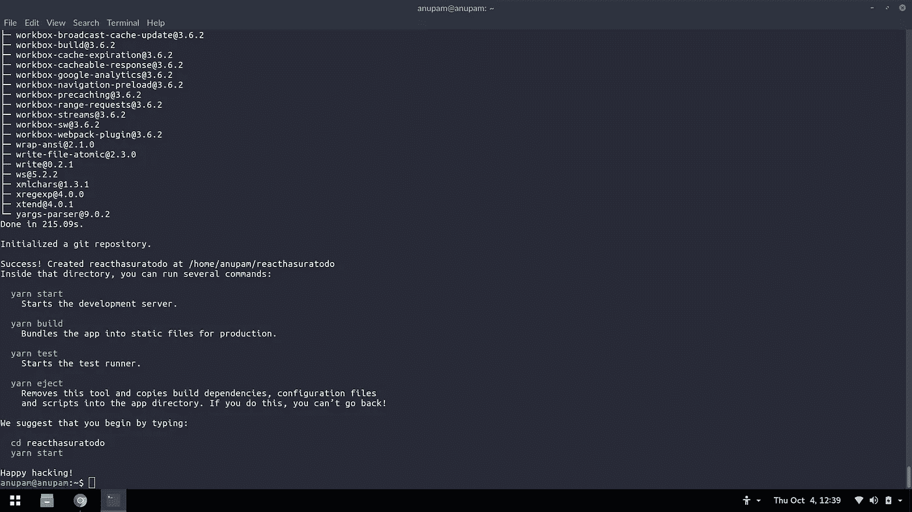
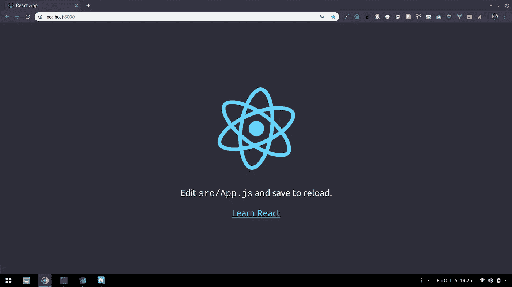
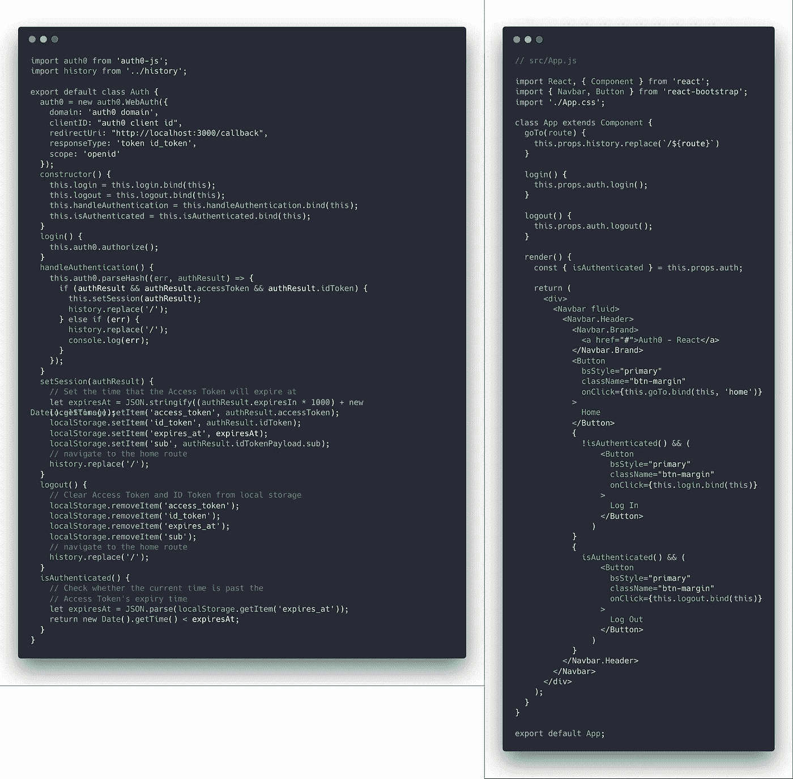
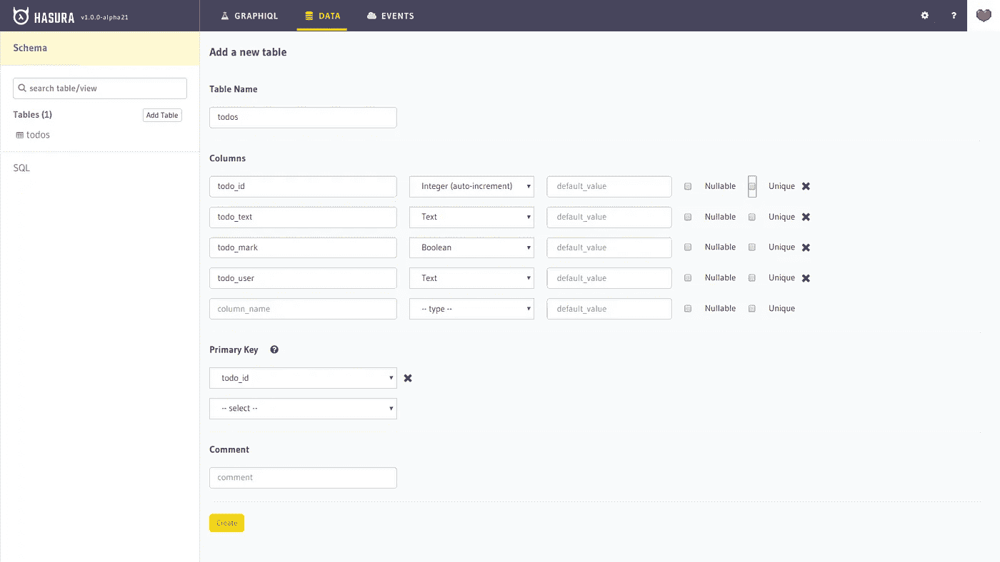
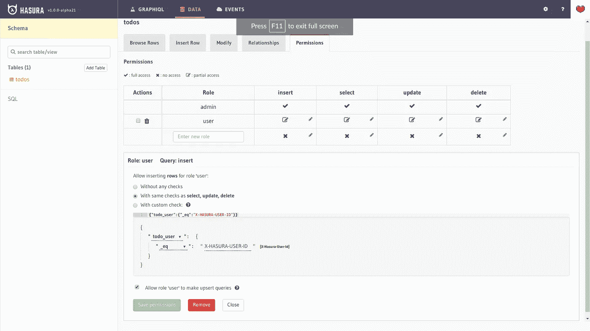

# 使用 Hasura GraphQL 引擎构建 React Todo 应用程序

> 原文：<https://levelup.gitconnected.com/building-a-react-todo-app-with-hasura-graphql-engine-511b703a7ef>


哈苏拉和反应

如果你正在读这篇文章，那么这意味着你可能对学习 Hasura 和 [React](https://gitconnected.com/learn/react) 感兴趣。如果是这样的话，那你就正好落在了一个完美的位置。你可能会有各种各样的问题，比如，“什么是 [GraphQL](https://gitconnected.com/learn/graphql) ？”，“哈苏拉是什么？”或者更重要的是，“我们为什么要用它？”。不用担心，当你读完这篇博客的时候，一切都会被清除。所以让我们开始吧！

本教程假设您对 React 框架有基本的了解。如果你是 React 的新手，我建议你先浏览 React 的 [hello world 应用，然后再继续。](https://reactjs.org/docs/hello-world.html)

本教程中的代码示例仅针对主要相关部分，但是如果您打算复制代码，请确保也导入相关的库和组件，并导出创建的组件。如果你想要完整的代码，你可以看看这个博客的[代码库](https://github.com/Anupam-dagar/react-Hasura-todo)。

# **什么是哈苏拉？**

[Hasura](https://hasura.io/) 是带有 BaaS 组件的 [PaaS](https://en.wikipedia.org/wiki/Platform_as_a_service) 。 [PaaS](https://www.google.co.in/url?sa=t&rct=j&q=&esrc=s&source=web&cd=1&cad=rja&uact=8&ved=0ahUKEwi8ybHf4M3UAhUjTo8KHXc-CCkQFggnMAA&url=https%3A%2F%2Fen.wikipedia.org%2Fwiki%2FPlatform_as_a_service&usg=AFQjCNGEI5j7opaOUuYhR3mLFcXu9xqYpw&sig2=MupuhZhI6n-GLERzsL6jGw) 代表平台即服务。它允许开发人员、It 专业人员和企业领导以安全、经济高效的方式在云中开发、测试和部署下一代应用程序，从而加快上市时间并增加竞争优势。

BaaS 代表后端即服务。它是一种模式，为 web 应用程序和移动应用程序开发人员提供一种方法，将他们的应用程序链接到后端云存储和后端应用程序公开的 API，同时还提供用户管理、推送通知和与社交网络服务集成等功能。

# GraphQL，有什么大惊小怪的？

GraphQL 是一种 API 查询语言，也是一种用现有数据完成这些查询的运行时语言。GraphQL 为 API 中的数据提供了完整且易于理解的描述，使客户能够准确地要求他们需要的东西，使 API 更容易随时间发展，并支持强大的开发工具。

# **哈苏拉的 GraphQL 引擎**

Hasura GraphQL 引擎是一个非常轻量级、高性能的产品，它可以在 Postgres 数据库上为您提供即时的实时 GraphQL APIs。这可以用来在 Postgres 上快速构建新的应用程序，或者为 Postgres 上的现有应用程序快速迁移到 GraphQL。

它附带了一个 UI，允许您在数据库上创建和查看表，并使用嵌入式 GraphQL 接口进行 graph QL 查询。

# 我们将会建造什么

我们将创建一个简单的 todo 应用程序，让用户注册或登录，然后通过(CRUD)创建它们来管理 todo，将它们标记为完整，或根据需要删除它们。用户还可以看到他的所有待办事项。访问[https://reacthasuratodo.herokuapp.com/](https://reacthasuratodo.herokuapp.com/)看我们将建设的演示。

# **设置您的开发环境**

1.  Hasura GraphQL 服务器
2.  结节
3.  npm 或纱线
4.  创建-反应-应用
5.  将您的 Hasura GraphQL 引擎部署到一个服务器上，该服务器将被用作进行查询的端点。设置 Hasura GraphQL 最多需要 1 分钟。它可以通过一键部署到 Heroku 的方法轻松地部署到 Heroku。[单击此处将您的 Hasura GraphQL 引擎部署到 Heroku 服务器](https://heroku.com/deploy?template=https://github.com/hasura/graphql-engine-heroku)。给你的 Heroku 应用一个名字，然后点击部署应用。您的 Hasura GraphQL 用户界面将在 appname.herokuapp.com 现场直播



Hasura 一键部署到 Heroku

为了保护您的 Hasura graphql 服务器，在 Heroku 上添加一个环境变量`HASURA_GRAPHQL_ACCESS_KEY`,并保持它的值为您能记住的值。每当您尝试登录 Hasura Graphql 服务器时，都会询问这个访问密钥。

2.在您的系统上安装节点和 npm。

*   在基于 Linux 的操作系统上:

> curl-sL[https://deb.nodesource.com/setup_8.x](https://deb.nodesource.com/setup_8.x)| sudo bash-
> sudo 安装节点

以上命令会在您的系统中安装 node 和 npm。

*   在 Windows 上:
    在这里从[下载相关包并安装。](https://nodejs.org/en/download/)

3.安装 create-react-app(我将用 yarn 代替 npm)

*   create-react-app 是一个由脸书开发的脚本，用来建立一个包含所有必要的目录结构和节点模块的 react 应用程序。
*   使用以下命令安装 create-react-app。

> **纱线全局添加创建-反应-应用**

这将在您的系统上全局安装 create-react-app。

# **创建 react 应用**

使用`create-react-app reacthasuratodo`
创建一个新的 react 应用程序。成功完成该命令后，您将看到类似于图中的输出。现在，在刚刚创建的 react 应用程序目录中打开代码编辑器。



设置 React 应用程序

把你的工作目录改成 react app 目录，运行`yarn start`。服务器将启动，您应该能够在 [http://localhost:3000](http://localhost:3000.) 上看到欢迎反应屏幕。这意味着你的 React 应用运行良好。



Live React 应用

我将使用`react-bootstrap`包进行造型，所以使用`yarn add react-bootstrap`安装包。确保在`/public/index.html`中添加引导样式表。react-bootstrap 包的完整文档可以在这里找到[。](https://react-bootstrap.github.io/getting-started/introduction)

# **使用 auth0 作为 todo 应用程序的身份验证**

auth0 是一个通用的认证和授权平台。

要将 auth0 添加到您的 React 应用程序，我们将执行以下步骤:
1。在[https://auth0.com](https://auth0.com)上注册并创建一个新的应用程序。
2。在 auth0 控制台中添加回调 URL。
3。创建一个验证类。创建历史. js
5。创建一个回调组件
6。创建路线
7。更改 App.js 以包含授权 URL
8。渲染路线而不是应用程序 js

在[https://auth0.com](https://auth0.com)上注册，为你的 react 应用创建一个新的应用。为您的 auth0 应用程序提供一个相关的名称，然后转到 settings 选项卡，用 react 应用程序对其进行配置。

在`Allowed Callback Urls`下的设置中添加`http://localhost:3000/callback`，因为它将在认证完成后成为开发环境上的回调 URL。

现在通过执行`yarn add auth0-js`在 react 应用程序中安装 auth0。
auth0 的网站上有一个很棒的 [react 快速入门文档](https://auth0.com/docs/quickstart/spa/react/01-login)，可以将 auth0 包含在 react 应用中。

在`src/Auth/`中创建一个新文件作为`Auth.js`。我们将创建一个处理认证的`Auth`类。

从您的 auth0 应用程序中复制您的 auth0 `clientID`并粘贴到`Auth.js`中。如果您从 auth0 docs 开始，那么请确保在`setSession()`函数中添加`localStorage.setItem('sub', authResult.idTokenPayload.sub)`，在`logout()`函数中添加`localStorage.removeItem('sub', authResult.idTokenPayload.sub)`。这将在本地存储中存储用户 id。

历史. js

创建一个文件`history.js`,并将其内容制作成图像。同样修改`App.js`以包含登录、注销和主页按钮。



Auth.js 和 App.js

创建一个`callback.js`组件，该组件将在授权完成时显示给用户。

创建一个`routes.js`,包括显示不同组件的不同路线和进行授权的路线。所有文件的内容可在 [auth0 react 快速入门文档中找到。](https://auth0.com/docs/quickstart/spa/react/01-login)

# **在 GraphQL 中编写查询**

GraphQL 中有 3 种不同类型的查询——查询、变异和订阅。GET 请求由“查询”完成，而插入、删除和更新查询由“变异”完成。订阅监听事件中发生的任何变化，例如，如果一个新条目被添加到一个表中，那么通过订阅，它可以得到通知。这可以防止再次使用 GET 查询。

在 Hasura API Explorer 上创建一个名为`todos`的新表。它将包含以下字段:
1 .todo_id: Integer(自动递增)
2。todo_text: Text
3。todo_mark: Boolean
4。todo_user: Text

*   todo_id 将是 todo 编号，它将在每次新建时自动递增。
*   todo_text 将存储 todo 的文本。
*   todo_mark 是一个字段，如果 todo 已完成，则该字段为 true 如果 todo 尚未完成，则该字段为 false。
*   todo_user 将存储登录用户的用户 id。



在 Hasura 上创建一个表

添加表权限，以便每个用户只能访问其数据。

1.  创建一个新的`role`用户。
2.  对于`insert`选择了`with custom checks` 选择`todo_user`作为字段，使其`_eq`变为`X-HASURA-USER-ID`
3.  对于`select`，选择`with same checks as ----`并选择所有要访问的列。
4.  对于`update`选择了`with same checks as ----`并且只允许访问`todo_mark`列。
5.  因为`delete`选择了`with same checks as ----`。



## 编写 GET 查询

用 GraphQL 编写查询很容易。指定表名，然后指定要在响应中出现的字段。如果您想进行选择性搜索，那么可以在表名说明之后提供一个`order_by`。

获取 todos 表中所有值的示例查询如下:

```
query {
    todos{
       todo_id
       todo_text
       todo_mark
       todo_user
    }
}
```

查询的一般格式是:

```
query query_name {
 table_name (where, orderby or pagination expression)]{
 table fields in response
 }
}
```

## 写一个突变

突变包括插入、更新和删除。编写变异查询的一般格式是:

```
mutation mutation-name {
  mutation-type_table-name (
    expressions to identify row and changing data
  )
  affected_rows
}
```

对 todos 表的简单插入查询如下所示:

```
mutation {
    insert_todos(
        objects: [
            {
              todo_text: "Complete react app",
              todo_user: "auth0|20390123821398"
            }
        ]
    ){
       affected_rows
     }
}
```

对 todos 表的简单更新查询如下所示:

```
mutation {
    update_todos(
        where: {todo_id: {_eq: 1}}
        _set: {todo_mark: true}
    ){
       affected_rows
     }
}
```

对 todos 表的简单删除查询如下所示:

```
mutation {
    delete_todos(
        where: {todo_id: {_eq:1}}
    ){
       affected_rows
    }
}
```

现在我们准备使用 React 创建前端，并查询数据库以创建和利用 todos。

## **使用 React 编码前端**

我们将使用 React Apollo 客户端与 GraphQL 服务器交互并进行查询。使用`npm install apollo-boost react-apollo graphql --save`或`yarn add apollo-boost react-apollo graphql`安装 apollo 客户端。

会有以下几个主要成分:
1。一个父组件包装了 apollo provider 组件中的所有组件。
2。GetTodos 组件向用户显示所有待定的待办事项。
3。添加待办事项的 AddTodos 组件。
4。MarkTodo 组件将待办事项标记为已完成。
5。用于删除待办事项的 DeleteTodo 组件。
6。GetAllTodos 组件获取到目前为止为用户创建的所有 Todos。

1.  `Home.js`父组件。
    该组件将作为所有其他组件的父组件，我们将把子组件包装在一个`ApolloProvider`中，这将使我们能够使用 apollo 客户端在整个应用程序中进行 GraphQL 查询。ApolloProvider 需要一个带有`ApolloClient`对象的`client`道具。这允许我们提出授权请求。从 apollo-boost 导入 ApolloClient，从 react-apollo 导入 ApolloProvider。创建一个 ApolloClient 对象，如下所示
    要使用用户身份验证，在头中传递用户访问令牌作为授权。这将让 Hasura 知道哪个用户正在向 GraphQL 服务器发送请求。需要部署一个单独的身份验证 webhook 来允许令牌身份验证。将 webhook 部署到 Heroku 或任何其他服务。使用 Heroku 一键部署很容易部署。之后，将 Hasura 服务器中的`HASURA_GRAPHQL_AUTH_HOOK`环境变量配置为您部署的 webhook URL。使用`/auth0/webhook`进行 auth0 认证。

Home.js

2.`GetTodos`将从数据库中提取所有未完成的待办事项并显示给用户。这个组件需要使用 React Apollo 的查询组件。我们首先需要编写一个 GraphQL 查询来从 todos 表中获取所有未完成的 todos。编写查询的方法与上面解释的一样。在 react 中，您需要将查询放在`gql```中。gql 是从 graphql-tag 导入的，它让 apollo 客户机知道这个文本中包含的文本是一个 graphql 查询。为了保持代码的整洁，我们将创建一个`queries.js`并在其中编写所有的 GraphQL 查询。

获取不完整的 todos 查询

我们将使用这个查询来获取所有未完成的待办事项。在 GetTodos 组件中，我们将使用 Apollo 的查询标签。创建一个 Apollo 查询，并将 graphql 查询作为一个`query`属性传递给它。查询组件中的一个函数将检查查询的当前状态(加载)、错误(如果存在)以及完成时的数据。数据中会包含所有的待办事项，我们只需遍历数据并向用户显示相关内容。应该有一个选项将待办事项标记为已完成或删除待办事项，所以我们将创建这些组件，并与收到的数据一起呈现。最后，在所有的待办事项呈现后，我们将为用户提供一个添加新待办事项的选项，我们将为其创建一个 AddTodo 组件，并将其呈现在显示给用户的待办事项旁边。

GetTodos 组件

3.AddTodo 组件将用于向 hasura graphql 服务器发送插入请求，以便在数据库中添加新的 Todo 条目。这个组件将需要使用 graphql 的变异请求和 Apollo 的变异组件。

插入新待办事项的查询

这里我们将在变异查询中使用变量，变异查询将从 Apollo 的变异组件接收。该组件将由一个表单组成，该表单将接受来自用户的 todo_text 输入，并将其作为变量发送给变异查询。创建一个变异组件，并在变异属性中传递 GraphQL 查询的名称。在突变中有一个带有两个参数的函数，第一个参数是突变的类型，第二个参数是可选数据。插入类型的突变需要`todo_text`和`todo_user`作为变量。任何要随查询一起发送的额外数据都包含在字典中。

所有的变量都包含在一个字典中，变量名作为关键字，变量值作为字典。这个变量字典被分配给附加数据字典中的一个变量键。突变改变了数据库的状态，这意味着如果我们向数据库添加新的待办事项，那么它应该在未完成待办事项列表中显示给用户。这是由`refetchQueries`实现的。`refetchQueries`是字典列表，每个字典包含变异完成时要执行的查询的名称。每当一个新的待办事项被添加到数据库时，我们将重新提取所有的待办事项。

AddTodos 组件

4.MarkTodo 组件将用于向特定 Todo 的数据库发送更新请求，以将其 todo_mark 值从`false`更改为`true`。

用于将待办事项标记为已完成的变异查询

在 MarkTodo 组件中，创建一个变异组件，并在变异属性中传递 graphql 查询的名称。MarkTodo 组件类似于 AddTodos，只是 AddTodo 插入一个新条目，而 MarkTodo 更新数据库中现有的条目。

将 todo 的 id 作为变量传递给 update mutation，以便可以在数据库中更改 todo_mark 值。变异完成后重新提取所有 todos。

MarkTodo 组件

5.与 MarkTodo 一样，我们将创建一个 DeleteTodo 组件。这将允许用户从数据库中完全删除待办事项。除了我们将使用 delete_todos 作为变异类型之外，一切都将与 MarkTodo 中的相同。

删除待办事项的查询

DeleteTodo 组件

6.最后，我们将创建一个 GetAllTodos 组件，向用户显示他到目前为止创建的所有 Todos。它包括已完成和未完成的待办事项。该组件将对 todos 表使用 GET 查询，我们将首先根据最近创建的未完成的 todos 对 todos 进行排序。在 react 中使用条件渲染，我们可以对未完成的待办事项和完成的待办事项设置不同的样式。

GetAllTodos 组件和查询

使用`yarn start`运行服务器。前往 [http://localhost:3000](http://localhost:3000) 测试你的应用。

就是这样，用 Hasura Graphql Engine 创建一个 React Todo 应用程序是如此简单。您可以扩展它以包括更多的功能和更好的外观和感觉。将 react 应用程序部署到 Heroku 或任何其他托管服务上，这样互联网上的每个人都可以使用它。

你可以在这里找到这个博客的源代码。

[](https://github.com/Anupam-dagar/react-Hasura-todo) [## Anupam-dagar/react-Hasura-todo

### 一个使用 Hasura Graphql 引擎的 react todo 应用程序。为 Anupam-dagar/react-Hasura-todo 开发做出贡献，创建一个…

github.com](https://github.com/Anupam-dagar/react-Hasura-todo) 

继续编码！！！

创建 todo 应用时使用的有用资源:
1。 [Hasura GraphQL 引擎文档](https://docs.hasura.io/1.0/graphql/manual/index.html)
2。 [React 阿波罗 GraphQL 文档](https://www.apollographql.com/docs/react/)
3。[auth 0 React quick start](https://www.apollographql.com/docs/react/)4。[官方 GraphQL 文档](https://graphql.org/learn/)

# 关于我

我的名字是阿努帕姆·达加尔。我是阿拉哈巴德印度信息技术学院的一名本科生。我正在攻读信息技术的学士学位。

当我没有大学作业的时候，我喜欢创造和学习新事物。我喜欢用 Python 和 T21 编写代码。我是**开源贡献者**，目前是 **GitHub 校园专家**在**印度**。

你可以在 [LinkedIn](https://www.linkedin.com/in/anupamdagar/) 、 [Twitter](https://twitter.com/siriusdagar) 和 [GitHub](https://github.com/Anupam-dagar) 上关注我。