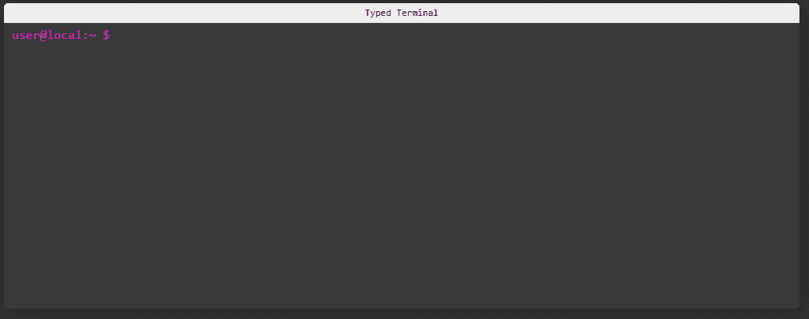

# 构建一个反应式终端组件

> 原文：<https://levelup.gitconnected.com/building-a-react-typing-terminal-component-b01a96ba368d>


最近，我一直在开发我的开发者组合。在此期间，我想尝试创造一种效果，看起来像一些在终端上打印出来的文本，以此作为一种有趣的方式向其他技术人员展示我的技能。我开发的最终产品使用了简单的 CSS 和一个名为 [Typed.js](https://github.com/mattboldt/typed.js/) 的优秀包，为下面的效果制作了一个 react 组件。



为了构建这种效果，我将向您展示如何利用 Typed.js 来制作组件，以获得我们的终端键入效果，以及如何将多行链接在一起，以便动画按预期播放。最后，通过一些造型，我们可以使它看起来像一个计算机终端，以吸引其他技术类型来查看您想要显示的任何信息。我已经把这个组件放在 GitHub 上了，如果你想安装它或者为你需要的任何东西分叉它。

[](https://github.com/Aaron-K-T-Berry/react-component-typed-terminal) [## GitHub-Aaron-K-T-Berry/react-component 型终端

### 一个 react 组件，用于显示一个打字动画，使用 TypedJs 来显示一个类似终端的组件来显示…

github.com](https://github.com/Aaron-K-T-Berry/react-component-typed-terminal) 

# 创建组件

构建这个效果需要两个 React 组件:终端窗口的包装器和使用 typed.js 为我们创建输入效果的终端行。我们将在下面分别讨论这些组件。

# 终端窗口

终端窗口将用于给出我们的终端输出将出现的区域的结构。为了达到这种效果，如果您要立即显示每一行，typed.js 动画会立即启动。因此，我们希望为每一行存储一些状态，以跟踪何时应该开始输入以及何时完成输入，从而允许像开发人员一样在终端窗口上同步输出这些行。

下面看到的`TypedTerminal`，请注意 type.js 完成动画时将调用的`onComplete`函数。我们在这里定义了一个函数，它将把下面终端行的`animationState`标记为 true，所以终端 like 将被取消隐藏并启动 typed.js。

```
export const TypedTerminal: React.FunctionComponent<{
  title: string;
  terminalData: { command: string; results: string[] }[];
  promptText: string;
  typedJsProps?: TypedOptions | {};
}> = (props) => {
  // Create an array for each terminal line to track the animation completed
  // state so the next terminal line typing can be picked off
  const [animationState, setAnimationState] = useState<boolean[]>(
    // Set the first line as true to start typing and set all other lines to false
    props.terminalData.map((item, index) => (index == 0 ? true : false))
  );return (
    <div className={"TerminalWrapper"}>
      <div className={"TerminalTitle"}>{props.title}</div>
      <div className={"TerminalBody"}>
        {props.terminalData.map((item, index) => {
          return (
            <TerminalLine
              key={`${item.command.toLowerCase().replace(" ", "")}_${index}`}
              promptText={props.promptText}
              // Animation has not be started so don't show the prompt
              hidden={!animationState[index]}
              typedJsProps={{
                // Combine the command and results into a single string separated
                // by new lines to get the effect of some terminal output
                strings: [item.command + "\n" + item.results.join("\n")],
                // When the line has completed its animation progress to the next one
                onComplete: () => {
                  let currentState = [...animationState];
                  currentState[index + 1] = true;
                  setAnimationState(currentState);
                },
                loop: false,
                typeSpeed: 40,
                showCursor: false,
                ...props.typedJsProps,
              }}
            />
          );
        })}
      </div>
    </div>
  );
};
```

现在为样式，我们将使用下面的样式表建立一个矩形窗口，在它和文本颜色之间有一些对比背景，就像你在终端上看到的一样。但是当然，这可以为你正在构建的任何主题定制，类是可重写的。

```
.TerminalWrapper {
  max-width: 1000px;
  font-family: Monaco, Consolas, "Lucida Console", monospace;
  display: block;
  margin: auto;
  border-radius: 5px;
  box-shadow: rgb(0 0 0 / 30%) 5px 5px 30px;
  clear: both;
  overflow: auto;
  -webkit-transition: all 0.5s ease-out;
  -moz-transition: all 0.5s ease-out;
  -ms-transition: all 0.5s ease-out;
  -o-transition: all 0.5s ease-out;
  transition: all 0.5s ease-out;
}.TerminalTitle {
  padding: 5px 0;
  font-size: 0.75em;
  text-align: center;
  background-color: #eeeeee;
  border-bottom: #e0e0e0 1px solid;
}.TerminalBody {
  padding: 5px 10px;
  height: 350px;
  overflow-y: auto;
  word-break: normal;
  background-color: #3a3a3a;
  color: #fff;
}.TerminalLine {
  padding-bottom: 0.5rem;
  font-family: Monaco, Consolas, "Lucida Console", monospace;
}.TerminalPrompt {
  color: #ff00df;
}.TerminalResults {
  white-space: pre;
}
```

# 终端打字线路

所以现在我们想构建一个组件来保存我们为每一行输入的文本，这样我们就可以在显示时对它有更多的控制。这是一个简单的组件，它将接受文本和 typed.js 配置，并在组件显示时实例化 typed.js 实例。组件如下所示；

```
export const TerminalLine: React.FunctionComponent<{
  promptText: string;
  hidden?: boolean;
  typedJsProps?: TypedOptions | {};
}> = (props) => {
  // Create reference to store the DOM element containing the animation
  const targetEl = React.useRef(null);
  // Create reference to store the Typed instance itself
  const typed = React.useRef(null);// Trigger this effect when props.hidden changes
  useEffect(() => {
    if (!props.hidden) {
      if (!typed.current) {
        // elRef refers to the <span> rendered below
        (typed.current as unknown as Typed) = new Typed(
          targetEl.current as unknown as Element,
          props.typedJsProps ?? {}
        );
      }
    }
  }, [props.hidden]);return (
    <div className={"TerminalLine"}>
      <span className={"TerminalPrompt"} hidden={props.hidden}>
        {props.promptText + " "}
      </span>
      <span className={"TerminalResults"} ref={targetEl} />
    </div>
  );
};
```

需要注意的一点是，在我们需要的行准备好之前，我们不想初始化 typed.js 对象；如果我们不这样做，每一行都会同时输出，这看起来不太像终端。为了让 typed.js 只在需要时初始化，当组件在屏幕上可见时，我们使用下面每当`props.hidden`改变状态时触发的 react 效果来启动 typed.js 动画。

当组件第一次被加载到页面中时，类型化的对象将是`null`，当该行被触发显示时，类型化的元素将被一个新的 typed.js 实例填充。然后，这个实例被附加到引用`targetEl`上，在我们漂亮的样式 bash 提示文本被添加到 typed.js 动画之前之后，该引用作为组件范围的一部分被输出。

```
return (
    <div className={"TerminalLine"}>
      <span className={"TerminalPrompt"} hidden={props.hidden}>
        {props.promptText + " "}
      </span>
      <span className={"TerminalResults"} ref={targetEl} />
    </div>
  );
```

# 把这些都集中起来。

现在我们有了组成效果的两个组件，我们可以将它们结合起来，在应用程序中获得一个可配置的终端。使用`TypedTerminal`组件，您必须为命令和结果以及您可能需要的任何其他 typed.js 选项传递一些数据。

```
import React from "react";
import { TypedTerminal } from "react-component-typed-terminal";const App = () => {
    const typedJsProps = {
        loop: false,
        typeSpeed: 40,
        showCursor: false,
    }const terminalData = [
        {
          command: "ls -a ./folder-1",
          results: ["file 1", "file 2", "file 3", "file 4"],
        },
        {
          command: "ls -a ./folder-2",
          results: ["file 1", "file 2", "file 3", "file 4"],
        },
    ]return <TypedTerminal typedJsProps={typedJsProps} terminalData={terminalData}/>
}
```

现在，当您使用该组件时，您应该会在屏幕上看到下面的效果，您可以通过修改输入数据来自定义该效果，以控制终端输出的内容。


# 包扎

希望看到这个组件是如何组装在一起的，会让您对如何使用它、实现类似的东西或者在其他 react 项目中使用 typed.js 有所启发。如果需要，我已经在这里打包了安装在您的项目中的回购，或者随时打开任何更改的拉请求。

[](https://github.com/Aaron-K-T-Berry/react-component-typed-terminal) [## GitHub-Aaron-K-T-Berry/react-component-type-terminal

### 一个 react 组件，用于显示一个打字动画，使用 TypedJs 来显示一个类似终端的组件来显示…

github.com](https://github.com/Aaron-K-T-Berry/react-component-typed-terminal) 

如前所述，我已经在我的开发人员作品集中使用了这个组件，以一种开发人员和技术人员会欣赏的方式来展示我的一些技能。将这种功能封装到一个可配置的组件中，应该意味着如果需要的话，我可以将这个组件用于其他项目，并覆盖那个项目的任何样式。

# 进一步连接

*   如果你正在考虑获得一个中型订阅，你可以通过使用我的[推荐链接](https://aaron-kt-berry.medium.com/membership)来帮助我。
*   查看我在[媒体](https://medium.com/@aaron-kt-berry)上的其他文章，如果你想了解最新消息，请通过[电子邮件](https://aaron-kt-berry.medium.com/subscribe)订阅。
*   如果你想聊天，在推特上联系我，或者在 T2 的 LinkedIn 上联系我，如果你想雇佣我，我在 T4 的 Codementor 上。