# 建立一个反应排版系统

> 原文：<https://levelup.gitconnected.com/building-a-react-typography-system-f9d1c8e16d55>

我的目标是创建一个稳定、灵活、可伸缩的反应式排版系统。

下面是一个工具和惯例的集合，放在一起形成一个易于使用和可扩展的设计系统。

这是一个过程的分解，例子，以及如何实现它。

# 目标

我喜欢设计系统。可能是我德国的一面让我在使用一个可靠的设计系统时有一种温暖模糊的感觉，而且一切正常。以前，像原子设计模式和 ITCSS 这样的解决方案工作得很好，但是依赖于全局 CSS 的级联性质。现在，网络已经转向更加独立的模块化组件，我想创建一个解决方案，它仍然具有我们在优秀的旧 CSS 类中拥有的灵活性。

这些是我的主要要求:

*   **可扩展样式:**使用道具覆盖默认样式的能力。
*   **灵活标记:**改变组件 HTML 元素的能力。

此外，最终的解决方案应该是简单的、可伸缩的和干燥的。

# 入门指南

当面对这样的挑战时，我经常从理想的最终目标开始，然后逆向工程。所以在我看来，我想要这样的东西:

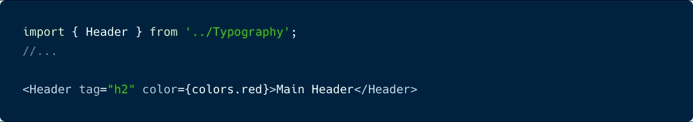

上面的例子将满足这两个主要要求。它是一个样式化的组件，可以灵活地在视觉上和语义上进行修改。尽管上面的例子相当简单，但我想做一些修改来改进命名约定，并从使用它的上下文中抽象出名称。

## 良好做法

这个简短的部分是关于我在最终解决方案中作为例子使用的惯例，如果你已经熟悉设计系统，可以随意跳过这个部分。

首先，字体名称。我使用过各种命名字体样式的惯例，从行星名称到城市名称，但我遇到的最佳解决方案是在 [GEL](http://www.bbc.co.uk/gel/guidelines/typography) 中使用的，这是 BBC 制作的前端框架，参考了可追溯到 15 世纪的传统字体测量技术。

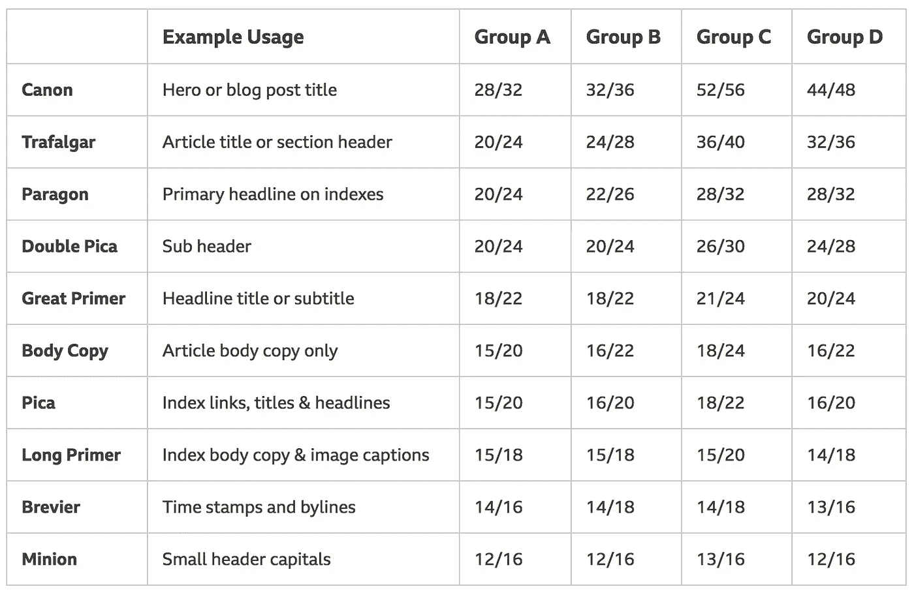

[http://www.bbc.co.uk/gel/guidelines/typography](http://www.bbc.co.uk/gel/guidelines/typography)

> 这有助于我们在开发过程中轻松交流类型选择，弥合设计人员和开发人员之间的差距。

第二，关于颜色名称，我经常用[命名那个颜色](http://chir.ag/projects/name-that-color/)来创建单独的抽象名称。这防止了以相同颜色(灰色-1，灰色-2)的编号变化列表结束…我们都经历过这种情况。

因此，在应用这些更改后，第一个示例现在看起来像这样:

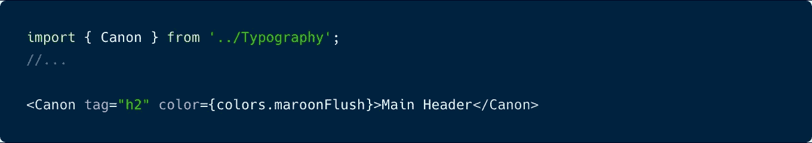

现在是下一个挑战，可扩展的风格…

# 扩展默认组件样式

为了满足标准的第一个要求，我需要一种方法来制作每种印刷样式(正楷、正文等)。)转换成具有默认样式的组件，但也可以使用 props 覆盖它们。

以前，我通过在每个单独的组件中包含所有默认的样式、属性和标记来实现这一点(见下文)。然而，这使得修改非常有限，并迫使您使用硬编码的 HTML 元素(在这种情况下，H1)。

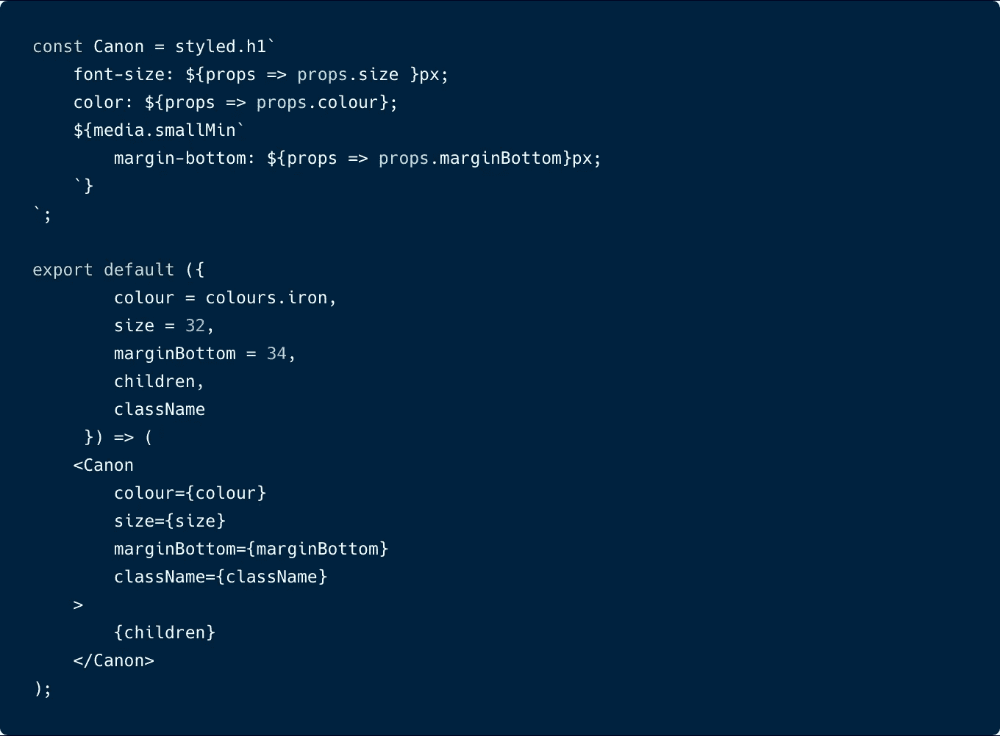

此外，这种方法也不能很好地扩展，一旦我添加了更多样式和修改，很快就会导致组件和道具膨胀。

在创造和尝试了各种其他可能的解决方案后，我遇到了 Brent Jackson 的[风格系统](https://github.com/jxnblk/styled-system)包。

 [## jxnblk/styled-system

### sparkles:使用 React - jxnblk/styled-system 构建设计系统的响应式、基于主题的风格道具

github.com](https://github.com/jxnblk/styled-system) 

使用 styled-system，我能够重构佳能组件以实现以下功能:

*   移除手动道具进行修改
*   将默认样式移动到主题提供者

所以，首先我替换手动定义的道具。Styled-System 使用样式函数的概念为您提供一组将属性映射到组件的实用程序。因此，在应用了 styled-system 中的这些内容后，前面的示例看起来应该是这样的:

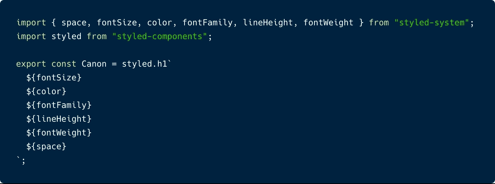

我一直在使用 [styled-components](https://www.styled-components.com/) ，但是 styled-system 也可以与 JS 库中的其他 CSS 一起工作。

通过使用 styled-system 指定样式函数，我能够实现和以前一样的功能，并且能够使用 props 覆盖默认样式，如字体大小和颜色。

第二步，将默认样式从单个组件移动到共享的 React 提供程序中。Styled-system 实际上利用了 styled-components 使用的 ThemeProvider，通过使用 styled-system 命名约定，您可以引用值而无需任何额外的逻辑。

下面的代码是将被传递到 ThemeProvider 中的主题变量。`textStyles`对象是我移动原始组件中所有默认样式的地方。

为了使这些样式具有响应性，属性如`fontSize`和`lineHeight`也接受一个数组，数组中的值对应于根对象中的`fontSizes`数组，数组中的位置对应于`breakpoints`数组中的最小宽度值。

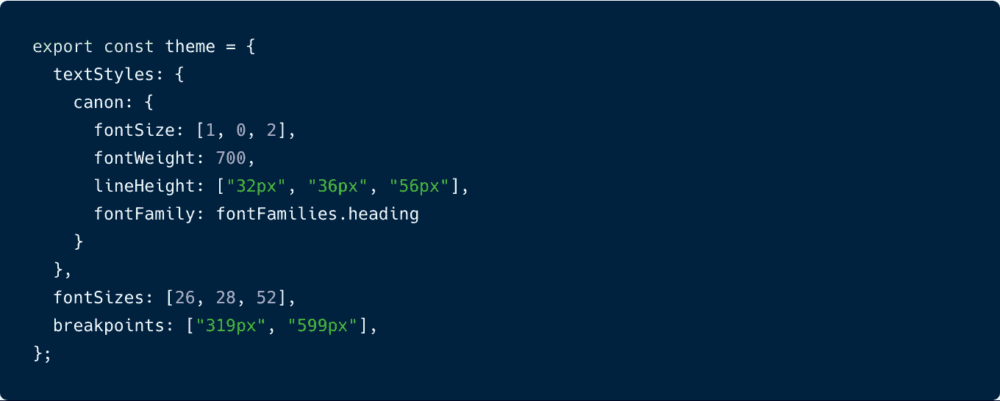

`textStyles`现在可以被引用并应用到 JSX 元素上，以使它们的风格应用到它上面。

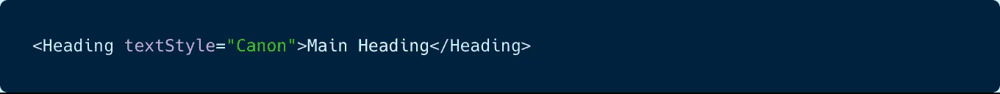

然而，为了使这些文本组件更容易导入，我创建了一个单独的清单文件，它导出了所有带有默认样式和属性的文本组件。

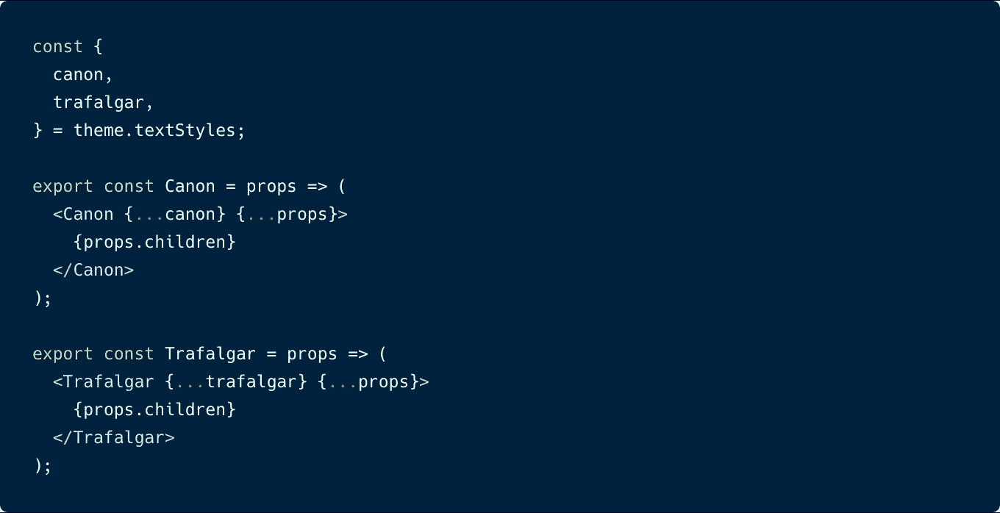

现在可以导入文本样式，并像这样覆盖样式:

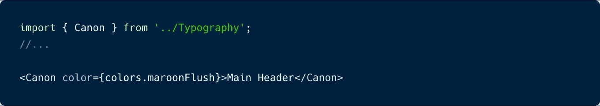

最后，对于最后的需求，我还需要能够覆盖每个元素的标记。

## **灵活标记**

对于任何设计系统来说，重要的是不要将排版风格绑定到元素上。例如，当你需要一个标题样式的时候，你不应该被强迫使用 H1。语义标记应该只针对浏览器或搜索引擎。和用于视觉目的的样式。

为了实现这种灵活性，我创建了一个名为`DynamicComponent`的高阶组件来处理所有样式和标记覆盖。

以前，我通过使用样式化组件的`withComponent`方法实现了这一点。这将`DynamicComponent`默认为一个 div，并允许使用 props 覆盖它(如下)。

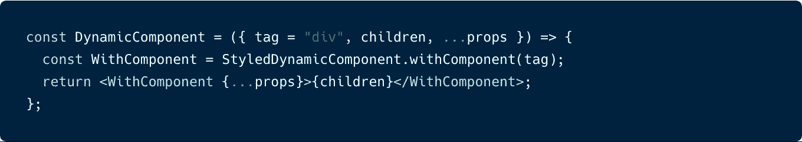

然而，正如[样式化组件 V4 提供了一个](https://medium.com/u/a3b001e8e8ec#as-polymorphic-prop) `[as](https://www.styled-components.com/docs/api#as-polymorphic-prop)` [标签](https://www.styled-components.com/docs/api#as-polymorphic-prop)来在运行时修改标记。所以在[之后，这个更新](https://github.com/Jezfx/react-typography-system/commit/0701fc6c8b597fd02d1c060f400289686e856552)可能只是导出一个样式化的组件。

每个排版组件将共享这个`DynamicComponent`。因此，我们可以将样式系统道具从每个排版组件移到`DynamicComponent`保持组件干燥。

所以完整的`DynamicComponent`加上所有的样式系统道具现在看起来会是这样的:

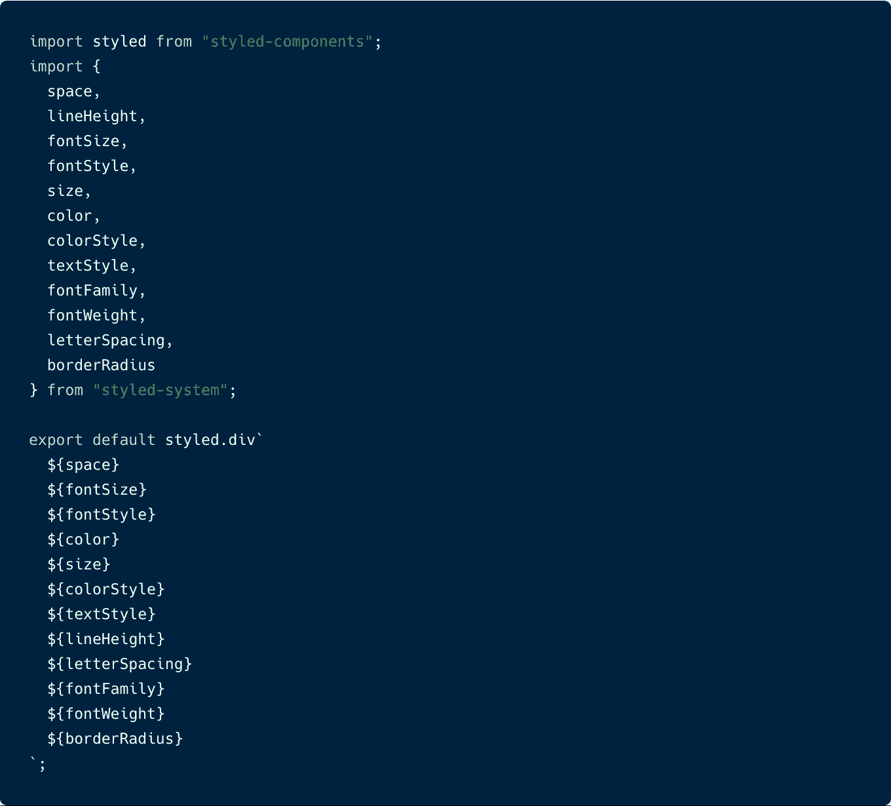

这意味着每个排版组件现在都可以使用共享的`DynamicComponent`。导入任何文本组件时使用的默认 HTML 元素是在主题对象中用`as`键定义的，以支持 styled-components `as`方法。

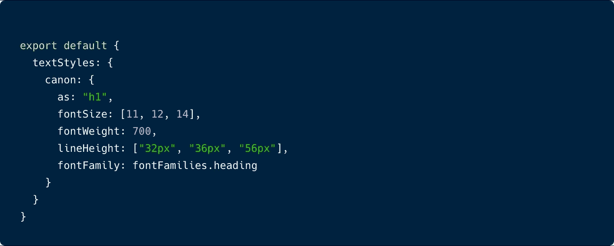

这是最终的排版清单文件，正在导出 2 种排版风格，佳能和特拉法尔加。

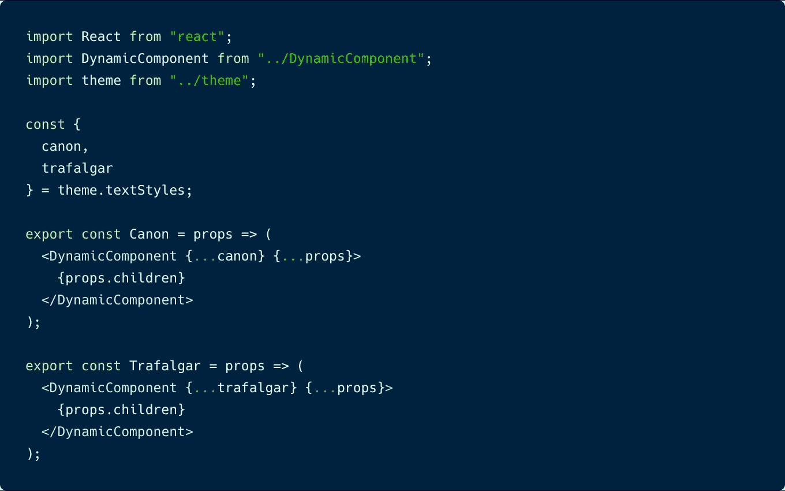

。/印刷术/index.js

# 差不多就是这样

所以，最后，这是可能的:动态标记和样式。

我在[代码沙箱](https://codesandbox.io/s/kw89ro5y2r)中加入了更多的例子，并在我的网站上使用:

 [## Jez Williams |自由前端网络开发人员

### Jez Williams 投资组合

www.jezfx.com](https://www.jezfx.com/) 

然而，我遇到了一些小限制:

*   `DynamicComponent`最终可能会膨胀。因为每当任何排版风格需要一个新的道具时，它必须从样式系统中导出，并添加到道具列表中。
*   您也只限于样式系统支持的样式。

所以肯定会有改进，但我发现它是迄今为止最灵活、最容易使用的。如果您想尝试一下，或者为您自己的项目挑选想法，完整的回购就在这里。

 [## jezfx/react-排版-系统

### 工具和惯例的集合放在一起形成了一个易于使用和扩展的设计系统。…

github.com](https://github.com/Jezfx/react-typography-system) 

## 谢谢你阅读✌

我很乐意听到任何反馈、想法或问题。

[阿玛多·洛雷罗](https://unsplash.com/@amadorloureiroblanco?utm_source=medium&utm_medium=referral)在[un plash](https://unsplash.com?utm_source=medium&utm_medium=referral)上拍摄的照片

 [## 学习反应-最佳反应教程(2018) | gitconnected

### 前 45 个反应教程。课程由开发人员提交并投票决定，让您能够找到最佳的反应课程…

gitconnected.com](https://gitconnected.com/learn/react)