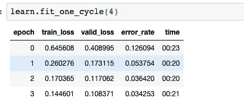
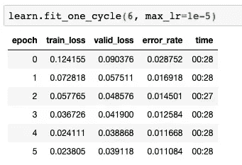
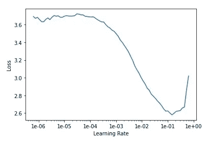
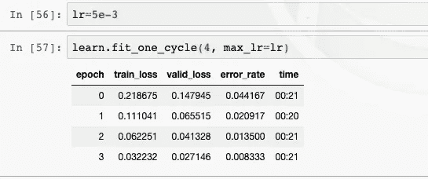

# 使用 MNIST 构建实时数字分类器(99.17%准确度)

> 原文：<https://levelup.gitconnected.com/building-a-real-time-digit-classifier-using-mnist-99-17-accuracy-1b894b07cae7>

*你可以看看已部署的* [*互动演示*](https://mnist.dube.io) *或者看看* [*github 回购*](https://github.com/gisderdube/mnist) *。*

[MNIST](http://yann.lecun.com/exdb/mnist/) 是使用深度学习训练图像分类器的经典数据集。该数据集由 70，000 个手写数字组成，存储为图像。现在，我在玩深度学习，我想看看作为该领域的新手，可能会有什么样的表现会很有趣。

我的想法是把一个分类器和一个小前端结合起来，让用户用鼠标画一个数字，并实时看到结果。毕竟，让一段代码表现良好是一回事，但让它对用户来说容易理解是另一回事。

从事 Web 开发已经有几年了，构建前端并不是太大的问题。我知道我可以用画布让用户画画。围绕这一点，我需要一个基本的网页，显示结果，加载状态等。稍后会详细介绍。

## 训练模型

正如之前的深度学习项目一样，我使用了 fast.ai 库来创建和训练一个神经网络。该库为您提供了快速入门所需的所有工具(尤其是对初学者而言)。您只需加载数据，选择一个基础架构，提供一些基础变量，然后让模型自行训练。

提供数据很容易，至少我一开始是这样认为的。数据集已经存在，我只需要下载数据并提供给模型。下载并解压存档数据后，我注意到它几乎是无格式数据，即“无符号字节”。虽然很可能有一种方法可以将它输入到神经网络中，但我希望数据是单个的 PNG 文件。我尝试运行一些脚本来转换它，但最终发现这个 [github repo](https://github.com/myleott/mnist_png) 将数据集转换成了 PNG。

第一轮培训

有了可用格式的数据(对我来说)，我就可以继续训练模型了。我使用 resnet34 作为 CNN 的基础架构，并训练模型。开箱即用，模型达到了~98.9%的准确率，非常惊人。能够在一天之内训练一个手写识别模型(只有数字)达到如此高的精度令人兴奋不已。知道来龙去脉的人可能能够在<20 minutes, but still a good timeframe!

second training round after unfreezing

I thought I might unfreeze the model (allowing to change weights of all layers of the neural net) and train again, but the error_rate didn’t seem to come down.

Clearly there must be something that is missing, as I would expect the unfreezed training to reduce the error rate. I went back and had a look at the learn rates for both freezed and unfreezed stages and voilà, things got below the 1% error rate threshold:

learn rate for freezed model

fresh training with freezed model & good LR

training with unfreezed model & good LR

## Overfitting after unfreezing

With a good learn rate, the error rate dropped to 0.833% for the freezed model and even 0.767% for the unfreezed one after training. At first sight, the 0.767% seems better, but after deploying the model to the [互动演示](https://mnist.dube.io)中做到这一点，我发现实际性能更差。例如，如果我在矩形(=0)的上部画一个小圆，模型会将其归类为 9。我不太确定这到底是什么原因，以及它是否真的过度拟合，但我会在冻结模型和 0.833%的错误率下获得更好的真实性能。

## 部署应用程序

在我的上一个项目中，我使用 node.js 服务器为 web 应用程序提供服务，对于任何分类任务，node.js 进程都会生成一个子 python 进程来运行实际的分类。这是可行的，但并不真正有效，因为模型本身的大小约为 200MB。启动 python 进程、加载模型和运行分类脚本将花费相当多的时间，尤其是当有多个请求进入时。这一次，我选择了一个 python 进程，它可以一直运行，并将模型保存在内存中。node.js (express)和 python (flask)服务器将通过 HTTP 进行通信，只有 node.js 服务器可以被外界访问。当然，有可能只有一个 python 服务器，让它也为 web 应用服务。然而，由于对 Node.js 更加熟悉，我选择了这个解决方案。此外，这使得主服务器负载相对较低(在这种情况下，这不是一个大问题)。你可以在 [github repo](https://github.com/gisderdube/mnist) 中查看完整设置。用于训练模型的 Jupyter 笔记本也在那里，但是你需要预先下载数据来运行它。