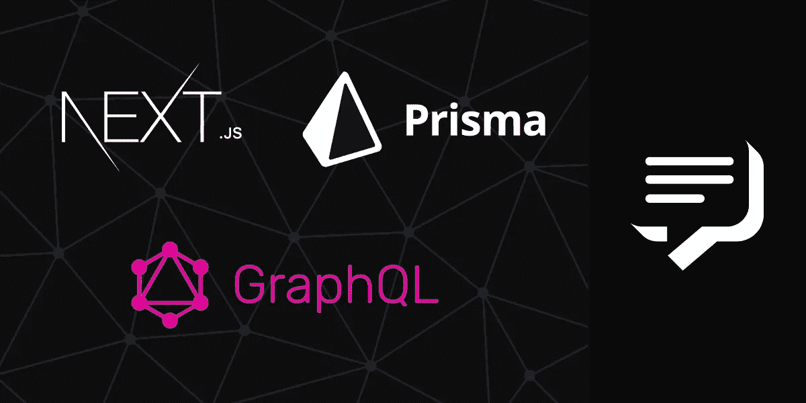

# 构建一个带有 SMS 通知的实时 GraphQL 聊天应用程序

> 原文：<https://levelup.gitconnected.com/building-a-realtime-graphql-chat-application-with-sms-notifications-cc8ecbd0ada0>

随着[的出现，GraphQL](https://graphql.org/) 为开发者提供了一种开发客户机/服务器应用程序的新方法。开发 GraphQL 应用程序的好处很多，从向服务器明确请求您需要的东西到通过订阅进行实时事件驱动的通信。本文重点介绍代码优先的 GraphQL 及其强大功能。本文还将概述如何开发一个聊天应用程序，在前端使用 [Next.js](https://nextjs.org/) 和 [Apollo](https://www.apollographql.com/) ，在后端使用优秀的 [Vonage SMS API](https://www.vonage.com/communications-apis/sms/) 使用 [Prisma 2](https://www.prisma.io/blog/prisma-2-beta-b7bcl0gd8d8e) 、 [Graphql-yoga](https://github.com/prisma-labs/graphql-yoga/blob/master/README.md) 和 SMS 通知。

# 代码优先图

代码优先的 GraphQL 是一种开发 GraphQL 服务器的方法，它通过编写解析器和外包模式定义来以编程方式生成。它通常被称为解析器优先方法。模式的生成由一个工具处理，该工具遍历解析器并生成模式。模式优先与代码优先方法相反，它涉及定义类型、响应等。，您的服务器。

# 后端开发

我们将建立一个带有短信通知的实时聊天应用程序。

首先，克隆这个[库](https://github.com/themmyloluwaa/nextjs-graphql-prisma-starter)。它包含了您需要遵循本文的基本设置。

## 先决条件

*   节点 js >=10.0.0
*   之前对 Prisma 的理解
*   了解 GraphQL
*   数据库，例如 MySQL
*   Prisma CLI
*   Vonage 账户

要完成本教程，您将需要一个 [Vonage API 帐户](http://developer.nexmo.com/ed?c=blog_text&ct=2021-02-25-building-a-realtime-graphql-chat-application-with-sms-notifications)。如果你还没有，你可以[今天](http://developer.nexmo.com/ed?c=blog_text&ct=2021-02-25-building-a-realtime-graphql-chat-application-with-sms-notifications)注册，开始用免费的信用点数建造。一旦你有了一个帐户，你可以在 [Vonage API 仪表板](http://developer.nexmo.com/ed?c=blog_text&ct=2021-02-25-building-a-realtime-graphql-chat-application-with-sms-notifications)的顶部找到你的 API 密匙和 API 秘密。

现在，让我们了解一下项目目录。

根目录中包含两个文件夹。后端目录包含一个保存 Prisma 配置的 Prisma 文件夹。prisma 文件夹中有一个 schema.prisma 文件，其中包含数据库设置配置和一个名为 dev.db 的 SQLite db。导航到后端目录并运行`**npm install**`来安装所有必要的依赖项。

另外，在后端目录中创建一个. env 文件；这将包含必要的环境变量，如数据库 URL 和变量等。对于数据库 URL，将其粘贴到 env 文件中:

frontend 文件夹中的 pages 目录是 Next.js 将为应用程序页面提供服务的地方。pages 目录包含一个 _app.js，它被设置为使用 Bootstrap。导航到前端目录并运行`npm install`。该文件夹还包括一个 src 目录，其中包含资产、组件和 utils 子目录。

接下来，导航到 prisma/schema.prisma 文件。我们需要两个模型，一个用于用户，一个用于聊天。下面是生成器客户端配置:

模型表示将在数据库中创建的表名，而字段表示将存储在那里的列名和数据类型。除了 Prisma 中可用的数据类型之外，模型也可以是一种数据类型。这就是定义两个或更多模型之间的关系或者一个模型的自身关系。我们用 Prisma 关键字注释每个模型。如果你不明白所使用的关键字，请查阅 Prisma [文档](https://www.prisma.io/docs/concepts)。

运行`prisma migrate save --experimental`。命名您的迁移并运行`prisma migrate up --experimental`。该命令将基于模式中的模型定义创建表。最后，运行`prisma generate`来展示映射到 Prisma 方法的数据库模式和支持 CRUD 功能的特性。

导航到 **src/types** 目录并创建一个用户和聊天文件。已经存在四个文件:Mutation.js、Query.js、Subscription.js 和一个 index.js 文件，该文件将所有解析器合并为一个。

在 User.js 文件中，添加:

在 Chat.js 文件中，添加:

我们从 nexus 导入一个 ***objectType*** ，因为用户和聊天模型是 object 类型的。我们使用模型方法和字段名称来访问我们在模式中定义的字段。这是通过我们安装的***nexus-plugin-prisma***实现的。这有助于我们不再需要开始逐个定义和配置每个字段。以下代码是手动进行配置的示例:

在突变文件中，我们来处理登录和注册。在 src/types 目录下创建一个名为 **AuthPayload.js** 的新文件。这是一个对象类型，表示返回给客户端的身份验证负载类型。

在 AuthPayload.js 中，添加:

在 src/utils 目录中，创建一个 helper.js 文件并创建这些方法。

**注意**:现在你应该已经在你的。这些方法的 env 文件。

现在，我们有了一种使用 getUser 方法获取用户 ID 的方法。让我们修改 script.js 文件。从 src/utils/helpers 导入 getUser 方法，并在服务器配置文件上取消对这部分上下文方法的注释。

在 mutation.js 文件中，添加注册代码:

我们首先检查数据库是否包含一个有电子邮件或电话的用户，如果用户存在，我们抛出一个错误，否则我们创建用户，使用用户的 id 生成一个令牌，并将令牌设置为 cookie。我们还返回注册有效载荷。

将以下内容添加到 login.js 中，就在注册解析器的下面:

我们验证用户是否存在，验证他们的登录凭证，将令牌设置为 cookie，并返回 auth 有效负载突变类型。我们还通过在服务器配置中创建的 Vonage SMS API 实例向他们发送 SMS 通知。

为了在应用程序上处理用户的短信通知，我从 Vonage 购买了一个虚拟号码。你应该按照这篇[文章](https://learn.vonage.com/blog/2019/09/16/how-to-send-and-receive-sms-messages-with-node-js-and-express-dr)开始创建一个 Vonage 短信应用程序。一旦你创建了一个应用程序，一个私钥文件会自动下载到你的电脑上。将此文件移动到后端目录。您还应该在您的。env 文件，我从 Vonage 账号买的虚拟号。

前进到 **types/index.js 文件**，注释掉查询和订阅导入，因为我们在那里没有任何东西。现在，导入 User.js 和 Chat.js 文件。

让我们添加一个查询解析器，允许用户查询他们的帐户详细信息。在 Query.js 中，添加:

因为我们已经在服务器配置的上下文字段中处理了对收到的每个请求的用户查询，所以如果用户存在于 ctx 对象上，我们就可以访问他们。如果 ctx 对象上不存在该用户，则意味着该用户需要登录。在 types/index.js 文件中，取消对导入的 Query.js 文件的注释。

让我们再创建两个查询解析器；一个用于查询一个用户，一个用于查询多个用户。我们将使用 nexus-plugin-prisma crud 功能；这是一个实验性的功能，所以我们需要打开它。在 **script.js** 文件中，在 plugins 字段中，将`{experimentalCRUD: true}`添加到 nexusPrisma 函数(如果没有添加的话)。

在 Query.js 中，添加:

要使用这个功能，请确保用单数形式命名您的模式模型，如**用户**而不是**用户**。让我们也使用这个特性来处理变异文件中的更新一个用户和删除一个用户解析器。

现在让我们来处理聊天解析器。让我们再添加两个文件，一个叫做 Subscription.js，另一个叫做 SubscriptionPayload。将这两个文件添加到 index.js 文件中的类型(解析器)列表中。

`**SubscriptionPayload.js**`

为了处理订阅，我们将使用 Graphql-yoga 包附带的 **PubSub** 方法。

首先，让我们为一个聊天创建 CRUD 功能，订阅解析器将监听这些 CRUD 事件。让我们还创建一个 sendNewMessageNotification 函数，用于在聊天接收者之间的前一次对话不到一小时之前的任何时候向他们发送通知。

在 helper.js 文件中，添加:

此方法检查最后发送的消息是否少于 1 小时。如果是，我们向消息的接收者发送短信通知，如果不是，我们什么也不做。导出 sendNewMessageNotification 方法并将其导入到 Mutation.js 文件中。现在让我们来处理 createChat 解析器。

在 Mutation.js 中，添加:

我们通过检查服务器上是否存在用户对象来验证消息发送者是否登录，然后验证消息是否为空。我们首先查询用户发送或接收的最后一条消息，然后创建新消息。如果两者之间的前一条消息不到一小时，则 sendNewMessageNotification 方法将被触发。最后，让我们处理订阅方面。

在 Subscription.js 中，添加:

我们从 nexus/schema 中导入 intArg 和 subScriptionFIeld 对象，还从 graphql-yoga 包中导入 withFIlter 方法——这有助于我们确保只有正确的用户才能接收有效负载或事件。第一个参数是 subscribe resolver，它返回我们想要过滤的 asyncIterator，它传递了我们想要监听的事件，即*创建、更新、删除*。第二个参数是事件通过必须满足的条件。对于我们的用例，这个事件应该只传递给消息数据的发送者和接收者。出于好奇，注释掉该字段并进行测试。您应该注意到，发送消息会通知应用程序中监听 createChat 解析器的所有用户。

现在，让我们添加 updateChat 和 deleteChat 变体——这与创建聊天略有不同。首先，我们需要检查用户是否经过身份验证。其次，我们必须检查消息是否存在；最后，我们需要检查消息的发送者是否可以更新或删除它。没有发送邮件的用户不应该有权删除邮件。如果这些条件通过，我们更新或删除聊天，然后通知我们的订户。

对于 updateChat 变体，添加:

对于 deleteChat 突变，添加:

现在让我们利用聊天和聊天查询的 CRUD 功能。在 Query.js 文件中，添加:

我们一直致力于应用程序的变异、查询和订阅方面。我们已经创建了低级别的权限和授权机制，以确保应用程序的一些功能是安全的，但现在是时候保护我们的 API 了。让我们在许可上工作。

理想情况下，我们不希望应用程序中的所有特性都是私有的，或者对未经身份验证的用户不可访问。我们也不想让所有东西都可以访问，那么我们如何解决这个问题呢？

现在，我们将使非认证用户可以访问用户列表查询，而其他功能将受到保护。我们还将为一些解析器添加额外的权限，以确保只有管理员可以执行某些操作，如删除用户。让我们开始吧。我们将使用 Graphql-shield。这里有一个很好的[教程](https://medium.com/@maticzav/graphql-shield-9d1e02520e35)，它涵盖了 Graphql-shield 的基础知识。

在 permissions/rules.js 中，添加:

然后在 permissions/index.js 文件中，我们将我们的规则定义应用于我们的每个解析器。

最后，在 script.js 的服务器配置文件中，取消对中间件字段的注释以打开权限。

# 前端开发

GitHub 存储库已经附带了编码所需的包和默认设置。运行`**npm i**`安装所需的依赖项。

导航到 pages 文件夹并创建 login、signup.js 和 index.js 文件。

现在，让我们来研究用户登录和注册。在我们继续之前，让我们创建一个 Layout.js 文件，用站点标题、favicon 等可重用功能包装我们的页面。

在 components 文件夹中，创建一个 Layout.js 文件。

在 login.js 中，添加:

在 getServerSideProps 中，我们检查令牌是否存在。如果令牌存在，这意味着用户还没有登录，我们将用户重定向到主页。如果令牌不存在，我们继续。导入所需的导入，如 setToken、Mutation 和 useMutation。我们定义了一个基本的 UI，用于登录并提供用户名和密码字段。该用户名接受电子邮件或电话号码。如果我们从服务器得到一个成功的响应，我们就设置令牌，并把用户导航到在`redirecTo`变量中定义的所需 URL。否则，如果登录凭证不正确，我们向用户显示此消息。如果你不明白 useMutation 钩子是如何工作的，请阅读 Apollo 客户端文档[这里](https://www.apollographql.com/docs/react/data/mutations/)。

在 Signup.js 中，添加:

现在，导航到您的浏览器并测试登录和注册。

接下来，创建 index.js 和 chat.js 文件。在 index.js 中，添加:

在 getServerSideProps 中，我们检查令牌 cookie。如果令牌不存在，用户将被重定向到登录页面。如果令牌存在，则在将数据作为 props 返回之前，会过滤掉登录的用户。array filter 方法用于处理客户端搜索，useMemo React 钩子用于记忆用户数据以防止不必要的重新呈现。

您可以在项目目录的 gql 文件夹中找到用于这些页面的 GraphQL 查询。

接下来，在组件文件夹中创建一个 ChatBubble 组件。我们将利用 day.js 包来处理消息时间戳。安装`npm install dayjs`包并在 utils 中创建一个格式化数据文件。在 formatDate.js 中，添加:

然后，在 ChatBubble.js 中插入:

根据收到的聊天对象，如果发送者是当前登录的用户，我们会应用各种样式，如聊天气泡的方向。

在 chat.js 中，添加:

所以让我们来了解一下这是怎么回事。我们首先检查令牌 cookie 是否存在。如果不存在，我们将用户重定向到登录页面，并将聊天页面作为 redirectTo 函数传递。如果令牌存在，用户对象有效负载被添加到 prop 中，聊天数据在客户机上使用 useQuery 钩子获取。这使我们可以访问一个名为`subscribeToMore`的方法，我们在`useEffect` hook 中调用该方法来处理订阅更多的消息以立即接收更新。`subscribeToMore`方法接受订阅查询、所需的变量和一个 updateQuery 方法，该方法告诉它如何处理收到的新消息。关于如何工作的更多信息，[文档](https://www.apollographql.com/docs/react/data/subscriptions/#usesubscription-api-reference)有一个有用的指南。useMutation 钩子处理新消息的创建。

现在，让我们在配置文件页面上工作，用户可以在处理云部署之前查看和更新他们的配置文件。

首先，创建 profile.js 文件。然后添加以下内容:

我们只编辑姓名和电子邮件字段。如果更新成功，我们向用户显示一条 toast 消息，并在 1.3 秒后将用户重定向到登录页面，以便使用新的凭据登录。

# 部署

我们已经创建了 GraphQL 服务器，还开发了一个用 NextJS 构建的应用程序来使用这些端点。服务器 API 受到保护，页面也是如此。由于我们一直在本地开发，现在是时候向世界公开这个应用程序了。我们将在 Heroku 上部署服务器，在 Vercel 上部署客户端应用。我将向您展示两种部署应用程序的方法。一个使用命令行界面，另一个使用 Vercel 仪表板。在这里创建一个 Vercel 账户[。在这里](https://vercel.com/)创建一个 Heroku 账号[。](https://www.heroku.com/)

另外，安装带有`npm i -g vercel`的 Vercel CLI。按照此处的说明[安装 Heroku CLI。](https://devcenter.heroku.com/articles/heroku-cli)

创建两个新分支。一个称为生产/服务器，另一个称为生产/客户端。让我们先来部署服务器。

让我们删除生产中不需要的文件。在 Prisma 文件夹中，删除 dev.db 文件和 migration 文件夹。我们将在生产中使用 Postgres 数据库。我们可以从 ElephantSql 获得一个免费的 PostgreSQL 数据库。创建一个[账户](https://www.elephantsql.com/)并创建一个新的 Postgres 数据库。导航到后端目录，复制数据库 URL 并将其替换到您的。环境文件。在 prisma/schema.prisma 文件中，将数据源数据库设置替换为:

我们有了新的数据库，是时候运行迁移了。运行`**npx prisma migrate save --experimental**`和`**npx prisma migrate up --experimental**`。

在终端中，运行 heroku login 并输入您的凭证。然后，运行`heroku create < name-of-your-app >`。让我们设置应用程序使用的环境变量。要设置配置变量，使用`heroku config:set < name >= < value > -a < namme-of-your-app>`，例如我的 SALTROUND 变量`**heroku config:set SALTROUND=10 -a vongage-graphql-api**`

由于我们的根目录包含客户端和服务器代码，Heroku 不支持子目录部署，我们必须使用不同的构建包进行部署。请在此处遵循本文[进行操作。添加所需的配置变量后，运行:](https://medium.com/@timanovsky/heroku-buildpack-to-support-deployment-from-subdirectory-e743c2c838dd)

*   `**heroku buildpacks:clear**`
*   `**heroku buildpacks:set** [**https://github.com/timanovsky/subdir-heroku-buildpack**](https://github.com/timanovsky/subdir-heroku-buildpack)`
*   `**heroku buildpacks:add heroku/nodejs**`
*   `**heroku config:set PROJECT_PATH=Backend**`

然后，将其添加到 package.json 文件中的脚本中:

`"heroku-postbuild": "npm run postinstall"`

我们刚刚添加的脚本确保了在安装了项目的依赖项之后，Heroku 会生成必要的 Prisma 数据库实例。

通过运行`git remote -v`确认 Heroku 是远程存储库的一部分。如果没有看到名为 Heroku 的遥控器，通过运行`heroku git:remote -a <app-name>`添加它。

最后，运行 git `git push heroku master`。这将推动您的代码并构建它。如果您遇到任何问题，请确保您已经设置了应用程序使用的所有 env 变量，并仔细按照说明进行操作。接下来，运行`heroku apps:open /playground`。

# 前端

确保您已经将所有的更改推送到生产/服务器分支中的 GitHub。从那里创建一个名为 production/client 的新分支，并为查询替换相应的 Graphql 端点，并将其转换为您的生产 URL。对于订阅，请将 HTTPS 协议替换为 WSS。将更改推送到 GitHub 并导航到您的 Vercel 帐户。

在您的仪表板中，

*   点击导入项目，复制你的 GitHub 库链接并粘贴
*   选择前端目录作为项目的根目录并命名
*   它应该会自动将 NextJS 检测为首选框架。我们没有使用任何 env 变量，所以让这部分为空。然后单击部署。
*   项目完全部署后，导航到 settings 选项卡。在 git 中，将部署分支从 main 更改为 production/client。
*   导航到您的代码，对您的文件进行更改，提交它，并推送到生产/客户端分支。它将自动构建并启动您的项目。
*   部署完成后，导航到您的 Heroku 仪表板。在您的服务器应用程序中，导航到 settings 选项卡，并将 FRONTEND_ORIGIN URL 更改为我们刚刚在 Vercel 上部署的生产客户端 URL。确保您没有在 URL 的末尾添加斜杠。比如应该是 www.example.com 的[，而不是 www.example.com/](http://www.example.com)的
*   瞧，我们完成了。

# 结论

一篇很长的文章，但我相信它值得一试。总的来说，我们已经介绍了如何使用代码优先的方法创建一个同样支持订阅的 GraphQL 服务器。我们进入了 Vonage SMS API，并使用它向用户发送短信通知。我们使用奇妙的 Prisma 2 数据库 ORM 来处理数据库查询。别忘了，我们使用 Apollo 和 NextJS 来消耗端点。最后，我们使用 CLI 和 GUI 在 Vercel 主机服务和 Heroku 上进行部署。我坚信我已经用这些工具武装了你构建下一个伟大想法所需要的一切。我对你的挑战是把这个应用程序提高到一个新的水平，增加更多的功能，如密码重置，添加朋友，帖子等。

感谢您花时间尝试本教程。如果你被卡住了，不要犹豫，通过 Twitter 联系我，电话是 [@codekagei](https://twitter.com/themmyloluwaaa) 或者发表评论。黑客快乐！

参考代码:

*   [前端](https://vonage-nextjs-client.vercel.app/login?redirectTo=/)
*   [后端](https://vonage-graphql-server.herokuapp.com/playground)

*最初发布于*[*https://learn . vonage . com/blog/2021/02/25/building-a-real time-graph QL-chat-application-with-SMS-notifications/*](https://learn.vonage.com/blog/2021/02/25/building-a-realtime-graphql-chat-application-with-sms-notifications/)