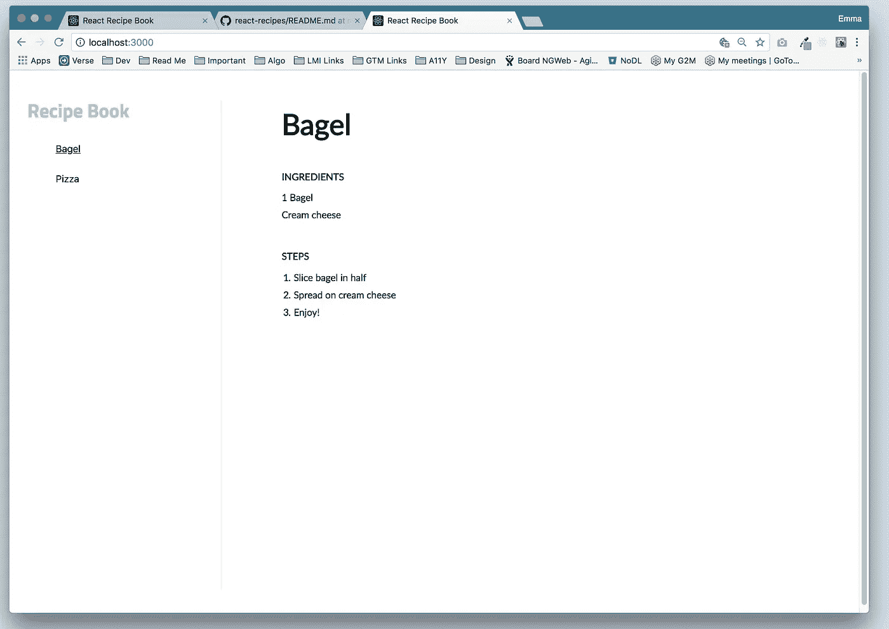
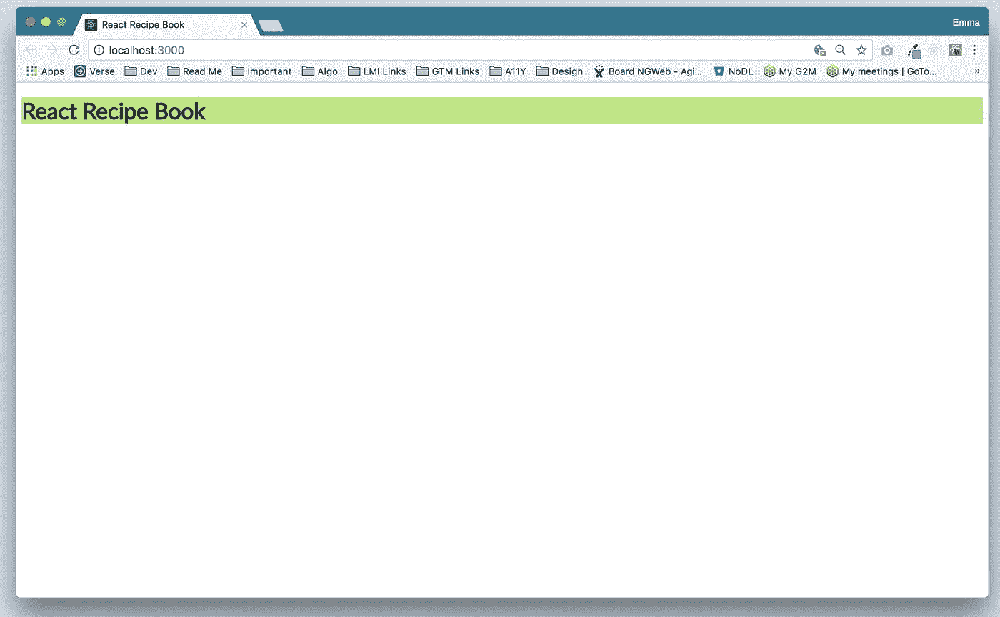
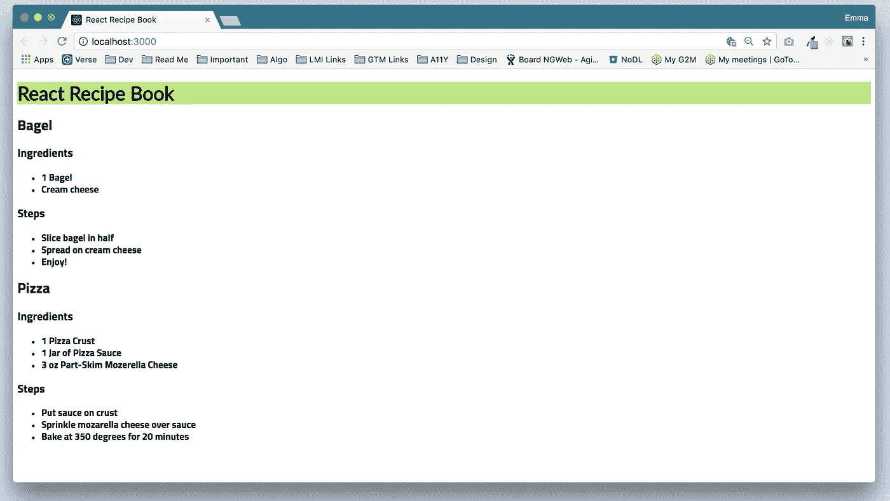
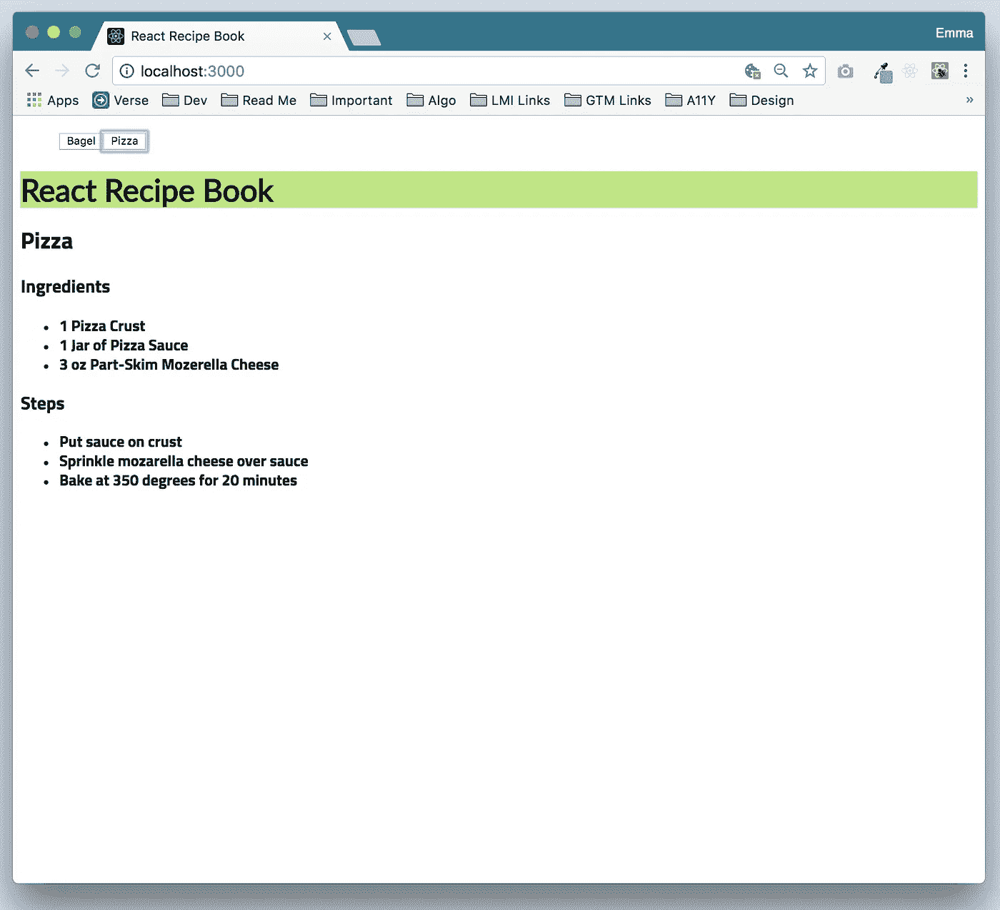

# React 初学者教程——在 React 中构建食谱

> 原文：<https://levelup.gitconnected.com/building-a-recipe-book-in-react-part-1-c05b3e53cbb1>



# 介绍

当我开始学习 React 时，我发现有时很难跟上。我发现有些教程对我来说节奏有点太快了。

因此，我决定自己写一个关于如何使用 React 创建食谱的分步指南。

这将包括使用`create-react-app`的基本知识，不会使用许多花哨的包。

我并不自称 React 专家(我自己还在学习中)，所以如果你发现了错误，欢迎留言评论！😸

# **先决条件**

1.  下载 [**npm**](https://www.npmjs.com/get-npm)

我们使用节点包管理器(NPM)来下载和管理应用程序中的包。

2.安装**反应**和[反应 CLI](https://www.npmjs.com/package/react-cli)

```
npm install -g react-cli react
```

我们希望安装 React 和 React 命令行接口，这样我们就可以在文件系统中的任何地方使用它们来创建 React 应用程序。

3.安装**纱线**

```
npm install homebrew
brew install yarn
```

家酿是另一个包管理器，我们需要安装纱线。我们使用 Yarn 来安装包依赖项。

4.安装 **sass**

```
npm install -g sass
```

我们使用语法上很棒的 Stylesheeets 作为我们的 CSS 预处理器，使我们的样式模块化，并获得 CSS 没有提供的功能。

我使用 [GitHub](https://github.com/ejbostian/react-recipes.git) 来托管所有的代码，所以请随意派生/克隆我的 repo 并跟随！

# **第一步:项目架构**

*所有代码都可以在* [*这里找到*](https://github.com/ejbostian/react-recipes) *。*

1.  使用命令行，将 CD 放入项目文件夹。我将我的存储库克隆到我的桌面上，因此我的命令如下所示:

```
cd Desktop/react-recipes
```

2.进入项目目录后，运行以下命令。

```
create-react-app .
```

这将在已经建立的目录中创建一个 React 应用程序。要创建没有项目文件夹的新应用程序，请运行:

```
create-react-app *name-of-app*
```

3.一旦`create-react-app`完成，安装依赖项:

```
yarn
```

4.现在，我们将在您选择的 IDE 中打开应用程序(我喜欢[与代码](https://code.visualstudio.com/))并启动应用程序。

一旦你在 IDE 中打开你的项目，这就是你的`src/`文件夹的样子。

在命令行运行`yarn start`，查看默认的`create-react-app`登陆页面。

5.接下来，删除我们不会使用的文件:`App.css`、`App.test.js`、`index.css`和`logo.svg`。

我喜欢我的组件模块化，所以让我们继续添加一些文件夹来构建我们的应用程序。

在`src/`中创建一个`components`文件夹，并将`App.js`移动到里面。

你的`src/`文件夹结构现在应该是这样的。

6.更新`index.js`以指向`App.js`的新路径，并删除我们刚刚删除的文件的旧导入。

7.在`App.js`内部，删除旧的导入和用`create-react-app`得到的默认代码。

## 设置 Sass

这里有一个快速简单的方法在你的项目中使用 Sass 而不用弹出！

1.  在`src/`中创建一个`styles/`文件夹，并在其中添加两个文件夹:`scss/`和`css/`。在`scss/`文件夹内，再添加两个文件夹:`base/`和`components/`。另外，在`scss/`文件夹中添加一个`index.scss`文件。

2.更新`index.js`以包含到`index.css`的路径(我们还没有生成)。它将存在于`src/styles/css`文件夹中。

3.现在，让我们添加一些样式来看看 SCSS 到 CSS 的转换。

*   在`styles/base/`内部，创建`_variables.scss`和`_elements.scss`。元素 partial 将包含基本 HTML 元素的任何样式，如`<body>`、`<h1>`等。变量 partial 将包含字体、颜色等变量。

Sass 中的片段是 Sass 代码的片段，你可以将它们包含在其他 Sass 文件中。我们正在为变量和基本元素创建一个分部，这样我们可以将每种类型的样式分开。我们将每个部分导入到`index.scss`文件中，以便在我们的 HTML 文件中使用它。部分由文件名中的下划线表示(尽管您可以在导入过程中省略它)。

我在`index.html`文件中加入了一个[谷歌字体](https://fonts.google.com/?selection.family=Lato)，并且清理了一些`create-react-app`默认注释。我还更新了应用程序的标题。

*   在`index.html`文件中包含自定义字体链接后，在`src/styles/scss/base/_variables.scss`中创建两个变量`$color-main`和`$font-main`。

4.在`styles/scss/base/_elements.scss`中，设置`<h1>`背景色和字体系列。

5.在`styles/scss/index.scss`里面，导入分音。

现在，让我们使用 Sass watch 将 Sass 代码(SCSS)转换成 CSS！

6.在`package.json`中，创建一个新脚本:

```
*"sass"* : "sass --watch src/styles/scss:src/styles/css"
```

这将获取在`src/styles/scss`中找到的任何 Sass (SCSS)文件，并将其转换成`src/styles/css`中的 CSS 代码。

7.在终端中，运行`yarn run sass`。这将把`index.scss`转换成`index.css`和`index.css.map`。

8.运行`yarn start`查看您新创建的应用程序！



# 步骤 2:配方成分

我们将为这个应用程序使用两个额外的组件:**导航**和**配方。**

让我们从菜谱组件开始。

1.  在`src/components`中创建一个名为`Recipe.js`的新文件。进口反应。并在文件末尾包含导出语句。

2.我们希望能够将数据(作为道具)传递给我们的食谱组件。所以让我们在状态中创建一个食谱数组，它将存在于`App.js`中。

*   创建一个构造函数并调用`[super();](https://developer.mozilla.org/en-US/docs/Web/JavaScript/Reference/Operators/super)`

对于每个食谱，我们需要在我们的状态中跟踪哪种信息？

*   **配料**:串[]
*   **步骤**:字符串[]
*   **标题**:字符串
*   **id** :字符串
*   在构造函数中创建`this.state`,并将两个项目添加到我们的食谱数组中。

理想情况下，每个食谱的 id 应该通过一个函数来确保它的唯一性，但是为了简单起见，我们将只显式地设置它。

你可以另外选择去掉 `[.bind(this)](https://medium.com/@nikolalsvk/loosing-bind-this-in-react-8637ebf372cf)`，但是为了简单起见，我把它留在这里。

3.为了检查传递给 Recipe 组件的数据类型，我们将使用 PropTypes。我们希望确保我们收到的数据是我们期望的数据类型。

```
npm install prop-types --save
```

*   将`PropTypes`导入`Recipe.js`。
*   在组件的底部，在导出之前，添加一个带有我们将要传入的相应属性的`propTypes`键:**配料**、**步骤**、**标题**和 **id** 。我在这些上面设置了`isRequired`标志，因为我们不想展示没有它们的食谱。

*   在`render`函数中的`return()`语句前创建两个常量`ingredients`和`steps,`。这将为配料和步骤数组中的每一项创建新的列表项。你可以在 JSX 做到这一点，但我喜欢将我的逻辑提取到变量中。

*   为标题、配料和步骤标题添加 HTML 元素，并显示我们刚刚用 const 创建的配料和步骤列表。

下面是`Recipe.js`应该是什么样子:

4.回到`App.js`，让我们遍历每一个食谱并实际传递数据。

这将为该状态下的每个配方创建一个新的`<Recipe />`组件。

下面是`App.js`的样子:

现在你应该看到你的每一个食谱都列出了它们各自的成分和步骤。



看起来还不是超级好看，但是很管用！

# 步骤 3:导航组件

1.  在`components/`文件夹中，创建`Navigation.js`。

导航组件目前只需要一个道具:食谱列表。

2.在`App.js`中包含导航组件

*   在`App.js`内部，导入`Navigation.js`并将其包含在`render()`函数中。
*   加一个`recipes`道具，从状态传食谱列表。

3.回到`Navigation.js`，让我们把食谱渲染成按钮。

*   遍历数组中的每个配方，并动态生成一个元素。

4.现在，让我们开发当相应的导航按钮被按下时显示正确配方的逻辑。

*   在`App.js`中，创建一个名为`selectedRecipe`的新状态。这将包含当前显示的食谱的 id。我们暂时可以将初始状态设置为`null`。
*   在渲染函数中，我们只想为当前选中的菜谱创建一个`<Recipe>`组件。为此，我们可以使用`array.filter()`功能。

除了我们的初始状态值为`null`之外，这很好，所以让我们将上面的语句包装在一个“if”语句中，以确保定义了“this.state.selectedRecipe”。

```
if(this.state.selectedRecipe) {...}
```

此外，`filter()`函数返回符合该描述的项目数组。所以我们引入一个局部变量叫做`recipeToSelect`。

我们将在刚刚编写的`if()`语句之前声明它，如果`filteredRecipes`至少返回一项，我们将把它赋给找到的第一个值(它应该只返回一个，所以这更像是一种边缘情况检查)。

现在，我们可以检查`recipeToSelect`是否有值。如果是，用那个 id 呈现`<Recipe>`组件，否则，只返回 null。

5.接下来，我们想用第一个食谱初始化我们的应用程序，所以让我们添加一个`componentDidMount()`生命周期函数。

如果配方状态数组中有配方，将`selectedRecipe`的状态设置为其`id`。

7.我们需要做的最后一件事是，当单击导航按钮时，更新显示哪个配方。

在`App.js`中，让我们创建一个将`selectedRecipe`状态设置为所选配方的函数。

在构造函数下面，添加一个名为`selectNewRecipe`的函数。这将采用一个参数`recipeId`并更新状态，如果这个值存在的话。

这看起来很棒，除了一件事:我们需要将这个函数绑定到`App`。否则`this`上下文就全错了。

在构造函数内部，为`selectNewRecipe`添加一个绑定。

酷！那么我们如何让子组件(导航)在按钮被点击时调用这个函数呢？

*   把这个函数作为一个道具传递给导航。

我们刚刚以 prop 的形式创建了对该函数的引用。

*   在`Navigation.js`内部，让我们给按钮添加一个`onClick`处理程序。

每点击一个按钮，就会调用`changeRecipe`函数。让我们现在就创建它。

该函数将接收`e`(事件)并为点击的食谱获取`id`。然后，它将把这个 id 传递给父函数，以便更新状态。

正如我们在`App.js`中绑定函数一样，我们在这里也必须这样做。因此，让我们创建一个构造函数并绑定该值。

还要更新`Navigation`中的`propTypes`以包含传递的函数。

厉害！您的应用程序现在应该呈现正确的组件！

以下是`App.js`和`Navigation.js`的完整文件:

这是我们的应用程序目前的样子。



# 第四步:风格

好吧，我承认，这个应用看起来不怎么好看。所以我们给它一些风格。你可以随心所欲地设计你的应用。我只是为每个组件的 Sass 创建一个新的 scss 部分，并将其导入到`index.scss`中。

**对选择的导航项目进行样式化**

我们必须做的一件重要的事情是样式化选择的导航项目。为此，我们必须将`selectedRecipe`状态作为道具传递给`<Navigation>`组件。

接下来，向`Navigation.js`中的`className`属性添加一个三元组。如果导航项的 id 等于所选的配方，那么除了基类之外，还要给它一个活动类。

这是我们的风格化应用程序的外观。


# 结论

我知道这不是一个超级花哨的应用程序，但对于初学者来说，这是一个很好的学习练习。

我喜欢这个应用程序的想法，也因为我有一吨的食谱，我需要保持跟踪。

你甚至可以[通过 GitHub](https://guides.github.com/features/pages/) 托管这个，发送给你的朋友和家人！

Emma Wedekind 是德国卡尔斯鲁厄 LogMeIn 公司的前端软件工程师。她喜欢写博客、在沙滩上漫步和养猫。还有披萨。Mmmm 披萨。

如果你喜欢这个博客，请一定要为它鼓掌或关注我的 [*推特*](https://twitter.com/EmmaWedekind) *，*[*LinkedIn*](https://www.linkedin.com/in/emmawedekind/)*，或*[*insta gram*](https://www.instagram.com/emmawedekind/)*！*😄 😼