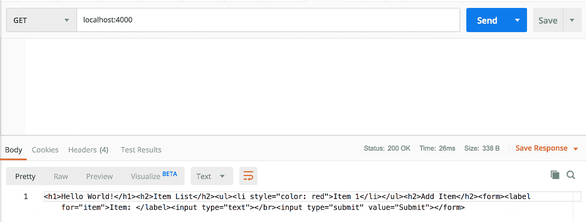
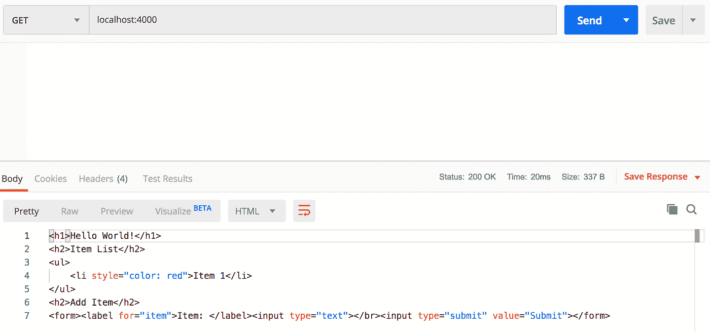
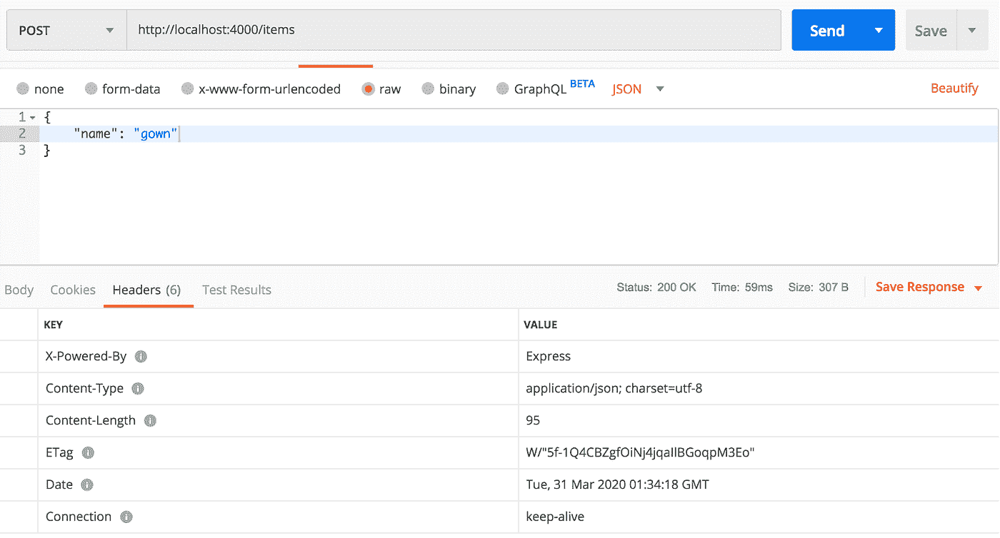
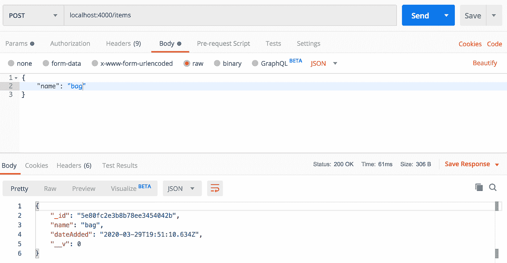
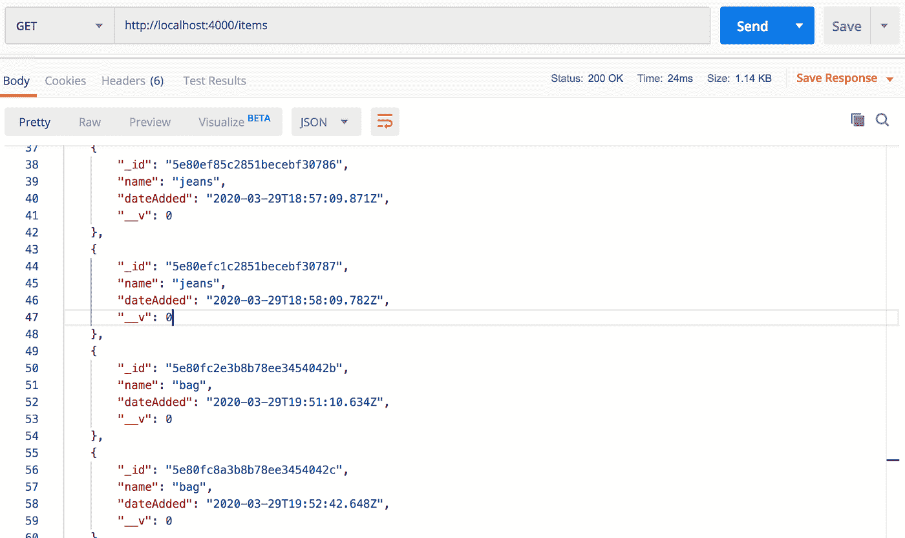
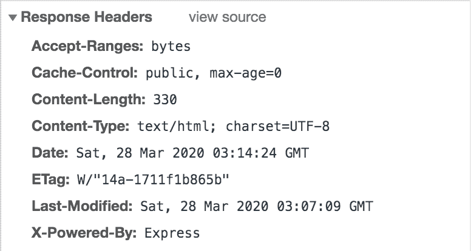

# 用 Node.js 构建 RESTful API

> 原文：<https://levelup.gitconnected.com/building-a-restful-api-with-node-js-831bff629e3b>

## 使用 Node.js、Express、MongoDB 和 React.js 的全栈应用程序


我最近的任务是为运行 Node.js 后端的 web 应用程序构建 REST API 端点。使用 Flask 框架在 Python 中工作了一段时间后，我需要刷新 Node.js 并研究其支持的 web 框架的最新情况。

在这篇博客中，我构建了一个简单的 Node.js 应用程序，它从 MongoDB 数据库中读取数据，并向其中写入数据。我首先用 Node HTTP 包创建一个基本的 web 服务器，然后用 Mongoose 连接到 MongoDB，最后用 Express.js web 框架增强应用程序。要跟进，你可以在我的 GitHub 上找到[源代码](https://github.com/ckraczkowsky91/rest-api-node-express)。

如果你对探索 Flask 框架感兴趣，我已经写了单独的博客解释[如何开始使用 Python 的 Flask 框架](https://medium.com/@ckraczkowsky/getting-started-with-the-flask-web-framework-a7c2862dfba8)，[如何使用 Flask 构建用户界面](https://medium.com/@ckraczkowsky/building-modern-user-interfaces-with-flask-23016d453792)，以及[如何使用 Flask-Admin 构建使用 Flask-Security 保护的管理界面](https://medium.com/@ckraczkowsky/building-a-secure-admin-interface-with-flask-admin-and-flask-security-13ae81faa05)。

## **构建一个简单的 Node.js 应用程序**

我们需要做的第一件事是在本地开发环境中安装 Node.js。Node.js 是一个开源、跨平台的运行时环境，它使我们的开发人员能够用 JavaScript 创建服务器端应用程序。然后，我们为项目创建文件夹，通过运行以下命令，我们将在其中构建 Node.js 应用程序。

```
$ mkdir rest-api-node-express
```

我们将添加到项目中的第一个文件是`index.js`文件，我们将在该文件中编写在应用程序启动时运行的 JavaScript。

```
$ touch index.js
```

在`index.js`文件中，我们添加代码来创建我们的基本 web 服务器，该服务器使用节点 http 包监听 URL[HTTP://127 . 0 . 0 . 1:4000/](http://127.0.0.1:4000/)上的任何类型的 HTTP 请求。我们设置响应头，以便当接收到请求时，Node.js 应用程序将以 HTTP 状态 200 进行响应，并且响应体的内容将以 HTML 返回。

```
const http = require(“http”);
const hostname = “127.0.0.1”;
const port = 4000;
const basicWebServer = http.createServer((req, res) => {
   res.writeHead(200, {‘Content-Type’: ‘text/html’});
   res.end(‘<h1>Hello World!</h1><h2>Item List</h2><ul><li style=”color: red”>Item 1</li></ul><h2>Add Item</h2><form><label for=”item”>Item: </label><input type=”text”></br><input type=”submit” value=”Submit”></form>’);
});
basicWebServer.listen(port, hostname, () => {
   console.log(`Server running at [http://${hostname}:${port}/`);](http://${hostname}:${port}/`);)
});
```

响应头是可以在 HTTP 响应中使用的 HTTP 头，它与消息的内容无关。响应标头有许多属性；在我们的应用程序中，我们使用了`Content-Type`属性。当这个属性被设置为`text/plain`时，我们的 Node.js 应用程序将用纯文本的响应体来响应 HTTP 请求。我们可以用 Postman 来模拟这种情况，它提供了一个 HTTP 客户端来发出 HTTP 请求。



当`Content-Type`属性被设置为`text/html`时，我们的 Node.js 应用程序将用 HTML 格式的响应体来响应 HTTP 请求。我也用 Postman 模拟了下面的场景。



由于我们的应用程序首选的 HTTP 客户端是一个 web 浏览器，所以我们将 Content-Type 属性设置为 text/html，这是当今浏览器的语言，并允许它们按照我们的意图呈现响应。

我们还需要指示我们的基本 web 服务器处于活动状态，并在我们定义的主机和端口上等待请求。节点 HTTP 包为此提供了 listen 方法。这个方法将启动我们的 web 服务器，并告诉它监听连接。如果没有这样做的机制，就永远无法连接到我们的 web 服务器，因此也就永远无法发送响应。

有了这些，我们就可以第一次启动 Node.js 应用程序了。我们可以使用 node 命令并提供 index.js 文件的路径来做到这一点。

```
$ node ./index.js
```

作为一个直观的指示，当我们的应用程序启动时，我们应该看到类似下面的消息，这是我们告诉 Node.js 记录的结果。

```
Server running at [http://127.0.0.1:4000/](http://127.0.0.1:4000/)
```

## **安装并运行 MongoDB**

好了，到目前为止，我们已经让 Node.js 应用程序创建了一个 web 服务器，它监听 http://127.0.0.1:4000/ 上的 HTTP 请求，并用一些 HTML 进行响应。现在，我们想通过向堆栈中添加一个数据库来包含一些持久性。我们将使用 MongoDB，这是一个 NoSQL，基于文档的数据库。所以首先，我们需要在本地开发环境中安装 MongoDB。安装完成后，我们可以通过运行`mongod`命令在本地启动 MongoDB。

```
$ mongod
```

现在我们已经有了一个 MongoDB 数据库，我们希望将它连接到我们的应用程序。我们可以使用 MongoDB 节点直接将 Node.js 连接到 MongoDB。JS 驱动。然而，使用这个驱动程序需要我们编写代码来与 MongoDB 交互并连接到 MongoDB，执行数据库操作，实现错误处理，并执行回调操作。虽然这提供了性能增强和灵活性，但也增加了项目代码库的开销。相反，我们将使用 Mongoose 包，它使得为 MongoDB 建模我们的应用程序数据变得容易，并为转换、验证、查询构建和业务逻辑提供了许多很好的钩子。

## 用猫鼬连接到我们的数据库

像任何其他包一样，我们需要做的第一件事是在我们的本地环境中安装 Mongoose 包。

```
$ npm install mongoose
```

安装好 Mongoose 后，我们将把它的`mongoose`模块加载到我们的`index.js`文件中。这个模块是一个构造器，将成为我们用 Mongoose 做的大多数事情的入口点。

```
const mongoose = require(‘mongoose’);
...
mongoose.connect(‘mongodb://127.0.0.1:27017/itemDB’);
...
```

> **注意:**请注意使用 require 而不是 import 来加载模块。这是因为 Node.js 自带了对 CommonJS 的内置支持，不支持开箱即用的 EcmaScript 模块。这将导致我们的 import 语句失败，除非我们在项目中添加一个像 Babel 这样的 JavaScript 编译器。

现在可以开始用猫鼬了。我们要做的第一件事是在本地运行的 MongoDB 实例上打开一个数据库连接。Mongoose 通过提供`connect`方法简化了这一过程，该方法将我们的 MongoDB 实例的 URI 作为第一个参数，将一个可选的配置对象作为第二个参数。默认情况下，MongoDB 从端口 27017 开始。此外，我们将把自动为我们创建的数据库命名为`itemDB`。使用这些信息，我们可以生成所需的 URI。

如果我们试图这样运行，Node 将抛出一些`DeprecationWarning`消息，我们可以通过`connect`方法可选的第二个参数向我们的 Mongoose 连接添加一些配置来修复这些消息。

```
mongoose.connect(‘mongodb://127.0.0.1:27017/itemDB’, {
   “useNewUrlParser”: true,
   “useUnifiedTopology”: true
});
```

## **用猫鼬定义文档**

Mongoose 中的一切都是从一个模式开始的。每个模式映射到一个 MongoDB 集合，用于定义该集合中的文档。就在我们的代码中定义该模式的位置而言，我们将遵循流行的模型-视图-控制器(MVC)软件设计模式，在该模式中，我们通过将相关的程序逻辑划分为互连的模块来实现关注点的分离。

```
$ touch itemModel.js
```

这个文件代表了我们的模型模块。在其中，我们为数据库定义了一个项目的属性模式。

```
const mongoose = require(‘mongoose’);
const Schema = mongoose.Schema;
const itemSchema = new Schema({
   name: {
      type: String,
      required: true
   },
   dateAdded: {
      type: Date,
      default: Date.now
   }
});module.exports = itemSchema;
```

定义属性是在键-值对中完成的，其中键是属性的名称，值是我们希望键被转换的`SchemaType`。例如，我们定义了一个属性`name`，它将被转换为`String`的`SchemaType`，另一个属性`dateAdded`，它将被转换为`Date`的`SchemaType`，默认值为当前日期和时间。

## **添加处理 HTTP 方法的逻辑**

然后，我们将创建 MVC 应用程序的控制器模块，其中我们创建控制器来从我们的`itemSchema`创建一个模型，并定义如何与该模型交互，即使用该模型创建一个新实例，找到一个或多个这些实例，更新一个或多个这些实例，等等。

```
$ touch itemControllers.js
```

为了使用我们的模式定义，我们需要将我们的`itemSchema`转换成我们可以使用的数据模型。模型是 Mongoose 提供的一个构造函数，带有许多查询 MongoDB 的内置方法。我们在控制器的函数中使用这些方法来处理传入的 HTTP 请求，例如 GET、POST、PUT、DELETE 等。

```
const mongoose = require(‘mongoose’);
const itemSchema = require(‘./itemModel’);
const Item = mongoose.model(‘Item’, itemSchema);
const addItem = (req, res) => {
   let newItem = new Item(req.body);
   newItem.save((err, Item) => {
      if (err) {
         res.send(err);
      } else {
         res.json(Item);
      };
   });
};
const getItems = (req, res) => {
   Item.find({}, (err, Item) => {
      if (err) {
         res.send(err);
      } else {
         res.json(Item);
      };
   });
};module.exports.addItem = addItem;
module.exports.getItems = getItems;
```

我们的第一个控制器函数`addItem`将创建一个名为`Item`的新模型实例，将其保存到我们的 MongoDB 数据库中，如果成功，将返回该实例的 JSON 表示。模型类的一个实例是文档，它们是 MongoDB 中的条目，所以返回的内容类似于我们数据库中输入的内容。我们的第二个控制器`getItems`将定位`Item`的所有实例，并以 JSON 格式返回它们。这些控制器将成为 POST 背后的机制，并获得我们的 REST API 的端点。

## **创建 API 端点**

既然我们有了查询数据库的机制，我们需要创建一个路径，REST 客户机可以调用这个路径来执行这个机制。这是使用路线完成的。

```
$ touch itemRoutes.js
```

我们首先加载我们在`itemControllers.js`文件中定义的控制器。然后，我们将路由的端点定义为'/items '，这将成为 REST API 中使用的请求 URL 的一部分。最后，我们将控制器传递给应用程序，并将它们与适当的 HTTP 方法相关联。

```
const controllers = require(‘./itemControllers’);
const addItem = controllers.addItem;
const getItems = controllers.getItems;
const path = require(‘path’);
const routes = (app) => {
   app.route(‘/items’)
   .post(addItem)
   .get(getItems);
};module.exports = routes;
```

现在，我们可以通过 POST 端点添加数据，并查看通过 GET 端点发布的数据。

**使用 Express.js web 框架增强我们的应用**

您会注意到我们的`routes`函数采用了一个参数，我们用它来定义一个路由，并定义调用该路由时要执行的函数。这就是 Express.js web 框架的用武之地，因为我们将创建一个 Express 的实例来访问它的`route`、`get`和`post`方法，使我们的 Node.js 服务器更容易处理 REST 路由。

Express 是一个最小且灵活的 Node.js web 应用程序框架，它提供了一个基本 web 应用程序功能的薄层。相比之下，Node 适用于直接在计算机或服务器操作系统上运行的服务器端应用程序，而 web 应用程序则需要通过 web 浏览器等客户端在 web 上运行。因此，Node 省略了特定于浏览器的 JavaScript APIs，并增加了对更传统的 OS APIs 的支持，如我们在上面的**构建简单的 Node.js 应用程序**部分中使用的 Node HTTP 包。

这就是说 Node.js 没有内置对常见 web 开发任务的支持。为了给不同的 HTTP 方法添加特定的处理，单独处理路由请求，或者像网页一样提供静态文件，我们要么需要自己编写代码，要么使用 web 框架—输入 Express！在 Python 世界中生活了一段时间后，我回到了 Node，并做了如下类比:Express 框架对于 JavaScript 就像 Django 和 Flask 框架对于 Python 一样。

现在回到代码。要开始使用 Express.js web 框架，我们需要做的第一件事是在我们的本地环境中安装 Express 包，就像我们在 Mongoose 中所做的那样。

```
$ npm install express
```

然后我们将重构`index.js`文件以使用 Express。

```
const express = require(‘express’);
...
const app = express();
app.use(express.json());
...
routes(app);
app.listen(port, hostname, () => {
   console.log(`Server running at [http://${hostname}:${port}/`);](http://${hostname}:${port}/`);)
});
...
```

我们将 Express 加载到我们的项目中，然后使用它的顶级`express`函数创建一个 Express 应用程序。由`express`函数返回的对象是一个 JavaScript 函数，作为处理请求的回调传递给 Node.js 服务器，按照惯例，我们已经将这个对象赋给了一个名为`app`的新变量。调用`app.listen`函数实际上启动了 UNIX 套接字，告诉它监听指定主机和端口上的连接。这与我们在上面的**构建一个简单的 Node.js 应用程序**部分中所做的相同，当时我们将`basicWebServer.listen`编码到文件中。接下来，我们调用一些中间件来允许我们的应用程序解析 JSON 请求，这将在本节稍后讨论。最后，我们将新创建的 Express 应用程序传递给我们在`itemRoutes.js`文件中定义的`routes`函数。

## **了解我们应用程序的优势表达**

让我们带着对 Express.js web 框架是什么以及我们为什么使用它的新理解，通过重新访问`itemRoutes.js file`、`itemControllers.js`文件和`index.js`文件，在我们自己的代码中更深入地看看 Express 的实际应用。

我们首先来看一下`itemRoutes.js`文件中的`routes`函数。

```
...
const routes = (app) => {
   app.route(‘/items’)
      .post(addItem)
      .get(getItems);
};
...
```

正如我们在上面看到的，Express 使得用内置方法为不同 HTTP 方法的请求编写处理程序变得很容易。此外，如果我们希望将数据库中的特定文档作为目标，例如处理 PUT 请求，Express 可以轻松地将标识符添加到我们的路由中，并使它们可供处理。

接下来，让我们看看`itemControllers.js`文件中的`addItem`控制器函数。

```
const addItem = (req, res) => {
   let newItem = new Item(req.body);
   newItem.save((err, Item) => {
      if (err) {
         res.send(err);
      } else {
         res.json(Item);
      };
   });
};
```

为了我们的利益，Express 提供了代表 HTTP 请求的`req`对象，包括请求的属性，比如查询字符串、查询参数、尊重主体和 HTTP 头。在我们的`addItem`函数中，我们主要对`req.body`属性感兴趣，该属性包含在请求体中提交的数据的键值对，并且应该与我们在`itemModel.js`文件中定义的模式相匹配。

Express 还提供了一个`res`对象，这是一个 Express 应用程序在收到 HTTP 请求时发送的 HTTP 响应。这个对象有很多方法，包括`send`方法，我们用它来发送一个错误消息作为响应。它还有一个`json`方法，如果成功创建了新项目，我们就用这个方法把它以 JSON 格式发送回去。无论哪种情况，Express 都会自动为响应添加`Content-Type`和`Content-Length`头。我们可以使用 Postman 工具来观察这一点。



最后，让我们看看添加了下面一行的`index.js`文件。

```
...
app.use(express.json());
...
```

`express.json`函数举例说明了 Express 的另一个好处，它是处理 HTTP 请求的中间件，比如用于解析 POST 请求主体的函数。这个函数允许我们解析 JSON 格式的`req`对象，并且只查看那些`Content-Type`头与默认的类型选项`application/json`匹配的请求。如果接收到另一种类型的请求，例如`application/xml`，Express 包含错误处理以返回错误。

`express.json`函数还为我们填充了一个包含解析数据的新的`body`对象，并在`req`对象中返回它。这是我们通过`req.body`属性在`newItem`变量中访问的内容，我们将该属性传递给 Mongoose 以保存到我们的数据库中。

不用说，如果没有 Express.js web 框架，我们将需要自己编写更多的代码。

## **使用我们的 REST API**

我们准备再次使用 Express 应用程序启动 Node.js，并使用我们的 REST API。

```
$ node ./index.js
```

让我们回到我们在上面的**构建一个简单的 Node.js 应用程序**小节中使用的 Postman 工具，并向位于[http://127 . 0 . 0 . 1:4000/items](http://127.0.0.1:4000/items)路径的“/items”端点提交一个 POST 请求。



让我们验证该数据是否成功保存到我们的数据库中。MongoDB 提供了一个命令行接口，称为 mongo shell。我们可以通过输入`mongo`命令来启动这个 shell。

```
$ mongo
```

在 mongo shell 中，我们可以查看我们的数据库。

```
> show databases
itemDB 0.000GB
> use itemDB
switched to db itemDB
> show collections
items
> db.items.find()
{ “_id” : ObjectId(“*********************************”), “name” : “bag”, “dateAdded” : ISODate(“2020–03–29T19:52:42.648Z”), “__v” : 0 }
```

我们看到，在我们的第一个 POST 请求中，我们的数据库是根据我们在上面的**使用 mongose**连接到我们的数据库一节中定义的连接字符串末尾给出的名称自动创建的。我们看到,`items`集合也是自动创建的。这是因为 Mongoose 通过它的`utils.toCollectionName` 方法自动生成一个集合名，该方法创建了我们的模型名的复数小写版本，我们在上面的**添加处理 HTTP 方法的逻辑**部分的`itemControllers.js`文件中将其定义为`mongoose.model(‘Item’, itemSchema)` 。最后，我们看到一个文档被添加到集合中，其中包含我们在 POST 请求中提供的数据。

虽然我们可以在 MongoDB 中看到我们的条目，但是我们应该仔细检查一下我们的“/items”端点是否也可以像预期的那样处理 GET 请求。我们可以使用邮递员工具来完成这项工作。



太好了，一切似乎都在工作！我们现在有了一个构建在 Node.js 上的工作 REST API，它使用 Express.js web 框架，使用 Mongoose 从 MongoDB 数据库中读取和写入数据。虽然这满足了我们的要求，但还有一点可选的工作要做。随着我们为支持 Express 所做的重构，我们不再有前端了！

## **添加前端**

在上面的**用 Express.js web 框架增强我们的应用**一节中，我们重构了`index.js`文件来创建一个 Express 应用，而不是使用 Node HTTP 包创建一个基本的 web 服务器。这让我们可以访问`app`对象以及`req`和`res`对象。正如我在**用 Express.js web 框架增强我们的应用**一节中提到的，Node.js 没有内置机制来服务静态文件，但 Express 有。在本节中，我们将使用该特性向节点应用程序添加一个 HTML 前端。

您可能已经注意到，当我们用 Express instantiation 替换了`http.createServer`时，对 [http://127.0.0.1:4000/](http://127.0.0.1:4000/) 的调用不再返回我们编码的古老 HTML。我们现在将使用 Express 提供给上面提到的`res`对象的`sendFile`方法将它添加回来。

`sendFile`方法需要一个静态文件的路径，所以我们首先需要创建一个文件。

```
$ touch index.html
```

我们用想要显示的内容填充新的`index.html`文件。然后我们需要为这个文件创建路径。我们希望从我们的项目的根目录提供`index.html`文件，所以我们向我们的`itemRoutes.js`文件添加了一个新的路径，并相应地设置了路径。

```
...
const routes = (app) => {
 **app.route(‘/’)
      .get((req, res) => {
         res.sendFile(path.join(__dirname + ‘/index.html’));
      });**
   app.route(‘/items’)
      .post(addItem)
      .get(getItems);
};
...
```

`sendFile`方法按照我们给定的路径传输文件，根据文件名的扩展名设置`Content-Type`响应 HTTP 头字段。我们可以通过使用我们所做的更改重新启动我们的应用程序，导航到 [http://127.0.0.1:4000/](http://127.0.0.1:4000/) ，并检查浏览器的开发人员工具来观察这一点。



现在我们有了一个使用 Express web 框架构建在 Node.js 中的 REST API，并通过一个非常基本的前端连接到 MongoDB 数据库！在未来，我们可以将我们的基本前端重构为 React.js 应用程序，以允许最终用户查看和编辑我们数据库中的数据，并将后端和前端部署到 AWS 或 Heroku 等云基础架构。

要查看 Nodes.js、Express 和 MongoDB 的运行情况，请从我的 GitHub 中克隆我们在这篇博客中构建的应用程序的源代码[，并在您的本地机器上运行它。](https://github.com/ckraczkowsky91/rest-api-node-express)

## 关于作者

Colin Kraczkowsky 在探索了产品管理的技巧之后，最近回到了 web 开发领域。Colin 的职业经历包括在企业和初创企业环境中工作，编写 web 和移动应用程序代码，推出新产品，构建模型和原型，分析指标，以及不断创新。

闲暇时，科林会去大苏尔看看最新的阿利特露营装备，计划下一次去柯克伍德·丹尼尔山，或者在网飞的恐怖区冲浪。科林目前居住在加利福尼亚州的旧金山。

与科林-https://www.linkedin.com/in/colinkraczkowsk 联系