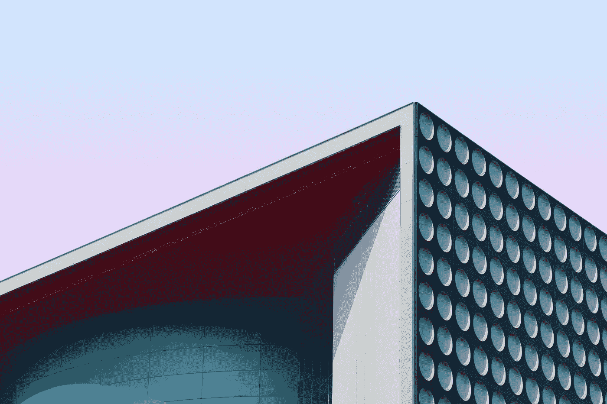
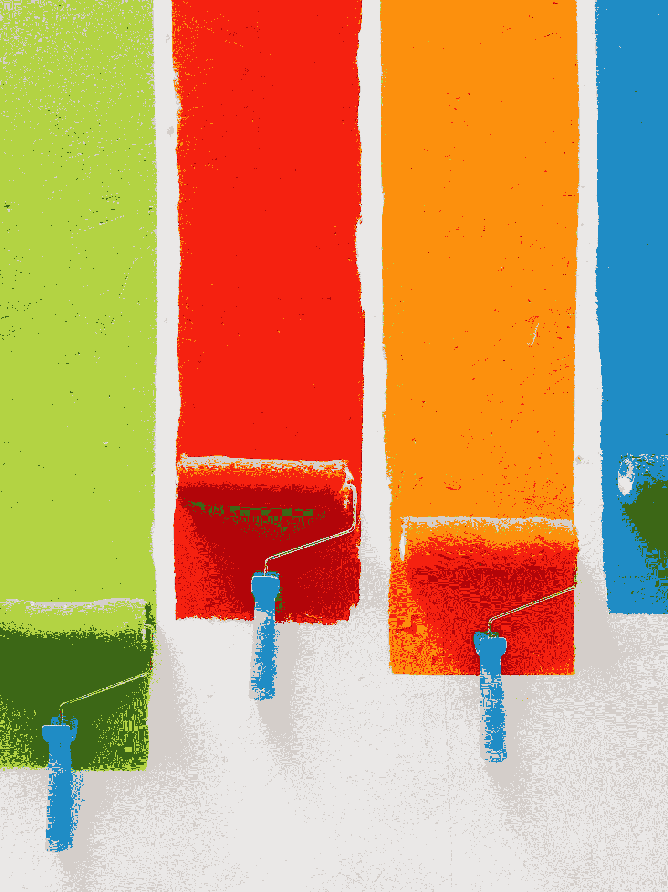
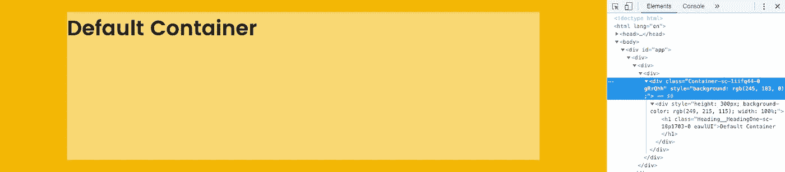
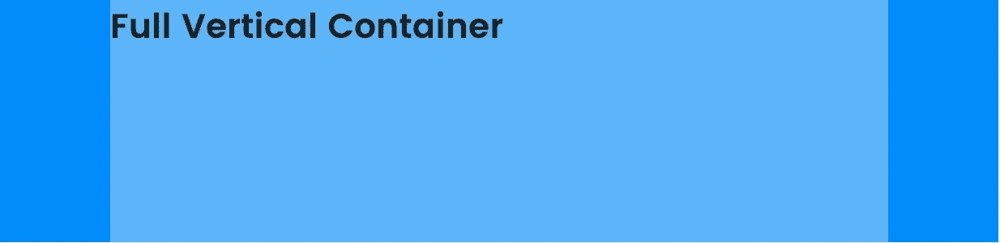
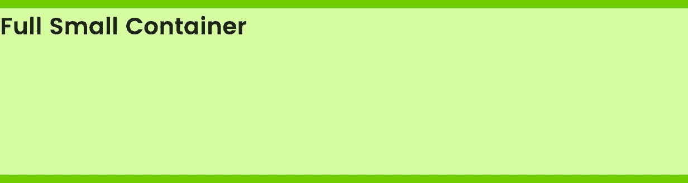
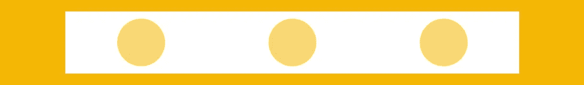
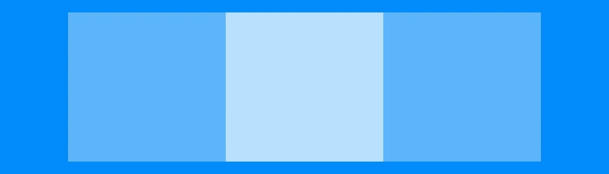
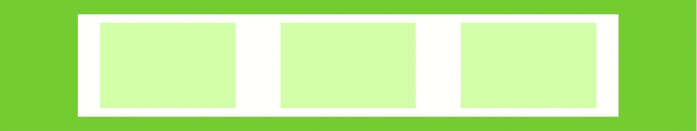
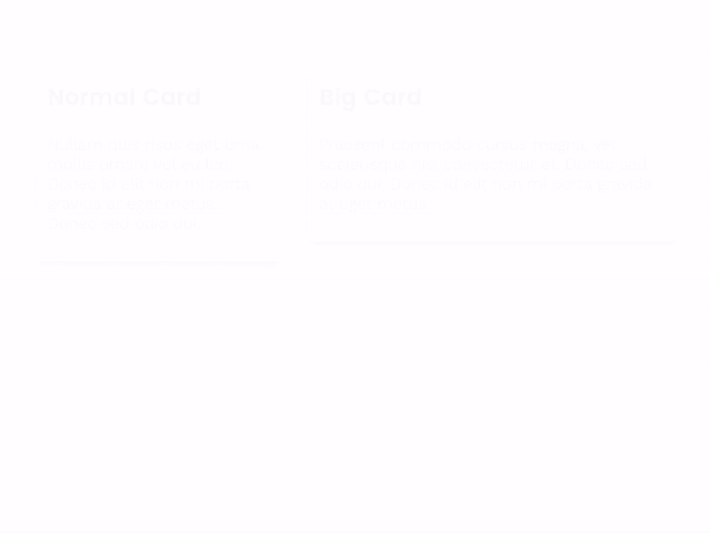
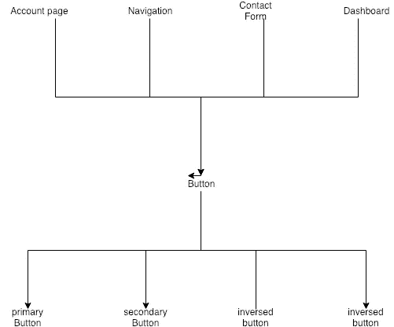

# 用 React.js 和 styled-components 构建可重用组件系统

> 原文：<https://levelup.gitconnected.com/building-a-reusable-component-system-with-react-js-and-styled-components-4e9f1018a31c>



[亚历克斯](https://unsplash.com/photos/vv8InJJu-Pg?utm_source=unsplash&utm_medium=referral&utm_content=creditCopyText)在 [Unsplash](https://unsplash.com/search/photos/design?utm_source=unsplash&utm_medium=referral&utm_content=creditCopyText) 上的照片

编码和设计。爱恨交加的关系。一些开发人员害怕执行 UX / UI 设计师提供的设计指导方针这一单调乏味的任务，另一些人喜欢把事情做得漂亮些。我认同后者，但同时，为什么不构建一个智能系统来减少采用设计指南的时间和混乱。我们将看看如何创建一个组件系统，使您的开发过程愚蠢地快速，并仍然遵循和执行设计准则。

我将首先介绍样式组件库，然后向您展示如何用它构建一个设计系统。

# 先决条件:设计系统

为了实现这个工作流程，我们需要一些可以遵循的设计指南。在过去的几年里，许多大公司重建了他们的设计系统，比如[微软](https://www.microsoft.com/design/fluent/)、 [Airbnb](https://airbnb.design/building-a-visual-language/) 、 [IBM](https://www.ibm.com/design/language/) 等等。这些设计系统的范围从调色板、定义边框半径、边距、填充等等到成熟的 UI 组件，比如卡片和容器，甚至包括工作流、动画和一些逻辑的 UX 组件。

如果你没有明确的设计系统，不要担心。我们将开始非常简单，你可以随着时间的推移扩展它。我从几个组件开始，对于我的许多项目，我可以重用一些或全部，只需适应新项目。

我们将看看建筑布局组件，按钮，文本组件，以及一些更具特色的组件，包括动画。

# 样式组件快速介绍

先说一下 [styled-components](https://www.styled-components.com/) 是做什么的，怎么用。我还将描述为什么我更喜欢用它来设计 web 应用程序的样式。

Styled-components 是 JS 解决方案中的一种 CSS，这意味着您不需要摆弄外部 CSS 文件。一切都在一个地方—逻辑、样式和标记。乍一看，这似乎令人困惑，如果您不知道如何处理它，您的 JS 文件将很快爆炸。本文旨在为您提供一个指南来防止这种情况，并有效地编写组件。

样式化组件的基本用法如下:

如你所见，你基本上可以把任何类型的 CSS 放在样式声明中。Styled-components 导出所有常见的 HTML 元素，因此您可以从导入的包中使用它们，例如`styled.div```或`styled.a`或任何其他元素。也许你已经注意到样式周围的反斜线````，这是普通的 JavaScript (ES6)并且被称为模板文字。我假设您在`console.log(`Bob is ${age} years old.`)`之前已经见过类似的东西，允许您将 JavaScript 放入字符串中。Styled-components 的行为没有什么不同，您可以在样式声明中使用任何种类的 JavaScript。

但是等等，还有更多。因为我们使用 React.js 来构建我们的应用程序，所以我们高度依赖`state`和`props`。基于应用程序状态的样式不是很有用吗？是的，styled-components 为此提供了一个简单的解决方案。您可以将一个函数传递给样式声明，其中一个参数是组件的`props`。然后你可以使用`props`来调整你的造型。这里有一个例子:

styled-components 提供了更多的功能，例如扩展样式、样式化任何组件的能力、主题化或`css` -helper(我们将在后面使用)。现在，这应该是构建我们的组件系统的一个很好的起点，但是可以随意看看[文档](https://www.styled-components.com/docs)。

## 摘要:样式化组件相对于 css 文件的优势

传统的 CSS 很难保持干净。为了防止选择器冲突，您必须使用特定的类命名术语来确保隔离(即 BEM)。条件样式将通过向`className`属性传递三元/逻辑语句来实现，例如:

```
<Button className={`btn ${this.props.isActive ? 'btn--active' : 'btn--primary' }'}
```

这不仅使实际的类名难以阅读(和书写)，而且您也不知道它会有什么视觉效果。要找到答案，您必须搜索 CSS 文件并找到匹配的类。对我来说，使用 CSS 文件感觉像是一种“水平”的方法，CSS 与你的标记和逻辑在同一水平上。对我来说——尤其是在 React.js 中——结构应该更“垂直”。一切的基础是逻辑，逻辑反过来在页面上放置标记并相应地设置样式。

对于样式化组件，我们使用这种方法。一切都靠逻辑，生活在一个地方，与世隔绝。当你想改变一个按钮时，你知道该去哪里找。当实例化这些组件时，语法是非常声明性的，因为您正在使用非常基本的`props`(大多数情况下您将使用布尔值)。没有必要试图揭开条件类名及其背后的风格的神秘面纱。

```
<Button primary active={this.props.isActive} big />
```

另一个很大的优势是你可以非常容易地为你的应用程序创建一个隐式文档，使用`props`-析构。当您忘记了为特定组件设计样式有哪些可能的选项时，只需查看函数参数，就可以了。下面是按钮组件的一个更深入的示例:

正如您所看到的，很容易识别出您可以向按钮组件传递什么`props`。

最后，仍然可以用内联样式覆盖和扩展任何样式。



照片由[大卫·皮斯诺伊](https://unsplash.com/photos/46juD4zY1XA?utm_source=unsplash&utm_medium=referral&utm_content=creditCopyText)在 [Unsplash](https://unsplash.com/search/photos/tools?utm_source=unsplash&utm_medium=referral&utm_content=creditCopyText) 上拍摄

## 多种类型:css`` vs 每个属性单独

希望您发现我在扩展按钮示例中使用了`css```助手。基于属性应用样式有不同的方法，或者对一个样式属性使用内联三元/条件运算符(Button.jsx:6)，对一个样式属性使用完整的 JavaScript 块(button . jsx:9–12)，或者对多个样式属性使用 css 帮助器(button . jsx:19–27)。显然，你可以使用最适合你的编码风格。然而，我倾向于将`css```助手用于大多数独立的样式块，这些块不与其他道具混合，并且通常为一个样式属性使用独立的条件，只是为了保持代码的整洁。

下面是 codesandbox.io 上的按钮示例:

# 构建组件系统

让我们开始真正的工作吧。我们已经看到了基本原理是如何工作的，现在让我们来构建一个更复杂的系统。

> 所有组件的完整工作示例可在 [Github](https://github.com/gisderdube/react-component-system) 上获得。

## 容器



默认容器，25px —<container></container>

我经常使用的一个组件是容器组件。通常，你不希望你的内容在你的页面上溢出一定的宽度。我的目标是 900-1000 像素，这取决于应用程序的内容。您可以有一个具有所需宽度的组件，并用 flex 定位它，但是如果您想要一个全幅背景(-color)呢？有一个简单的技巧，使用填充和`calc()`它，取决于你的视口宽度。这将创建一个漂亮的容器，具有全宽度，中心内容，可以很容易地嵌套和重用。

以下是该容器组件的代码:

我在容器中添加了另外几个`props`，分别是`small`、`full`和`fullVertical`。有时你想要全幅图像或类似的图像。随意扩展或改变组件，我只是发现这些规则很有用。

以下是一些直观的例子:



<container fullvertical=""></container>



<container full="" small=""></container>

> 您可以使用 styled-component 的 [`createGlobalStyle`](https://www.styled-components.com/docs/api#createglobalstyle) 助手为您的应用程序设置全局样式，如字体系列或基本字体大小。

## Flexbox

容器就位后，让我们看看我们的第二个组件，它也将用于布局:一个 flex 包装器和子组件。这个组件只是节省了我们反复输入`display: flex`、`flex-direction: …`、`justify-content: ...`和所有其他 flex 属性的时间。



<flex justifyaround="">…</flex>

这比考虑一个类，手动分配它并给出样式属性要容易得多，不是吗？

让我们甚至添加另一个子组件，在同一个文件/模块中声明，它给我们一个漂亮的列，可以是父元素的一半、三分之一或四分之一。



<flex nowrap="nowrap"><column three="">(x3)</column></flex>

我们也可以使用一个更小的`Column`，使用它的次数更少，并将其分布在`Flex`父节点上:



<flex justifyaround=""><column four="">(x3)</column></flex>

代码如下:

## 纽扣

实现了基本的布局组件后，我们现在可以开始一点更容易理解的东西了。让我们尝试改进我们在简介中看到的`Button`。如果我们能在道具的基础上展示一个装货标志会怎么样。请记住，我们希望组件有一个入口点，组件本身应该负责其余部分，逻辑，样式和标记。对于要显示的加载标志，我们不希望我们的标题，意思是反应儿童，是可见的。我们的组件实例看起来有点像这样:

```
<Button loading={this.state.loading} />
```


当我们查看代码时，我们看到子节点是动态呈现的，这取决于属性`loading`:

> 注意，我还添加了一个加载器组件。看看 Github 上的 repo，看看它做了什么，我用它来显示整个应用程序的任何加载状态，它也可以显示在顶层，在按钮组件之外。

## 动画卡片组件

让我们来处理一个更复杂的例子，一个带有动画的卡片组件。我们将有一个卡片，它在页面加载时淡入淡出，然后显示其内容。你实际上可以调整任何类型的行为或动画，并通过道具发布。另一个非常好的技巧是有一个滚动监听器，当我们的卡出现在屏幕上时，它会触发动画，当我们再次滚动到顶部时，它会反转动画(你可以在我们的网站的[上找到一个例子)。现在，我们只有一个淡入动画。](https://dube.io)

```
<Card>...</Card><Card *big*>...</Card><Card *primary* *delay*={1500}>...</Card>
```



正如您所看到的，有了这样的预定义组件，您可以轻松地在应用程序中实现更复杂的行为和外观，只需一行代码。作为奖励，你的设计师会非常高兴，因为这个应用程序看起来和他想象的一模一样。当有设计变更时，实现它们是非常容易的。只需更改基本组件，这些更改将应用于整个应用程序。下面是卡组件的代码:

现在你可能想知道为什么我有延迟道具。在上面的例子中，这看起来有点奇怪，但是当有一个完整的卡片列表时，这非常方便:


## 标题

在我们结束之前，我只想展示一下`Heading`组件的代码，现在应该很清楚如何使用它了:


凯文·克罗斯比在 [Unsplash](https://unsplash.com/search/photos/colors?utm_source=unsplash&utm_medium=referral&utm_content=creditCopyText) 上的照片

# 包扎

我们已经走了很多路了。构建一个组件系统可能很有趣，而且从长远来看,**确实为你节省了很多时间。通过可重用组件来加强设计系统，可以确保整个应用程序看起来符合指导原则，并且可以很容易地实现更改。组件应该垂直构建，有一个入口点和返回不同元素、视觉特征或行为的可能性。例如，`Heading`组件根据你传递的属性返回不同的 html 元素。您可以将它视为显式组件和可重用入口点下的行为之间的“连接器”。**



为了跟踪您的组件并记住有哪些可能的选项，您可以查看一下析构的 props，或者简单地通过检查 styled-components 样式声明。为了让设计人员、开发人员甚至产品所有者或利益相关者有一个共同的基础，您可以用所有可能的组件构建一个示例页面。当您克隆[库](https://github.com/gisderdube/react-component-system)时，您会看到我也做了同样的事情。发挥创造力，尝试构建自己的可重用组件，我经常构建的有:`Input`(也包括更多的逻辑)、`List`、`Table`、`Separator`、`Text`等等！

*关于作者:Lukas Gisder-Dubé作为 CTO 共同创立并领导了一家初创公司 1 年半，建立了技术团队和架构。离开创业公司后，他作为首席讲师在*[*iron hack*](https://medium.com/u/1ff093a3da32?source=post_page-----4e9f1018a31c--------------------------------)*教授编程，现在正在柏林建立一家创业机构&咨询公司。查看*[*Dube . io*](https://dube.io)*了解更多。*

[](https://levelup.gitconnected.com)[](https://gitconnected.com/learn/react) [## 学习 React -最佳 React 教程(2019) | gitconnected

### 排名前 49 的 React 教程-免费学习 React。课程由开发人员提交并投票，使您能够…

gitconnected.com](https://gitconnected.com/learn/react)