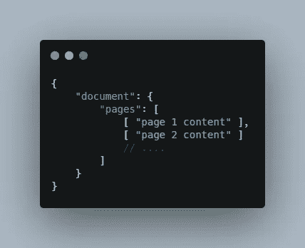
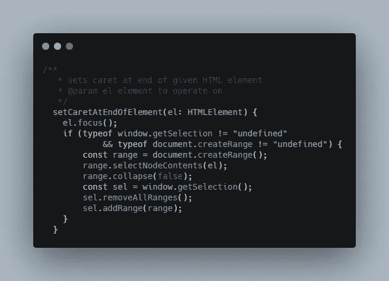
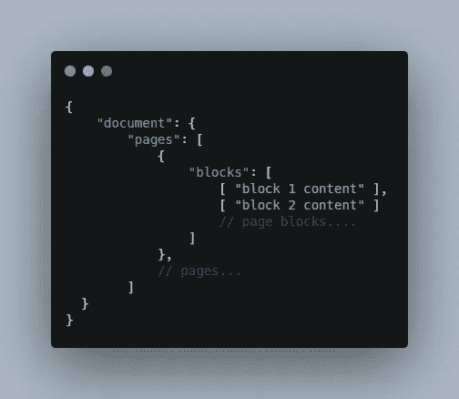
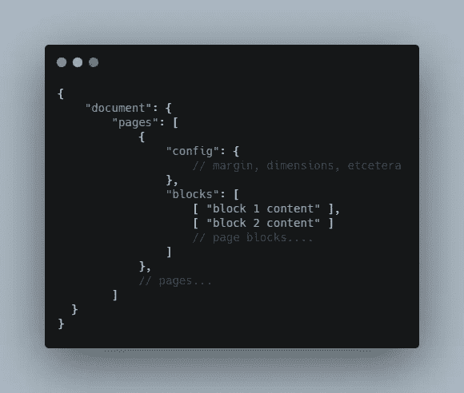
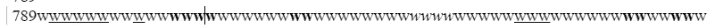
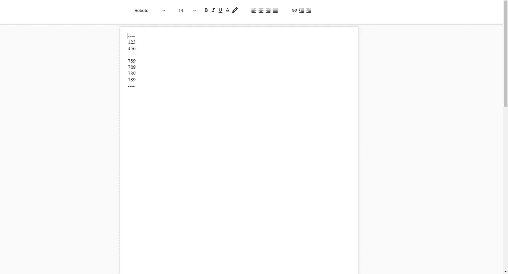

# 构建富文本编辑器:第 0 天

> 原文：<https://levelup.gitconnected.com/building-a-rich-text-editor-day-0-faca73c09e00>

## 设计文档核心

## [索引](https://svr8.medium.com/building-a-rich-text-editor-index-5d11d23c5111)

我通常对日常用品的设计很着迷。在最近的版本中有没有注意到 MS Word 中的插入符号？打字时它会动起来...我只是觉得这对眼睛有惊人的放松作用。这就是我开始构建文本编辑器的原因:p .我想构建一些让眼睛舒服的东西。我在大学一年级的第一个项目是构建一个 [IDE](https://github.com/svr8/Desk) ，只是为了从我的视图中移除十几个额外的工具。它教会了我无数 UI 动画和开发的技巧。更重要的是，客观地分解一项任务来消除复杂任务的压倒性感觉是一门艺术。接下来的两年里，我建造了世界上最差的文本编辑器[。这是一个应该在网页中使用的小部件，但它不能处理 1000 行代码。我得到了动画脱字符虽然！](https://github.com/MFOSSociety/sourcecodearea)

好吧，现在怎么办？

我想优化最后一个编辑器。

这将是我关于编辑的第三个项目。在这里，我将构建一个高效的富文本编辑器，用于以后的实时协作。通过这个系列，我将展示当前的进展，并展示我在构建过程中遇到的主要子问题。

在第一篇文章中，我将开发文档的核心数据结构，并快速实现一些 UI 来验证我的疑虑，并了解项目的整体复杂性。

为了降低复杂性，我选择在 HTML web 界面上构建编辑器。这简化了在底层实现 *MouseEvent* 、 *KeyboardEvents* 的任务，并提供了一系列文本格式事件，如下划线、项目符号，我们可以专注于如何在上层处理这些事件。我将使用运行我最喜欢的 web 框架 Angular 的 Electron。是的，这不是反应，我恨你们，kbye。

# 文档核心

我将介绍第一次尝试时想到的概述和可能的解决方案。我将列出一些子问题和用例，并随时开发核心数据结构。

**基本分页文档编辑器**

从最明显的事情开始，会有人物。为了在 HTML 中正确格式化，字符将被标记所包围。我们的数据是通过 HTML 可视化呈现的。并且，字符包含在文档的多个页面中。文档是逐页滚动的。

从基本的文本输入开始，这可以使用一个 *contenteditable div* 轻松实现。类似于:

这也将打开基本的文本格式化工具，我们将在后面考虑。接下来，我们需要页面。这可以通过在视觉上有多个*div*来实现，其中每个 *div* 看起来像一个页面。

考虑到这一点，我们有左边的数据结构。

在背面，这真的是存储文档的有效方式吗？

让我们了解一下编辑器中 string 的基本用法。我们的主要编辑工具是字符、退格键、删除键和鼠标选择来替换子字符串。

我们只想在特定的索引处插入或删除字符。字符串需要在索引处拆分，并根据插入字符的需要形成新的字符串。这需要 O(n)的时间。大多数操作都需要这样，当我们谈论更高级的实现时，我们很少需要在索引处获取字符。Rope 数据结构似乎最适合在文档中存储大字符串，因为它处理 O(log n)中的拆分。然而，让我们在决定这之前了解我们的其他问题。

**轻松导航至特定位置**

这意味着我应该能够使用键盘箭头键和鼠标点击直观地跳转到一个位置，并开始编辑文本。在单个 div 中，这相当容易。当添加多个页面时，事情变得有点棘手。当您位于 div 的末尾时，插入符号应该移动到下一页的开头。这可以使用[范围 API](https://developer.mozilla.org/en-US/docs/Web/API/Range) 轻松完成。以下是基于 StackOverflow 答案的实现:

但是，有一个问题。跳到 div 中的特定索引并不容易。有些情况下，文档中会出现一系列换行符。这是很难找到插入符号所在的字符索引的地方。有一些变通方法在某些测试案例中失败了，我最终无法解决它，除非我在低层次上得到控制。记住精确的位置对于以后的协作是绝对必要的，我引入了 blocks。

**关于协作的说明**

> 实时协作极其复杂。想象一下这个场景。当你打字的时候，你的朋友正在上面某个地方打字。这意味着当你在索引 5 处输入时，你的朋友已经在上面插入了几个字符。严格来说，你是在索引 7 处打字。处理这些偏移会导致复杂的边缘情况，这些情况目前由两种著名的解决方案处理:CRDT 和优化变换。想象一下当删除被考虑，复制，粘贴，更多的你的朋友加入进来时的复杂程度。
> 
> 显然，当超过 10 个实时用户开始编辑时，**谷歌文档**开始中断，其延迟开始明显显现。这篇关于 Google Docs 的 [IEEE 论文](https://ieeexplore.ieee.org/document/7497258)报道称，50 个用户(Google Docs 对实时协作者的上限)只有在每秒 1 个字符的速度下才能在 Docs 上编辑。现实世界中很少出现这种情况。

回到 block 的想法…这是我的一个朋友 [Ritvij](https://www.linkedin.com/in/ritvij-srivastava-b4257717b/) 早些时候给我的一个想法，让我*首先避免使用任何索引计算*。将每个块视为页面内的一个独立输入字段，用户可以在单个块上键入，而不会给其他块带来麻烦，因为数据已经“断开链接”。当用户在同一块输入时，应该使用协作算法。这可以节省大量的处理和服务器延迟。

考虑到上面的场景，我决定每一行都是一个块。

所以，我们当前的文档外观模型在左边。

我可以使用*页面索引、*和*字符串索引*轻松跳转到特定位置。这更像是一个动态的 [Mo 算法](https://www.geeksforgeeks.org/mos-algorithm-query-square-root-decomposition-set-1-introduction/)，用于对数组进行批量更新操作。查询一个数组非常快。

**页面格式**

每个页面都有一组属性，通常是页边距、背景色、页面尺寸。我们将在页面上添加一个*配置*属性。

这是最后的核心文件:

回到我们之前关于 Rope 数据结构的讨论。如果我们要处理长字符串，这绝对是最好的选择。考虑到当前的文档结构，每个块只是文档中的一行。我所说的线，并不是指英国文学中以句号结尾的线。这里，我说的是视觉上出现的单行，也就是说，一旦一个字符出现在另一个字符的下面，它将被视为与上面的字符不同的块的一部分。

为了估计我在一个块中要处理多少字符，我将页面大小设置为`A4`大小，添加了`15pt`的填充，填充了一个块，并突然添加了一些我不常使用的格式:

它包含 422 个字符，我从 block 元素的`innerHTML` 属性中获得这个数据。看到这里，我估计在最坏的情况下，我每个块将处理大约 500-600 个字符。这可以由字符串以相对较少的开销有效地处理。

现在，Rope 数据结构意味着处理长字符串。在短字符串的情况下，额外的内存和查询延迟会导致开销，并且性能比普通字符串差。由于我能够使用*页面索引*跳转到一组特定的块，并使用*块索引*在每次按键时将我的视图调整到 50-500 个字符，所以我现在选择不使用 Rope。

# 元件布置

对于简单的文本编辑器，我们将有一个可滚动页面列表和一个用于格式化工具的固定标题。

我添加了一些格式化工具。我在 Javascript 中使用了`execCommand`方法，并测试了所有的格式化工具，它们毫不费力地顺利工作。然而，我目前已经删除了*项目符号*和*插入* - *表*操作，因为我不确定如何用我们新的基于块的结构实现它们。

我欢迎任何建议，无论是 UI 还是逻辑:)

明天，我将研究更多的子问题，比如滚动机制、事件处理、在实现核心之前在代码中构建文档组件。我在这里建立了一个原型，只是为了测试我的一些想法和可视化项目。

拜拜。

## [下一篇文章](https://svr8.medium.com/building-a-rich-text-editor-day-1-18771b9d4be2)