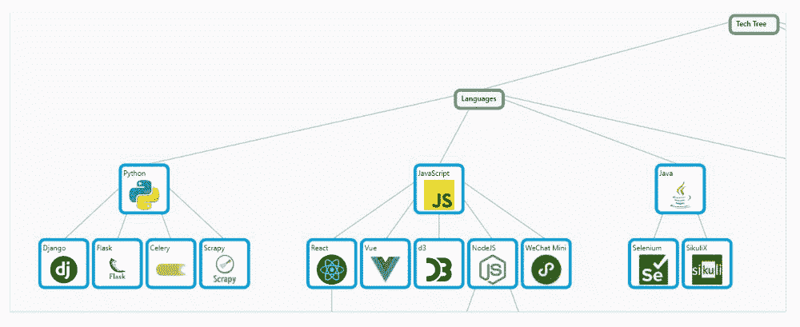
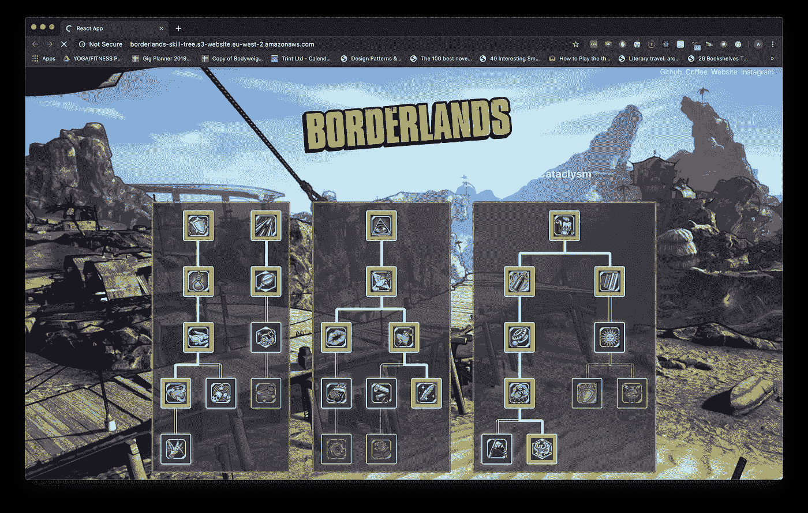
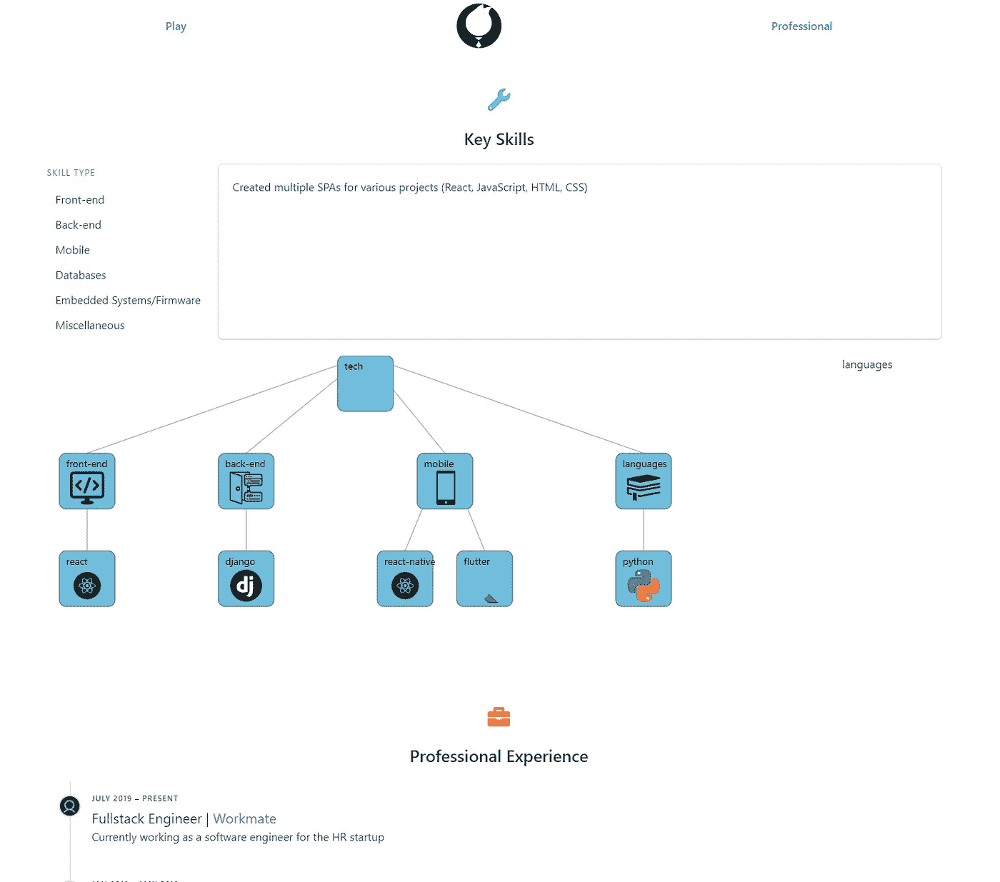
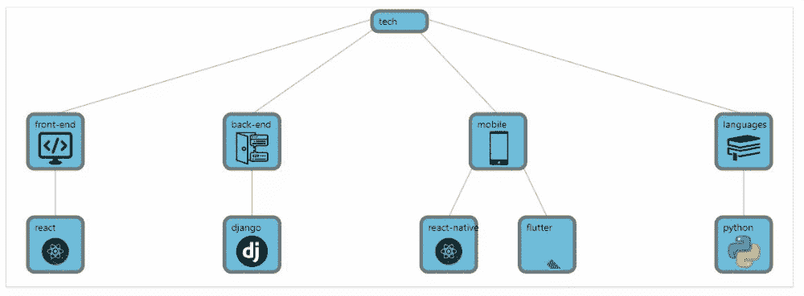

# 用 D3 和 Vue 制作技能树

> 原文：<https://levelup.gitconnected.com/building-a-rpg-like-skill-tree-98bfdbef01de>

## 我如何为我的投资组合网站建立我的自定义技能树



我最后从中得到了什么

# 动机

我有一个[作品集网站](https://zexuan.netlify.app/)，我基本上把它作为动态简历，展示我的技术能力和成就。我使用用 Vue 编写的 [Gridsome](https://gridsome.org/) 来构建它，并使用 [Buefy](https://buefy.org/) 作为主要组件库，因为我只是想尝试 Vue 和其他框架。页面中的一个部分是“关键技能”部分，我在这里列出了我觉得最擅长的技能，也是大多数公司最期待的技能。


我当前的投资组合网站

目前的设计工作正常，但我觉得它有点暗淡，因为在文本行中列出技能没有太多的“魅力”。因此，我开始寻找一种更好的方式来展示这些技能。我想到了角色扮演游戏(RPG)中的技能树，其中角色的技能和能力以分层的方式显示。然后我想象是否有可能复制它，用它来展示我的技能。大概是这样的:



[https://www . freecodecamp . org/news/create-a-borderlands-style-skill-tree-in-5-minutes/](https://www.freecodecamp.org/news/create-a-borderlands-style-skill-tree-in-5-minutes/)

这个“边境风格”的技能树例子使用了一个名为`[beautiful-skill-tree](https://github.com/andrico1234/beautiful-skill-tree)`的库，是为 React 设计的。由于这与我的 Vue 网站不兼容，我需要一个替代品，但不幸的是没有任何好的替代品。

这真的很棒，因为在网上找不到你需要的已经建好并可以使用的东西的情况越来越少了。因此，我开始建立自己的技能树[💪](https://emojipedia.org/flexed-biceps/)

# 技术

首先，我想到了在现代网站中可视化数据集的最佳方式。首先想到的是 [D3](https://d3js.org/) ，这是一个 JavaScript 库，用于组织、处理和格式化数据，以便于以后可视化。我决定使用 D3，因为这是一个学习如何使用它的绝佳机会。为了开始学习 D3，我浏览了这些材料:

[](https://observablehq.com/@d3/learn-d3) [## 学习 D3:简介

### 学习 D3:简介这一系列的笔记本将引导你通过 D3.js 的第一步。D3 的标志是画出来的…

observablehq.com](https://observablehq.com/@d3/learn-d3) 

Observable 有一个关于如何使用 D3 的非常深入和写得很好的教程/指南，但是我发现很难设置它并与 Vue 一起工作，主要是由于 Vue 的反应系统。

[](https://www.sitepoint.com/vue-d3-data-visualization-intro/) [## Vue 和 D3.js - SitePoint 数据可视化简介

### Web 应用程序通常是数据驱动的，经常需要可视化这些数据。这就是图表…

www.sitepoint.com](https://www.sitepoint.com/vue-d3-data-visualization-intro/) 

然后我就开始找 Vue + D3 相关指南，很幸运的找到了这个超级有用的教程。这个网站解释了如何让 D3 很好地与反应系统配合，这实际上很简单，使用 Vue 的`watchers`概念。

在玩了 D3 之后，我了解到 D3 并没有真正为你提供可视化的部分，比如条形图、树形图等等。大部分可视化部分是用`svg`组件手工构建的…这也是我非常不擅长的。😅所以，也是时候学习`svg`了！经过一番摆弄，我终于把“脚手架”做好了:



技能树的基本框架

## 密码

我将解释一下代码是如何工作的:

```
// skills data
*const* skills = [
{ id: "tech", label: 'Tech Tree' },
{ parentId: "tech", id: "languages", label: 'Languages',},
{
  parentId: "languages",
  id: "python",
  label: 'Python',
  iconHref:
  require('../assets/icons/python.png'),
  skillLevel: 90,
  descriptions: ['Mainly worked with webserver backend frameworks with it.', 'Used in some simple machine learning applications and projects such as Gestice League and Project 21.']
},
...]
```

要显示的数据必须有一定的结构，特别是基于父子关系的结构。每个数据点(技能)要么是根，要么是另一个数据点的子数据点。为了构造这个，我有一个对象列表，这些对象有自己的`id`和一个可选的`parentId`来指示它的父对象(如果它有父对象的话)。

## 组织数据

```
...
*let* hierarchy = d3.stratify()(this.skills);
*const* treeLayout = d3.tree().size([
    1280,
    500,
  ]);
hierarchy = treeLayout(hierarchy);
```

接下来，我利用 D3 强大的数据处理工具。首先，使用`[d3.stratify](https://observablehq.com/@d3/d3-stratify)()`有助于处理数据点和形式化层次结构的链接结构。具体来说，它有助于识别根及其子节点，同时还可以计算元数据和结构，比如结果图的深度和高度。如果检测到多个根或其他结构问题，它也会抛出一个错误。最终的输出就是 D3 所说的“层次”对象。在这个阶段，产生的层次没有特定的布局，这意味着数据点还没有相对于彼此在空间上“定位”。

然后，我使用`d3.tree()`将层次结构处理成自顶向下的树形布局。这有助于为数据点分配坐标，然后我们可以用它来直观地绘制出整棵树。

## 画树

首先，在模板中我有一个简单的结构设置，如下所示:

```
<template>
  <div>
    <svg />
  </div>
</template>
```

并且在 Vue 组件的安装方法中:

```
...
mounted() {
  this.svg = d3
  .select("svg")
  .attr("width", "100%")
  .attr("height", 500)
  .attr("cursor", "grab")
  .attr("position", "relative"); this.skillTree = this.svg.append("g"); this.drawTree();
},
```

在这里，我们看到了使用 D3 库处理 DOM 操作的第一个实例。通过使用`d3.select("svg")`，我们基本上是在试图找到文档中的第一个`<svg />`对象，然后对其进行操作。

我们对`<svg />`做的第一件事是添加一个`<g />`元素，这只是一个本地 svg 元素，作为其他组件的容器。做`this.svg.append("g")`也将返回结果`<g />`元素，然后我将它指定为`skillTree`对象，稍后在其上构建。

接下来，我们用`drawTree()`方法画出树，它是这样工作的:

```
// hierarchy object previously made*const* links = hierarchy.links();
*const* nodes = hierarchy.descendants();...
this.skillTree
  .selectAll("rect")
  .data(nodes)
  .enter()
  .append("rect")
  .attr("width", (*d*) *=>* rectWidth)
  .attr("x", (*d*) *=>* d.x)
  .attr("y", (*d*) *=>* d.y)
... //etc.
...
```

首先，我们可以分别通过`hierarchy.links()`和`hierarchy.descendants()`访问链接和节点对象。

接下来，我们将看到 D3 库最强大的特性之一。D3 有一个特殊的数据进入-更新-退出概念，在这里[有很好的解释。我还不完全熟悉它，但是基本上通过执行`.data(nodes)`，你将通知数据集你正在引用下一个的**，并且通过执行`.enter()`之后，需要更新的元素列表将被返回。因此，对于初始调用，`.enter()`将基本上返回整个节点列表，因为之前在层次结构中没有数据。**](https://bost.ocks.org/mike/join/)

在获得需要更新的元素列表后，我们将添加我们希望为每个节点构建的 svg 元素。所以在这种情况下，对于每个节点，我创建了一个正方形的 svg 元素，然后根据 D3 库方便地导出的`x, y`坐标分配它的位置。

本质上，这就是如何使用 D3 来帮助构建和支持您想要呈现的任何数据的可视化。我做的下一步是为链接构建线条，并通过为每个节点添加文本、图像和边框来美化节点。

## 让技能树更具互动性

我意识到我的技能树有相当多的数据要显示，但没有足够的空间来容纳所有的数据。与其相应地缩小数据，我想为什么不试着让用户能够平移它。我找到了一个很好的指南，告诉我该怎么做:

[](https://css-tricks.com/creating-a-panning-effect-for-svg/) [## 为 SVG | CSS-Tricks 创建平移效果

### 在这个月的早些时候，我们讨论了如何找到一种方法让用户在一个…

css-tricks.com](https://css-tricks.com/creating-a-panning-effect-for-svg/) 

整个想法是利用`<svg />`组件的`viewBox`属性，它基本上控制 svg 的显示区域。通过改变`viewBox`参数，我们可以模拟一个移动的“摄像机”,或者像游戏中的“视口”,移动整个树的区域来显示。

接下来的步骤是计算`viewBox`的变化量。为了做到这一点，我们需要做一系列的步骤:
1。当用户点击 svg
2 时，记录原点/起始光标坐标。通过新光标坐标和原始光标坐标
3 的偏移来跟踪和改变视窗。保存最后一个视图框偏移，并在随后的原点计算中考虑它

如果做得好，我们基本上会有一个可扩展的技能树！



哦，看，它动了！

让我解释一下它的代码:

```
...
this.svg.on("pointerdown", this.onPointerDown);
this.svg.on("pointerup", this.onPointerUp);
this.svg.on("pointerleave", this.onPointerUp);
this.svg.on("pointermove", this.onPointerMove);
...
```

我们想跟踪整个`<svg />`组件上不同的光标/触摸输入。为此，我们只需要将不同的回调分配给不同的事件。请注意我们是如何将指针离开`<svg />`视为光标“未按下”的。

```
onPointerDown: *function* () {
  this.isClicked = true;
  *const* x = d3.event.pageX;
  *const* y = d3.event.pageY;
  this.viewBoxPointer= {
    x: x + this.viewBoxOffset.x, 
    y: y + this.viewBoxOffset.y,
  };
},
onPointerUp: *function* () {
  this.isClicked = false;
  *const* x = d3.event.pageX;
  *const* y = d3.event.pageY;
},
onPointerMove: *function* () {
  if (this.isClicked) {
    *const* x = d3.event.pageX;
    *const* y = d3.event.pageY;
    this.viewBoxOffset = {
      x: this.viewBoxPointer.x - x,
      y: this.viewBoxPointer.y - y,
    };
    this.svg.attr("viewBox", `${x} ${y} ${width} ${height}`);
}
},
...
```

接下来，我将简要说明平移是如何工作的。首先，在`onPointerDown` 方法中，我们希望跟踪用户何时仍在点击`<svg />`，我们通过`this.isClicked`标志来实现这一点。然后我们还跟踪光标在`this.viewBoxPointer`中的当前位置。暂时忽略`viewBoxOffset`。

完成之后，我们观察用户何时开始围绕`<svg />`移动光标。这在`onPointerMove`方法中完成。我们首先检查用户是否真的还在点击`<svg />`，这意味着用户正在拖动组件。然后我们跟踪新的光标坐标，然后计算原始位置的偏移量，该偏移量存储在`this.viewBoxPointer`中。我们还将当前偏移存储在`viewBoxOffset`中。这样做将会模拟技能树被“移动”。

最后，当用户停止拖动和点击时，我们希望简单地取消设置`this.isClicked`标志。

当用户想要再次平移技能树时，我们在`onPointerDown`方法中的`viewBoxPointer`的计算中加入偏移量，以便我们从正确的最后已知位置开始。

## 最终细节

整个技能树的最后一部分是当用户点击其中一个节点时，在它的旁边显示一个“描述”抽屉。这是通过放置一个 Buefy card 组件(通过`<div class="card" ...`)并用 Buefy `<b-collapse>`包装它来完成的，以便在节点被点击时显示/隐藏它。选定的节点数据被传入，然后详细信息被很好地显示出来，并带有一个使用 Buefy 的`<b-progress>`构建的漂亮的小“体验栏”。

所以在这一切之后，这就是我们最终得到的结果:


太“有技巧”了！

# 结论

我对最终的结果非常满意，我完成了我设定的目标，学会了如何使用 D3 和 svg。我还想探索更多的东西，即如何更好地支持 svg 的移动触摸支持，并可能为它添加缩放功能。也许在我稍微清理一下代码之后，我可以把它作为一个包发布给其他人使用🤔。但总的来说，这是一个有趣的小项目！如果你愿意，你可以在我的主网站上看到它:😃[https://zexuan.netlify.app/](https://zexuan.netlify.app/)