# 从头开始构建 Ruby CLI Gem

> 原文：<https://levelup.gitconnected.com/building-a-ruby-cli-gem-from-scratch-fca59acda169>

作为 Flatiron School 软件工程项目的学生，我的任务是用 Ruby 创建一个命令行应用程序。这个应用程序将被打包成一个漂亮整洁的包，随时可以在另一个程序员的应用程序中实现，在 Ruby 中被称为“宝石”。我的 gem，叫做`TopNewsD1`，通过`Nokogiri`从 ESPN NCAA 男篮主页抓取文章，打印到你的终端，并会根据直播网站实时更新。我的宝石是根据给定的规格建造的:

1.提供 CLI(命令行界面)

2.提供对来自给定网页的数据的访问

3.所提供的数据必须能够深入一个层次(一个“层次”是用户可以做出选择，然后获得关于他们选择的详细信息)

本文将给出我如何构建这个 gem，我的 gem 做什么，以及我对构建这个 gem 的体验的想法。

**第一步—创建存储库**

如果您阅读本文的目的是构建自己的 gem，那么网上有许多资源可以提供关于这个特定步骤的补充信息。出于我的目的，我使用`bundler`来创建我的 gem 存储库和让这个 gem 正常工作所需的所有文件。在我的终端中，我导航到我想要的位置，在我的终端中键入`bundle gem TopNewsD1`，瞧，需要开始的一切都创建好了。

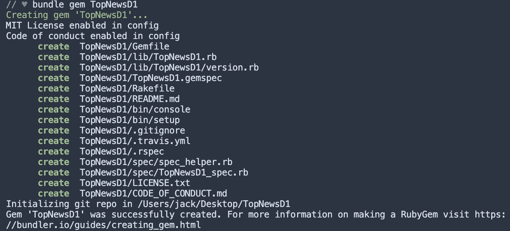

在终端捆绑宝石

上面创建的唯一需要我编辑的文件是`gemspec`和`README`。文件本身实际上会告诉你需要编辑什么，除了给`gemspec`添加一些开发依赖。

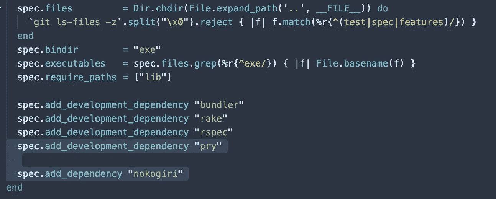

Gemspec 依赖性

在`gemspec`的底部，我必须为`bundler`、`rake`、`rspec`和`pry`添加一个开发依赖项，并为`nokogiri`添加一个通用依赖项，这样我的任何使用抓取的文件都可以正确地抓取所需的网页。
(之后，您需要将本地机器上的这个目录与 GitHub 上的一个存储库连接起来。你可以查看 GitHub 的文章了解这方面的细节)

## 第二步—操作和属性

我已经知道我希望我的宝石刮 ESPN 的 NCAA 男子篮球主页，并提供基于该网站当时显示的文章，但我需要决定我希望我的应用程序如何操作。我使用了 Flatiron 提供的一些资源来让我了解如何实现这一点。
首先，也是最重要的，我需要一种方法来运行我的程序。这是通过在某种链中调用其他对象的对象来完成的。链中的第一个链接位于我创建的名为`TopNewsD1`的文件下的`bin`文件夹中。

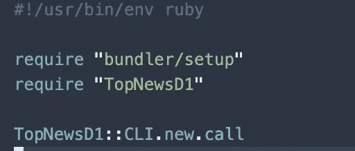

bin 文件夹中的 TopNewsD1

实际代码只有四行，但它们对于操作都是必不可少的。这里最重要的一段代码是`require “TopNewsD1”`。这一行需要将成为整个应用程序环境的`TopNewsD1`文件(我还必须将这些相同的代码行添加到`bin`文件夹中的文件`console`)。

让我们深入了解一下我们的环境。

我的环境文件是应用程序中所有东西都依赖的文件。

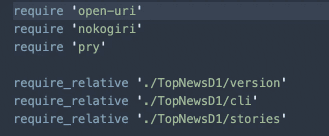

环境设置

因为我在用刮削我需要的`open-uri` & `nokogiri`。这些在前两行是必需的。我也会毫无疑问的遇到问题，会用`pry`来调试。最后，我需要将我的文件放在我的`lib`文件夹中的`TopNewsD1`文件夹中。这在第 5–7 行完成。简单而强大，我的环境文件将让所有需要通信的文件这样做。

回到`bin`文件夹中的文件，最后一行是`TopNewsD1::CLI.new.call`。这一行访问了`TopNewsD1::CLI`类，创建了一个新的实例，并调用了`call`方法(我们稍后将定义这个类及其方法)。这个方法`call`，将是链中被调用的第一个对象。

但是在我们到达那里之前，我们需要回溯一点，远离写代码回到我的程序的基础。我创建了一个大纲，并给了自己一些一般的指导方针。最终，我不得不问自己一个非常重要的问题:

***什么定义了一篇文章？***

一篇文章有一个`title`。

一篇文章有一个`author`。

一篇文章有一个`description`或`topic`。

一篇文章有一个基于其写作时间的`timestamp`。

一篇文章有一个`URL`。

这给了我一些重要的信息。我知道我需要为我收集的每篇文章获得一个标题、一个`author`、一个`description`或`topic`、一个`timestamp`和一个`URL`。这些将是我要设置的属性。

## 第三步—创建 CLI

在`lib`文件夹中，甚至在`TopNewsD1`文件夹的更深处，我创建了一个名为`cli.rb`的文件。这个文件将包含用户与应用程序交互所需的所有代码。在最后一步中，在`bin`文件夹中的`TopNewsD1`文件中，我从类`TopNewsD1::CLI`中调用了`call`方法。这实际上是一个非常简单的方法，也是链条中的下一步。

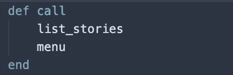

呼叫方法

只有短短两行代码的`call`方法将列出搜集到的故事，并给用户一个与之交互的菜单。列表`list_stories`，是我将要定义的另一个方法。

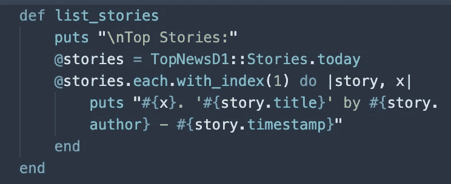

列表法

该方法输出一个新行，后跟“`Top Stories:`”。接下来的几行将实例变量`@stories`设置为`::Stories`类中的一个方法，名为`today`(我将在后面定义)。之后，它获取该实例方法，并遍历每一项。我用`each.with_index(1)`将第一项设置为 1 而不是 0。这个迭代将输出一个字符串，这个字符串是由`Stories`类填充的，带有我们前面提到的属性，并且是在那个类中设置的。这是我为列表设置结构的地方。它看起来有点像“T21”。

在`call`方法中调用的下一个方法是`menu`。这是整个应用程序中最复杂的方法。

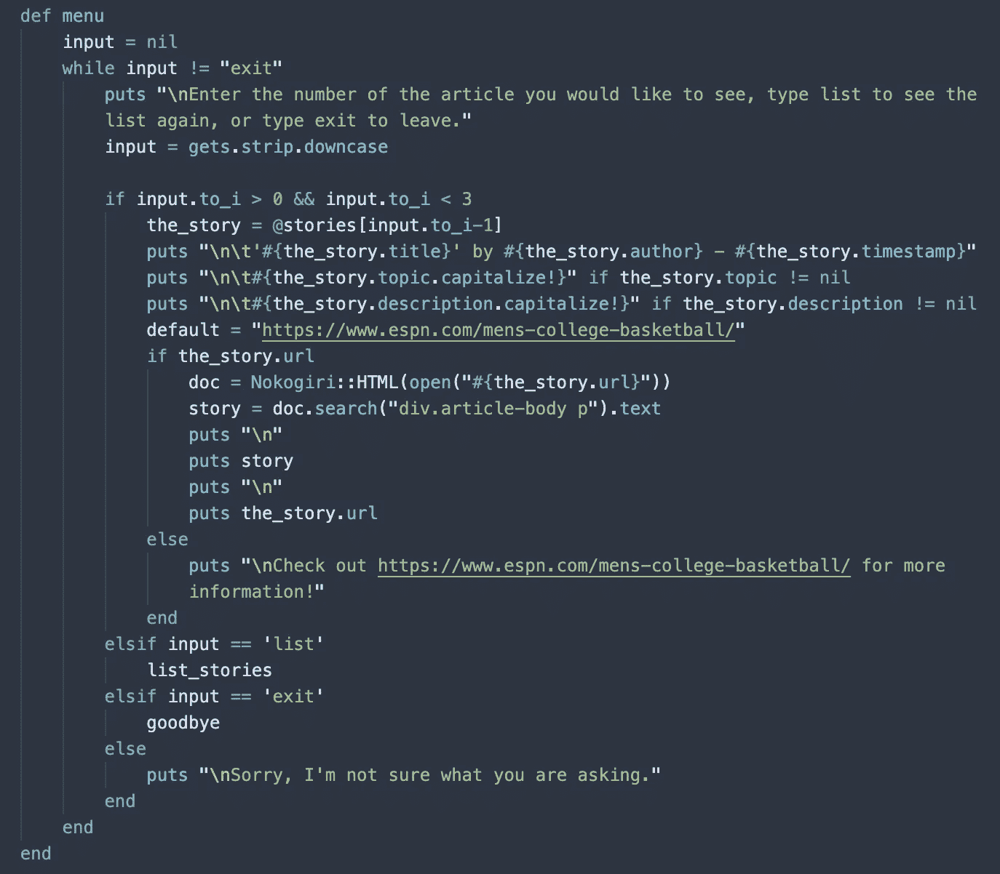

菜单方法

这个方法负责接收用户的输入，并根据输入决定做什么。默认情况下，我将`input`设置为等于`nil`。菜单方法的核心是一个条件语句，以代码开始，说明“当输入不等于“退出”时，这样做:”并继续输出一个新行和一个字符串“T2”。这在每次交互后输出到终端，这样我们的用户就不会对下一步做什么感到困惑。

在设置了一个`gets`方法的输入之后，我需要设置人类交互的边界。我说“如果一个人的输入大于 0 但小于 3 (1 或 2)，这样做:“(我使用这个特定的定义，因为任何更大数量的可用输入或文章都会给我的项目指南带来不必要的复杂性)。接下来，我将变量`the_story`设置为等于`@stories`实例方法，参数为“将给定输入转换为一个整数，减一”。这是因为在之前的`each.with_index(1)`迭代中，我将第一项设置为 1 而不是 0。然后，该方法输出一个新行、一个制表符，然后是用户以与列表相同的格式选择的文章。然后，它输出另一个新行和另一个选项卡，接着是基于文章的主题或描述(一些文章有概括的主题，而一些文章有一些文章的摘录行)。

接下来的几行是另一个条件语句，内容是“如果选择的文章有一个 URL，就这样做”。这个块是应用中`nokogiri`和`open-uri`的第一个例子。在这个程序块中，我设置了一个本地变量`doc`等于所选故事的`URL`。然后，我将变量`story`设置为包含实际文章的网页中文本的位置。然后，该块输出一个新行`story`，另一个新行，以及文章`URL`。在这个条件中，我设置了一个默认的响应，如果没有故事`URL`出现，它将输出 ESPN NCAA 男篮主页的 URL。在这之后，我有几个`elsif`语句和最后一个 else 语句。第一个`elsif`语句说“如果 input 等于‘list’，再次调用方法`list_stories`”。这再次显示了故事列表。第二个`elsif`语句说“如果 input 等于‘exit ’,调用方法`goodbye`”,我将马上定义它。最后，我们的`menu`方法有一个简单的`else`语句，如果给定的输入不属于我们的某个集合定义，它会输出“`Sorry, I’m not sure what you are asking.`”。

我们在`::CLI`类中的最后一个方法是一个单行的`goodbye`方法，它为已经完成应用程序的用户输出告别消息。我现在已经构建了整个 CLI，但是没有它的兄弟类`TopNewsD1::Stories`，这些都是无用的文本。

## 第四步——制造铲运机

我的刮刀，`TopNewsD1::Stories`，包含了链条的最后环节。首先，我需要设置属性，以及我将为这些属性抓取的网页。

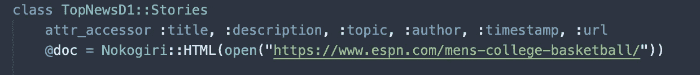

attr_accessor 和 doc 实例变量

如前所述，我需要一个`title`、一个`author`、一个`description`或`topic`、一个`timestamp`和一个`URL`。我用`attr_accessors`设置了这些属性。接下来我使用`nokogiri`和`open-uri`将实例变量`@doc`设置为 ESPN 的 NCAA 男篮主页。

之后，我定义了我在`::CLI`类中调用的`today`方法。这个方法调用另一个方法`self.scrape_stories`。`self.scrape_stories`方法将`stories`设置为一个将被推送的空数组，然后将我将抓取的故事推送到这个数组中。最后，该方法返回已填充的数组。

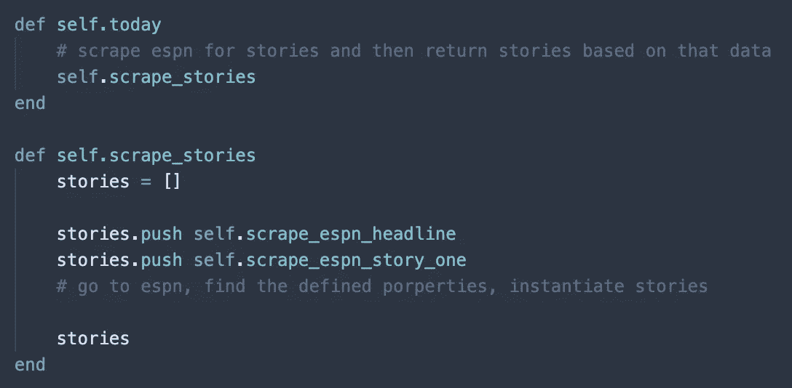

刮刀和调用刮刀

`::Stories`类中的最后两个方法是实际的抓取方法，它们使用`nokogiri`、`open-uri`和实例变量`@doc`从网页中抓取属性。

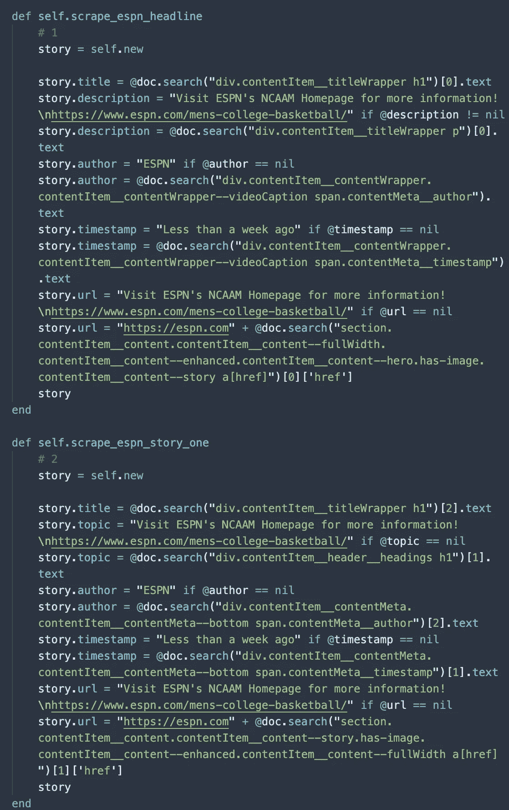

HTML 元素抓取

这些方法首先将变量`story`设置为`::Stories`的新实例，然后将每个属性设置为它们在网页中的 HTML 位置。因为这些属性中有些总是存在，有些则不存在，所以已经为其中一些属性设置了默认输出。您还会注意到`_headline`有一个`description`属性，而`_story_one`有一个`topic`属性。这是因为网站的标题总是有一个简短的`description`，第一个列出的故事有一个概括的`topic`。

## 工作 Gem 示例

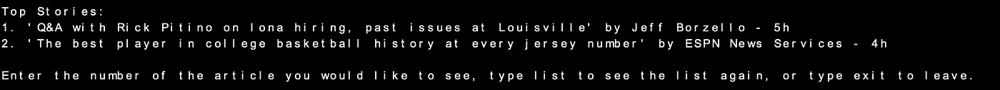

列表和菜单

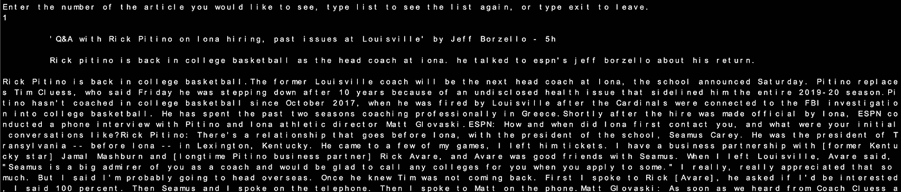

输入和输出

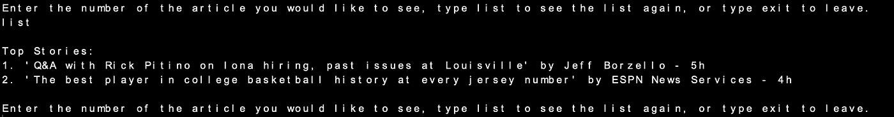

再次请求列表

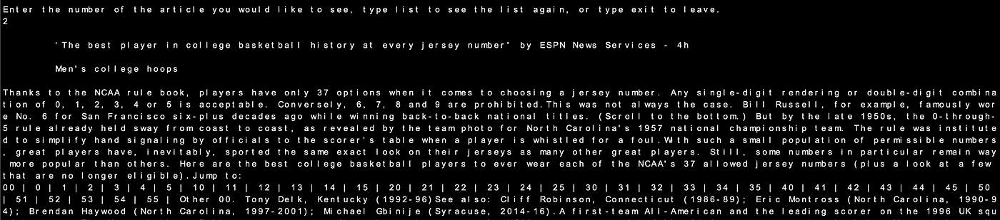

第二层输出

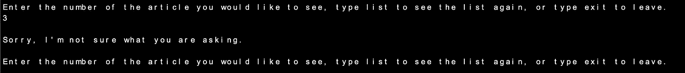

无法识别的输出

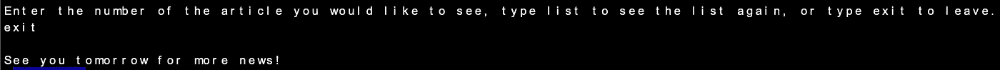

告别信息

*图中的代码截至 2020 年 3 月 14 日准确无误。*

*如果你想看我的更新作品，可以查看我的* [*资源库*](https://github.com/jackismoe/TopNewsD1) *。*

# 结论和经验

在我在熨斗的经历中，迄今为止我经历了一些起起落落。从完成一个特别难的实验室(井字游戏，我看着你呢……)后感觉自己站在世界之巅，到被堵了几个小时(又一次井字游戏)后对自己失去所有希望。也就是说，我总是从中学习，带着雄心和专注前进。然而我的问题是，这些实验室没有一个真正让我觉得自己是一个真正的程序员；我真的建造了一些东西。我感觉我的手被握住了，我被指引着完成我需要做的任何事情。这在过去是必要的，现在也是必要的，但我仍然渴望得到更多。这个宝石项目就是这样。相当于一只鸟妈妈把她的宝宝推出巢外，说“飞”，在我的编程生涯中，我真的从来没有像这个项目对我这样的挑战。我感觉自己像是软件工程社区的一名真正的成员…尽管是一名非常不成熟和没有经验的成员，但仍然是一名成员。除了我在这篇文章中所能描述的，这个项目还涉及到更多的东西。作为我的最低可行产品，实际上是我的第三份 gem 草案，在一个对我的能力来说过于雄心勃勃的范围后，两个前评估者被取消了，但每次我都从零开始，从失败中吸取教训，不断成长，最终将它变成了成功。回顾建立这个 gem 项目的过程，我对解决项目和在未来做有意义的工作充满信心，并希望有一天很快回到我废弃的项目并把它们视为基础。