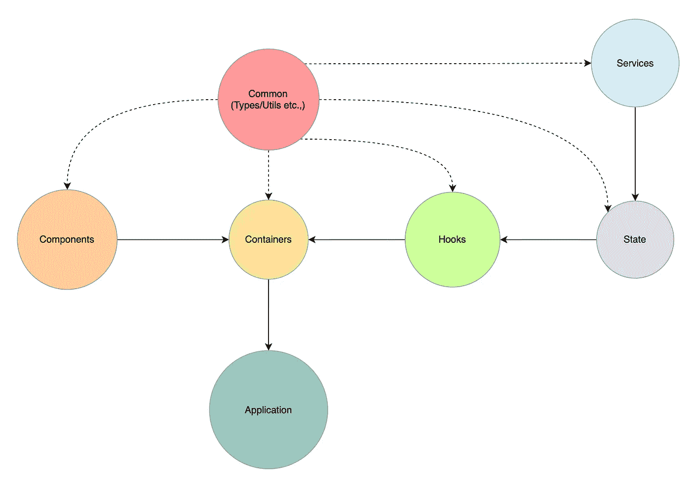

# 为 React-TS 应用构建可扩展的模块化架构

> 原文：<https://levelup.gitconnected.com/building-a-scalable-and-modular-architecture-for-react-ts-applications-e1d917250e04>

# 介绍

React.js 在很大程度上是非个人化的，除了一些在使用钩子时被推荐和强制的设计模式。因此，没有官方推荐来组织你的项目，这通常会导致组件的架构困境。

在我们目前的公司尝试了几种不同的模式和架构后，我们最终采用了一种 ***模块化*** 架构，这使我们能够毫不费力地扩展我们的项目。

# 核心原则

## 模块隔离

每个模块都需要用它自己的依赖项来隔离，并且应该知道它需要的所有依赖项以及它所有 API 的入口点。

## 非循环依赖

模块不应该相互导入，因为这违反了[非循环依赖原则](https://en.wikipedia.org/wiki/Acyclic_dependencies_principle#:~:text=The%20acyclic%20dependencies%20principle%20(ADP,form%20a%20directed%20acyclic%20graph.)。

## 模块间的差异

*从属模块与独立模块*。除了应用程序中的公共模块之外，独立模块与其他模块的耦合并不紧密，这使得我们可以将其外包给外部库。

React 应用程序的模块化架构

# 从属模块

模块化架构图代表了一个简单的可扩展的模块化架构，它符合我们的核心原则。

> ***注*** :上图中的每个**箭头**代表一条导入语句。

## 应用

应用程序/根模块只是容器的集合/组合(也称为智能组件)。它负责用***react-suspension****，****error-boundaries***和任何顶级 ***提供者*** 来引导应用程序。一般来说，它应该包含尽可能少的代码。

## **容器**

容器模块是通过钩子连接到状态的智能组件的集合。正如你所看到的，容器模块只导入*公共、组件和钩子*模块，它根本不涉及状态模块。这有助于我们在不影响状态的情况下扩展钩子模块。

## **挂钩**

钩子模块通过状态向容器提供数据，并根据用户与容器组件的交互来更新状态。

## *状态*

状态模块负责使用服务和公共模块填充客户端状态。这使我们能够避免服务 API 污染容器和挂钩。

# 独立模块(可能)

独立模块只耦合到*公共模块*，尽管这并不像我们希望的那样独立，但将其外包给外部库仍然更容易。

## 成分

组件模块只是不关心应用程序状态的纯功能组件的集合。

尽管这可能像外部库一样完全独立，但您可能仍然会最终构建与公共模块的数据类型非常相似的*应用程序特定的组件。因此，隔离/标记*通用*和*特定*组件通常很有帮助。*通用*组件不使用公共模块中的任何类型，从而使我们能够将它们移动到外部组件库中。*

## *服务*

*服务模块构成了与后端交互的 API 的集合，产生的响应应该与公共模块中的核心数据类型保持一致。*

# *结论*

*图中表示的每个模块都可以是 react-project 中自己的一个文件夹，有一个入口点*(例如:index.ts)。**

*如果操作正确，每个泡泡都可以在不影响其他泡泡的情况下变大。*

*如果你喜欢这篇文章，请留下掌声。请在评论中告诉我你的想法。*