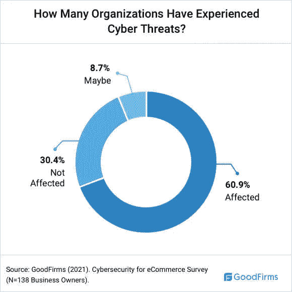

# 使用 Django 构建可扩展且安全的在线状态，为下一代互联网做好准备

> 原文：<https://levelup.gitconnected.com/building-a-scalable-and-secure-online-presence-thats-ready-for-the-next-generation-of-the-internet-9d0ca9ea6aa9>

如今，对于企业来说，拥有一个动态、安全的在线形象从未像现在这样重要。新冠肺炎疫情改变了众多行业的面貌，将万维网变成了一个竞争激烈、变化无常的导航环境。多亏了 Django 的网络框架，以你想要的方式在网上生存比以往任何时候都更容易。

那么，姜戈到底是什么？简而言之，Django 是一个[高级 Python web 框架](https://www.djangoproject.com/)，它能够以简洁且易于管理的方式促进快速开发。该框架由一个领先的网络开发团队创建，以相对容易掌握和使用而闻名，这意味着企业可以在任何他们喜欢的地方建立和修改他们的网站和应用程序，而不必浪费公司的时间。

Django 也是完全免费和开源的，这意味着可以构建漂亮的框架，而不必为了奢华而浪费一大笔钱。

*(图片:*[*Shopify*](https://www.shopify.com/blog/global-ecommerce-sales)*)*

将电子商务网站作为未来几年网络持续增长的一个例子，我们可以看到，2019 年至 2025 年，全球电子商务销售额将翻一番以上，达到 7.385 万亿美元。

虽然这是一个强有力的例子，说明拥有在线商店的网站可能需要[出于扩展目的考虑 Django](/things-to-know-about-django-beforehand-f93e4e3319ed)，但它也表明未来的 Web 将比现在更具竞争力，使得使用一个合适的、适应性强的框架比以往任何时候都更重要。

最近的新冠肺炎疫情在决策者可能还没有做好冒险的准备的时候，在网上推出了大量的小企业。幸运的是，采用 Django 意味着比以往任何时候都更容易创建一个易于管理和扩展的在线存在。

随着关于 Web3.0 和互联网未来的讨论越来越多，可能没有比一个能够以安全的方式与您的业务同步增长的框架更好的框架了。

# 按比例建造

当建立在线形象时，无论你是想[创建一个功能齐全的网站](/the-reason-that-web-templates-fail-and-why-custom-design-is-always-best-c43650311615)还是使用 Django 的应用程序，可伸缩性都应该是开发你的页面时的一个关键问题。

你不太可能知道你的企业会变得有多大，或者你会被访问或在线参与的频率。当谈到扩大你的存在时，重要的是你要避免不得不[重写你的网站](/getting-started-in-web-development-b7b3322cd536)并冒险改变最初使你的业务如此成功的公式。

因此，选择一个可扩展的框架至关重要。但是“扩展”这个术语对于在线业务来说到底意味着什么呢？在 web 应用程序的上下文中，这可能意味着接受更多的访问者和请求，但是 Django 可以承担更多的工作。

由于 Django 的高度适应性框架，企业可以从小批量的常规用户扩展到每分钟都有大量的访问者。应用程序和页面也可以采用更多的模块化组件，如果它们被识别为应用程序中的瓶颈，可以[解耦和替换](https://coderbook.com/@marcus/how-scalable-are-websites-built-in-django-framework/)。Django 的可伸缩性也有助于企业确保安全补丁和漏洞修复一旦出现就能得到长期支持。

虽然在考虑扩展选项时，性能通常是个人考虑的首要问题，但它也可以指功能，Django 很容易让新团队成员跟上框架的速度，因为公司的物理规模在扩大，并雇用了新员工。

Django 非凡的可扩展性可以从该框架支持的网站和应用程序的质量中看出。Instagram、YouTube、Spotify、Quora、Pinterest、Bitbucket 和 Disqus 等全球知名平台都在 Django 上运行，每天都能处理数百万的游客。

虽然许多这些应用程序将使用客户端-服务器设计，这意味着其他技术将被[整合到 Django](/pros-of-using-django-for-web-development-f0f148cb8bd3) 中以获得最佳性能，但企业也有可能采用类似的方法，并寻求专业 Django 开发服务[的帮助，以创建一个全面的平台](https://www.stxnext.com/services/django-development/)，帮助确保未来的可用性和可伸缩性。

# 最高安全

值得注意的是，安全性也是 Django 的一个重要特征。事实上，该框架拥有最好的现成安全系统之一，能够帮助开发人员限制许多常见安全威胁的影响，如点击劫持、跨站脚本和 SQL 注入。

*(图片:***)**

*如上述数据所示，绝大多数电子商务企业主都经历过网络威胁。幸运的是， [Django 的开源性质意味着新的安全补丁和对威胁的快速响应意味着它是当今保护企业最有效的框架之一。](/5-cool-open-source-django-projects-every-python-developer-must-know-about-492d7e9633b2)*

*互联网正在变得越来越大，下一代万维网有望成为当今商业的一个广阔而有利可图的地方。这使得开发用户友好且可扩展的安全存在变得至关重要。说到合适的框架，很少有企业能够找到比 Django 更合适的解决方案。*