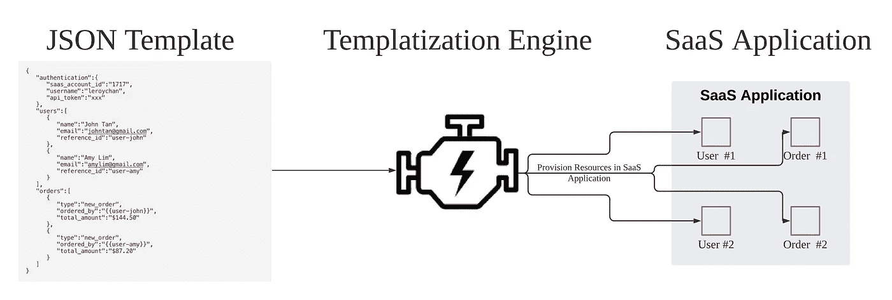
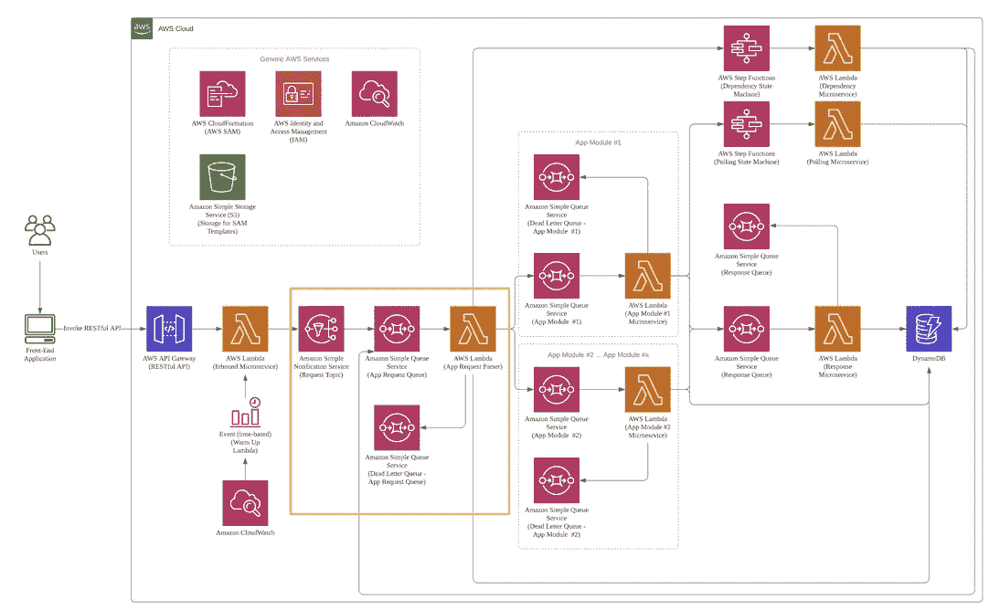

# 使用 Amazon Web Services 构建可伸缩的模板化引擎

> 原文：<https://levelup.gitconnected.com/building-a-scalable-templatization-engine-using-amazon-web-services-c44db96f05bd>

## 可扩展架构

## 关于设计可伸缩模板化引擎的综合文章

*免责声明:本文所表达的观点和意见均为作者个人观点和意见，不一定代表任何公司的官方政策或立场。*

我一直对[亚马逊网络服务(AWS)的云形成](https://aws.amazon.com/cloudformation/)很着迷，因为它提供了一种从 JSON/YAML 模板中剥离出整个基础设施堆栈的方法。开发人员可以为他们的应用程序定义一个 CloudFormation 模板，并确保任何想要部署他们的应用程序的人都能够以系统和一致的方式这样做。

> AWS CloudFormation 为您在云环境中建模和提供 AWS 和第三方应用资源提供了一种通用语言
> ——亚马逊网络服务，2020

也就是说，我坚信**能够基于一个定义好的 JSON 模板**提供资源的概念可以应用于任何其他**软件即服务(SaaS)应用**。

大多数 SaaS 应用程序确实提供了 RESTful APIs 供用户使用，但通常情况下，它们不提供类似于 CloudFormation 的功能，开发者可以通过该功能声明一个 JSON 模板来提供 SaaS 应用程序中的所有资源。



模板化引擎—高水平流量

因此，我决定为 SaaS 应用程序开发一个模板化引擎，能够实现 CloudFormation 为 AWS 所做的事情。这里需要注意的是，所选的 SaaS 应用程序必须具有为修改其资源而公开的 API，即 CRUD ( **C** reate， **R** ead， **U** pdate， **D** elete)。

# 1.挑战

为 SaaS 应用程序构建模板化引擎的主要挑战是:

1.  **模板的声明必须简单易懂** —资源的规范必须符合 SaaS 应用程序的 API 模式
2.  **快速、可靠** —声明资源的处理必须快速(即，如果可能，声明资源的创建应该并行进行)
3.  **资源依赖管理** —需要从另一个资源的创建结果中输入的资源必须被管理(即，资源#1 需要资源#2 的 ID 才能被创建)

# 2.架构设计考虑事项

从一开始就获得正确的架构是很重要的，因为这是构建整个应用程序的基础。基于以下考虑，我决定构建模板化引擎:

1.  **云原生** —利用云服务来构建和运行模板化引擎
2.  **水平可扩展性** —允许计算资源的容量动态增加
3.  **事件驱动架构—** 摆脱传统的点对点集成
4.  **无服务器架构** —不为那些讨厌的服务器升级、打补丁、更新安全包
5.  **微服务** —基于功能“模块”的解耦处理逻辑，使得代码维护更加容易
6.  **处理逻辑的执行速度**—不需要任何依赖关系的资源应该并行处理

# 3.解决办法

模板化引擎完全建立在 AWS 之上，具有上面列出的所有架构设计考虑。

解决方案组件:

1.  [基础设施即代码](#f670)
2.  [RESTful API 端点](#4ea7)
3.  [事件驱动架构](#5df2)
4.  [App 模块——无服务器微服务](#b52a)
5.  [依赖关系管理](#29e1)
6.  [轮询服务](#7c2b)
7.  [响应服务](#b796)
8.  [样本模板格式](#e560)


## 1.基础设施即代码

从一开始，模板化引擎的 AWS 资源的整个声明就在 [AWS SAM](https://docs.aws.amazon.com/serverless-application-model/latest/developerguide/what-is-sam.html) 上完成，这是 CloudFormation 的扩展。我强调**而不是**使用 AWS 控制台创建任何资源，以符合“基础设施即代码”策略。AWS SAM 已被证明非常有用，因为它允许您将整个应用程序架构迁移到新的 AWS 帐户或部署新的开发环境(即 s it，UAT)，只需两个简单的 SAM CLI 命令(`sam package` & `sam deploy`)

我采用的 AWS SAM(或 CloudFormation)策略之一是将模板分成两部分，以便在添加 SaaS 应用程序的附加模块/功能时具有更好的可伸缩性。

这两个部分是:

1.  基础架构模板——提供模板化引擎运行所需的所有必要资源(除应用模块之外的所有资源)的根模板。这样的模板**应该只有一个**。
2.  应用模块模板—每个应用模块模板将由 1 个 SQS 队列、1 个 SQS 死信队列和 1 个 Lambda 函数组成。根据需要创建任意数量的应用模块模板。我通常按照功能来划分(即“用户”将被视为一个应用模块，“订单”将被视为另一个应用模块)。

利用 CloudFormation 的[交叉堆栈引用](https://docs.aws.amazon.com/AWSCloudFormation/latest/UserGuide/walkthrough-crossstackref.html) ( `Export` & `Fn::ImportValue`)，应用模块模板将能够利用基础架构模板的输出。通过这样做，随着模板化引擎支持的功能数量的增加，我能够添加更多的应用模块模板，而无需实际编辑核心基础架构模板。

## 2.RESTful API 端点


用户或应用程序与模板化引擎交互的主要方式是通过由 Amazon API Gateway 和 Lambda 函数支持的 RESTful API 接口。

API 端点通过一个`POST`方法接受一个 JSON 模板(`Content-Type: application/json`)。

除了作为调用 Lambda 函数的接口，Amazon API Gateway 还可以执行 API 认证、API 计划、API 速率限制等。此外，一旦客户端应用程序的 API 流量达到某个阈值，模板化引擎就会提供一个 [Web 套接字连接](https://docs.aws.amazon.com/apigateway/latest/developerguide/apigateway-websocket-api.html)来实现更好的可伸缩性和可靠性。

一旦 Amazon API 网关调用了入站微服务 Lambda，它就会执行以下操作:

*   执行基本的语法验证，以确保传入的模板格式是有效的
*   基于 [RFC 4122](https://www.ietf.org/rfc/rfc4122.txt) 规范生成一个 UUID(版本 4)以标记到传入的模板化请求。该 UUID 将贯穿请求的整个生命周期。
*   将传入的请求(附加了 UUID)发布到简单通知服务(SNS)主题

由于入站微服务是与外界交互的 API 端点，并且为了使该 API 具有最佳响应时间，需要始终保持 Lambda 函数温暖。Lambda 的问题是 Lambda 调用有开销，这是为函数代码设置执行环境所花费的时间，并且完全由 AWS 控制。因此，我配置了一个 CloudWatch 的基于时间的规则，它每 10 分钟周期性地调用 Lambda 函数。或者，AWS 有一个名为 [Provisioned Concurrency](https://aws.amazon.com/blogs/compute/new-for-aws-lambda-predictable-start-up-times-with-provisioned-concurrency/) 的新特性，它旨在允许 Lambda 函数被初始化和超级就绪。

## 3.事件驱动架构

> 事件驱动架构使用事件来触发解耦服务并在它们之间进行通信，这在使用微服务构建的现代应用程序中很常见。



入站微服务会将每个模板化请求作为事件消息发布到 SNS 请求主题中。拥有 SNS 主题的目的是为了满足未来的需求，即消息可以一次发布到多个队列，以处理不同的功能用例(即安全审计、通知)。最重要的是，拥有一个发布-订阅架构可以在一个资源声明 JSON 模板中支持多个 SaaS 应用程序。

通过使用订阅 SNS 请求主题的 SQS 队列，我们能够将传入的请求与实际的模板化引擎分离。同样，模板化请求也可以保存在 SQS 队列中，以防止传输过程中任何意外的数据丢失。

App Request Parser Lambda 充当模板化引擎的“请求路由器”。它负责接收、过滤事件并将事件推送给适当的消费者(即应用程序模块)。请求解析器 Lambda 未能处理的任何传入请求都将被扔进死信队列，以进行进一步的错误处理。这确保了在应用程序失败时不会丢失模板化请求。

在应用程序级别，应用程序请求解析器 Lambda 负责:

1.  确定 JSON 模板中是否声明了依赖关系。如果有依赖关系，调用依赖关系管理步骤功能(更多信息在[依赖关系管理服务部分](#29e1)
2.  将模板化请求 JSON 模板分解成各自的 App 模块模板，同时发送给各自的 SQS 队列**。这使我们能够减少总处理时间，因为不同的应用程序模块可以并行处理相同的模板化请求。**

****

**将模板化请求 JSON 模板分解成更小的部分**

**3.出于记录保存的目的，将传入的请求持久化到 DynamoDB 中**

## **4.应用模块—无服务器微服务**

****

**应用程序模块由 SaaS 应用程序提供的一组特定功能来定义。根据您尝试进行模板化的 SaaS 应用程序，您可以拥有任意多的应用程序模块。**

**通过使用不同的应用程序模块，我们能够将大的模板化请求 JSON 模板分解成较小的模板，然后**并行处理它们**，以获得最佳的总处理时间。**

**尽管我们对应用模块的“划分”越精细，模板化引擎的处理速度就越快，但我们需要能够在处理时间以及整个架构的成本和维护工作之间取得平衡。**

**让我们以 SaaS 应用程序的 Shopify 为例，看看如何定义应用程序模块。通过查看 [Shopify 的开发者文档](https://shopify.dev/concepts/about-apis)，我实际上将它分成了 3 个不同的应用模块( *AJAX 和 Liquid APIs 与供应资源无关，因此将被忽略*)。**

1.  **应用模块#1:管理**
2.  **应用模块#2:店面**
3.  **应用模块#3:分析**

**每个应用模块都有自己的 SQS 队列、Lambda 函数和 SQS 死信队列。通过拥有专用的 SQS 队列和死信队列，我们将能够配置与特定应用模块相关的单独设置(`VisibilityTimeout`、`ReceiveMessageWaitTimeSeconds`、`MessageRetentionPeriod`和`RedrivePolicy`，因为每个应用模块*可能有不同的要求。***

**SQS 队列将负责促进特定应用模块的传入请求，而 Lambda 将充当微服务来处理传入的 JSON 模板，并相应地提供适当的资源。一旦应用程序模块 Microservice Lambda 成功处理了请求，它就会将包含所供应资源的所有元数据的消息发布到响应队列中。**

**由应用模块微服务 Lambda 函数抛出的任何故障将被自动放置在应用模块 SQS 死信队列中。**

## **5.依赖性管理服务**

****

**依赖性管理是模板化引擎中最关键和最复杂的组件，因为该引擎需要知道已经声明的所有不同资源的创建顺序。**

**依赖关系可以通过下面的例子来理解:**

> **在资源 A 可以被供应之前，它需要被供应的资源 b 的输出(例如，ID)**

**我们试图通过依赖关系管理实现的是，我们希望同时拥有一个模板化请求 JSON 模板和**，能够处理所有的依赖关系，以了解首先创建哪些资源，以及在获得所有所需数据之前延迟创建哪些资源。****

****在模板化请求 JSON 模板中，用户需要为依赖关系管理定义 2 个属性:****

1.  ****在那些您希望被引用的资源上提供一个唯一的`reference_id`****
2.  ****对于那些需要在创建之前从 reference_id 转换 ID 或键的对象，使用`{{unique-value-that-you-have-provided-in-the-reference-id}}`****

****通过进一步扩展上面的依赖关系示例，模板化请求 JSON 模板将如下所示:****

```
**{
   "authentication":{
      "saas_account_id":"1717",
      "username":"leroychan",
      "api_token":"xxx"
   },
   "resource": [
     {
       "name": "A",
       "foreign_key": "{{id-of-resource-B}}"
     },
     {
       "name": "B",
       "reference_id": "id-of-resource-B"
     }
  ]
}**
```

****书面上，上述样本模板将是:****

> ****请先创建资源 B，并将创建的资源 B 的 ID 分配给`id-of-resource-B`。一旦创建了资源 B，请创建资源 A 并让`foreign_key`属性值成为`id-of-resource-B`的输出。****

****既然我们已经得到了依赖管理的语法声明，让我们把注意力集中在处理逻辑部分。****

****依赖微服务有两个功能组件:****

1.  ****依存解析器****
2.  ****依赖性处理****

****依赖解析器最终负责确定所声明的资源的创建顺序，这将由依赖类型决定。****

****这两种依赖类型是:****

1.  ****`dependency#reference`:可以立即创建并在创建后保留 ID 的资源。这适用于已经声明了`reference_id`并且在其模板中不包含任何`{{value}}`的资源****
2.  ****`dependency#payload`:需要延迟创建的资源，直到模板中声明的所有`{{value}}`都被解析****

****下面的流程图显示了确定依赖类型的逻辑情况:****

********

****依赖性分析器工作流****

****至于依赖处理，本质上是按照 AWS Steps 函数定义的状态机运行的 Lambda 微服务。也就是说，依赖性微服务 Lambda 将一直运行，直到**所需的所有**依赖性都已被解决并且**所有**资源都已被提供。****

## ****6.轮询服务****

********

****SaaS 应用程序的某些 API 实际上是异步的。这些 API 不会在创建后立即返回 ID，而是为您提供一个`job_id`,要求您不断轮询以了解资源是否已成功创建。****

****通常，SaaS 应用程序会将耗时且资源密集的任务视为异步作业。****

****例如:****

1.  ****上传应用程序****
2.  ****上传附件****
3.  ****创建分析报告****

****轮询微服务就是为了做到这一点。每当资源创建实际上是 SaaS 应用程序端的异步作业时，它就会被 App 模块的微服务(通过 AWS 步骤函数)触发。轮询微服务将在设定的 3 秒间隔内保持运行，直到`job_id`返回成功(或失败)。****

## ****7.响应服务****

********

****所有的应用模块微服务将发送成功(状态代码:`2xx`)或失败消息(状态代码:任何不是`2xx`的消息)到正在创建的**每个**单独资源的 SQS 响应队列，以及所有相关的元数据，如 ID 和创建时间。****

****然后，响应微服务负责从队列中提取这些消息，并将其保存在 DynamoDB 上。****

****重要的是让所有单独提供的资源持久化，以便在声明的模板化请求 JSON 模板中的任何资源创建失败时便于回滚。****

## ****8.样本模板格式****

****以下是 SaaS 应用程序的模板化请求 JSON 模板示例:****

```
**{
   "authentication":{
      "saas_account_id":"1717",
      "username":"leroychan",
      "api_token":"xxx"
   },
   "users":[
      {
         "name":"John Tan",
         "email":"[johntan@gmail.com](mailto:johntan@gmail.com)",
         "reference_id":"user-john"
      },
      {
         "name":"Amy Lim",
         "email":"[amylim@gmail.com](mailto:amylim@gmail.com)",
         "reference_id":"user-amy"
      }
   ],
   "orders":[
      {
         "type":"new_order",
         "ordered_by":"{{user-john}}",
         "total_amount":"$144.50"
      },
      {
         "type":"new_order",
         "ordered_by":"{{user-amy}}",
         "total_amount":"$87.20"
      }
   ]
}**
```

****如果我必须将示例模板翻译成句子格式，它将是:****

> ****在 SaaS 应用程序中我现有的帐户(SaaS 帐户 ID: 1717)上，请帮我创建 2 个新用户(约翰和艾米)，一旦完成，创建 2 个订单。约翰一张，艾米一张，总金额分别为 144.50 美元和 87.20 美元。****

****样本模板中声明了 3 个对象:****

1.  ****`authentication` —负责获取有关 SaaS 帐户信息的信息，以执行必要的资源供应****
2.  ****`users` —用户应用模块。数组中声明的每个对象属性都对应于 SaaS 应用程序提供的用户 API 的模式****
3.  ****`orders` —订单应用模块。数组中声明的每个对象属性都对应于 SaaS 应用程序提供的订单 API 的模式****

# ****摘要****

****模板化引擎的最终架构是**解耦**、**高效**、**和**可扩展**。如您所知，模板化引擎需要大量的服务和应用程序逻辑才能无缝运行。AWS 提供了一系列服务，可以帮助减轻您的负担，让您能够专注于应用程序逻辑。******

**也就是说，架构是应用程序的基础，从一开始就正确设计它是很重要的。**