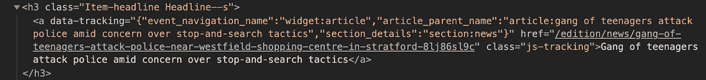
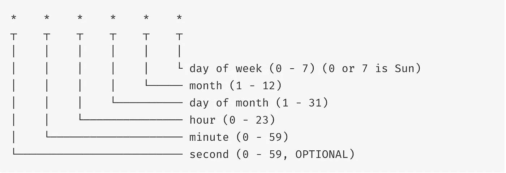
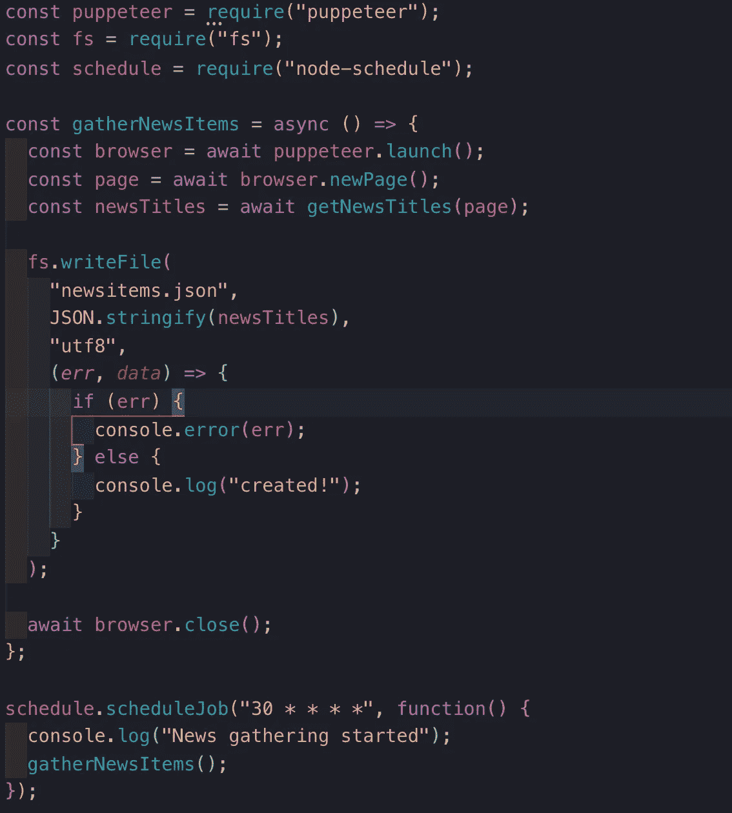

# 用木偶师构建一个预定的新闻爬虫

> 原文：<https://levelup.gitconnected.com/building-a-scheduled-news-crawler-with-puppeteer-d02a7919bdbe>

在这个项目中，我将一步一步地展示如何构建自己的新闻爬虫，访问多个网站并收集所有必要的信息。

# 我们在建造什么？

在这个项目中，我们将建立一个 NodeJS 服务器，它运行一个预定的 Puppeteer crawler 并从新闻站点收集所有信息。我所说的计划是指您可以设置任何时间的数据/小时/分钟，爬虫将通过再次爬行新闻站点来刷新它的数据。

# **木偶师背景资料**

木偶师的官方文件记载:

> Puppeteer 是一个节点库，它提供了一个高级 API 来控制 Chrome 或通过 [DevTools 协议](https://chromedevtools.github.io/devtools-protocol/)的 Chrome。默认情况下，木偶师运行无头的[，但可以配置为运行全(无头)铬或铬。](https://developers.google.com/web/updates/2017/04/headless-chrome)

这意味着几乎所有你能在网上做的事情，木偶师都能帮你做。这方面的一些例子是:
-生成页面的截图和 pdf
-创建测试环境
-抓取任何页面，不管它是 SPA 还是 SSR 页面。

# **入门**

要开始，我们需要确保您已经安装了节点。这可以通过在终端中键入以下命令来检查。

```
node -v
```

这样做的结果应该类似于 10.16.0。
如果不是这样，您可以访问[https://nodejs.org/en/](https://nodejs.org/en/)并按照安装指南进行手动安装。

现在我们都准备好了，我们可以开始用必要的文件创建一个文件夹，并开始编码。

# **设置**

我们将在本节中设置项目并安装依赖项。首先，在终端中导航到您希望安装项目的位置。

例如，我希望我的项目位于我的项目文件夹中，该文件夹位于我的文档文件夹中。我可以通过运行以下代码来实现这一点:

```
cd ~/Documents/projecten
```

在此文件夹中，您可以运行以下代码来创建一个文件夹，项目将在其中生成。

```
mkdir news-crawler// To navigate inside this folder you can run:
cd news-crawler
```

下一步是建立项目文件。我们将创建的第一个东西是 package.json，方法是在您的终端中运行以下代码(在项目文件夹中)。

```
npm init --yes or yarn init --yes
```

上面的代码创建了一个 package.json，其中包含一些关于您的基本信息。您可以运行“npm init”并手动添加所有信息，或者打开代码编辑器并编辑创建的文件。

下一步是创建文件，我们的爬虫将被创建。在我的例子中，我将文件命名为 crawler.js，但这可以是您喜欢的任何名称。

```
touch crawler.js
```

这就是我们项目的基础。让我们安装一些包并开始编码。

# **安装必要的软件包**

我们要安装的第一个包是 Puppeteer 本身和 nodemon。

```
npm install puppeteer nodemon --save or yarn add puppeteer nodemon
```

因为我们将在我们的终端得到结果，所以我们还不需要添加任何像 express 这样的包。这将在我们的项目结束时出现。

关于我们刚刚安装的一些背景信息:

Puppeteer 是我们在本文前面提到的 crawler，nodemon 是 node.js 文件的监视器，监视更改并在每次更改时重新启动自己，因此您不必每次保存更改时都键入 node crawler.js。

# 我们写点代码吧！

我们要写的第一件事是一个老式的“hello world”消息，并在我们的 package.json 中构建一个 start 命令。

打开您最喜欢的代码编辑器，在 crawler.js 文件中，我们将创建一条简单的消息:

```
console.log(‘hey globe’)
```

我们将通过向我们的 package.json 添加一个脚本来访问它，我们可以在我们的终端中运行这个脚本。

打开 package.json 并在依赖项下面，您可以编写以下内容:

```
“scripts”: {“start”: “nodemon crawler.js”}
```

在您的终端中，您现在可以运行“npm run start”或“yarn start ”,我们之前键入的 console.log 消息将显示在您的终端中。

# **开始操纵木偶**

我们将从展示一些可以用木偶师完成的魔术开始。我们将通过一个简单的例子来展示您可以期待什么。

我做了一个小的设置，用注解说明了每个函数的作用。最好是自己写，喜欢就抄。

```
const puppeteer = require(“puppeteer”);*// Puppeteer is in this case a IIFE to make sure it directly starts gathering the dimension of the page.*(async () => {*// Puppeteer.launch() is the default function to launch a browser, in this case added an option called headless: false. This shows what actions puppeteer is currently doing.*const browser = await puppeteer.launch({ headless: false });// Make sure the browser opens a new pageconst page = await browser.newPage();*// Navigate to the desired website. WaintUntil is used to make sure there is a internet connection.*await page.goto(“https://news.ycombinator.com",{waitUntil:“networkidle2”});*// page.evaluate is the function that can gather information from the page. In thise case the dimensions.*const dimensions = await page.evaluate(() => {
  return {
     width: document.documentElement.clientWidth
   };
 }); console.log(“Dimension:”, dimensions);// The browser needs to be closed after the actions are completed.
 await browser.close();
})();
```

如果你运行过这段代码，你已经看到网站 ycombinator 因为 browser.close()的原因在之后直接被打开和关闭。这是 page.evaluate()函数完成时的行为。结果会在你的终端里，因为我们记录了结果。

这很有趣，但是让我们开始从新闻网站收集一些信息。

木偶师功能的设置如下所示:

```
(async () => {const browser = await puppeteer.launch({ headless: false });const page = await browser.newPage();const newsTitles = await getNewsTitles(page);console.log(newsTitles);await browser.close();})();
```

' getNewsTitles(page)'将是我将为该页面编写逻辑的函数。请注意我是如何在函数中将' page '作为参数传递的。这对于让木偶师在函数中评估页面是必要的。

在这种情况下，我们的目标网站是《泰晤士报》。在编写任何逻辑之前，我们需要做的第一件事是手动评估页面，并寻找我们想要的有趣标题或文本。

我的目标是标题，重点是它显示的文本和链接。当我在我的终端里浏览网站时，我看了看那些非常常见的标题类。在这种情况下，大多数课程都非常简单。项目-标题”。



现在的诀窍是获取标题内部链接的信息。为此，我们需要使用木偶师评估页面，并尝试访问标题。

```
async function getNewsTitles(*page*) { await page.goto("https://www.thetimes.co.uk/?region=global"); return (results = await page.evaluate(() => {const allTitles = document.querySelectorAll(".Item-headline a", {waitUntil: 'networkidle2'}); return Array.from(allTitles)
      .slice(0, 10)
      .map(*title* => {
        let res = {
          title: title.textContent,
          link: title["href"]
        };

      return res;

      }); }));
}
```

我上面所做的是创建一个异步函数，这是使木偶师正常工作所必需的。我们等待网站的加载，然后开始收集所有早期找到的带链接的类。

我们创建了一个所有链接的数组，为了可读性，我们将它拼接为 10，然而，这可以是您喜欢的任何数字，如果您想要所有的结果，您可以删除拼接功能。我们现在可以映射所有项目并返回我们想要的信息。在这种情况下，我需要标题和链接。要访问 HTML 项目中的内容，您可以使用。textContent”。对于链接，我们可以针对“href”属性。

上面代码的结果是一个包含我们想要的信息的对象数组。

```
[
  { title:
     'Reality or fantasy? Claims of Tory leadership rivals put to the test',
    link:
     '[https://www.thetimes.co.uk/edition/news/reality-or-fantasy-claims-of-tory-leadership-rivals-put-to-the-test-8gnb6x5vw'](https://www.thetimes.co.uk/edition/news/reality-or-fantasy-claims-of-tory-leadership-rivals-put-to-the-test-8gnb6x5vw') 
  } 
]
```

嗯，我们现在有了我们的标题，这可以用网站上的任何元素来完成。你只需要知道你需要瞄准哪些元素。

# 现在还剩下什么？

嗯，我们在终端中获得了数据，但是如果我们能够将这些数据导出到一个 JSON 文件中，并根据时间表进行更新，那就更好了。这就是我们接下来要做的。

我们需要做的第一件事是在我们的程序的顶部要求“fs”。因为我们想利用“fs.writeFile”功能。有了这个功能，您可以用动态数据编写自己类型的文件。非常适合这样的项目。

我们在顶部的进口现在看起来像这样:

```
const puppeteer = require("puppeteer");
const fs = require("fs");
```

在我们的代码中，我们只是记录了被收集的数据，但是这个常量也可以用来用数据写一个新文件。

> **简短警告** 在添加下面的代码之前，关闭“npm start”进程，因为每次文件改变都会重新激活系统。

```
fs.writeFile("newsitems.json", JSON.stringify(newsTitles), "utf8", (*err*, *data*) => {
  if (err) {
  console.error(err);
} else {
  console.log("created!");
}});
```

写文件就这么简单。第一个参数是您要给文件起的名字。第二个参数是数据，如果它是一个数组，它必须是字符串形式的。第三种模式是 Unicode 标准，函数总是期待回调。在这种情况下，它让我们知道文件已经创建。

我们现在将有一个名为 newsitems.json 的新文件。

# 行程安排

接下来我们要做的是创建一个在特定时间收集新闻的时间表。为此，我们将使用“[节点计划](https://www.npmjs.com/package/node-schedule)包。

运行下面的安装命令。

```
npm install node-schedule --save or yarn add node-schedule
```

既然我们已经将包添加到我们的项目中，我们可以将它包含在我们的文件中。我们的进口现在看起来像:

```
const puppeteer = require("puppeteer");
const fs = require("fs");
const schedule = require('node-schedule');
```

这是如何工作的一个基本例子:

```
schedule.scheduleJob('42 * * * *', function(){
  console.log('The answer to life, the universe, and everything!');
});
```

上面的代码将每 42 分钟触发一次日志。在我们的例子中，我们将这个值设置为 30，这样每半小时就会收集一次新闻。

如果您想将时间调整为每天一次，这里有一个图表，显示了您可以为 scheduleJob 提供的所有参数。



scheduleJob 函数的所有参数选项。

让我们开始在我们的项目中实现时间表。要做到这一点，我们需要把函数从一个生命中移除，变成一个我们可以随时调用的函数。在这种情况下，我们将函数绑定到一个常数。并在调度函数中调用它。

所以这个函数现在看起来像这样:



我们将该函数绑定到 gatherNewsItems，并在我们的 schedule 函数中调用它。我们可以在终端中再次启动“npm start”脚本，因为它不再是一个生命函数，每半个小时才会被调用一次。

```
npm start or yarn start 
```

这就是我们的计划爬虫。

# 然后

在下一篇文章中，我们将创建一个界面来显示和刷新我们的新闻条目。第二部分可以在[https://medium . com/@ timruiterkamp/building-an-interface-for-our-scheduled-puppeter-news-crawler-a93f 9957 f 785](https://medium.com/@timruiterkamp/building-an-interface-for-our-scheduled-puppeteer-news-crawler-a93f9957f785)找到