# 用 Unity 中的 UI 元素构建分数系统

> 原文：<https://levelup.gitconnected.com/building-a-score-system-with-ui-elements-in-unity-ef11df8ad9e7>

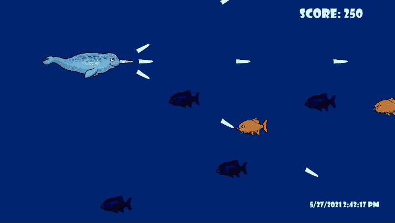

在 Unity 中创建一个漂亮的 UI 从来没有这么快和简单过。如果你像我一样，想使用**文本网格专业版**将定制的**字体**引入你的项目，那么这就是适合你的文章。首先，我在电脑上的 Unity projects Assets **文件夹**中创建了一个新文件夹，命名为“ **fonts** ”，并放置我想要导入的字体文件。Unity 可以使用 **true** 和 **open** 类型的字体，所以在尝试导入之前，请务必检查您的字体类型。

开始使用 Unity 中的 UI 非常简单，只需在**层级**中右键单击，选择 **UI** ，然后选择 **Text Mesh Pro** ，即可创建一个新的 UI 文本。第一次使用 Text Mesh Pro 会弹出导入 TMP essentials 的提示，我接受。

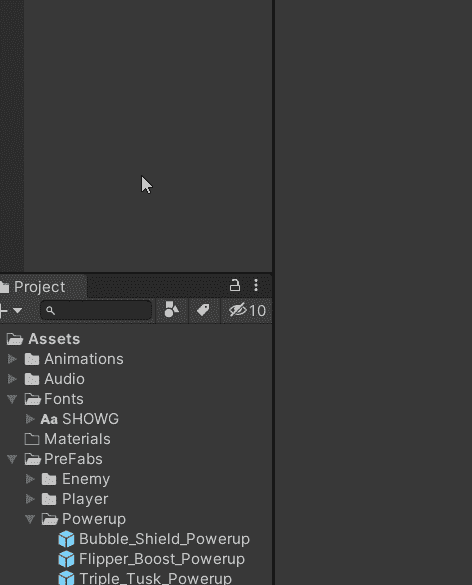

这里发生了一些事情。一旦创建了文本，就会生成一个**画布**作为**文本**的**父**对象，因为画布将容纳和控制 UI 元素。还会生成一个**事件系统**，它将需要与 **UI 按钮**进行交互。

下一步是**准备**字体，可以通过进入 Windows>Text Mesh Pro>Font Asset Creator 来完成。

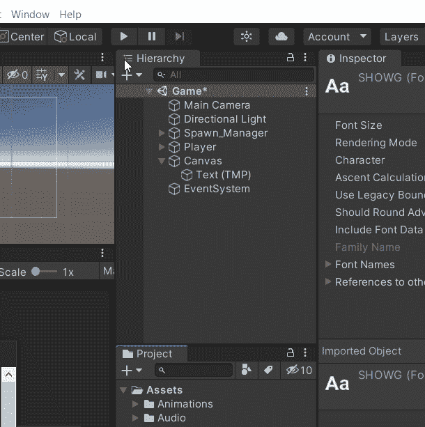

**字体资源创建器**窗口将包含几个不同的选项，其中**源字体文件**是这里最重要的一个。现在，' **None (Font)** '被设置为源，这意味着有一个**缺少**字体分配。

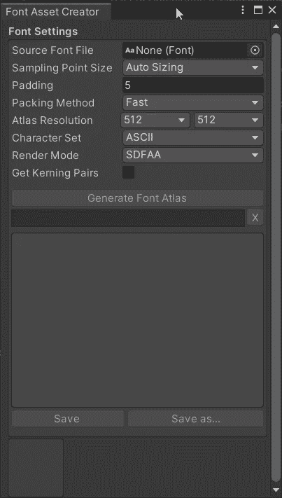

从**资产**文件夹中拖拽字体**文件**到**字体资产创建器**中，即可分配字体。

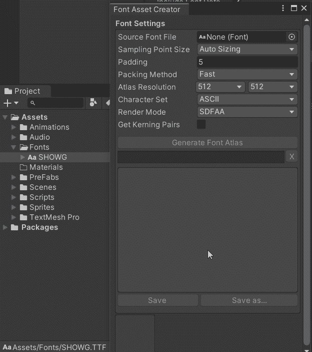

分配了所需的自定义字体**后，我现在可以按下**生成字体集**按钮。**

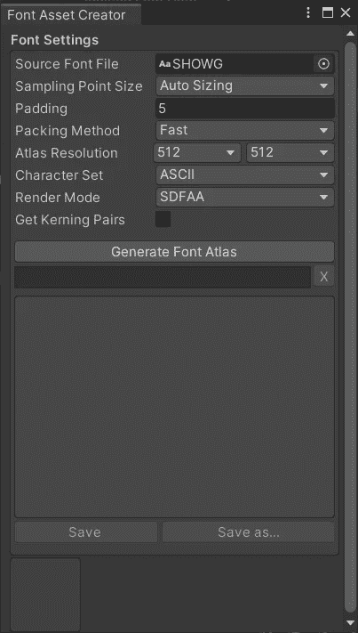

在资产文件夹中，已经生成了可用的字体资产！

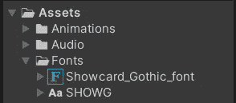

既然已经创建了该字体的可用版本，我现在可以点击层次结构中的字体游戏对象来选择它，并且**将我新生成的字体分配给**字体资源**对话框中的**检查器**。**

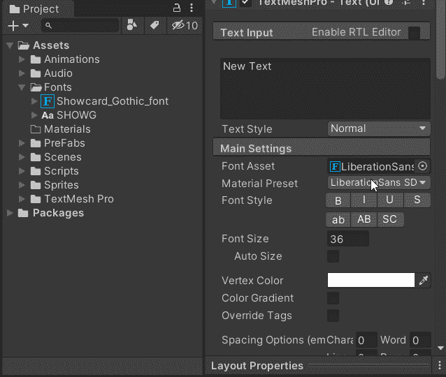

自定义字体现在显示在我的游戏视图中！

因为这个字体将处理和更新玩家当前的分数，我给它起了一个合适的名字 **Score_text** 。**矩形变换**有一些强大的**锚**特性。I **移动**字体到所需位置，选择**顶/右**锚**预置**。当将游戏移植到不同的屏幕尺寸时，这将使我的文本固定在屏幕的右上角。否则，文本可能会完全飞出屏幕，或者奇怪地出现在不同的用户监控设备上。

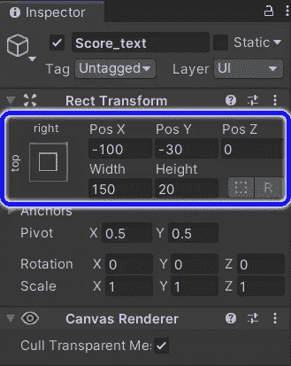

在**文本输入框**中，我可以将默认的新文本更改为得分文本。

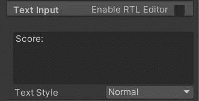

我的新分数文本现在被正确地锚定并放置在我的游戏视图中了！

另一个需要检查的重要方框是**画布**上的一个组件，称为**画布缩放器**。UI 缩放模式应改为屏幕尺寸的**缩放。这将使文本**根据游戏是在手机上玩还是在 4K 显示器上玩来调整**的大小。**

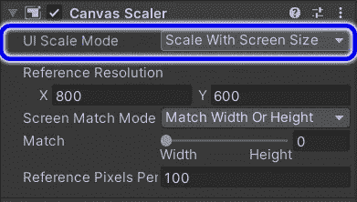

随着我的文本正确显示，下一个逻辑步骤是通过代码让**控制**。我创建了一个 UI 管理器**脚本**，它将处理我所有 UI 事件的控制和交互。

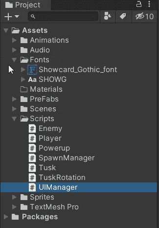

我没有创建一个新对象并将其命名为 UI Manager，而是将脚本分配给检查器中的画布，因为默认情况下画布正在处理 UI 资源。

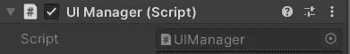

现在，我添加了一些脚本需要的名称空间**。为了让画布及其 UI 按钮和其他元素工作，我需要使用 UnityEngine 添加**。UI** 。作为一个额外的特性，我还将添加一个快速世界时钟，它使用系统名称空间的**。最后，我还需要包含使用 TMPro** 名称空间的**，以便能够与我的 Text Mesh Pro 资产进行通信。****

**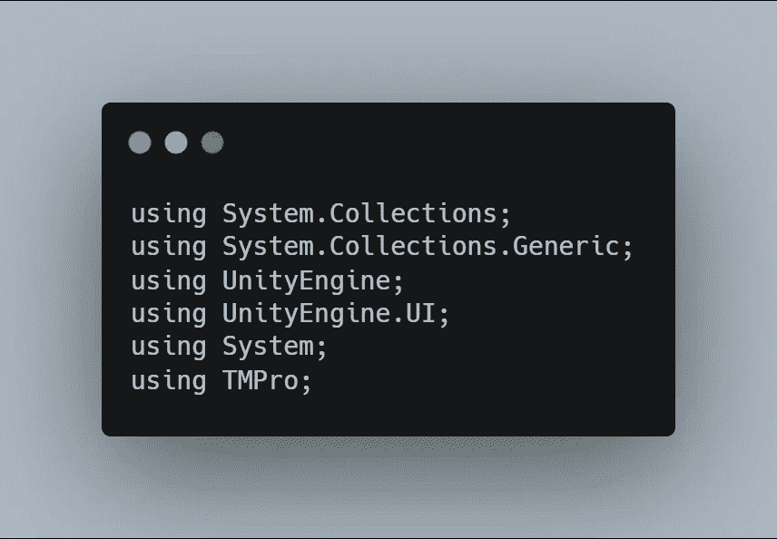**

**由于我的 **UI 管理器脚本**将处理 UI 文本和来自其他游戏对象和事件的触发，所以我决定让它也管理我的分数系统。我添加了一个**变量**来保存玩家的分数，另外两个变量**用来给**分配我的分数和世界时钟文本。**

**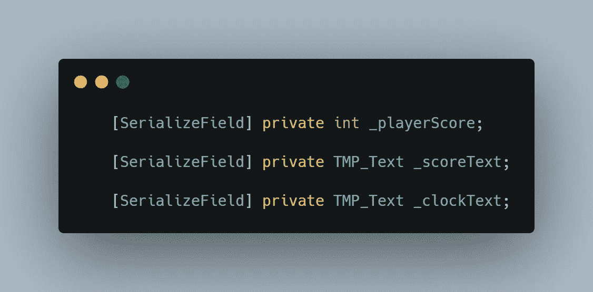**

**在**保存**之后，可以通过从**层级**拖放到检查器中的 UI 管理器**脚本**中，将乐谱文本**分配**到**画布**。**

**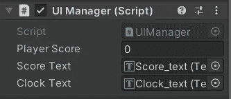**

**作为以后的预防措施，我在无效开始时给玩家的分数赋值为零。默认情况下，分数应该是零，但这是一个很好的安全措施，以确保游戏开始时分数值总是被**设置为**。**

**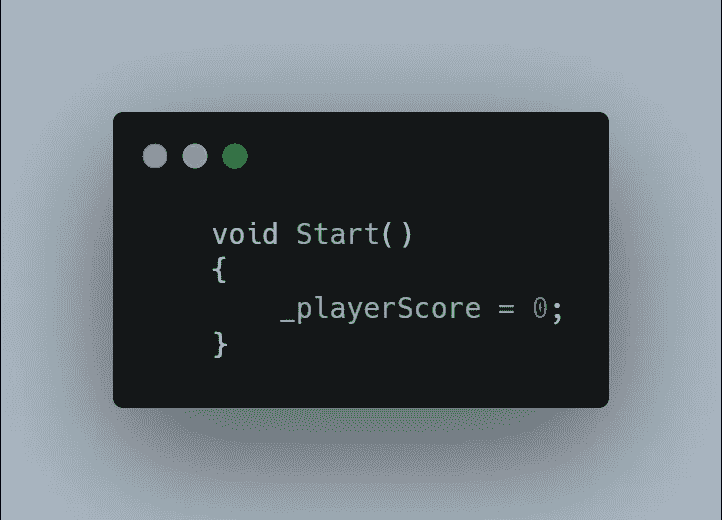**

**就世界时钟而言，在 **void Update** 中，通过引用新分配的时钟文本，并使用 **DateTime** 关键字，可以非常容易地处理这个问题。DateTime 关键字是**通过使用系统**名称空间**继承**的内容。我现在有了一个**更新游戏中的**的日期和时间时钟！**

**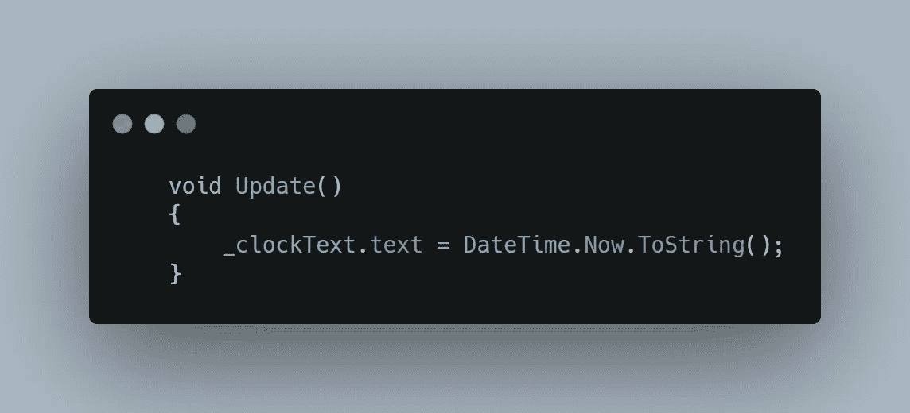**

**为了继续分数系统，我在我的 **UI 管理器脚本**中创建了一个**公共**方法，当我想要更新分数时将调用该方法。在里面，我忙于一些**伪代码**来完成我在这里需要完成的工作。我想在得分上加上一点，等于被击中的敌人所赋予的一个值。然后我需要更新 UI 来反映当前的分值。**

**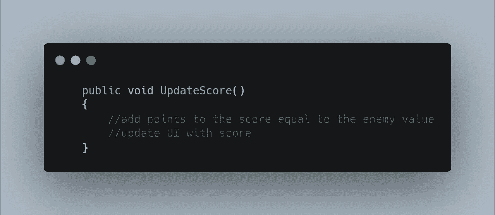**

**一个基本的开始是给玩家分数加 10 分，这是用 **+=** 操作符完成的。这就是**同**所说的，玩家点数=玩家点数+10。**

**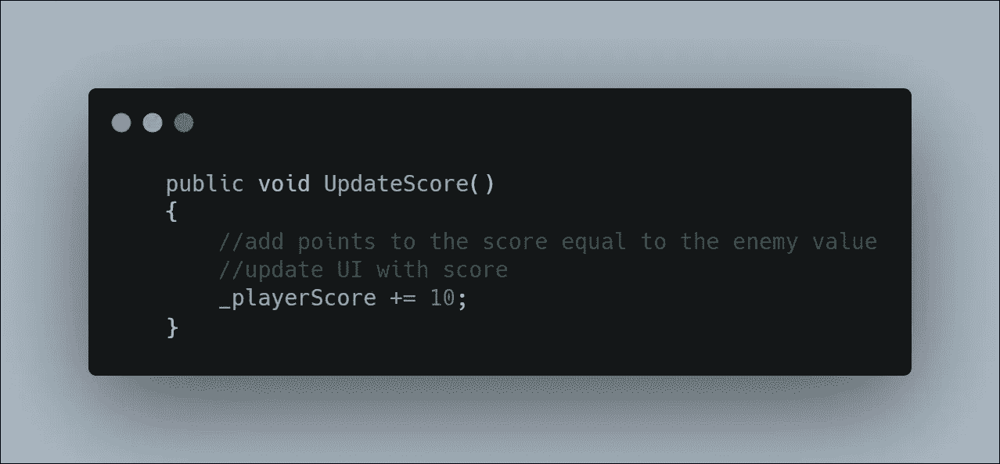**

**计算出新分数后，可以通过访问分数文本变量**更新**UI。我给文本赋值 **"Score: "** ，传入玩家分数**变量**，并发送给 UI **画布**中文本的**字符串**。**

**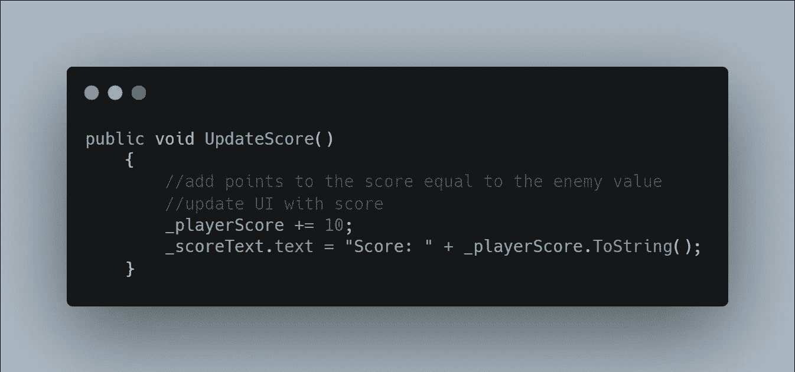**

**是时候解决谁或什么将**触发**分数更新了。这里显而易见的答案是打开我的**敌人脚本**，射击敌人将导致分数更新。我想让我的敌人直接与 UI 管理器交流，因为这是处理分数系统和 UI 文本更新的东西。所需要的只是一个引用 UI 管理器的变量。**

**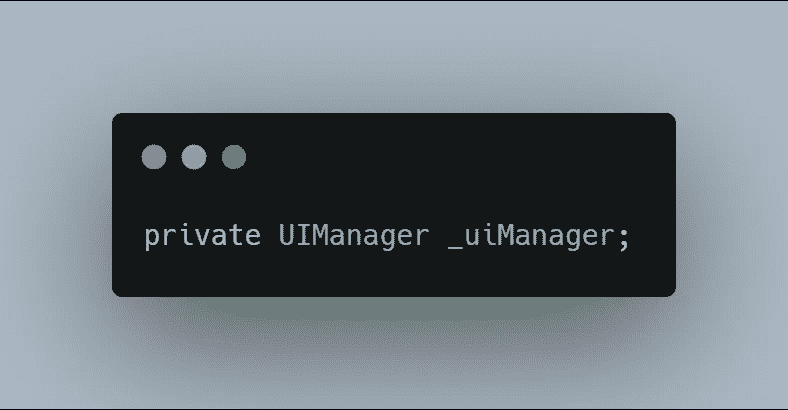**

**在 **void Start** 中，我使用 **GetComponent。找到**通过名称搜索访问**画布**，然后执行**空检查**以确保我的连接工作正常。**

**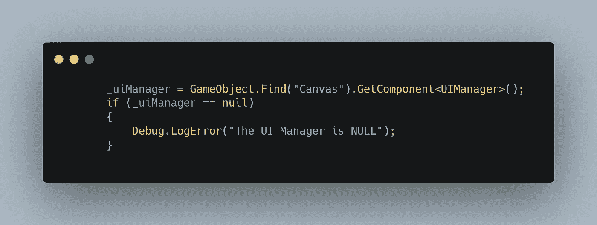**

**我的**敌方脚本**中的 **OnTriggerEnter2D** 方法是**与玩家投射物发生碰撞**的地方，所以我想在这里调用**更新分数**方法。在与一枚獠牙弹丸相撞后，我检查 UI 管理器是否为空，如果是**不是**(!=)，我可以**调用**更新评分方法。在调用之后，随着脚本自上而下的编译，死亡事件上的敌人发生了。**

**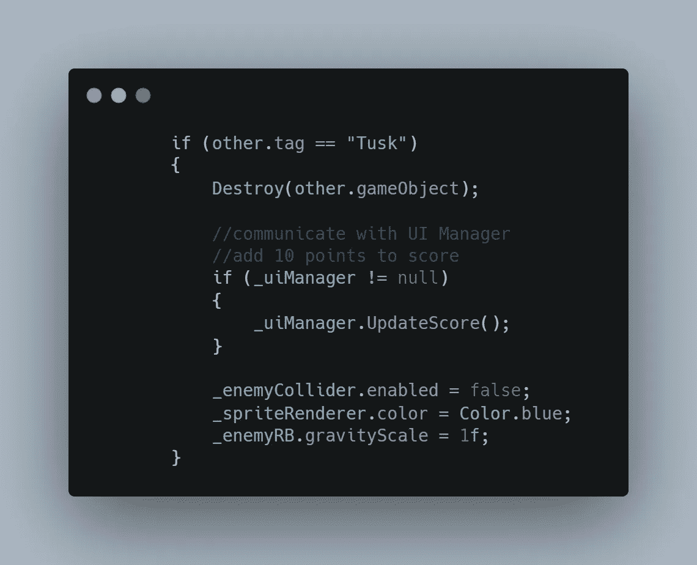**

**现在我有了一个有效的分数系统，我仍然想微调分数的**值**。现在我没有一个实际的积分变量。我只是硬编码 10 作为射击一个敌人时所允许的数量。我很可能希望不同的敌人能够在开发阶段的后期通过**不同的**点数值。一个简单的方法是回到我的公共方法中，在我的 **UI 管理器脚本**中更新分数，并在方法的**括号**中输入一些**参数**。因为我的积分系统是基于整数的，所以我声明了一个 **int** 变量，并将其命名为 **points** 。这样，无论什么事件调用更新的点数，**都必须**传入一个数值 **int** 来表示它所值的点数。我现在还可以更改我的玩家分数，添加点数变量**而不是硬编码的值 10。****

**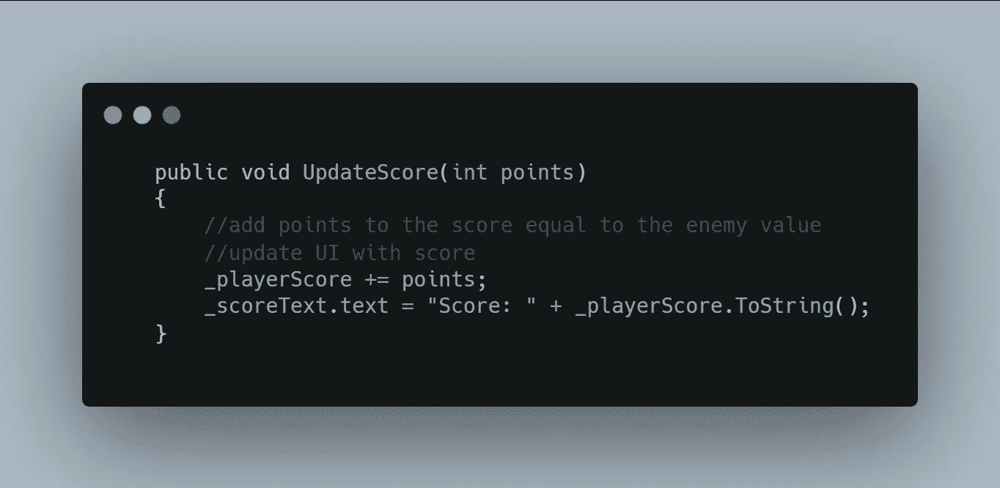**

**这里还有一个步骤。现在我告诉我的点数更新到**需要**一个数字点数变量，我的敌人脚本会不高兴，因为没有用更新点数的调用来声明点数。正如 points 变量是在更新 points **方法**的**括号**中声明的一样，**敌人**的**数值**在更新分数时可以通过到 **(10)** 在**括号**中传递。**

**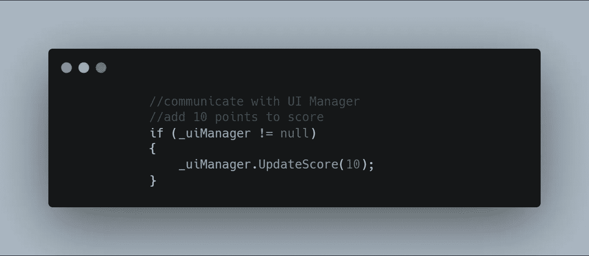**

**在**保存**并让 Unity 编译后，我现在可以玩测试我的新 UI，看看我的分数系统和世界时钟是否完全正常。感谢阅读，我希望在我的下一篇文章中看到你！**

**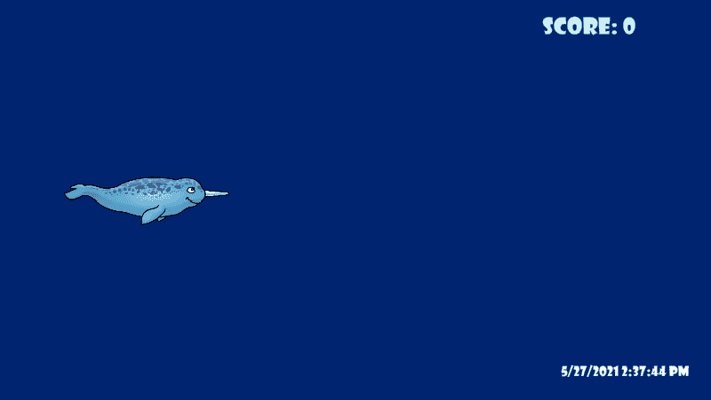**