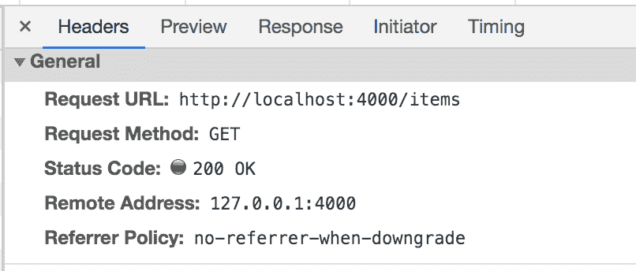
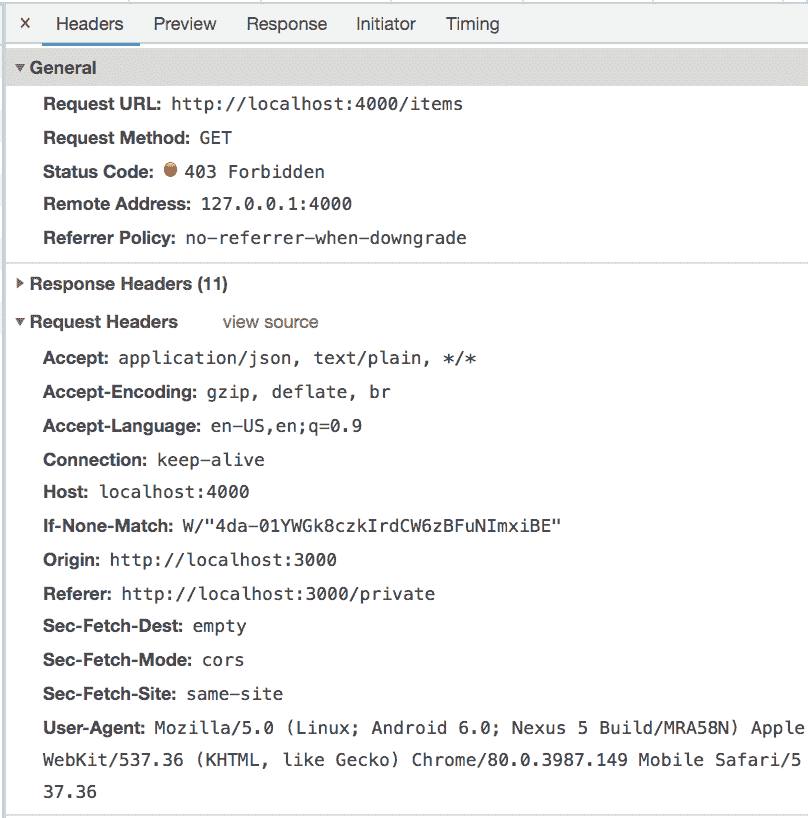
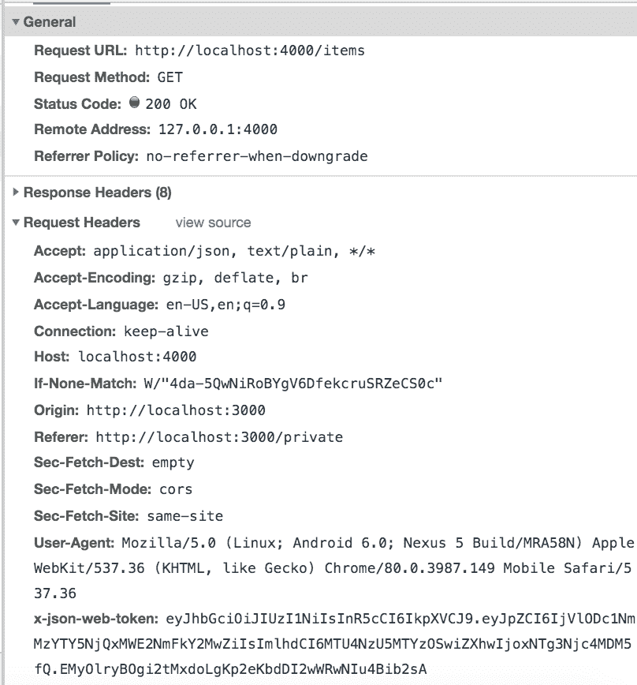
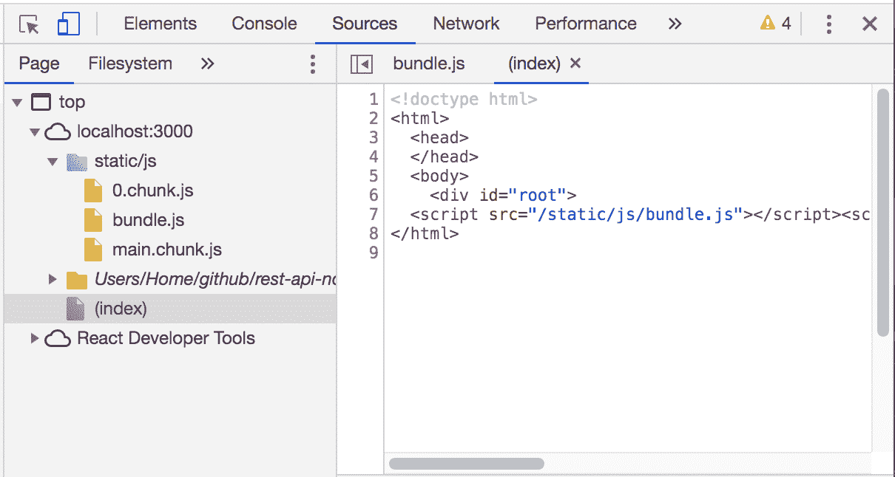

# 使用 React.js 构建安全的单页面应用程序(SPA)

> 原文：<https://levelup.gitconnected.com/building-a-secure-single-page-application-spa-with-react-js-194f30a55cb2>

## 使用 Node.js、Express、MongoDB 和 React.js 的全栈应用程序


在这篇博客中，我构建了一个前端应用程序，它通过 RESTful API 与后端应用程序接口。在构建了前端之后，我添加了安全性，这样只有授权的用户才能访问特定的内容并向后端发出请求。

前端应用程序是用一组 JavaScript 库构建的:React.js、React Router 和 axios。后端应用程序是用 Node.js、Express.js 和 MongoDB 构建的，是我以前的博客中讨论的一个项目的结果，在我以前的博客中，我详细介绍了[如何使用 Node.js、Express.js 和 MongoDB 构建 RESTful API](/building-a-restful-api-with-node-js-831bff629e3b)和[如何保护用 Node.js 构建的 RESTful API](/securing-a-restful-api-built-with-node-js-f7feefc1efe1)。要跟进，您可以在我的 GitHub 上找到[源代码](https://github.com/ckraczkowsky91/rest-api-node-secure)。

## **为我们的前端设置一个 React.js 应用程序**

添加前端意味着我们现在将有两个应用程序在不同的位置运行，即在同一台机器上但在不同的端口上，或者在相距数百或数千英里的两台不同的机器上。因此，让我们从重组我之前的博客[中的项目开始，确保用 Node.js](/securing-a-restful-api-built-with-node-js-f7feefc1efe1) 构建 RESTful API。

首先，我们创建一个名为`backend`的新目录，并将我们所有的后端代码迁移到其中。

```
$ mkdir backend
```

让我们通过切换到新目录并启动应用程序来确保 Node.js 应用程序在迁移后仍然工作。

```
$ cd backend/
$ node ./index.js
```

回到我们项目的根目录，我们创建一个名为`frontend`的新目录，在那里我们将添加所有的前端代码。

```
$ mkdir frontend
```

回想一下我之前的博客[用 Node.js 构建 RESTful API](/building-a-restful-api-with-node-js-831bff629e3b)，我们的 Node.js 应用程序的前端是非常基本的`index.html`文件。在本节的后面，我们将增强这个文件，但是现在让我们把它从后端目录移到前端目录。

```
$ mv backend/index.html frontend/
```

让我们把它变成一个 React.js 应用程序！React.js 应用程序的基础是`index.html`文件和`index.js`文件。我们已经有了一个`index.html`文件，所以我们只需要创建`index.js`文件。

```
$ cd frontend/
$ touch index.js
```

我们将描述浏览器显示内容的代码从我们的`index.html`文件移动到新的`index.js`文件中。

```
import React from ‘react’;
import ReactDOM from ‘react-dom’;ReactDOM.render(
  <div>
    <h1>Hello World!</h1>
    <h2>Item List</h2>
    <ul>
      <li>Item 1</li>
    </ul>
    <h2>Add Item</h2>
    <form>
      <label for=”item”>Item: </label>
      <input type=”text”></input>
      <br></br>
      <input type=”submit” value=”Submit”></input>
    </form>
    <a href=”/content”>Click here for content!</a>
  </div>, document.getElementById(‘root’)
);
```

React.js 的细节已经超出了这篇博客的范围，所以我将简单总结一下这段代码在做什么。我们加载了`react`和`react-dom`库，这两个库使我们能够访问 JSX(JavaScript 的语法扩展)和虚拟文档对象模型(VDOM)，后者是 React 组件的节点树，将动作与状态相匹配。`ReactDOM.render()`创建了这个 VDOM，在其中我们使用 JSX 来渲染一个 React 元素。我们将旧的`index.html`文件中的 HTML 包装在一个`div`元素中，因为 React 一次只能呈现一个元素。

正如您所看到的，这个文件加载了两个新的库，`react`和`react-dom`，所以我们需要安装它们各自的包，我们使用了一个熟悉的工具:节点包管理器(npm)。

`$ npm install react react-dom`

接下来，我们重构`index.html`文件。

```
<!doctype html>
<html>
  <head>
  </head>
  <body>
    <div id=”root”>
  </body>
</html>
```

回想一下`index.js`文件，我们为`ReactDOM.render()`提供了第二个参数。这个参数是我们想要呈现 React 元素的容器。我们将这个容器定义为`document.getElementById(‘root’)`，它获取对 DOM 的引用，并要求它返回带有“root”的`id`的元素。在`index.html`文件中，我们提供了这个元素。事实上，这是我们将在`index.html`文件中提供的唯一元素。所有其他元素都将呈现给该容器元素中的 VDOM。这与早期的 web 开发非常不同，在早期的 web 开发中，网站是一系列链接在一起的 HTML 文档，每个文档都是它们自己的 DOM 对象。当我们构建 React.js 应用程序时，您会注意到我们在这个 DOM 对象中操作内容的表示。

## **向 React.js 应用程序添加内容**

让我们通过向 present 添加一些内容来使 React.js 应用程序更有趣。React.js 应用程序由 React 组件组成，这些组件类似于 JavaScript 函数。它们接受名为`props`的各种输入，并返回描述屏幕上应该出现什么的 React 元素。组件只是 JavaScript 文件，所以让我们在项目中添加一个。

```
$ touch PublicPage.js
```

然后我们定义这个组件应该返回什么。

```
import React from ‘react’;export default class PublicPage extends React.Component{
  render(){
    return(
      <div>
        <h1>This is a public page, everyone has access to this page!  </h1>
      </div>
    );
  };
};
```

就像我们在`index.js`文件中所做的一样，我们加载`react`库来获取它的作用域，这样我们就可以访问在我们的组件中使用的 JSX 语法。然后，我们创建 React 提供的`Component`类的一个实例，并将其命名为`PublicPage`，在整个 React.js 应用程序中，我们将使用这个名称来引用这个组件。`Component`类有许多生命周期方法，我们可以用它们来操作组件，从构造到渲染。在我们的`PublicPage`组件中，我们使用`render`方法来定义将呈现给 DOM 的内容。正如我们在`index.js`文件中所做的，我们将想要呈现的元素包装成一个单独的`div`元素，因为 React 一次只能呈现一个单独的元素。下面是呈现该组件时生成的文档。

```
<!doctype html>
<html>
  <head>
  </head>
  <body>
    <div id=”root”>
      <div>
      <h1>This is a public page, everyone has access to this page!</h1>
      </div>
    </div>
  </body>
</html>
```

如您所见，React 获取了我们的`PublicPage`组件的内容，并将其注入到我们的`index.html`文件的主体中。我们添加到 React.js 应用程序中的每个组件都将以这种方式呈现给浏览器。

## **使用 React 路由器为我们的前端实现导航和路由**

此时，我们的 React.js 应用程序的内容由一个包含主要内容的`index.js`文件和一个包含组件的`PublicPage.js`文件组成。眼前的挑战是建立一个机制，在这个内容和我们将来添加的任何内容之间进行转换。这个机制需要提供定义路由、维护路由列表、将路由上可用的内容返回给调用者、定位 URL 并将其与路由匹配，以及记住用户请求的路由的历史的方法。虽然我们可以自己构建这种机制，但是 React 路由器库已经可用，并且包含这种功能。该库根据正在构建的应用程序类型提供了几个包，但是我们安装了`react-router-dom`包，因为我们正在构建一个 web 应用程序。

```
$ npm install react-router-dom
```

由于`index.js`文件是我们应用程序的入口点，让我们重构这个文件以使用 React Router。

```
...
import { BrowserRouter as Router, Switch, Route, Link } from “react-router-dom”;
import PublicPage from ‘./Components/PublicPage’;ReactDOM.render(
  <BrowserRouter>
    <div>
      <ul>
        <li>
          <Link to=’/public’>Public</Link>
        </li>
      </ul>
      <Switch>
        <Route path=’/public’>
          <PublicPage />
        </Route>
      </Switch>
    </div>
  </BrowserRouter>, document.getElementById(‘root’)
);
```

我们将`div`元素包装在从`react-router-dom`导入的`BrowserRouter`组件中，该组件使用 HTML5 历史 API 来保持我们的 UI 与 URL 同步。在`BrowserRouter`组件中，我们使用 React Router 提供的`Link`组件来定义一个超链接，单击该超链接会导致我们的`PublicPage`组件。`Link`组件提供了大量内置的`props`；关键的一个是`to`，我们向它传递一个表示路径名的字符串，这个路径名是`Link`应该期望找到的内容。

当超链接被点击时，URL 被请求，并且是`Switch`组件告诉 React Router 根据路径名呈现哪个`Route`组件。然后，`Route`组件负责呈现适当的组件。在我们的例子中，我们将`PublicPage`组件放在路径名“/public”处，这样任何对 http://localhost:3000/public 的请求都应该返回该组件。

## **用 React.js 和 axios 构建登录组件**

太好了！我们的 React.js 应用程序现在有了一些要显示的内容和在这些内容中导航的方法。但是目前我们的内容是任何人都可以访问的。正如我们在我之前的博客[中讨论的，保护用 Node.js](/securing-a-restful-api-built-with-node-js-f7feefc1efe1) 构建的 RESTful API，有些情况下我们希望将对某些内容的访问限制在某个特定的个人组。在那篇博客中，我们为 RESTful API 构建了一些中间件和端点来执行这个访问控制逻辑。让我们为 React.js 应用程序的用户添加一个前端。我们首先构建一个允许最终用户登录的组件。

```
$ touch LoginPage.js
```

该组件将提供一个接口，与我以前博客中的“/auth/login”端点进行通信。该接口将是一个反应组件。现在我们来定义这个组件。

```
import React, { useState } from ‘react’;
import axios from ‘axios’;
import {useHistory, useLocation} from ‘react-router-dom’;export const LoginPage = (props) => {
  const [email, setEmail] = useState(‘’);
  const [password, setPassword] = useState(‘’);
  let url = props.baseUrl + ‘/auth/login’;
  let location = useLocation();
  let history = useHistory();
  let {from} = location.state || { from: { pathname: “/” } }; function handleSubmit(event){
    event.preventDefault();
    axios.post(url, {email, password})
      .then((res) => {
        document.cookie = ‘my-token=’+res.data.token+’; max-age=60;’;
        history.push(from);})
      .catch((error) => {
        console.log(error);});
  };
  function handleOnChange(event){
    if (event.target.name === ‘email’){
      setEmail(event.target.value);
    };
    if (event.target.name === ‘password’){
      setPassword(event.target.value);
    };
  };
  return(
    <form onSubmit={handleSubmit}>
      <h1>Login to your account:</h1>
      <label>Email: </label>
      <input onChange={handleOnChange} name=”email” placeholder=”freddie.mercury@gmail.com” size=”35" value={email}/>
      <br/>
      <label>Password: </label>
      <input onChange={handleOnChange} name=”password” placeholder=”queen_rox” size=”35" value={password}/>
      <br/>
      <input type=’submit’ value=’Submit’/>
    </form>
  );
};
```

从`LoginPage`组件的定义中，您可以看出这个组件不同于我们在上面的**向 React.js 应用程序**添加内容一节中定义的`PublicPage`组件。`PublicPage`组件是“类组件”的一个例子，而`LoginPage`组件是“功能组件”的一个例子。

虽然类组件是有状态的，并且 React 提供了许多方便的生命周期方法，但是函数组件只是一个 JavaScript 函数，这使得它是无状态的。从 16.8 版本开始，我们可以并且确实在组件定义的第一行中使`LoginPage`组件有状态，在那里我们调用一个新的附加组件 React，即`useState`钩子。“挂钩”是一个特殊的函数，它让我们挂钩到 React 特性，例如,`useState`让我们挂钩到 state 特性，这在以前是类组件独有的。

> **注意:**JavaScript 语法中在赋值左边使用括号被称为“数组析构”。它为函数结果的分配提供了一个更简洁的语法，即赋值右边的函数的第一个结果填充左边数组的第一个变量，依此类推。
> 
> 所以我们的准则是:
> 
> `const [email, setEmail] = useState(‘’);`
> 
> 相当于以下代码:
> 
> `const stateArray = useState(‘state’);`
> 
> `const email = stateArray[0];`
> 
> `const setEmail = stateArray[1];`
> 
> 因为`useState`钩子返回两个项目的数组，组件状态的当前值和我们用来更新它的函数，我们的数组只需要两个变量。这两个变量实现了与我们在类组件中使用的`this.state.*` 和`this.setState()`相同的含义。

我们在`handleOnChange`函数中使用用`useState`钩子创建的四个变量。该函数获取用户输入到表单的`email`和`password`字段中的输入，并将其添加到组件的状态中。这为我们提供了一种存储这些值的方法，这样我们就可以通过我们的`handleSubmit`函数将它们提交给后端的“/auth/login”端点。

我们的`LoginPage`组件的`handleSubmit`函数为我们的应用程序完成了繁重的工作。首先，它从组件的状态中获取电子邮件和密码值，并在 POST 请求中将它们发送到我们的 Node.js 后端。不幸的是，React.js 应用程序不能本地发送 HTTP 请求，因此我们需要一种方法来实现这一点。我们可以选择使用大多数浏览器提供的`XMLHttpRequest`对象自己构建这个功能，但是我们将使用 axios 库。axios 库使我们能够发送更复杂的请求，并且更擅长使用承诺而不是使用事件和回调进行异步通信。要使用 axios 库，我们首先要安装它的软件包。

```
$ npm install axios
```

我们现在可以访问 axios 提供的用于发送 POST 请求的`post`方法。如果请求无效，我们的`handleSubmit`函数会捕捉并返回错误。但是，如果请求成功，它将获取包含 JSON Web 令牌的响应，该令牌验证用户是他们所声称的那个人，通知浏览器创建一个 HTTP cookie(也称为 web cookie 或 cookie)，并将该令牌存储在该 cookie 中。

## **用 JavaScript 设置 HTTP cookies 在浏览器中存储数据**

在上面的**使用 React.js 和 axios 构建登录组件**小节中，我们将来自后端的响应存储在一个 HTTP cookie 中。但是饼干到底是什么？从概念上讲，cookies 使我们的 web 开发人员能够通过模拟跨 HTTP 请求的用户意识，给无状态 HTTP 协议一种有状态的错觉。实际上，cookie 是存储在浏览器中的一小段数据(大多数浏览器支持最大 4096 字节的 cookie ),然后在随后的请求中发送到同一个服务器。默认情况下，cookie 存在于整个会话中，仅在浏览器关闭时过期。为了控制 cookie 的生命周期，我们设置了一个持续时间，在此之后，cookie 将从浏览器的存储中删除。可以通过使用`Set-Cookie` HTTP 头从服务器接收 Cookies 或者通过使用`document.cookie`属性用 JavaScript 应用程序设置 Cookies 来创建 Cookies。此属性接受单个字符串值，该值应采用“<cookie-name>=<cookie-value>的形式；<指令名> = <指令值>。例如，在我们的`LoginPage`组件的`handleSubmit`函数中，我们创建了一个名为`my-token`的 cookie，并从后端返回的响应中为它赋予 JSON Web 令牌的值。在这个 cookie 中，我们还将`Max-Age`指令设置为 60，这意味着我们的 cookie 的生命周期是 60 秒。

## **使用 React 路由器保护我们的路由**

在上面的**使用 React.js 和 axios 构建登录组件**小节中，我们构建了一种机制来获取 JSON Web 令牌，该令牌是我们向后端的'/auth/login '端点发出请求的结果，并将令牌存储在浏览器中。在本节中，我们将使用该令牌授权用户访问 React.js 应用程序中的不同路由和组件。我们使用 React 路由器库提供的组件来实现这一点。我们从更新我们的`index.js`文件开始，我们已经初始化了一个这样的组件，即`BrowserRouter`组件，它是我们所有路线的父组件。

```
...
const BASE_URL = ‘http://localhost:4000';
...
ReactDOM.render(
  <BrowserRouter>
    <div>
      <ul>
        <li>
          <Link to=’/public’>Public</Link>
        </li>
        <li>
          <Link to=’/private’>Private</Link>
        </li>
      </ul>
      <Switch>
        <Route path=’/public’>
          <PublicPage />
        </Route>
        **<Route path=’/login’>
          <LoginPage baseUrl={BASE_URL}/>
        </Route>
        <PrivateRoute path=’/private’>
          <PrivatePage />
        </PrivateRoute>** </Switch>
    </div>
  </BrowserRouter>
...
```

在`Switch`组件中，我们添加了一个新的`Route`组件，当请求其路线时，它将显示我们的`LoginPage`组件。接下来，我们添加一个新的定制`PrivateRoute`组件，并定义它的路由。这是一个高阶组件(HOC ),我们将重用它来控制我们所有的私有内容。现在让我们来定义这个新组件。

```
$ touch PrivateRoute.js
```

然后我们定义它。

```
import React from ‘react’;
import { Route, Redirect } from ‘react-router-dom’;
import isAuthenticated from ‘./isAuthenticated’;function PrivateRoute(props){
  return(
    <Route render={() => {
      if(isAuthenticated()) {
        return(props.children);
      } else {
        return(
          <Redirect to={{pathname: ‘/login’, state: {from: props.location}}}/>
        );
      }
    }}/>
  );
};export default PrivateRoute;
```

就像上面的**用 React.js 和 axios** 构建登录组件中的`LoginPage`组件一样，我们的`PrivateRoute`组件也将是一个只以`props`作为参数的‘函数组件’。我们的`PrivateRoute`组件除了是函数组件，还是高阶组件。在 React.js 术语中，高阶组件是一个将组件作为参数并返回新组件的函数，这正是我们的`PrivateRoute`组件正在做的事情。在上面的**使用 React Router** 实现导航和路由小节中，我们只是将想要呈现的组件嵌套在了`Route`组件中。然而，`Route`组件也有一个名为`render`的属性，它接受一个函数作为参数。我们使用这个函数来执行逻辑，以确定要呈现的组件:如果用户经过身份验证，则是包含我们私有内容的组件；如果用户未经身份验证，则是我们的登录组件。我们可以通过`props`参数访问包含私有内容的组件。

在`props`中有一个名为`children`的属性，它包含任何嵌套在组件中的 React 元素。回想一下本节前面的内容，我们在`PrivateRoute`组件中嵌套了一个名为`PrivatePage`的组件。

```
...
<PrivateRoute path=’/private’>
  <PrivatePage />
</PrivateRoute>
...
```

因此，在等待我们将在本节稍后定义的`isAuthenticated`函数的结果时，我们在 render 中的逻辑告诉我们的高阶组件返回我们的`PrivatePage`组件或`Redirect`组件。

`Redirect`组件由 React 路由器库提供，处理更复杂的导航。我们可以将一个对象传递给该组件的`to`属性，以定义附加信息，如重定向到的路径名、我们希望作为参数包含在生成的 URL 中的任何查询字符串，以及从重定向组件传递到路径末端组件的状态。我们为`pathname`属性提供了我们的`LoginPage`组件的路径，我们在本节前面将其定义为“/login”。

接下来，我们提供一个对象的`state`属性，其中我们定义一个`from`属性作为指向`props.location`对象的指针。除了一个`children`属性，`props`还有一个名为`location`的属性，它是一个包含用户当前所在 URL 信息的对象。我们将该信息传递给`Redirect`组件，后者将通过`state`属性将其传递给路径末端的组件。在这种情况下，该组件是`LoginPage`组件。

回想一下上面的**用 React.js 和 axios** 构建登录组件中的代码，我们在这里定义了`LoginPage`组件。

```
...
let location = useLocation();
let history = useHistory();
let {from} = location.state || { from: { pathname: “/” } };
...
history.push(from);
...
```

这段代码决定了用户登录后从我们的`LoginPage`组件被定向到哪里。为此，我们使用 React Router 提供的`useLocation`钩子和`useHistory`钩子。调用`useLocation`钩子返回一个对象，该对象具有一个表示用户当前所在路径的`pathname`属性和一个表示用户在当前 URL 之前所在路径的`state`属性。

> **注意:**JavaScript 语法中在表达式左侧使用大括号被称为‘对象析构’。它为在对象内分配属性提供了更简洁的语法，即赋值左边大括号内的变量将等于等式右边同名对象的属性值。
> 
> 所以我们的准则是:
> 
> `let {from} = location.state || { from: { pathname: “/” } };`
> 
> 相当于以下代码:
> 
> `let from = location.state.from || { from: { pathname: “/” } };`
> 
> 这两段代码都会将变量间接赋给 location 对象的 state 属性中的值(如果该值为 true ),或者直接赋给对象文字。

所以我们知道我们想把用户送到哪里，但是我们仍然需要一种方法把他们送到那里。我们用`useHistory`钩子实现了这一点，当它被调用时，返回一个我们可以用来导航的`history`对象。`history`对象来自我们安装 React 路由器包时安装的历史包。这个包提供了许多在 JavaScript 中管理会话历史的属性和方法，包括`push`方法。该方法获取一个表示新组件路径的字符串，将其作为一个新条目推入“历史堆栈”，然后加载新推入的 URL。

> **注意:**历史堆栈是 URL 的堆栈。回想一下计算机科学时代，堆栈是一种数据结构，其中堆栈顶部的第一个数据是最后添加到堆栈中的数据。在历史堆栈的情况下，我们能够使用历史对象将新的 URL 推到堆栈的顶部，并弹出从堆栈顶部添加的最后一个 URL。堆栈数据结构的这种实现使我们能够快速轻松地在 web 应用程序中构建导航。

通过结合 React Router 提供的`useLocation`钩子和`useHistory`钩子，我们现在知道用户从哪条路径到达了`LoginPage`组件，并且一旦用户登录，就能够相应地指引用户。在这个场景中，`Redirect`组件将为 LoginPage 组件填充`state`属性，这样当我们的`LoginPage`组件返回的登录表单被提交时，用户将被重定向到他们试图访问的路径，即“/private”路径。

那么我们的`PrivateRoute`组件如何知道将用户指引到哪里呢？这是前面提到的`isAuthenticated`函数的工作，我们现在将对其进行定义。首先，让我们创建一个文件，我们将从这个文件中导入这个函数。

```
$ touch isAuthenticated.js
```

`isAuthenticated`功能确定用户是否有权访问他们请求的内容。

```
import getCookie from ‘./getCookie’;function isAuthenticated() {
  var checkCookie = getCookie(‘my-token’);
  if(checkCookie != null){
    return true;
  } else {
    return false;
  };
};export default isAuthenticated;
```

我们的`isAuthenticated`函数非常简单。它使用一个名为`getCookie`的函数扫描当前存储在浏览器中的 HTTP cookies，寻找一个名为`my-token`的 cookie，我们将在下一节中定义这个函数。根据`getCookie`函数的结果，我们的`isAuthenticated`函数将返回`true`或`false`，我们的`PrivateRoute`组件将选择并使用它们来确定返回哪个组件。

## **通过 JavaScript 获取 HTTP cookies 从浏览器中检索数据**

在上面的**使用 React Router** 保护我们的路由中定义的`isAuthenticated`函数依赖于`getCookie`函数。在本节中，我们将定义该函数。首先，让我们创建一个文件，我们将从这个文件中导入这个函数。

```
$ touch getCookie.js
```

`getCookie`函数扫描存储在浏览器中的 HTTP cookies，以找到一个特定的名称。如果该 cookie 存在，该函数将返回与该名称的 cookie 相关联的值。如果该 cookie 不存在，该函数将返回一个空值。

```
function getCookie(name){
  var cookieArray = document.cookie.split(‘;’);
  for(var i=0; i < cookieArray.length; i++){
    var cookieKeyValuePair = cookieArray[i].split(‘=’);
    if(name === cookieKeyValuePair[0].trim()) {
      return(cookieKeyValuePair[1]);
    };
  };
  return(null);
};export default getCookie;
```

回想一下上面的**通过用 JavaScript 设置 HTTP cookies 在浏览器中存储数据**部分，JavaScript 提供了`document.cookie`属性。以前，我们使用这个属性来设置 cookie，但是它也可以用于从浏览器获取 cookie。这些 cookie 都作为一个单独的字符串返回，遵循模式'<cookie-name>=<cookie-value>；'我们可以编写一个正则表达式来解析这个字符串以找到我们的 cookie，但幸运的是 JavaScript 提供了一个更简单的方法，即`split`方法，根据提供的分隔符将一个字符串分割成一个子字符串数组，并返回该数组。我们将对该数组的引用存储为一个新的`cookieArray`变量。

现在的问题是遍历这个数组，找到我们要寻找的元素。为此，我们将`cookieArray`分割成自己的数组，并将对新数组的引用存储为新的`cookieKeyValuePair`变量。这个数组只有两个元素，由索引为 0 的'< cookie-name >和索引为 1 的'< cookie-value >'组成。然后，将索引为 0 的值与作为参数提供给`getCookie`的名称进行比较，当发现匹配时，返回索引为 1 的值。观察`trim`方法的使用，它也是由 JavaScript 提供的，我强烈推荐使用它，因为在“；”之间有隐藏的空格 cookies 之间的分隔符，必须对其进行修整才能找到匹配项。

> **注意:**对于那些对‘大 O 符号’感兴趣的人来说，我用于这个函数的算法的运行时间是 O(n)。这使得它成为一种“线性时间算法”，在最坏的情况下，它将随着数组中项目的数量而增长。

为了将所有这些放到 React.js 应用程序的上下文中，我们的`isAuthenticated`函数调用我们的`getCookie`函数并传递给它‘my-token ’,这是我们在上面的**使用 React.js 和 axios** 构建登录组件一节中命名的 cookie。`getCookie`函数检查这个 cookie 是否存在，并返回 cookie 的值，这是在我们的`LoginPage`组件中设置的 JSON Web 令牌的值。我们的`isAuthenticated`函数检查这个值，返回`true`，用户被授权访问由我们的`PrivateRoute`高阶组件保护的私有内容。

为了确保额外的路由，我们可以简单地将每个路径添加到`Switch`作为新的`PrivateRoute`高阶组件。

```
...
<Switch>
...
  <PrivateRoute path=’/private’>
    <PrivatePage />
  </PrivateRoute>
  <PrivateRoute path=’/superprivate’>
    <SuperPrivatePage />
  </PrivateRoute>
...
</Switch>
...
```

如果用户没有登录，对这些路径的任何请求也会将用户重定向到我们的`LoginPage`组件。

## **保护后端请求的安全**

在我之前的博客[中，保护用 Node.js 构建的 RESTful API](/securing-a-restful-api-built-with-node-js-f7feefc1efe1)，对应用程序内容的访问控制全部由我们的 Node.js 应用程序在后端处理。在这篇博客中，我们将这一职责转移到了前端的 React.js 应用程序上。我们使用 React Router 为提供我们的前端内容的组件定义路由，并通过将某些路由限制为授权用户来保护这些路由之间的导航和对这些组件的访问。这很好，但是我们仍然希望对 Node.js 后端应用程序公开的各种端点应用一些访问控制，以便只有拥有有效 JSON Web 令牌的用户才能成功提交请求。我们将通过向我们在`PrivatePage`组件中调用的“/items”端点添加访问控制来做到这一点。现在让我们来定义这个新组件。

```
$ touch PrivatePage.js
```

然后我们定义它。

```
import React from ‘react’;
import axios from ‘axios’;
import getCookie from ‘./getCookie’;export default class PrivatePage extends React.Component{
  constructor(props){
    super(props);
    this.state = {
      items: []
    };
  };
  updateState = () => {
    axios.get(‘http://localhost:4000/items')
      .then((res) => {
        this.setState({items: res.data});})
      .catch((error) => {
        console.log(error);
    });
  };
  componentDidMount(){
    this.updateState();
  };
  render(){
    return(
      <div>
        <h1>You have successfully logged in. Now, you have access to this page!</h1>
        <h2>List of items:</h2>
        <ul>{this.state.items.map((item) => (
          <li key={item._id}>{item.name}</li>
        ))}</ul>
      </div>
    );
  };
};
```

该组件向我们在 Node.js 应用程序中定义的'/items '端点发送 GET 请求，以便获取数据来填充返回列表中的元素。来自 Node.js 应用程序的响应取决于我们的路由。

```
...
app.route(‘/items’).post(addItem).get(getItems);
...
```

按照这种方式编码，我们的后端将用状态码`200 OK`和对该路由的任何请求的请求数据来响应。



但这意味着任何可以发送 HTTP 请求的客户端都可以向我们的“/items”端点发送 GET 请求并接收这些数据。这就是为什么在[用 Node.js](/building-a-restful-api-with-node-js-831bff629e3b) 构建 RESTful API 的过程中，我们添加了`verifyToken`中间件功能。

```
...
app.route(‘/items’).post(addItem)**.get(verifyToken, getItems);
...**
```

如果我们的 React.js 应用程序没有任何变化，我们的后端现在会用一个状态代码`403 Forbidden`和一个错误消息来响应我们对这个路由的请求。



好消息是，这意味着我们的`verifyToken`中间件功能正在工作，我们的后端现在期望提供一个 JSON Web 令牌。为了让它再次工作，我们需要将令牌添加到前端的代码段中，在那里我们向'/items '端点发送 get 请求。这个代码存在于我们的`updateState`函数中。

```
...
updateState = () => {
  **let token = getCookie(‘my-token’);** axios.get(‘http://localhost:4000/items', **{headers: {‘x-json-web-token’: token}}**)
    .then((res) => {
      this.setState({items: res.data});})
    .catch((error) => {
      console.log(error);
    });
};
...
```

我们使用上面的**中定义的`getCookie`函数，通过使用 JavaScript** 获取 HTTP cookies 从浏览器中检索数据，以检索用户登录时存储在浏览器 cookie 中的令牌。然后，我们向 axios 库提供的`post`方法传递一个新参数，该方法使用提供的名称和调用我们的`getCookie`函数返回的令牌值向我们的请求插入一个新的 HTTP 头。我们提供了名为`x-json-web-token`的新头部，因为这是我们告诉我们的`verifyToken`中间件函数用来查找令牌的名称。现在，当我们的前端提交 GET 请求时，它会再次收到一个状态代码为`200 OK`的响应和请求的数据！



注意，Request Headers 部分有一个新条目，带有我们的`x-json-web-token`头和令牌值。

我们可以在前端重用这种范式，用于将来对后端的请求，我们希望在后端使用令牌验证来保护请求。事实上，我们甚至可以重构 React.js 应用程序，为这种范式创建一个函数，我们可以从前端的任何地方导入和调用该函数，但这是另一篇博客的主题！

## **在 React.js 前端和 Node.js 后端之间建立符合 CORS 的通信**

如果我们启动 React.js 应用程序并尝试使用`LoginPage`组件登录，我们的浏览器将会抛出一个错误。错误本身会因浏览器而异。

```
//Google Chrome
Access to XMLHttpRequest at ‘http://localhost:4000/auth/login' from origin ‘http://localhost:3000' has been blocked by CORS policy: Response to preflight request doesn’t pass access control check: No ‘Access-Control-Allow-Origin’ header is present on the requested resource.//Mozilla Firefox
Cross-Origin Request Blocked: The Same Origin Policy disallows reading the remote resource at [http://localhost:4000/auth/login.](http://localhost:4000/auth/login.) (Reason: header ‘content-type’ is not allowed according to header ‘Access-Control-Allow-Headers’ from CORS preflight response).
```

我们看到这个错误是因为我们的 React.js 应用程序(其来源是 [http://localhost:3000](http://localhost:3000) )试图请求从我们的 Node.js 应用程序(其来源是 [http://localhost:4000](http://localhost:4000) )获取数据，因此请求必须跨越来源。这违反了跨源资源共享(CORS)标准，该标准仅允许在请求遵循 CORS 标准的情况下跨源发送请求。大多数现代浏览器都遵循 CORS 标准，所以我们也应该如此。我们需要做的是指示我们的后端允许跨源请求。我们通过在后端的`index.js`文件中添加几行代码来做这个改变。

```
...
app.use(function(req, res, next) {
  res.header(“Access-Control-Allow-Origin”, “*”);
  res.header(“Access-Control-Allow-Headers”, “Content-Type”);
  next();
});
...
```

我们传递一个函数作为中间件，在响应上设置两个头，使我们的后端能够与我们的前端共享资源。第一个头是`Access-Control-Allow-Origin`头，它允许我们的后端指定如何与外部域共享它的资源。将这个头的值设置为`*`意味着我们的后端可以与互联网上的任何域共享资源。第二个头是`Access-Control-Allow-Headers`头，它允许我们的后端指定它将在请求中接受哪些 HTTP 头。当发送一个 HTTP 请求时，浏览器首先使用 OPTIONS HTTP 方法发送一个“preflight”请求，让后端服务器知道在实际请求中可能会发送哪些 HTTP 头。后端用预检响应来响应该预检请求。预检请求包含`Access-Control-Request-Headers`报头，因此我们必须相应地在预检响应上设置`Access-Control-Allow-Headers`报头。让我们看一下我们的飞行前请求。

```
Host: localhost:4000
User-Agent: Mozilla/5.0 (Macintosh; Intel Mac OS X 10.13; rv:76.0) Gecko/20100101 Firefox/76.0
Accept: */*
Accept-Language: en-US,en;q=0.5
Accept-Encoding: gzip, deflate
Access-Control-Request-Method: POST
**Access-Control-Request-Headers: content-type** Referer: [http://localhost:3000/login](http://localhost:3000/login)
Origin: [http://localhost:3000](http://localhost:3000)
Connection: keep-alive
```

在我们的`index.j` s 文件中添加这两个标题将会生成以下预检响应。

```
HTTP/1.1 200 OK
X-Powered-By: Express
**Access-Control-Allow-Origin: *
Access-Control-Allow-Headers: Content-Type, x-json-web-token** Allow: POST
Content-Type: text/html; charset=utf-8
Content-Length: 4
ETag: W/”4-Yf+Bwwqjx254r+pisuO9HfpJ6FQ”
Connection: keep-alive
```

现在，如果我们启动 React.js 应用程序并尝试使用`LoginPage`组件登录，请求将会成功，因为我们已经使我们的前端和后端 CORS 之间的连接兼容！

## **运行我们的 React.js 应用程序**

我们终于可以运行我们的前端和后端应用程序了！运行我们在这篇博客中构建的 React.js 应用程序将不同于运行我们在以前的博客中构建的 Node.js 应用程序。我们的 Node.js 应用程序运行在我们使用 Express.js web 框架构建的 HTTP 服务器上，因此我们的应用程序可以接受 HTTP 请求，找到请求的文档，并发送包含请求的文档的 HTTP 响应。我们的 React.js 应用程序将使用浏览器内置的 JavaScript 引擎直接在浏览器中运行，例如 Google Chrome 中的 V8、Mozilla Firefox 中的 SpiderMonkey 和 Apple Safari 中的 JavaScriptCore。这意味着我们的 React.js 应用程序将需要 1)优化以在 web 浏览器中运行，2)横向兼容多个浏览器供应商以及纵向兼容这些浏览器的各个版本，也就是说，我们不能期望我们的所有最终用户都使用最新版本的 Google Chrome。

我们的 React.js 应用程序是一个单页面应用程序，由多个相互依赖的 JavaScript 文件组成。为了让这些文件能够在浏览器中有效地交互，我们使用模块捆绑器来解析我们的代码，在遇到依赖关系时将其映射出来，并以浏览器可以理解的方式将我们的应用程序捆绑在一起。一个这样的模块捆绑器叫做 Webpack，我们可以通过`webpack`包将它安装到我们的项目中。

当 Webpack 解析我们的应用程序时，它会遇到我们使用现代 JavaScript 语法的代码，该语法在 ECMAScript 的第六个版本(也称为 ES2015 或 ES6)中可用。不幸的是，对 ES6 的支持在不同的浏览器和浏览器版本之间是不一致的，正如在本节前面提到的，我们希望我们的应用程序的最终用户有相同的体验，不管他们选择什么浏览器。为了确保我们的应用程序能够在不同的浏览器上一致流畅地运行，我们需要将我们的代码从 ES6 向下转换到一个跨浏览器广泛支持的 JavaScript 版本。执行这种转换的一个工具是 Babel，我们可以通过`babel`包将它安装到我们的项目中。

现在，我们可以通过安装每个必要的工具来建立我们自己的构建环境，并构建一个脚本来将它们绑定在一起，或者我们可以只安装`react-scripts`包来为我们完成所有这些工作，包括将`babel`和`webpack`作为依赖项进行安装。

```
$ npm install react-scripts
```

`react-scripts`包包含一个`start.js`文件，该文件在执行时将运行一个脚本来启动我们的 React.js 应用程序。我们想通过命令行界面运行这个脚本，但是 JavaScript 文件不能从命令行执行。相反，我们使用节点包管理器。在这个博客系列中，我们只使用了 npm 来安装我们希望在项目中使用的包，但是 npm 也提供了一个接口来使用它们。例如，npm start 命令可用于运行我们项目中指定的脚本。唯一的问题是这个命令在一个名为`package.json`的文件中查找这些脚本。让我们现在创建这个文件。

```
$ touch package.json
```

我们用相关信息填充这个新文件。

```
{
“name”: “rest-api-node-react”,
“scripts”: {
  “start”: “react-scripts start”
},
...
```

`package.json`文件有许多用途，比如管理依赖关系，但是出于我们的目的，我们通过将文件的`scripts`属性中的`start`脚本设置为`react-scripts start`来使用它与 react-scripts 包进行交互。`scripts`属性是一个包含脚本命令的字典，这些命令在应用程序生命周期的不同时间运行。键是生命周期事件(如`start`、`build`和`eject`)，值是在该点运行的命令(如`react-scripts start`、`react-scripts build`和`react-scripts eject`)。这样做意味着当我们运行`npm start`时，将会执行`start.js`文件中的脚本。

现在让我们尝试运行我们的应用程序。

```
$ npm start
```

如果一切正常，我们应该会看到一个错误。这是因为`react-scripts`是一个固执己见的库，它期望我们的应用程序中的文件在特定的位置。具体来说，它期望在`public/`目录中找到我们的`index.html`文件，在`src/`文件夹中找到我们的`index.js`文件和相关组件。让我们创建这些目录。

```
$ mkdir public
$ mkdir src
```

一旦我们将文件移动到适当的目录中，让我们再次尝试运行我们的应用程序。

```
$ npm start
```

有用！在幕后，`start.js`脚本调用 Webpack 来解析应用程序。Webpack 在`src/index.js`开始解析，并加载任何导入的模块，直到它有一个完整的依赖图。当遇到 ES6 代码时，Webpack 将这些文件传递给 Babel，以将代码转换成跨浏览器一致的 JavaScript 版本。Webpack 使用依赖图来生成一个由我们的应用程序源代码组成的 JavaScript 文件，通过一个脚本标签将该文件注入到`public/index.html`中，并启动一个可从 [http://localhost:3000](http://localhost:3000) 获得的开发服务器。我们可以使用浏览器的开发工具在 Sources 部分看到这个注入的 JavaScript 文件。



我们现在有了一个用 React.js 库构建的前端，它保护我们的 Node.js 后端免受未经授权的请求！

因此，回顾我们在这篇博客中所做的工作，我们首先重组了我们在我以前的博客中一直在做的项目[构建一个 RESTful API](https://medium.com/@ckraczkowsky/building-a-secure-admin-interface-with-flask-admin-and-flask-security-13ae81faa05) 和[保护一个用 Node.js 构建的 RESTful API](/securing-a-restful-api-built-with-node-js-f7feefc1efe1)，以清晰地从我们的后端代码中描绘出我们的前端代码，并根据这个新的结构从那个博客中迁移了所有的前端代码。然后，我们从一个基本的 React.js 应用程序开始构建我们的前端，并添加组件来呈现可公开访问的内容。接下来，我们添加了新的组件来呈现只有授权用户才能访问的私有内容，并构建了一个登录组件来使用户能够授权自己。然后，我们使用 React 路由器库在我们的公共和私有内容之间添加导航，并通过将未授权用户重定向到我们的登录组件来保护私有内容的所有路由。最后，我们使用 axios 库实现了前端和后端之间的通信，并保护了对后端的请求，以便只有授权用户才能通过中间件访问我们后端中受保护的数据。

为了获得使用 React.js、React Router 和 axios 构建单页面应用程序的实际经验，从我的 GitHub 中克隆我们在整个博客中构建的应用程序的[源代码](https://github.com/ckraczkowsky91/rest-api-node-secure)，并在您的本地机器上运行它。

## 关于作者

Colin Kraczkowsky 在探索了产品管理的技巧之后，最近回到了 web 开发领域。Colin 的职业经历包括在企业和初创企业环境中工作，编写 web 和移动应用程序代码，推出新产品，构建模型和原型，分析指标，以及不断创新。

闲暇时，科林会去大苏尔看看最新的阿利特露营装备，计划下一次去柯克伍德·丹尼尔山，或者在网飞的恐怖区冲浪。科林目前居住在加利福尼亚州的旧金山。

与科林—[https://www.linkedin.com/in/colinkraczkowsk](https://www.linkedin.com/in/colinkraczkowsky)y 联系