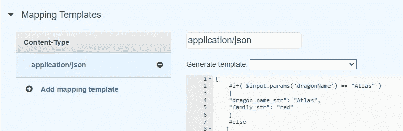

# 在 AWS 上构建无服务器后端

> 原文：<https://levelup.gitconnected.com/building-a-serverless-backend-on-aws-762b6f7680c7>

## 使用亚马逊 API Gateway，AWS Lambda 和亚马逊 Cognito。

以下是来自 [Coursera](https://www.coursera.org/learn/building-modern-java-applications-on-aws) 的 ***在 AWS*** 上构建现代 Java 应用的亮点。查看课程，了解更多信息和技术细节。

我们正在构建的应用程序使用户能够查看和添加关于龙的数据。这是通过 **/dragons** 端点完成的。此端点上可用的方法有:

GET:**API 网关**接受请求并使用 **Amazon Cognito** 检查授权。然后它验证有效负载，并调用后端来查询数据。一个 **AWS** **Lambda 函数**将使用 **S3 选择**读取数据。

POST:请求通过网关后，一个 **Lambda 函数**将在后端进行数据验证。我们不想让用户等待响应，所以我们将使用 Amazon 简单通知服务( **SNS** )在流程完成时提醒用户(请求卸载)。如果验证通过，将调用 Lambda 函数来添加要存储在 S3 中的数据。


数据存储在 **S3** 中。我们使用亚马逊 API 网关安全地公开这些数据。一龙唱片的例子:

```
{
      "description_str": "From the northern fire tribe, Atlas was born from the ashes of his fallen father in combat.",
      "dragon_name_str": "Atlas",
      "family_str": "red",
      "location_city_str": "anchorage",
      "location_country_str": "usa",
      "location_neighborhood_str": "w fireweed ln",
      "location_state_str": "alaska"
}
```

在亚马逊 API 网关**、**上，我们会选择 **REST API** 作为 API 类型。这将使我们能够验证和转换请求和响应。另一个可供选择的相关选项是 HTTP API，但它意味着更简单的用例。


首先，我们为后端创建一个模拟(为方法选择集成类型*模拟*)。


请求和响应的流程

我们根据模型验证收到的请求。**型号**定义有效载荷的结构。每种方法可以有不同的模型。验证在方法请求和方法响应中执行。只有经过验证的请求才能到达后端。

我们可以使用**映射**来转换集成请求和集成响应。在我们的 GET 方法中，我们可以修改集成响应来检查查询参数(使用 VTL 语言中的条件)。那样的话，我们就可以模拟对*/龙的请求了？比如 dragonName=Atlas* 。



映射示例

我们可以将 API 部署到一个*阶段*(对部署的命名引用)并托管 API 的多个版本。例如，在创建了一个名为*测试*的阶段之后，一个示例请求将会是这样的:


接下来，我们将使用 **Amazon Cognito** 用户池向 REST API 添加身份验证。

身份验证过程如下:客户端将首先向 Amazon Cognito 用户池进行身份验证(可以通过托管的身份验证页面完成)。用户池将发回一个 JWT 令牌，它可以在向 API 网关发送请求时使用。API 网关通过用户池验证令牌。如果通过验证，请求将被允许发送到后端。


接下来，我们添加 Lambda 函数。这些将由 API 网关触发。


lambda 函数列表龙概述

Lambda 运行处理程序方法来处理事件。这是 Java 中的通用处理程序形式:map 对象将具有事件信息(有效负载、参数等。).上下文将包含调用信息(请求 ID、函数 ARN 等等)。

```
import com.amazonaws.services.lambda.runtime.RequestHandler;
...public class Handler implements RequestHandler<Map<...>, String> {@Override
public String handleRequest(Map<...> event, Context context) {
    // business logic
    return response;
}
```

为了避免每次调用的引导时间，Lambda 函数将尝试重用执行环境。

我们可以在日志中查看最近的调用:


接下来，我们使用 **AWS 步骤函数**为 POST 请求创建这个工作流(当用户提交一个新的 dragon 时)。如果新对象有效，则添加它。结果通过使用 **SNS** (亚马逊简单通知服务)以消息形式发送。


我们还可以使用 **AWS X 射线查看痕迹。**例如，这是对调用 *ListDragons* Lambda 函数的 GET 请求的跟踪。这个因为冷启动慢。

