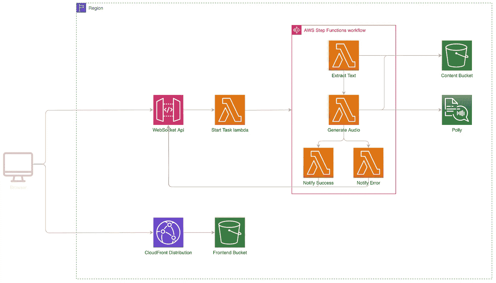
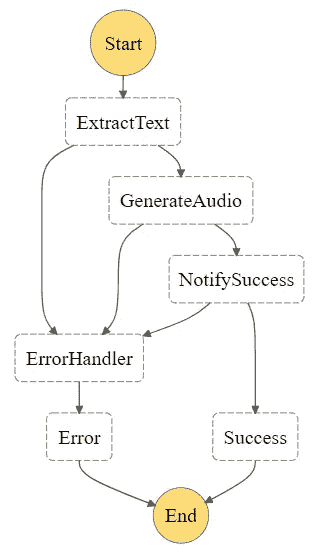
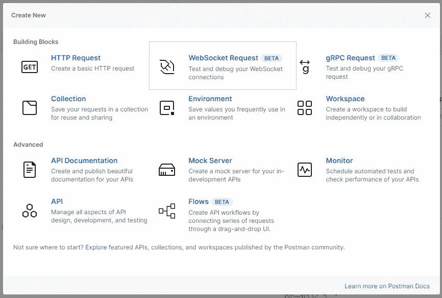
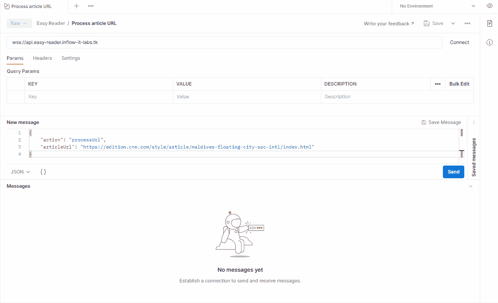
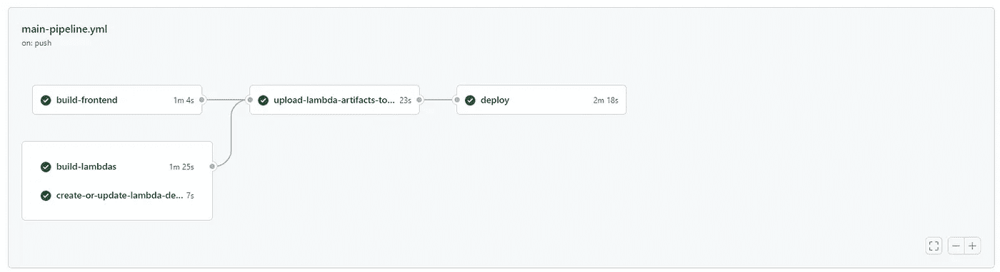
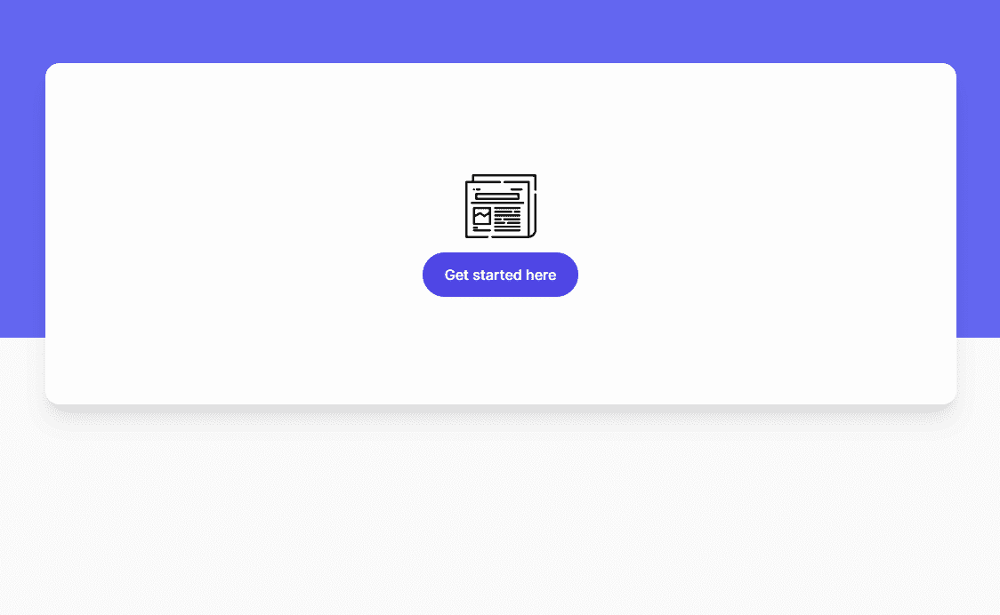

# 用 Amazon Polly、Step 函数和 WebSocket Api 构建一个无服务器的文本到语音转换应用程序

> 原文：<https://levelup.gitconnected.com/building-a-serverless-text-to-speech-application-with-amazon-polly-step-functions-and-websocket-56e9871730b7>

在本文中，我们将构建“Easy Reader”，这是一个完全托管在 AWS 上且完全无服务器的文本到语音转换应用程序。这个应用程序只需提供一个 URL 就可以为你阅读在线文章

在后端，我们将使用 Amazon Polly、WebSocket Api (Api 网关)、编排 lambda 函数的 Step 函数(用 typescript 编写并使用 node 16 运行时)

在前端，我们将构建一个小型的静态 react 应用程序，托管在 s3 上，由 CloudFront 发行版提供服务。


我们将用 Github Actions 和 CloudFormation 构建和部署这个应用程序

## TL；速度三角形定位法(dead reckoning)

你可以在这里找到完整的回购协议👉[https://github.com/ziedbentahar/aws-easy-reader](https://github.com/ziedbentahar/aws-easy-reader)

## **等等，为什么是 WebSocket Api？**

为了处理网络文章，我们将执行两个步骤:

*   首先，我们提取一篇网络文章的纯文本、可读/无杂乱版本，并检测其语言
*   其次，我们使用 Amazon Polly 生成音频

根据要处理的文章的长度，文本提取和音频合成任务可能会很长。WebSocket Api(以及 AWS ApiGateway)需要考虑的一个重要配额是最大集成超时 的 [29 **秒。**](https://docs.aws.amazon.com/apigateway/latest/developerguide/limits.html)

这可以通过两种策略来解决:

*   **基于轮询的**:让客户端定期向 Api 网关重复发送请求，检查文章是否处理完毕。这种策略不是资源友好的，因为它导致服务器和客户端之间的许多请求。
*   **基于 WebSockets 的推送**:客户端和服务器之间的双向通信，当一篇文章处理完毕时，浏览器会得到通知。这将允许资源的有效使用和减少的等待时间。

AWS API Gateway 支持 WebSockets，并提供与 AWS lambda、HTTP 端点或其他 AWS 服务的路由集成。这就是我们将要在这个语音合成应用程序中使用的内容

## “简易阅读器”应用程序的参考架构



“简易阅读器”应用程序的参考架构

*   **web socket Api**公开了一个集成了“启动任务 Lambda”的路由。此路由处理来自客户端的请求(包含文章 URL 的有效负载)，它还向集成的 lambda(开始任务)提供相对于连接的客户端的连接 Id。这个连接 Id 将用于在成功或失败的情况下对客户端进行回调
*   **Start Task Lambda** 触发一个步骤函数，并传递一个要处理的文章 URL 以及连接 Id。
*   **提取文本**有两个职责:首先，它试图提取文本的可读版本，其次，它检测内容的语言。提取的文本数据可能会有所不同，如果有效负载大小超过 265 Kb，将它传递给 step 函数可能会失败。我们将把内容保存在 s3 存储桶“内容存储桶”中。该内容将由状态机上的下一个 lambda 读取
*   **生成音频**从内容桶中读取内容，然后调用 Polly 以便从文章内容中生成音频
*   **Notify Success** 向连接的客户端发送一个成功有效载荷，其中包含一个可公开访问的预签名的音频 URL
*   **处理错误**当状态机发生错误时，向连接的客户端发送错误通知
*   **阶跃函数**将 Lamba 函数编排并连接在一起
*   **前端桶和 CloudFront 分发**负责向客户端提供 react 应用

## **定义状态机**

阶跃函数提供了一种很好的方式来协调多个 Lambda 函数的执行。下图显示了“简易阅读器”步骤功能所涉及的任务的逻辑流程。



下面是 ASL(亚马逊州语言)状态机的模板定义

跟随[此链接](https://github.com/ziedbentahar/aws-easy-reader/blob/main/aws/cfn/easy-reader-components/easy-reader-stepfunction.yml)获取该步骤功能的完整云形成定义

## **构建 Lambda 函数，相关部分**

**1-文本提取器λ函数**

这个 lambda 接收文章 URL 和连接 Id 作为输入，并尝试从网站中提取内容

我们将使用[可读性](https://github.com/mozilla/readability)来提取一篇网络文章的内容。Firefox reader 使用这个库，所以它在主要内容提取方面提供了非常好的结果。我们还尝试使用“[language detect](https://github.com/FGRibreau/node-language-detect)”lib 来检测语言。这就是`**extractContentFromArticleUrl**` 的作用:

一旦提取了内容，这个 lambda 函数通过 WebSocket 连接发布通知来通知连接的客户端。

```
await **postNotificationToConnection**(**connectionId**, { type: “contentExtracted”, articleUrl: articleUrl, contentUrl: articleContentUrl, });
```

这个函数调用 Api 网关管理 API 向一个连接 Id 发送消息

这个 lambda 函数必须有`allow` `execute-api:ManageConnections`策略，才能通过 WebSocket Api 将数据发送到连接

你可以在这里找到 lambda 函数[的完整云模板](https://github.com/ziedbentahar/aws-easy-reader/blob/main/aws/cfn/easy-reader-components/text-extractor-lambda.yml)

**2-生成音频λ功能**

相当简单的过程。首先我们从内容桶中获取提取的内容，然后通过调用`synthesize`函数生成音频，最后我们将生成的音频保存在内容桶中

`synthesize`函数使用亚马逊 Polly SDK 生成音频。波利文本合成 api 接受纯文本或 SSML。在这个例子中，我们使用 SSML，这样我们可以控制演讲的暂停持续时间，特别是对于没有以正确的标点符号结尾的段落。

请注意，我们通过 3000 个字符的块来生成音频。这是[输入的`SynthesizeSpeech`的最大尺寸](https://docs.aws.amazon.com/polly/latest/dg/limits.html)

`getLangConfigurationOrDefault`提供与语言相关的引擎(神经或标准)和语音 Id。此配置在中定义

这个 lambda 函数必须有`allow` `polly:SynthesizeSpeech`策略。

这个λ的完整云形成模板[在这里](https://github.com/ziedbentahar/aws-easy-reader/blob/main/aws/cfn/easy-reader-components/generate-audio-lambda.yml)

**3-发送成功/失败通知**

成功通知功能从内容桶请求音频文件的预先指定的 URL，然后用包含成功状态和预先指定的音频 URL 的有效载荷通知客户端

另一方面，句柄错误 lambda 只会在整个过程中出现问题时向连接的客户端发送消息

**4-构建和捆绑 lambda 函数**

在这个应用程序中，我们将构建 Lambda 函数并将其与 Webpack 捆绑在一起。捆绑带来了一些优势:

*   减少了包的大小和树的抖动:因为我们不想为每个 lambda 复制`node_modules`的全部内容，所以 Webpack 包只包含在每个 lambda 函数处理程序上导入的依赖项
*   每个 Lambda 单独包装
*   通过较小的部署缩短冷启动时间

在`[webpack.config.js](https://github.com/ziedbentahar/aws-easy-reader/blob/main/src/backend/webpack.config.js)`文件中，您会注意到我们忽略了`canvas`模块。事实上，这个模块是 jsdom 所需要的(它是可读性的依赖项)，并且与 Lambda 运行时不兼容。

## 配置 WebSocket API

用 CloudFormation 定义 WebSocket Api 与 REST 或 HTTP Api 没有太大区别。

这里，我们在 ApiGateway 资源上定义了到`WEBSOCKET`的协议类型，并创建了一个路由`processUrl`，其目标是与 StartTaskLambda 集成。你可以在这里找到这个 WebSocket Api 的完整 CF 模板

## 测试后端部署

一旦部署了所有这些后端组件，我们将能够执行 Websocket Api 测试。邮递员让一切变得简单。



在 Postman 中创建新的 WebSocket 请求



用 postman 测试 WebSocket api

在上一节中，我们着重于构建“简易阅读器”的后端，现在让我们来处理前端部分。

## 催单

你可以在这里找到 Github 工作流程的完整报告👉[https://github.com/ziedbentahar/aws-easy-reader](https://github.com/ziedbentahar/aws-easy-reader)

## 构建前端

在这一节中，我们将主要关注查询“Easy Reader”web socket Api 和处理异步响应。

你可以在这里找到完整的 React 应用程序[⚛️](https://github.com/ziedbentahar/aws-easy-reader/tree/main/src/frontend/easy-reader-front)

**简易阅读器挂钩**

`useEasyReader`接受一个 URL，创建一个 WebSocket 连接并发送一个`processArticle`命令，该命令将 URL 作为有效载荷。然后，它等待两个事件:

*   事件，其有效负载包含相对于可读文章内容的 S3 对象的预签名 URL。
*   `audioGenerated`在有效负载上提供音频 URL 的事件

这个钩子返回一个对象，提供将在组件级使用的处理进度状态、文章内容和 audioUrl。

反过来，[组件](https://github.com/ziedbentahar/aws-easy-reader/blob/bd4ad2e39d49d54ee97129cd6f34980ee060c325/src/frontend/easy-reader-front/src/App.tsx#L103)对进度事件做出反应，并逐步处理不同的事件类型。

## **定义前端的基础设施**

如上面的架构图所示，为了在 AWS 上部署前端部分，我们将创建一个 S3 存储区，用于存储和服务捆绑的 react 应用程序。然后我们将把它作为一个原点附加到 CloudFront 发行版上。

S3 存储桶只允许访问原始访问身份(OAI ),这是一个特殊的 CloudFront 用户。这样，我们只允许 CloudFront 访问桶，而拒绝其他任何东西。

## 关于构建/部署管道的一句话



Easy reader 主 Github 操作管道

在本文中，我不会深入 Github 操作的构建和部署管道。您可以通过[链接](https://github.com/ziedbentahar/aws-easy-reader/blob/main/.github/workflows/main-pipeline.yml)找到完整的管道工作流程。你也可以在[这篇文章](https://medium.com/@zied-ben-tahar/aws-lambda-function-urls-with-net-6-minimal-api-727b6d2087a5)中找到关于设置 Github 动作管道的逐步指南。

## 🎉行动中的简易阅读器



## 进一步阅读

[](https://aws.amazon.com/blogs/compute/from-poll-to-push-transform-apis-using-amazon-api-gateway-rest-apis-and-websockets/) [## 从轮询到推送:使用 Amazon API Gateway REST APIs 和 WebSockets 转换 API | Amazon Web…

### 本文由 Adam west rich(AWS 首席解决方案架构师和 Ronan Prenty(云支持工程师)提供…

aws.amazon.com](https://aws.amazon.com/blogs/compute/from-poll-to-push-transform-apis-using-amazon-api-gateway-rest-apis-and-websockets/) [](https://aws.amazon.com/step-functions/use-cases/) [## AWS 步骤功能使用案例|无服务器微服务编排| Amazon Web Services

### 使用 AWS Step 函数可以自动化什么？从下面一些最流行的用例中获得一些想法。AWS 步骤…

aws.amazon.com](https://aws.amazon.com/step-functions/use-cases/) [](https://aws.amazon.com/blogs/compute/node-js-16-x-runtime-now-available-in-aws-lambda/) [## Node.js 16.x 运行时现已在 AWS Lambda | Amazon Web Services 中提供

### 这篇文章是由无服务器首席专家解决方案架构师 Dan Fox 撰写的。你现在可以开发 AWS Lambda…

aws.amazon.com](https://aws.amazon.com/blogs/compute/node-js-16-x-runtime-now-available-in-aws-lambda/) [](https://labrlearning.medium.com/a-deep-dive-into-amazon-polly-3672baf6c624) [## 深入亚马逊波利

labrlearning.medium.com](https://labrlearning.medium.com/a-deep-dive-into-amazon-polly-3672baf6c624) 

# 分级编码

感谢您成为我们社区的一员！在你离开之前:

*   👏为故事鼓掌，跟着作者走👉
*   📰查看[升级编码出版物](https://levelup.gitconnected.com/?utm_source=pub&utm_medium=post)中的更多内容
*   🔔关注我们:[Twitter](https://twitter.com/gitconnected)|[LinkedIn](https://www.linkedin.com/company/gitconnected)|[时事通讯](https://newsletter.levelup.dev)

🚀👉 [**将像你这样的开发人员安置在顶级创业公司和科技公司**](https://jobs.levelup.dev/talent/welcome?referral=true)