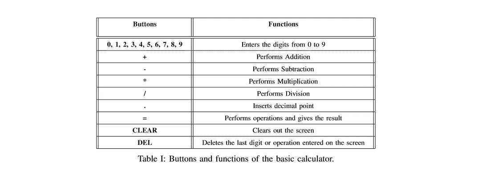

# 使用 Android Studio 在 Kotlin 中构建一个简单的计算器

> 原文：<https://levelup.gitconnected.com/building-a-simple-calculator-in-kotlin-using-android-studio-e877dec52768>

在本教程中，我们将学习如何使用 Android Studio 在 Kotlin 中构建一个简单的计算器。


演职员表:[数字仓库](http://www.digitstory.com/setting-up-kotlin-in-android-studio/)

## 描述

在本教程中，我们将使用 Kotlin 在 Android Studio 上开发一个“ **10 键**计算器”。包括的按钮应该是:

*   数字键: **1** 、 **2** 、 **3** 、 **4** 、 **5** 、 **6** 、 **7** 、 **8** 、 **9** 、 **0** 。
*   操作键: **+** 、 **-** 、 ***** 、 **/** 。
*   其他按键: **=** ，**清除**。这里“**清除**”键应该清除屏幕和内存中的所有内容。“ **=** ”键应用操作并给出结果。
*   此外，计算器将有一个“ **DEL** ”键，与“退格键”相同，将删除屏幕上的最后一个字符。
*   **一个。**"键应该显示一个小数。

现在我们知道了计算器的外观和工作方式，让我们开始吧。为了让你理解，我将尽力提供所有必要的步骤。

## 第一步:在 Android Studio 上创建一个“空活动”。

让我们创建一个新项目。由于我们的计算器只包含一个活动(我们只需要一个活动 Kotlin 文件和一个 XML 布局文件)，我们需要选择一个“**空活动**”。这可以按如下所示完成:

**新建→新建项目→清空活动**


在 android studio 上创建空活动

创建空活动后，配置项目，例如名称、包名、位置、语言和 API 级别。按照下面的截图来配置您的项目，以保持一致性。确保你选择的语言是 Kotlin(显然我是用 Kotlin 编码的)。然后点击完成，那么你的项目就会被加载。


配置您的项目

要了解更多关于 API 级别的信息，你可以参考下面给出的 google 官方文档，并不是强制选择上面截图中显示的 API 15。只是为了教程的一致性而选择它。

 [## 代号、标签和内部版本号| Android 开源项目

### Android 开发版本被组织成具有字母代号的家族，其灵感来自美味的食物…

source.android.com](https://source.android.com/setup/start/build-numbers) 

## 步骤 2:向 colors.xml 文件添加颜色

顾名思义，在颜色文件中，我们可以为计算器的所有按钮指定颜色。colors.xml 文件可以在以下位置找到:

**app→RES→数值→colors.xml**

```
*<?***xml version="1.0" encoding="utf-8"***?>* <**resources**>
    <**color name="colorPrimary"**>#000000</**color**>
    <**color name = "white"**>#ffffff</**color**>
    <**color name="colorPrimaryDark"**>#cccccc</**color**>
    <**color name="colorAccent"**>#FF4081</**color**>
    <**color name = "actionButton"**>#808080</**color**>
    <**color name = "equalButton"**>#FF0000</**color**>
    <**color name="numberActionButton"**>#000000</**color**>
    <**color name = "numberActionButton2"**>#373737</**color**>
</**resources**>
```

## 步骤 3:修改 styles.xml 文件

样式文件用于定义 UI 的格式或外观。一个样式可以应用到一个单独的`View`(从一个布局文件中)或整个`Activity`或应用程序(从清单文件中)。

styles.xml 可以在

**app→RES→values→style . XML**

```
<**resources**>

*<!-- Base application theme. -->* <**style name="AppTheme" parent="Theme.AppCompat.Light.DarkActionBar"**>
    *<!-- Customize your theme here. -->* <**item name="colorPrimary"**>@color/colorPrimary</**item**>
    <**item name="colorPrimaryDark"**>@color/colorPrimaryDark</**item**>
    <**item name="colorAccent"**>@color/colorAccent</**item**>
</**style**>

*<!-- ActionButtonStyle for keys "CLEAR" and "/". -->*  
<**style name="ActionButtonStyle"**>
    <**item name="android:layout_width"**>0dp</**item**>
    <**item name="android:layout_height"**>match_parent</**item**>
    <**item name="android:layout_weight"**>1</**item**>
    <**item name="android:background"**>@color/actionButton</**item**>
    <**item name = "android:textSize"**>21sp</**item**>
    <**item name="android:textColor"**>@android:color/white</**item**>
    <**item name="android:gravity"**>center</**item**>
    <**item name="android:layout_margin"**>0.5dp</**item**>

</**style**>

*<!-- NumberButtonStyle for keys "1, 2, 3, 4, 5, 6, 7, 8, 9, 0". -->*
<**style name="NumberButtonStyle"**>
    <**item name="android:layout_width"**>0dp</**item**>
    <**item name="android:layout_height"**>match_parent</**item**>
    <**item name="android:layout_weight"**>1</**item**>
    <**item name="android:background"**>@color/numberActionButton</**item**>
    <**item name = "android:textSize"**>21sp</**item**>
    <**item name="android:textColor"**>@android:color/white</**item**>
    <**item name="android:gravity"**>center</**item**>
    <**item name="android:layout_margin"**>0.5dp</**item**>
</**style**>*<!-- EqualButtonStyle for key "=". -->*
<**style name="EqualButtonStyle"**>
    <**item name="android:layout_width"**>0dp</**item**>
    <**item name="android:layout_height"**>match_parent</**item**>
    <**item name="android:layout_weight"**>1</**item**>
    <**item name="android:background"**>@color/equalButton</**item**>
    <**item name = "android:textSize"**>21sp</**item**>
    <**item name="android:textColor"**>@android:color/white</**item**>
    <**item name="android:gravity"**>center</**item**>
    <**item name="android:layout_margin"**>0.5dp</**item**>
</**style**>

*<!-- NumberActionButton2 for keys "*", "-", "+". -->*
<**style name="NumberActionButton2"**>
    <**item name="android:layout_width"**>0dp</**item**>
    <**item name="android:layout_height"**>match_parent</**item**>
    <**item name="android:layout_weight"**>1</**item**>
    <**item name="android:background"**>@color/numberActionButton2</**item**>
    <**item name ="android:textSize"**>21sp</**item**>
    <**item name="android:textColor"**>@android:color/white</**item**>
    <**item name="android:gravity"**>center</**item**>
    <**item name="android:layout_margin"**>0.5dp</**item**>
</**style**>

</**resources**>
```

以上只是 styles.xml 文件中定义的计算器的样式属性。发出简报

> **ActionButtonStyle:按键→清除，/**
> 
> **数字按钮样式:按键→ 1，2，3，4，5，6，7，8，9，0**
> 
> **数字操作按钮 2:按键→ *、-、+**
> 
> **EqualButtonStyle: Key → =**

## 步骤 4:配置“activity_main.xml”文件

这是主布局文件，这里你不需要使用 UI 编辑器，而是可以使用 XML 编码整个布局。这里我们可以使用文本视图布局，而不是按键按钮。我将所有的文本视图放置在线性布局中。因为有多个文本视图，所以这是一个机械的过程。所以现在跟我来。

```
*<?***xml version="1.0" encoding="utf-8"***?>* <**LinearLayout xmlns:android="http://schemas.android.com/apk/res/android"
    xmlns:app="http://schemas.android.com/apk/res-auto"
    xmlns:tools="http://schemas.android.com/tools"
    android:layout_width="match_parent"
    android:layout_height="match_parent"
    tools:context=".MainActivity"
    android:background="@android:color/black"
    android:orientation="vertical"**>

    <**TextView
        android:id="@+id/tvExpression"
        android:layout_width="match_parent"
        android:layout_height="80dp"
        android:textColor="@color/actionButton"
        android:layout_gravity="end"
        android:ellipsize="start"
        android:singleLine="true"
        android:textSize="40sp"** />

    <**TextView
        android:id="@+id/tvResult"
        android:layout_width="match_parent"
        android:layout_height="100dp"
        android:textColor="@color/white"
        android:layout_gravity="end"
        android:ellipsize="end"
        android:singleLine="true"
        android:textSize="30sp"**/>

    <**LinearLayout
        android:layout_width="match_parent"
        android:layout_height="match_parent"
        android:orientation="vertical"**>

        <**LinearLayout
            android:layout_width="match_parent"
            android:layout_height="0dp"
            android:layout_weight="1"
            android:orientation="horizontal"**>
            <**TextView
                android:id="@+id/tvClear"
                style="@style/ActionButtonStyle"
                android:text="CLEAR"**/>

            <**TextView
                android:id="@+id/tvDivide"
                style="@style/ActionButtonStyle"
                android:text="/"**/>

        </**LinearLayout**>

        <**LinearLayout
            android:layout_width="match_parent"
            android:layout_height="0dp"
            android:layout_weight="1"
            android:orientation="horizontal"**>

            <**TextView
                android:id="@+id/tvSeven"
                style="@style/NumberButtonStyle"
                android:text="7"**/>

            <**TextView
                android:id="@+id/tvEight"
                style="@style/NumberButtonStyle"
                android:text="8"**/>

            <**TextView
                android:id="@+id/tvNine"
                style="@style/NumberButtonStyle"
                android:text="9"**/>

            <**TextView
                android:id="@+id/tvMul"
                style="@style/NumberActionButton2"
                android:text="*"**/>

        </**LinearLayout**>

        <**LinearLayout
            android:layout_width="match_parent"
            android:layout_height="0dp"
            android:layout_weight="1"
            android:orientation="horizontal"**>

            <**TextView
                android:id="@+id/tvFour"
                style="@style/NumberButtonStyle"
                android:text="4"**/>

            <**TextView
                android:id="@+id/tvFive"
                style="@style/NumberButtonStyle"
                android:text="5"**/>

            <**TextView
                android:id="@+id/tvSix"
                style="@style/NumberButtonStyle"
                android:text="6"**/>

            <**TextView
                android:id="@+id/tvMinus"
                style="@style/NumberActionButton2"
                android:text="-"**/>

        </**LinearLayout**>

        <**LinearLayout
            android:layout_width="match_parent"
            android:layout_height="0dp"
            android:layout_weight="1"
            android:orientation="horizontal"**>

            <**TextView
                android:id="@+id/tvOne"
                style="@style/NumberButtonStyle"
                android:text="1"**/>

            <**TextView
                android:id="@+id/tvTwo"
                style="@style/NumberButtonStyle"
                android:text="2"**/>

            <**TextView
                android:id="@+id/tvThree"
                style="@style/NumberButtonStyle"
                android:text="3"**/>

            <**TextView
                android:id="@+id/tvPlus"
                style="@style/NumberActionButton2"
                android:text="+"**/>

        </**LinearLayout**>

        <**LinearLayout
            android:layout_width="match_parent"
            android:layout_height="0dp"
            android:layout_weight="1"
            android:orientation="horizontal"**>

            <**TextView
                android:id="@+id/tvDot"
                style="@style/NumberButtonStyle"
                android:text="."**/>

            <**TextView
                android:id="@+id/tvZero"
                style="@style/NumberButtonStyle"
                android:text="0"**/>

            <**TextView
                android:id="@+id/tvBack"
                style="@style/NumberButtonStyle"
                android:text="DEL"**/>

            <**TextView
                android:id="@+id/tvEquals"
                style="@style/EqualButtonStyle"
                android:text="="**/>

        </**LinearLayout**>

    </**LinearLayout**>

</**LinearLayout**>
```

## 步骤 5:将表达式构建器库放入 Gradle 中。

我已经使用了[表达式生成器](https://www.objecthunter.net/exp4j/)库来计算表达式。在 GitHub 库的帮助下，我学会了如何做这件事。我很难使用等号按钮来生成结果。所以现在只需将表达式构建器库放在 Gradle 中。

**app →Gradle 脚本→build.gradle**


只需粘贴→ **编译“net . object hunter:exp4j:0 . 4 . 8”**到 build.gradle 里面

## 步骤 6:计算器的实际 Kotlin 编码

首先，我追加 1，2，3，…..0，当用户分别按下文本视图的键时。为此，我创建了一个名为 **evaluateExpression()** 的函数，它完成了文本视图的附加工作。然后在 Equals 函数中，我使用表达式构建器库并调用它的方法**表达式构建器**来进行计算。代码基本上是不言自明的。main_activity.kt 可以在以下位置找到:

**app→Java→com . example . my application calculator→main activity . kt**

在我的例子中，包名是**com . example . my application calculator**，在你的例子中可能会有所不同。

```
***// Program: main_activity.kt
// Author: Tanu. N. Prabhu
// Course: CS 855
// Date: 28/010/2019
// Assignment 2
/* Description: This program helps to perform the operations and the calculations of 
 the basic calculator*/
//------------------------------------------------------------------*****package** com.example.finalcalculator
**import** androidx.appcompat.app.AppCompatActivity
**import** android.os.Bundle
**import** kotlinx.android.synthetic.main.activity_main.*
**import** net.objecthunter.exp4j.ExpressionBuilder

**class** MainActivity : AppCompatActivity()
{

    **override fun** onCreate(savedInstanceState: Bundle?)
    {
        **super**.onCreate(savedInstanceState)
        setContentView(R.*layout*.*activity_main*)

        */*Number Buttons*/

        tv*One.*setOnClickListener* **{** evaluateExpression(**"1"**, clear = **true**)
        **}** tvTwo.*setOnClickListener* **{** evaluateExpression(**"2"**, clear = **true**)
        **}** tvThree.*setOnClickListener* **{** evaluateExpression(**"3"**, clear = **true**)
        **}**tvFour.*setOnClickListener* **{** evaluateExpression(**"4"**, clear = **true**)
        **}** tvFive.*setOnClickListener* **{** evaluateExpression(**"5"**, clear = **true**)
        **}** tvSix.*setOnClickListener* **{** evaluateExpression(**"6"**, clear = **true**)
        **}** tvSeven.*setOnClickListener* **{** evaluateExpression(**"7"**, clear = **true**)
        **}** tvEight.*setOnClickListener* **{** evaluateExpression(**"8"**, clear = **true**)
        **}** tvNine.*setOnClickListener* **{** evaluateExpression(**"9"**, clear = **true**)
        **}** tvZero.*setOnClickListener* **{** evaluateExpression(**"0"**, clear = **true**)
        **}** */*Operators*/* tvPlus.*setOnClickListener* **{** evaluateExpression(**"+"**, clear = **true**)
        **}** tvMinus.*setOnClickListener* **{** evaluateExpression(**"-"**, clear = **true**)
        **}** tvMul.*setOnClickListener* **{** evaluateExpression(**"*"**, clear = **true**)
        **}** tvDivide.*setOnClickListener* **{** evaluateExpression(**"/"**, clear = **true**)
        **}** tvDot.*setOnClickListener* **{** evaluateExpression(**"."**, clear = **true**)
        **}** tvClear.*setOnClickListener* **{** tvExpression.*text* = **""** tvResult.text = **""
        }** tvEquals.*setOnClickListener* **{
            val** text = tvExpression.*text*.toString() **val** expression = ExpressionBuilder(text).build()

            **val** result = expression.evaluate()
            **val** longResult = result.toLong()
            **if** (result == longResult.toDouble()) {
                tvResult.text = longResult.toString()
            } **else** {tvResult.text = result.toString()
            }
        **}** tvBack.*setOnClickListener* **{
            val** text = tvExpression.*text*.toString()
            **if**(text.isNotEmpty()) {
                tvExpression.*text* = text.drop(1)
            }

            tvResult.text = **""** }}

    */*Function to calculate the expressions using expression builder library*/* **fun** evaluateExpression(string: String, clear: Boolean) {
        **if**(clear) {
            Result.text = **""** Expression.append(string)
        } **else** {
            Expression.append(Result.text)
            Expression.append(string)
            Result.text = **""** }
    }
}
```

## 步骤 7:使用模拟器运行应用程序

这是最后一步，现在你已经写好了所有的 Kotlin 代码，现在让我们测试结果。为此，我们可以使用 androids 内置仿真器。点击右上角看起来像播放按钮的绿色按钮，或者按下 **Shift + F10。**如果你不知道如何配置和使用 android 内置模拟器。请查看下面的视频:

演职员表:[弗拉德·沃延科](https://www.youtube.com/watch?v=LgRRmgfrFQM&t=390s)

或者，如果您在使用模拟器时遇到问题，或者您的笔记本电脑过热。别担心，总有第二种选择。使用 [Genymotion](https://www.genymotion.com/) 作为外部仿真器。您可以在下面观看如何设置 Genymotion 的视频:

演职员表: [Apk 天堂](https://www.youtube.com/channel/UCe1jGdp0cGKVOPHUiuNDwBA)

现在所有的设置都完成了，当你运行模拟器时，你会得到一个漂亮的简单的计算器，如果没有，那么仔细检查你的代码。


简单计算器

## 用户交互

这个 android 应用程序需要用户交互才能运行。用户通过执行按下计算器键盘上的按钮的基本任务来与应用程序交互。通过输入数字，用户可以完成基本的数学运算，如加、减、乘、除。使用这个计算器是微不足道的；用户只需要使用键盘将输入输入到计算器中，然后通过点击四个操作按钮(+、-、*、/)中的一个来指定他们想要执行什么操作。这个计算器可以识别正数和负数。此外，它还识别操作的顺序；规则的集合，这些规则显示首先执行哪些运算来计算表达式。通常规则被表示为 PEMDAS，其中 P-括号，E-指数，M-乘法，D-除法，A-加法和 S-减法。例如，如果用户输入 2+9*5，则计算器会提示结果为 47，而不是 55。此计算器不支持括号和指数，因此在这种情况下，根据 PEMDAS 的运算顺序是“*”，即 9*5 后跟“+”，即 45+2，结果是 47。



上表 1 显示了基本计算器的按钮和功能。这些操作类似于如今大家都知道的基本计算器。例如，该计算器在屏幕上最多可显示 18 个字符(1/3 = 0.3333333333333)。这款计算器拥有良好的用户体验和设计，看起来和感觉上有点像我们经常在 android 手机上使用的高级计算器。事实上，我打算基于我目前的 android 智能手机来设计它。

## 已知问题和限制

通过使用这个计算器，我们不能使用键盘快捷键来输入。我们只能使用计算器本身提供的按钮来输入数据。这不是一个需要担心的大问题，因为这是一个 android 应用程序。每个人都在他们的智能手机上运行这个应用程序，你不需要键盘来输入数字。

此外，如果有人试图除以 0，这个计算器不会提供任何错误信息。如果有人同时输入两个操作，那么计算器不会显示任何错误消息。例如，通过输入表达式 5**+9，计算器不会冻结或崩溃，而是等待用户更改运算，使其成为有效的数学表达式。

除了这两个限制之外，该应用程序满足上面描述部分列出的所有标准。我使用文本视图布局作为按钮，因为我发现这是一种简单的组织按钮的方式。当我手动将按钮放置在另一个按钮旁边时，我遇到了一些问题。每次当我使用模拟器执行应用程序时，即使我限制了布局，按钮还是分散在整个屏幕上。在文本视图布局的帮助下，我可以解决这个问题。

因此，我们有意无意地在 Android Studio 上使用 Kotlin 构建了一个漂亮的简单计算器。这只是一个简单的计算器，我们可以添加更多的功能，也建立一个科学的。但是这对于获得 Kotlin 和 Android Studio 编码实践的良好开端来说已经足够了。我建议你们键入代码，而不是复制粘贴，有时当你复制粘贴时，你最终会因为包不匹配而出错。每个人在 android studio 中都有不同的包，所以输入并学习吧。如果你们对本教程有任何疑问，请在下面发表回复或评论。我会很快回复。再见，再见。